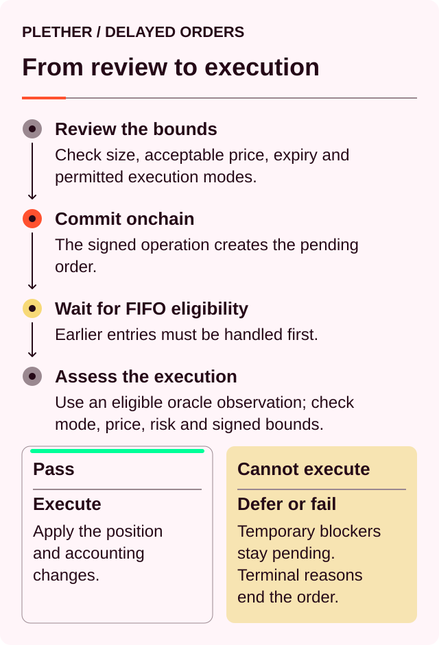
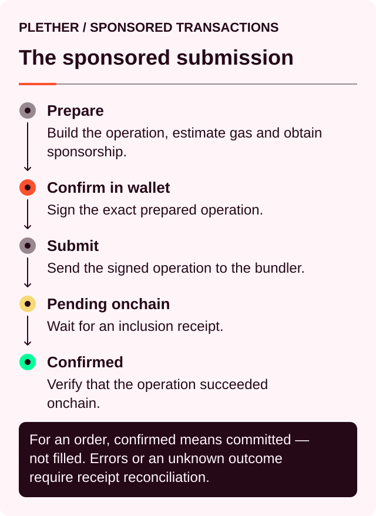
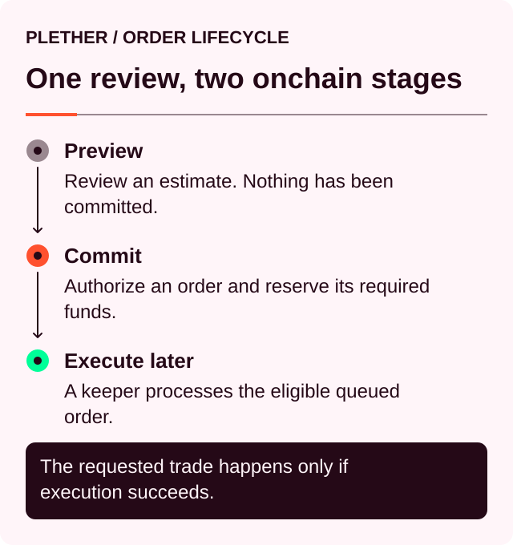
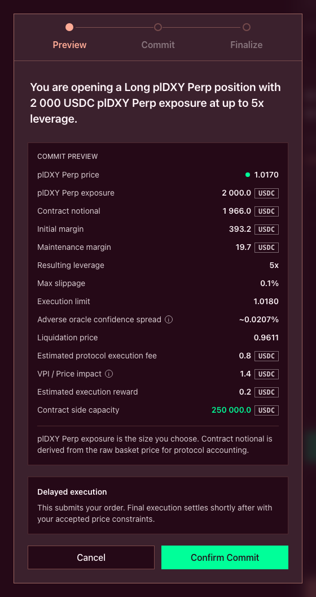
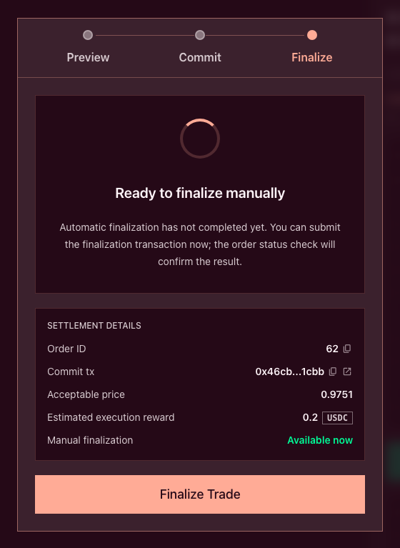
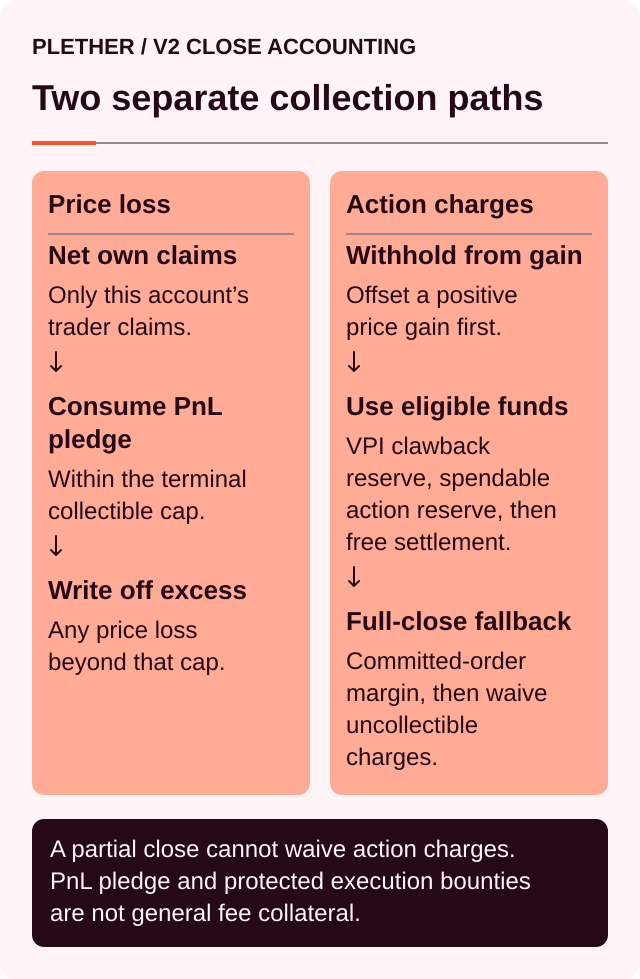
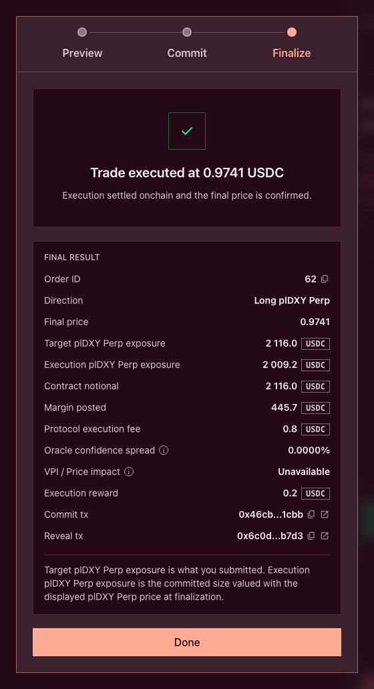
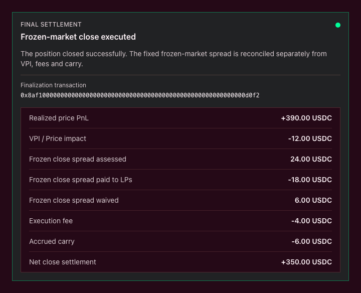
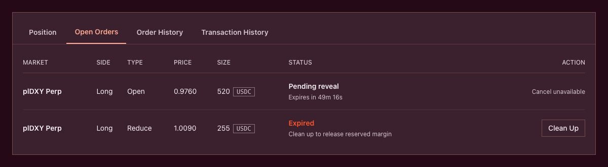

# How orders execute

Plether does not match traders in an order book, and it does not let an AMM determine the index price.

Orders use delayed, oracle-settled execution.

**Commit first. Price second.**

A trader commits the direction, size, margin and acceptable-price boundary before the final execution price is known.

The order enters a global queue, then settles under the oracle regime active when it is finalized:

* Live and FAD-only execution uses the first eligible post-commit observation.
* An `oracleFrozen` voluntary close uses the bounded frozen-market policy.



This introduces a short delay by design. The delay separates the trading decision from the price used to settle it, reducing the surface for front-running and selective execution.

### Two related lifecycles

The sponsored commitment first moves through:



Here, **Confirmed** means the order commitment reached the chain. It does not mean the trade has executed.

The delayed order then follows the protocol stages:



The owner wallet normally authorizes the Trading Account commitment, and Plether submits the eligible sponsored operation. A keeper normally submits the separate finalization transaction.

If keeper finalization is delayed, the trader may be able to finalize the order manually.

### 1. Preview the order

The **Commit Preview** shows the expected result using the market state available before commitment.

This includes:

* Direction: LONG USD or SHORT USD
* Target exposure
* Contract notional
* Margin
* Resulting leverage
* Execution limit
* Adverse oracle confidence spread
* Estimated protocol execution fee
* Estimated VPI
* Estimated execution reward
* Liquidation price
* Available side capacity



For a voluntary reduction or close, the onchain preview also exposes:

* `frozenSpreadUsdc` — frozen-close spread assessed
* `frozenSpreadPaidUsdc` — amount collected for LPs
* `frozenSpreadWaivedUsdc` — uncollectible amount waived

These values are nonzero only when the previewed execution is during `oracleFrozen`.

For a valid close:

```
spread assessed
= spread paid
+ spread waived
```

The preview is an estimate, not a quote.

Some values become fixed when the order is committed. Others are determined only when it executes.

| Fixed at commitment             | Determined at execution                    |
| ------------------------------- | ------------------------------------------ |
| Direction                       | Eligible oracle observation                |
| Contract size                   | Final execution price                      |
| Margin to assign                | Final USDC notional                        |
| Open, increase, reduce or close | Protocol execution fee                     |
| Acceptable-price boundary       | VPI charge or rebate                       |
| Reserved execution reward       | Accrued carry and resulting account health |

The execution-time oracle regime and final frozen-close spread are also determined at execution.

A preview can therefore show no spread and later execute with one if the market enters `oracleFrozen`. The reverse is also possible if frozen operation ends before finalization.

Pool depth, directional imbalance, market state and account state can change while the order is waiting. The final settlement can therefore differ from the preview even when the execution price remains within the accepted boundary.

### 2. Commit the order

Selecting **Confirm Commit** requests the owner-wallet authorization and submits the eligible sponsored Trading Account operation.

The commitment records:

* LONG USD or SHORT USD
* Size to add or remove
* Margin to assign
* Acceptable-price boundary
* Whether the order opens risk or reduces it
* Commitment time and block

For an opening or increase, Plether reserves the submitted margin immediately.

It also reserves an **execution reward**. This compensates whoever later finalizes or clears the order. The reward is separate from:

* Position margin
* Protocol execution fees
* VPI
* Carry
* Any frozen-close spread
* Network gas

For a reduction or close, the reward is taken from available account USDC where possible. Within defined safety bounds, it may instead be reserved from the position’s margin.

At this point, no position size has been added or removed. The order is pending, but its reserved funds are no longer available for another order or withdrawal.

Commitment does not lock whether the frozen-close spread will apply. When a reduction or close reaches execution, Plether recalculates:

* The active market state
* The final execution price
* Reduced contract notional
* Signed VPI
* Accrued carry
* Frozen spread assessed, paid and waived

### Committed orders are binding

A pending order cannot be manually cancelled or replaced.

This is part of the execution model. If traders could cancel after seeing the next oracle observation, a commitment would become a free option:

* Keep the order when the observation is favourable
* Cancel it when the observation is unfavourable

Plether therefore keeps the order binding until it:

* Executes
* Fails a terminal check
* Expires and is cleared
* Is removed following liquidation

Before expiry, the interface shows **Cancel unavailable**. After expiry, it shows **Clean Up**.

### 3. Enter the global FIFO queue

Every committed order enters a global first-in, first-out queue.

Keepers must begin with the current queue head. They cannot skip a valid earlier order to finalize a later one.

This prevents a keeper from choosing orders based on:

* Direction
* Size
* Expected profitability
* Execution reward
* Whether the result is favourable to the trader or the HousePool

Several consecutive orders may be processed together, but batching does not change their order.

FIFO also creates a trade-off: if the queue head is temporarily blocked, later orders may have to wait.

### 4. Select the oracle observation

During normal market operation, Plether settles an order using the first eligible Pyth observation after commitment.

The observation must:

* Be strictly later than the commitment time
* Fall inside the protocol’s settlement window
* Contain valid prices for all six index components
* Keep component timestamps sufficiently aligned
* Satisfy the configured confidence limits

The historical proof prevents the finalizer from ignoring the first eligible observation and submitting a more favourable later one.

The settlement window determines **which observation may price the order**. It does not necessarily determine when the finalization transaction must arrive. A keeper can submit the transaction later while proving the eligible historical observation.

If no valid observation exists inside the window, Plether does not substitute a later market price.

> **Finalization time is not pricing time.** During live execution, an order finalized later is still priced from its eligible post-commit observation.

Because the market mark may have moved since that observation, a newly executed position can show unrealized profit or loss immediately.

The dedicated frozen-market exception is explained under **Execution during protective market states** below.

### Who finalizes the order?

A keeper normally supplies the historical Pyth data, pays the oracle update fee and submits the finalization transaction.

The reserved USDC execution reward is then credited to the finalizer.

If automatic finalization does not arrive during the interface’s keeper grace period, the modal exposes **Finalize Trade**. Order-commitment sponsorship does not automatically cover manual finalization. Unless the interface explicitly marks this action as **Sponsored**, manual finalization requires:

* A wallet transaction
* ETH for network gas
* ETH for the Pyth update fee

The finalizing address receives the reserved execution reward through its Margin Account. If the owner EOA and Trading Account use different addresses, they are different Plether accounts.



### From index observation to execution price

Plether distinguishes five different quantities.

| Quantity            | Meaning                                                                                                 |
| ------------------- | ------------------------------------------------------------------------------------------------------- |
| Central index price | The neutral oracle-derived Plether Dollar Index value                                                   |
| Execution price     | The policy-adjusted oracle price: adverse during live/FAD execution and unshifted for frozen voluntary closes |
| Execution limit     | The trader’s acceptable-price boundary                                                                  |
| VPI                 | A separate USDC charge or rebate based on HousePool imbalance                                           |
| Frozen-close spread | A separate LP-owned USDC charge on reduced notional for voluntary closes executed during `oracleFrozen` |

The displayed Plether Dollar Index is:

```
D = 2.00 − B
```

Where `B` is the underlying foreign-currency basket. All prices shown below use the displayed index `D`, bounded to the fixed `0.00–2.00` range.

### The adverse confidence adjustment

Pyth provides a price and a confidence interval for each component.

During live and FAD-only execution, Plether propagates those intervals through the index, then shifts the execution price conservatively against the trader:

| Action                     | Execution adjustment |
| -------------------------- | -------------------- |
| Open or increase LONG USD  | Price shifted higher |
| Reduce or close LONG USD   | Price shifted lower  |
| Open or increase SHORT USD | Price shifted lower  |
| Reduce or close SHORT USD  | Price shifted higher |

For example, a LONG USD position opens slightly above the central index price and closes slightly below it.

During an `oracleFrozen` voluntary reduction or close, confidence-width validation remains active but this adverse price shift is waived. The validated unshifted price is used, and the separate frozen-close spread applies instead. Liquidations continue using their liquidation-specific adverse confidence policy.

This adjustment is not a separate USDC fee. It changes the price at which the position enters or exits.

It is also not the frozen-close spread:

* When applicable, the confidence adjustment changes the execution price.
* The frozen-close spread is a separate USDC settlement charge.

As a result, a position may initially show a small unrealized loss even if the central index has not moved.

### Acceptable-price protection

The **Execution limit** defines the worst confidence-adjusted oracle price the trader accepts.

| Order                      | Meaning of the execution limit | Required condition                            |
| -------------------------- | ------------------------------ | --------------------------------------------- |
| Open or increase LONG USD  | Maximum acceptable price       | Execution price must be at or below the limit |
| Reduce or close LONG USD   | Minimum acceptable price       | Execution price must be at or above the limit |
| Open or increase SHORT USD | Minimum acceptable price       | Execution price must be at or above the limit |
| Reduce or close SHORT USD  | Maximum acceptable price       | Execution price must be at or below the limit |

Suppose a trader submits a LONG USD opening with an execution limit of `1.0150`:

* Execution at `1.0148` passes
* Execution at `1.0150` passes
* Execution at `1.0152` fails

This is slippage protection, not a resting limit order.

If the eligible observation breaches the boundary, the order fails. It does not remain open waiting for the index to return to the requested price.

Selecting **Market** removes the price boundary. It does not remove:

* Delayed execution
* The adverse confidence adjustment
* Protocol fees
* VPI
* Carry
* The frozen-close spread, when applicable
* Margin and solvency checks

A market-style order is therefore not guaranteed to execute.

### What the execution limit does not protect

The execution limit applies only to the confidence-adjusted oracle price.

It does not directly cap:

* Protocol execution fees
* VPI
* Accrued carry
* The frozen-close spread, when applicable
* The execution reward
* Network or oracle fees

VPI depends on HousePool depth and directional imbalance when the order executes. It may therefore differ from the commitment preview even when the oracle price barely changes.

The frozen-close spread is a separate fixed settlement charge. The execution limit does not cap it or guarantee a maximum all-in close cost.

### Final risk and settlement checks

Passing the acceptable-price check does not guarantee execution.

The engine evaluates the complete position using the state that exists at finalization.

For an opening or increase, this includes:

* Available and assigned margin
* Initial and maintenance margin requirements
* Resulting account equity
* Position-size rules
* Directional imbalance
* Available side capacity
* HousePool solvency
* Current market mode

For a reduction or close, settlement can include:

* Realized PnL
* Released margin
* Protocol execution fee
* VPI charge or rebate
* Accrued carry
* Frozen-close spread assessed, paid and waived, when applicable
* Remaining position health
* Immediate USDC credit or a trader claim

The execution-time regime determines how VPI and the frozen-close spread are handled:

| Execution regime    | Voluntary-close VPI                   | Frozen-close spread |
| ------------------- | ------------------------------------- | ------------------- |
| Live market         | Normal signed VPI with lifetime clamp | None                |
| FAD-only close-only | Normal signed VPI with lifetime clamp | None                |
| `oracleFrozen`      | Normal signed VPI with lifetime clamp | Currently 50 bps    |
| Liquidation         | Liquidation settlement path           | None                |

During `oracleFrozen`:

```
Frozen-close spread
= reduced contract notional × 0.50%
```

The rate is fixed rather than dependent on VPI, skew or oracle age. It belongs entirely to LPs and never credits the protocol treasury.

The current rate is timelocked, must remain nonzero and cannot exceed `1,000 bps`, or `10.00%`. The live onchain value is authoritative.

If trader-owned value must be collected, settlement follows this priority:



A partial reduction must settle its complete obligation, including the full spread. If it cannot, the reduction does not execute.

A terminal full close remains executable when the spread cannot be collected in full. Plether waives only the uncollectible spread.

A waived spread:

* Does not become bad debt
* Does not become a trader claim
* Does not become an LP receivable

Only a complete, valid transition changes the position.

### Possible order outcomes

An order has three practical outcomes.

| Outcome           | What happens                                                                                                                  |
| ----------------- | ----------------------------------------------------------------------------------------------------------------------------- |
| **Executed**      | The position changes, settlement is applied and the execution reward is paid to the finalizer                                 |
| **Failed**        | The intended size change is not applied, committed opening margin is released and the execution reward is paid to the clearer |
| **Still pending** | Nothing is finalized, reservations remain locked and the queue waits                                                          |

#### Executed

The order passes its price and risk checks.

The interface shows a **Final Result** containing:

* Final price
* Target exposure
* Execution exposure
* Contract notional
* Margin posted
* Protocol execution fee
* Oracle confidence spread
* VPI
* Execution reward
* Commit transaction
* Finalization transaction

Target and execution exposure can differ because the contract size was committed before the final execution price was known.

For a voluntary frozen close, the onchain result also exposes:

* Frozen spread assessed
* Frozen spread paid to LPs
* Frozen spread waived

A successful close with a nonzero assessment emits:

```
FrozenCloseSpreadSettled(
    account,
    assessedUsdc,
    paidUsdc,
    waivedUsdc
)
```

The result always satisfies:

```
assessed spread
= paid spread
+ waived spread
```

Every paid dollar belongs to LPs. None is credited to the protocol treasury.

A terminal full close remains an **Executed** order when part of the spread is waived. The position closes successfully, and the event records the paid and waived amounts.





#### Failed

Terminal failures include:

* Acceptable price exceeded
* Order expired
* Account state no longer supports the requested action
* Position changed or disappeared before execution
* A partial reduction cannot settle its complete obligation, including the frozen-close spread
* Engine risk or solvency rejection

A terminally failed order is removed from the live queue. It is not retried or requeued.

Committed opening margin is released, but the execution reward is paid to the finalizer or clearer. Clearing a failed order still consumes oracle data, gas and queue-processing work.

No protocol execution fee, VPI or frozen-close spread is charged for a trade that never executes. An existing position can, however, continue accruing carry while its close order is pending.

#### Still pending

Some conditions prevent safe execution without making the order terminal.

Examples include:

* Missing historical oracle data
* Invalid or excessively wide oracle confidence
* Excessive timestamp differences between index components
* An attempted live-market execution in the commitment block
* Insufficient finalization gas
* An opening order blocked by close-only mode

In these cases, the execution transaction reverts or a batch stops. The order and its reservations remain pending.

A reverted finalization transaction does not necessarily mean the order failed. The onchain order status is authoritative.

### Expiry and cleanup

Orders have a maximum lifetime.

Reaching the expiry time does not automatically change onchain state. Someone must process the expired order so the queue and reservations can be updated.

After cleanup:

* The order is marked failed
* Committed opening margin is released
* The execution reward is paid to the clearer
* The global queue advances

The interface changes the action from **Cancel unavailable** to **Clean Up** when cleanup becomes available.



### Execution during protective market states

Plether distinguishes scheduled close-only operation from its scheduled `oracleFrozen` state.

#### Close-only operation

During a scheduled close-only window with a live oracle:

* New openings and increases are blocked
* Reductions and closes remain eligible
* Live post-commit oracle rules still apply
* Normal signed VPI and its lifetime clamp remain active
* No frozen-close spread applies

An earlier opening order already sitting at the global queue head remains pending rather than being silently discarded. It can delay later orders until it executes, expires or otherwise reaches a terminal outcome.

#### Frozen oracle

When the protocol is in `oracleFrozen`:

* New risk remains blocked
* Reductions use the dedicated frozen-market oracle policy
* Available oracle data must still remain within bounded staleness rules
* Voluntary reductions and closes continue using normal signed VPI and its lifetime clamp
* A separate fixed 50 bps spread is assessed on reduced contract notional
* The paid spread belongs entirely to LPs
* Partial reductions must settle the spread in full
* Terminal full closes waive only the uncollectible spread
* Liquidations do not assess the spread

The execution-time state controls the result.

A close committed during the live-oracle shoulder can incur the spread if it is finalized after `oracleFrozen` begins. Conversely, a close finalized after frozen operation ends pays no frozen-close spread, even if the market remains FAD-only close-only.

Frozen does not mean that any old price can be used. If the available data is too stale even for the frozen-market policy, execution remains blocked.

### A pending close is still an open position

Submitting a close order does not close the position.

Until the order executes:

* The position remains exposed to index movements
* Carry can continue to accrue
* Margin requirements continue to apply
* The position can still be liquidated

Liquidation uses a separate keeper path and does not wait for the trader’s close order to reach the front of the FIFO queue.

Liquidation never assesses the voluntary frozen-close spread, even when it executes during `oracleFrozen`.

If liquidation happens first, the account’s pending orders fail. Their reserved execution rewards are forfeited to the protocol treasury rather than paid to an order finalizer.

### What traders should verify

Before committing:

* Correct direction and action
* Target exposure and contract notional
* Assigned margin and resulting leverage
* Execution-limit direction
* Adverse confidence spread
* Estimated execution fee
* Estimated VPI
* Whether the order could finalize during `oracleFrozen`
* Estimated frozen-close spread, if shown
* Execution reward
* Liquidation price
* Available side capacity

While pending:

* Do not treat the order as executed
* Remember that it cannot be cancelled
* Keep monitoring the underlying position
* Check whether the execution regime has changed
* Check the expiry countdown
* Distinguish a failed finalization attempt from a failed order

After finalization:

* Confirm whether the order executed or failed
* Check the final execution price
* Compare target and execution exposure
* Separate released margin from realized profit
* Review fees, VPI, carry and execution reward separately
* Review frozen spread assessed, paid and waived, when applicable
* Do not treat a waived spread as bad debt or a trader claim

### The central distinction

Plether’s execution model separates five decisions:

```
The oracle determines the market observation.

The confidence policy determines the conservative execution price.

The trader’s execution limit determines whether that price is acceptable.

The execution-time market state determines the oracle regime
and whether the frozen-close spread applies.

The engine determines whether the resulting position and settlement are valid.
```

Plether does not promise instant execution. It provides rule-bound execution: globally ordered, tied to the applicable oracle regime and settled only when the HousePool can support the result.
