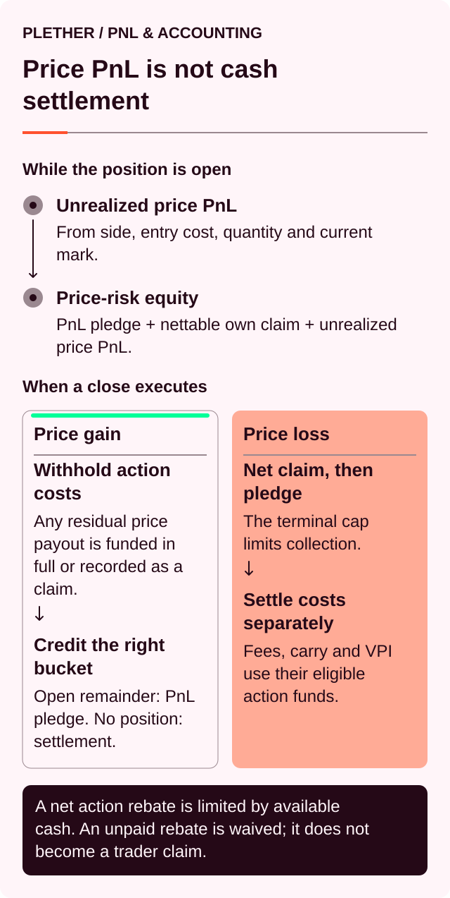
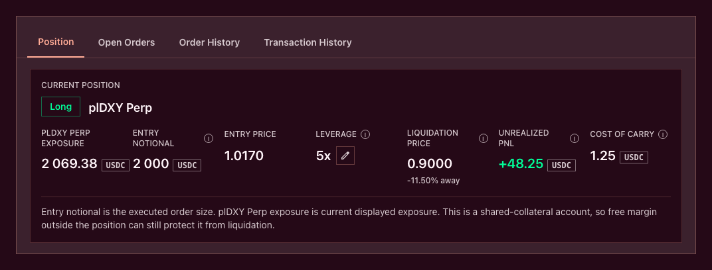
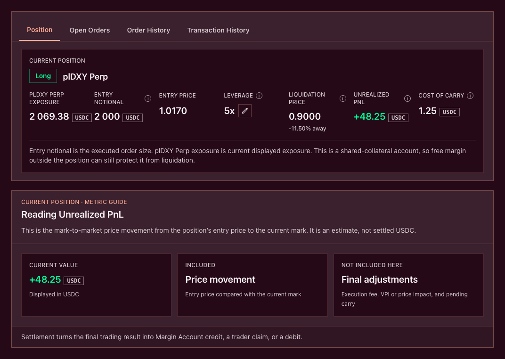
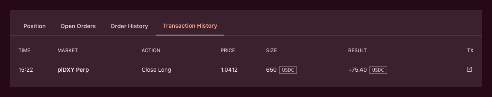

# How PnL is calculated

> Price PnL[^pnl] tells you what the market movement did. It does not tell you how much cash is available to withdraw.

Plether’s directional PnL is linear:

* **LONG USD** profits when the displayed price rises.
* **SHORT USD** profits when the displayed price falls.

That first calculation is simple. Settlement is where the distinctions begin.

Gross PnL, account equity, released margin, net settlement, trader claims and wallet balance are related—but they are not the same number.



### Start with the displayed price

Plether’s oracle[^oracle] calculates the raw foreign-currency basket, represented here as `B`.

The interface converts it into the dollar-oriented price:

```
D = 2.00 − B
```

Where:

* `B` is the bounded foreign-currency basket used internally.
* `D` is the **plDXY Perp price** displayed to traders.

Both are defined inside the fixed settlement range:

```
0.00 ≤ B ≤ 2.00
0.00 ≤ D ≤ 2.00
```

For example:

```
Raw basket B:       0.92
Displayed price D:  2.00 − 0.92 = 1.08
```

The inversion changes the direction of a move, but not its magnitude:

```
|change in D| = |change in B|
```

All trader-facing formulas below use `D`, the price displayed in the interface.

### Exposure, quantity and notional are different

Behind every position is a fixed contract quantity, represented here as `Q`. That quantity changes only when the position is increased or reduced.

The current interface derives several different values from it:

| Interface value         | Meaning                                                            |
| ----------------------- | ------------------------------------------------------------------ |
| **plDXY Perp price**    | Current displayed price `D`                                        |
| **plDXY Perp exposure** | `Q × current D`                                                    |
| **Entry price**         | Displayed execution price when the position was opened or averaged |
| **Entry notional**      | `Q × raw entry basket price`                                       |
| **Contract notional**   | `Q × current raw basket price`                                     |
| **Position margin**     | USDC collateral assigned to the position                           |
| **Unrealized PnL**      | Gross price PnL from entry to the current mark                     |

The distinction matters because **plDXY Perp exposure** and **Entry notional[^notional]** use different price bases.

> Do not calculate PnL by subtracting Entry notional from current plDXY Perp exposure.

The interface handles the conversion into contract quantity. For understanding PnL, the important variable is `Q`: the amount of index exposure whose value changes with price.



### Gross PnL

Let:

* `Q` = position quantity
* `Dentry` = displayed entry price
* `Dmark` = current displayed mark

#### LONG USD

```
Gross PnL = Q × (Dmark − Dentry)
```

The result is positive when the displayed price rises and negative when it falls.

#### SHORT USD

```
Gross PnL = Q × (Dentry − Dmark)
```

The result is positive when the displayed price falls and negative when it rises.

| Direction | Profits when     | Gross PnL              |
| --------- | ---------------- | ---------------------- |
| LONG USD  | `Dmark > Dentry` | `Q × (Dmark − Dentry)` |
| SHORT USD | `Dmark < Dentry` | `Q × (Dentry − Dmark)` |

The contracts apply the required decimal scaling automatically. The examples below use human-readable units.

### LONG USD example

Suppose a trader holds:

```
Position quantity: 10,000
Entry price:         1.00
Current mark:        1.04
```

Gross unrealized PnL is:

```
10,000 × (1.04 − 1.00)
= +400 USDC
```

If the mark falls to `0.97` instead:

```
10,000 × (0.97 − 1.00)
= −300 USDC
```

### SHORT USD example

Suppose a trader holds:

```
Position quantity: 10,000
Entry price:         1.00
Current mark:        0.96
```

Gross unrealized PnL is:

```
10,000 × (1.00 − 0.96)
= +400 USDC
```

If the mark rises to `1.03`:

```
10,000 × (1.00 − 1.03)
= −300 USDC
```

These results include only directional price movement.

They do not include:

* VPI[^vpi]
* Protocol execution fees
* Carry[^carry]
* Execution rewards
* Sponsored network gas or any explicitly self-funded network and oracle-update costs
* Released margin

### How leverage affects PnL

Leverage does not appear as a second multiplier in the PnL formula.

Once the position quantity has been established:

```
PnL = quantity × directional price change
```

Higher leverage allows a trader to support a larger quantity with less collateral. It therefore magnifies PnL relative to the trader’s margin, but it does not multiply an already-calculated PnL again.

Two positions with the same quantity, entry and current mark have the same gross PnL—even if one has more margin assigned than the other.

Their liquidation risk will be different.

The current Plether interface does not display an ROI[^roi] or PnL-percentage field. **Unrealized PnL** is shown directly in USDC[^usdc].

### Which price is used?

#### Unrealized PnL uses the current mark

Unrealized PnL uses:

* The position’s actual entry price
* The current central oracle mark
* The full remaining position quantity

The mark is not a guaranteed close price.

#### Realized PnL uses the close execution price

When you reduce or close a position, Plether uses the execution price resolved under the oracle policy active at finalization.

Expressed using displayed prices:

| Action or regime                         | Execution-price policy                                      |
| ---------------------------------------- | ----------------------------------------------------------- |
| Open LONG USD                            | Adverse confidence shift produces a higher entry            |
| Live or FAD-only close of LONG USD       | Adverse confidence shift produces a lower exit              |
| Open SHORT USD                           | Adverse confidence shift produces a lower entry             |
| Live or FAD-only close of SHORT USD      | Adverse confidence shift produces a higher exit             |
| Voluntary close during `oracleFrozen`    | Validated unshifted price; separate frozen-close spread      |

When the adverse confidence adjustment applies, it is embedded in the execution price rather than charged as a separate USDC fee.

As a result:

* A newly opened position may begin with a small negative unrealized PnL.
* The realized PnL from a close may be lower than the unrealized PnL visible before commitment.
* Price movement during delayed execution can create an additional difference.

VPI, fees and carry are still applied separately.

### Unrealized PnL is not cash

The interface describes **Unrealized PnL** as price PnL from entry to the current mark, before execution fees, VPI and pending carry.

It answers a hypothetical question:

> What is the position’s gross directional result at the current mark?

No USDC has moved merely because unrealized PnL changed.

Positive unrealized PnL is not yet:

* Credited to your Margin Account
* Withdrawable to your wallet
* Paid out of the HousePool

Negative unrealized PnL is not yet:

* Collected as HousePool cash
* Realized LP[^lp] revenue
* Final bad debt

Plether treats the two sides conservatively:

* Unrealized trader profits are recognized as potential pool liabilities.
* Unrealized trader losses are not treated as spendable pool assets.

Settlement is what turns PnL into cash movement, a trader claim or bad debt.



### Entry price after increasing a position

Increasing an existing position in the same direction creates a quantity-weighted average entry:

```
New entry =
(old quantity × old entry + added quantity × added execution price)
÷ total quantity
```

Because `D = 2.00 − B` is linear, the same weighted-average formula works with displayed prices.

For example:

```
Existing quantity: 10,000 at 1.00
Added quantity:      5,000 at 1.06
```

The new entry is:

```
(10,000 × 1.00 + 5,000 × 1.06)
÷ 15,000
= 1.02
```

Increasing the position does not realize the existing price PnL.

At a mark of `1.06`, the original position had:

```
10,000 × (1.06 − 1.00)
= +600 USDC
```

After the increase:

```
15,000 × (1.06 − 1.02)
= +600 USDC
```

The same gross PnL remains embedded in the larger position, subject to contract rounding.

The increase can still change account balances because:

* The increase’s VPI and execution fee are settled.
* Accrued carry is realized when collectible or otherwise checkpointed.
* Additional margin may be locked.
* A new execution reward is paid.

### Partial closes

A partial close realizes price PnL only on the quantity being closed:

```
Realized price PnL =
closed quantity × directional price difference
```

The remaining position:

* Keeps the same entry price
* Keeps the same direction
* Retains the unclosed quantity
* Releases position margin proportionally
* Retains its proportional maximum-payout envelope

Suppose the LONG USD position above has:

```
Total quantity: 15,000
Entry price:     1.02
Close quantity:  5,000
Close price:     1.08
```

Gross realized PnL is:

```
5,000 × (1.08 − 1.02)
= +300 USDC
```

The remaining position is:

```
Remaining quantity: 10,000
Entry price:         1.02
```

At the same `1.08` mark, its gross unrealized PnL is:

```
10,000 × (1.08 − 1.02)
= +600 USDC
```

Position margin is released proportionally. That released margin is not profit—it is existing collateral becoming free again.

A partial close also checkpoints the carry accrued by the position up to that point. Gross price PnL may therefore be proportional to the quantity closed while the final account adjustment is not perfectly proportional.

### From gross realized PnL to net settlement

Once the close execution price is fixed, Plether calculates gross realized price PnL.

The close then applies separate USDC adjustments:

```
Net close adjustment
=
Gross realized price PnL
− Signed close VPI
− Protocol execution fee
− Accrued carry
− Frozen-close spread, when applicable
```

For VPI:

* A positive value is a charge.
* A negative value is a rebate.
* Subtracting a negative value increases the trader’s result.

Opening VPI and the opening execution fee are not subtracted again. They were already settled when the position opened or increased.

The order execution reward is separate from this formula. It pays for resolving the delayed order and is not directional PnL.

#### Example net settlement

Assume a LONG USD close executes during a live or FAD-only[^fad] market state, so no frozen-close spread applies:

```
Gross realized PnL:       +390 USDC
Close VPI charge:          −12 USDC
Protocol execution fee:     −4 USDC
Accrued carry:              −6 USDC
```

The net close adjustment is:

```
390 − 12 − 4 − 6
= +368 USDC
```

If `1,000 USDC` of position margin is released, the accounting should show two separate entries:

```
Margin released:         1,000 USDC
Net close adjustment:     +368 USDC
```

The `1,000 USDC` is returned collateral. Only the `368 USDC` is the net result created by that close.

A complete lifetime result would also account for:

* Opening VPI
* Opening execution fee
* Opening and closing execution rewards
* Any earlier increases or reductions
* Any explicitly self-funded network or oracle-update costs; eligible sponsored network gas is paid by Plether

### When a close realizes a loss

For a negative settlement, Plether collects the amount owed from collateral reachable inside the trader’s Plether account.

Conceptually:

```
Amount owed
=
Gross realized loss
+ positive VPI
+ execution fee
+ accrued carry
+ frozen-close spread, when applicable
− applicable rebates
```

The amount collected can include:

* Free USDC in the Margin Account
* Margin released by the close
* Other collateral reachable under terminal settlement rules

Loss is therefore not necessarily limited to the margin originally assigned to the position.

Plether cannot debit USDC or other assets held outside the protocol in the trader’s wallet.

#### Partial-close protection

A partial close cannot leave an underfunded residual position while passing an uncovered loss to LPs.

If the loss from the closed portion cannot be collected without invading collateral protected for the remaining position, the partial close fails. The trader may need to:

* Add collateral
* Close a larger portion
* Close the complete position

#### Full-close shortfall

A full close can use all collateral defined as terminally reachable inside the account.

If an existing trader claim belongs to the same account, it can be reduced against a terminal shortfall before loss is socialized.

Not every uncollectible charge becomes LP bad debt. Any uncollectible frozen-close spread is waived, and any execution fee that cannot be cash-credited is not recorded as an LP loss or protocol receivable. Only the remaining uncovered base trading obligation becomes bad debt and is absorbed through the LP tranche[^tranche] waterfall.

### Position equity is broader than PnL

Liquidation is not based on Unrealized PnL alone.

Conceptually:

```
Net account equity
≈ reachable in-protocol USDC
+ unrealized price PnL
− accrued carry
− any provisional VPI rebate adjustment
```

That equity is compared with the applicable maintenance-margin requirement.

This explains why two positions with identical quantity, entry and mark can have different health:

* One account may hold more free USDC.
* One may have more position margin.
* One may have accrued more carry.
* One may have pending reservations.
* One may have provisional VPI accounting attached to the position.

The interface reflects these distinctions:

| Interface field        | Meaning                                      |
| ---------------------- | -------------------------------------------- |
| **Unrealized PnL**     | Gross price result only                      |
| **Cost of carry**      | Accrued unpaid carry in USDC                 |
| **Portfolio value**    | Net account equity, floored at zero          |
| **Maintenance margin** | Minimum equity requirement                   |
| **Available to Trade** | Free buying power after locked funds         |
| **Withdrawable**       | Amount that can currently leave the protocol |

Portfolio value is not the same as position margin, and Unrealized PnL does not automatically become free buying power.

### Profitable closes: cash or trader claim

Released position margin is accounted for separately from the positive net close adjustment. For the complete fresh HousePool-funded payout, Plether checks whether sufficient unreserved cash is available.

The fresh payout follows an all-or-nothing rule: it is either credited immediately in full or recorded in full as a trader claim. Plether does not split it between the two.

#### Immediate payout

If sufficient cash is available:

1. The HousePool transfers the payout to the Margin Clearinghouse.
2. The Trading Account’s Margin Account is credited.
3. The trader may withdraw through the normal withdrawal flow.

The profit is not sent directly to the wallet.

#### Trader claim

If sufficient free cash is not available:

1. The position still closes.
2. None of the fresh payout is credited immediately.
3. Plether records the complete fresh payout as a trader claim.
4. The claim remains a senior HousePool liability.
5. LP withdrawals remain restricted around that liability.

A claim is not immediately withdrawable USDC.

It becomes settleable once aggregate trader claims are fully covered by physical HousePool cash. Settlement credits the Trading Account’s Margin Account, after which the normal withdrawal process applies.

### Current interface status

The current interface does not yet provide a complete net-close reconciliation in one view.

In particular:

* **Transaction History → Result** shows gross realized price PnL.
* It is before close VPI, execution fee and carry.
* The Final Result view shows fee and VPI lines but not complete net settlement.
* Released margin is not presented separately.
* Trader claim balance and **Settle Claim** appear in a separate **Trader claim** card under **Position**; the live card does not preflight aggregate coverage or show a separate settlement-status field.
* **Settle Claim** credits the complete claim to the Trading Account’s Margin Account after owner-wallet authorization.
* Portfolio value does not include a separate outstanding trader claim.

A profitable close that creates a claim can therefore appear under-credited in the current interface even though the liability exists onchain.



### The fixed range bounds gross PnL

Because the displayed price is bounded between `0.00` and `2.00`, the maximum gross directional result is calculable at entry.

| Direction | Best boundary | Maximum gross profit  | Worst boundary | Maximum gross price loss |
| --------- | ------------- | --------------------- | -------------- | ------------------------ |
| LONG USD  | `2.00`        | `Q × (2.00 − Dentry)` | `0.00`         | `Q × Dentry`             |
| SHORT USD | `0.00`        | `Q × Dentry`          | `2.00`         | `Q × (2.00 − Dentry)`    |

These are mathematical price boundaries, not promised outcomes.

A position can be liquidated before reaching either endpoint. VPI, fees, carry and execution rewards also sit outside gross price PnL, so maximum gross price loss is not the same as maximum total account cost.

If the external FX[^fx] market moves beyond Plether’s settlement range, Plether PnL stops extending beyond the applicable boundary. That creates basis risk[^basis-risk] relative to an unbounded external market.

### Rounding

Plether’s contracts calculate with:

* 18-decimal position quantities
* 8-decimal index prices
* 6-decimal USDC accounting

Values smaller than the supported accounting precision are truncated according to contract arithmetic. The interface may display fewer decimals than the contracts store.

Small differences between a hand calculation and the final onchain result can therefore come from:

* Price-display rounding
* Weighted-entry rounding
* USDC precision
* Proportional margin rounding
* The execution-price policy active at finalization

Use the confirmed onchain result as the final record.

### A practical reconciliation

To understand a Plether position, read the numbers in this order:

1. Use the displayed dollar-oriented price `D = 2.00 − B`.
2. Calculate gross price PnL from quantity and directional price movement.
3. Keep position margin separate from profit.
4. Adjust account equity for reachable collateral, carry and applicable VPI accounting.
5. At close, use the execution price produced by the active oracle policy.
6. Subtract close VPI, the execution fee and accrued carry.
7. Subtract the frozen-close spread when it applies.
8. Show released margin separately.
9. Determine whether positive settlement became Margin Account cash or a trader claim.
10. For a loss, determine how much reachable collateral was collected and whether any shortfall remained.

The central distinction is simple:

> PnL measures price performance. Settlement determines who owes cash. Custody determines whether that cash can be withdrawn.

[^pnl]: Profit and loss, the financial result of market-price movement on a position.
[^oracle]: A service that supplies external market data to smart contracts; Plether uses Pyth price feeds.
[^notional]: The face value of a position’s market exposure, not the amount of collateral posted.
[^vpi]: Virtual Price Impact, a separate USDC charge or rebate based on how a trade changes HousePool directional imbalance.
[^carry]: The time-based cost charged on the portion of a position financed by LP capital.
[^usdc]: A US dollar-denominated stablecoin Plether uses for margin and settlement.
[^roi]: Return on investment, gain or loss expressed relative to the capital invested.
[^lp]: Liquidity provider, a participant that supplies USDC capital to the HousePool.
[^fad]: Friday Afternoon Deleverage, Plether’s wider scheduled close-only window around the weekly FX closure.
[^tranche]: A pool layer with its own loss priority, withdrawal priority and return profile.
[^fx]: Foreign exchange, the market for trading one currency against another.
[^basis-risk]: The risk that a hedge and the exposure it is intended to offset do not move together.
