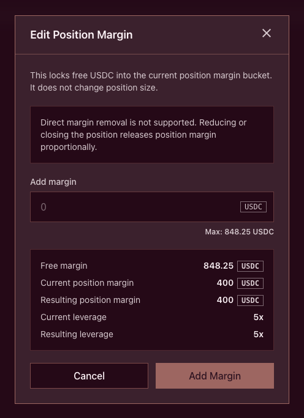
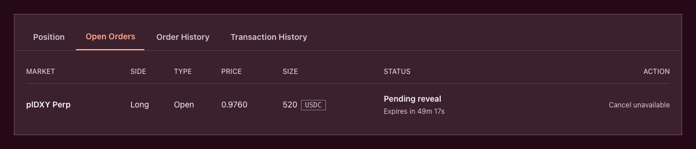

# Margin, leverage and liquidation

Margin is assigned to a position. Risk is assessed across the account.

That distinction is fundamental. The USDC shown as **Position margin** is not an isolated loss limit. Free USDC held in the same Plether account can protect the position—and losses can consume that free USDC before becoming bad debt.

The practical model is:

```
Position margin organizes collateral.
Account equity determines health.
Maintenance margin determines liquidation.
```

### Where your USDC sits

All trader collateral is held in the MarginClearinghouse. Within it, USDC is divided into separate accounting buckets.

| Bucket                   | What it means                                                                                         |
| ------------------------ | ----------------------------------------------------------------------------------------------------- |
| Free USDC                | Available for new orders, fees, carry, supporting open positions or withdrawal—subject to risk checks |
| Position margin          | USDC assigned to the active position                                                                  |
| Committed order margin   | USDC reserved for a pending order                                                                     |
| Execution reward reserve | USDC reserved to reward the account executing or cleaning up an order                                 |

The total of these buckets forms the account’s settlement balance, but not every bucket is available for every purpose.

Position margin and eligible free USDC support account health. During terminal settlement, committed order margin may also be reachable. Execution reward reserves are kept separate from ordinary position health.

A trader claim—a receivable recorded when the pool cannot immediately cash-settle an amount—is not physical collateral and does not keep another position healthy.

> Position margin is part of the account’s collateral. It is not an isolated-loss boundary.

Plether cannot debit USDC or other assets held in your wallet, another protocol or another Plether account.

### The notional used for margin

Plether displays the dollar-oriented index price:

```
D = 2.00 − B
```

Where:

* `D` is the displayed Plether Dollar Index price.
* `B` is the raw foreign-currency basket price.

The risk engine calculates current contract notional from the raw basket:

```
N = S × B
  = S × (2.00 − D)
```

Where `S` is the protocol position size.

This means the notional used for leverage and margin is not simply position size multiplied by the displayed index price.

Directional PnL is still calculated from changes in `D`. The distinction above applies to margin and risk accounting.

### Initial margin

Initial margin governs the creation of risk.

When you open or increase a position, Plether checks that both:

1. The margin assigned to the position meets the initial requirement.
2. The account’s post-trade equity meets the same requirement.

Conceptually:

```
Initial requirement
= max(
    current contract notional × initial margin rate,
    minimum liquidation-bounty floor
  )
```

The post-trade check includes the applicable execution fee, VPI adjustment and accrued carry. An order that appears sufficiently collateralized before costs may fail after those costs are applied.

The protocol also verifies that:

* the resulting position is not immediately liquidatable;
* the HousePool can cover its bounded maximum liability;
* the resulting market imbalance remains within protocol limits.

Initial margin rates and bounty parameters are protocol settings. Refer to the live parameters page for current values.

### Maintenance margin

Maintenance margin determines whether an existing position may remain open.

```
Maintenance margin
= current contract notional × active maintenance margin rate
```

The central liquidation condition is:

```
Account equity ≤ Maintenance margin
```

Equality counts. If account equity is exactly equal to the requirement, the position is eligible for liquidation.

Maintenance margin is normally lower than initial margin. This gives a valid position some room to move after opening—but it is not a guaranteed safety buffer.

### Position leverage and effective account leverage

Plether can describe leverage in two different ways.

#### Position leverage

```
Position leverage
= current contract notional ÷ assigned position margin
```

This is the leverage shown in the **Current Position** panel. It describes the relationship between the position’s current notional and the USDC explicitly assigned to it.

#### Effective account leverage

```
Effective account leverage
= current contract notional ÷ account equity
```

This includes the effect of free USDC, unrealized PnL and pending obligations. It is therefore more representative of current account risk.

If account equity is zero or negative, effective leverage is no longer a meaningful finite number. The account should instead be treated as critically undercollateralized.

#### Example

Suppose:

```
Current contract notional:  $10,000
Assigned position margin:    $1,000
Account equity:              $1,500
```

Then:

```
Position leverage:          10.00×
Effective account leverage:  6.67×
```

If losses and carry reduce account equity to `$800`, effective account leverage rises to `12.50×`, even if assigned position margin and contract notional remain unchanged.

Free USDC can therefore reduce effective account leverage without changing the leverage shown against the position-margin bucket.

Leverage is also a snapshot. It can change because:

* the oracle price changes current notional;
* unrealized PnL changes equity;
* carry accrues;
* fees or VPI consume collateral;
* USDC enters or leaves the account;
* the active margin regime changes.

Higher leverage means less room for adverse movement and costs. Leverage itself, however, is not the liquidation trigger. The equity test is.


### Depositing USDC versus adding position margin

These actions are not equivalent.

#### Depositing new USDC

Depositing USDC from your wallet increases the account’s settlement balance.

If carry is already due, some of the deposit may be used to settle it immediately. The net improvement in account equity can therefore be smaller than the deposited amount.

#### Adding position margin

Adding position margin moves existing free USDC into the position-margin bucket. It does not:

* increase position size;
* change entry price;
* create new account equity.

The USDC was already inside the account and already available to support account health.

Adding position margin can still:

* lower the displayed position leverage;
* satisfy position-level requirements for a later increase;
* reduce the part of the position economically financed by LP capital;
* reduce future carry.

Plether realizes accrued carry before locking the added margin. If carry consumes part of the account’s existing position margin, the resulting increase may be smaller than a simple `current margin + added amount` estimate.

#### Removing position margin

Direct position-margin removal is not supported.

Reducing or closing the position releases assigned margin proportionally. Once released into free USDC, it may be withdrawn if the account passes the post-withdrawal risk checks.



### Available to trade is not the same as withdrawable

Free buying power shows USDC not currently locked in accounting buckets. It does not, by itself, prove that the same amount can safely leave the account.

Before allowing a withdrawal, Plether accounts for:

* unrealized PnL;
* accrued carry;
* current oracle freshness;
* initial and maintenance requirements;
* pending order reservations;
* the active protocol state;
* the account’s health after withdrawal.

The interface therefore shows a separate **Withdrawable** amount. It may be lower than **Available to Trade**, and may temporarily be zero even when some free USDC is visible.

### How liquidation equity is calculated

Conceptually:

```
Liquidation equity
= terminally reachable USDC
+ unrealized directional PnL
− pending carry
− applicable provisional VPI rebate adjustment
```

This is compared with the active maintenance requirement.

A position may have positive gross PnL and still be liquidatable if collateral is low or accumulated costs are high. A losing position may remain healthy if sufficient USDC is available elsewhere in the account.

#### Illustrative example

Suppose an account has:

```
Assigned position margin:  $1,000
Eligible free USDC:          $500
Unrealized PnL:           −$1,150
Pending carry:                $50
Maintenance requirement:     $250
```

Its liquidation equity is:

```
$1,000 + $500 − $1,150 − $50 = $300
```

The account remains above the `$250` maintenance requirement.

If the unrealized loss deepens by another `$70`:

```
Liquidation equity = $230
```

Because `$230 ≤ $250`, the entire position becomes eligible for liquidation.

This example also shows why assigned position margin is not the account’s maximum possible loss. The position can lose more than its assigned margin while free account USDC continues supporting it.

### Liquidation price

The displayed liquidation price estimates where projected account equity reaches the active maintenance requirement.

In displayed index terms:

* A **LONG USD** position is normally vulnerable at or below its liquidation price.
* A **SHORT USD** position is normally vulnerable at or above its liquidation price.

The threshold is not permanent. It can move because:

* carry continues accruing;
* account collateral changes;
* current contract notional changes;
* VPI accounting changes;
* the maintenance margin regime changes;
* pending reservations change.

Actual liquidation uses a fresh, side-adverse confidence-adjusted oracle price. For liquidation testing, the protocol shifts the accepted price against the account:

* lower for LONG USD;
* higher for SHORT USD.

The chart mark and displayed liquidation price should therefore be treated as estimates, not guaranteed execution boundaries.

#### What “Not in range” means

The displayed index has a fixed settlement range:

```
0.00 ≤ D ≤ 2.00
```

If the interface shows **Not in range**, it means that no liquidation threshold was found inside that range under the current account and risk snapshot.

It does not mean the account is permanently immune from liquidation. Carry, withdrawals, new orders or a stricter margin regime can create an in-range threshold without an index move.

> **Current testnet note:** The displayed liquidation-price estimate does not fully project pending carry through the threshold calculation, while live protocol health does include it. Treat the live account-equity check as authoritative.

### The market-close margin regime

As Plether approaches a scheduled market closure, the protocol can enter a close-only risk window.

During this period:

* new positions and increases are blocked;
* reductions and full closes remain available;
* a higher market-close margin rate replaces ordinary maintenance margin.

An account can therefore become liquidatable without any movement in the index if the higher requirement becomes active.

Traders should not wait until the close-only window begins to evaluate whether they have sufficient collateral to remain open.

### What happens during liquidation

Liquidation is permissionless. Once an account satisfies the liquidation condition, a keeper may submit a liquidation transaction.

There is no separate onchain margin-call state and no guaranteed grace period.

A successful liquidation proceeds broadly as follows:

1. The protocol validates a fresh liquidation oracle update.
2. It applies the side-adverse confidence adjustment.
3. It calculates current PnL, carry, reachable collateral and maintenance margin.
4. If equity remains above maintenance, the transaction is rejected.
5. If equity is at or below maintenance, the entire position is deleted.
6. Reachable account value is used for settlement.
7. The keeper receives a liquidation bounty, capped by collateral the protocol can physically reach.
8. Any positive value remaining belongs to the trader.
9. Any uncovered shortfall becomes protocol bad debt.
10. The account’s pending orders are failed and cleaned up.

Liquidation does not charge the normal voluntary-close execution fee or a new voluntary-close VPI adjustment. Pending carry and any applicable negative accrued-VPI adjustment still form part of terminal accounting.

The liquidation bounty is a liquidation cost. It is not necessarily equal to the trader’s loss or the size of the liquidated position.

### Liquidation is always full

Plether does not partially liquidate positions.

Once liquidation succeeds, the complete position is closed. The protocol does not reduce the position just enough to restore a target leverage ratio.

Crossing the maintenance threshold therefore puts the entire position at risk.

Liquidation also does not force-sell the position through an AMM or order book. It settles against the protocol oracle. One liquidation does not mechanically move the execution price for the next account, although the same oracle move may make many accounts liquidatable at once.

### A pending close does not protect the position

Submitting a close order does not immediately reduce exposure.

Until the close executes:

* the original position remains active;
* PnL and carry continue changing;
* the account remains liquidatable;
* the submitted close does not reserve an execution price.

Liquidation uses a separate protective path and does not wait behind the global order queue. If liquidation happens first, pending orders for that account fail with **Account liquidated**.

Reserved order execution rewards are forfeited to the protocol treasury during liquidation. Eligible committed order margin remains reachable for terminal settlement.



### Liquidation does not necessarily consume everything

An account can be liquidatable while it still has positive equity. Maintenance margin is a safety threshold above zero.

After carry, applicable adjustments and the liquidation bounty:

* a positive residual is preserved for the trader;
* released margin follows separately; if a fresh HousePool-funded payout cannot be funded in full, the complete fresh payout is recorded in full as a trader claim;
* an existing trader claim may be netted against a terminal shortfall;
* only the remaining uncovered loss becomes bad debt borne by the LP waterfall.

Liquidation means the entire position is closed. It does not automatically mean every dollar in the account is lost.

### Voluntary close versus liquidation

|                 | Voluntary close                                       | Liquidation                                           |
| --------------- | ----------------------------------------------------- | ----------------------------------------------------- |
| Initiated by    | Trader or delegated account operator                  | Any keeper                                            |
| Execution path  | Delayed global order queue                            | Separate permissionless path                          |
| Position size   | Partial or full                                       | Full only                                             |
| Pricing         | Eligible delayed execution mark                       | Fresh adverse confidence-adjusted liquidation mark    |
| Costs           | Carry, execution fee, order bounty and applicable VPI | Carry, applicable VPI clawback and liquidation bounty |
| Pending orders  | Continue independently                                | Failed and cleaned up                                 |
| Trader residual | Preserved                                             | Preserved after terminal costs                        |

A submitted voluntary close remains only an intention until it executes.

### Margin Call Simulator

The advanced **Margin Call Simulator** removes the interface’s ordinary leverage limit and allows testing much closer to the protocol’s maintenance boundary.

Despite its name, it does not create a margin call or grace period. Plether still uses full liquidation.

At extreme leverage, a position may become invalid or liquidatable because of:

* a very small adverse move;
* execution fees or rewards;
* VPI;
* carry;
* the stricter market-close requirement.

The simulator derives its upper range primarily from maintenance margin. Initial-margin requirements and transaction costs can still cause an order at the displayed extreme to fail.

Treat this as a testing tool, not a risk-control feature.

### Managing liquidation risk

The useful question is not only:

> How much margin is assigned to my position?

It is:

> How much account equity remains after PnL, carry and other obligations—and how does that compare with maintenance margin?

In practice:

* Monitor account equity and maintenance margin together.
* Leave room for price movement, carry and the market-close regime.
* Deposit new USDC when you intend to add economic collateral.
* Do not assume reassigning free USDC creates new account equity.
* Treat **Withdrawable**, not free buying power, as the withdrawal limit.
* Remember that a pending close leaves the position live.
* Treat the displayed liquidation price as an estimate.
* Reduce or close early enough for delayed execution to complete.

### The central distinction

```
Position size determines price sensitivity.
Assigned margin satisfies position-level requirements.
Account equity determines ongoing health.
Maintenance margin determines full liquidation.
```

The fixed `0.00–2.00` range makes directional liability measurable. It does not bound carry, fees or liquidation bounties, and it does not prevent liquidation before either boundary is reached.
