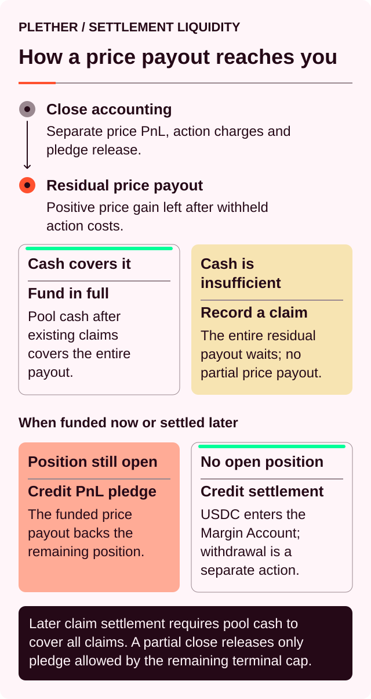
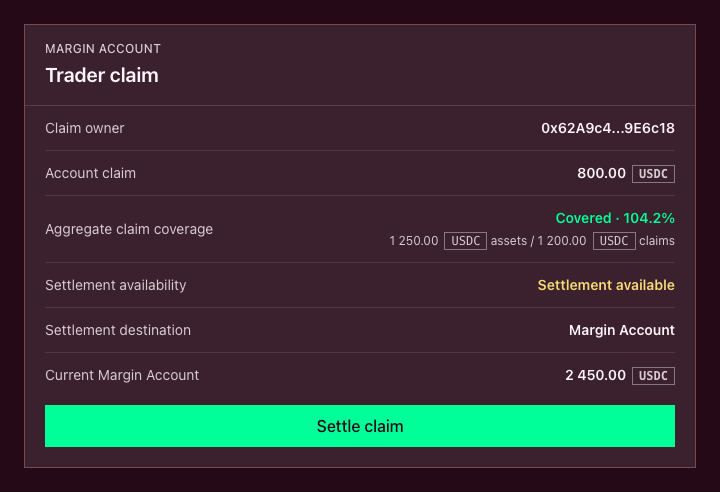
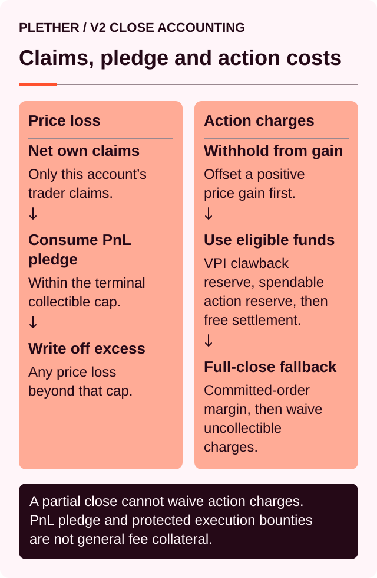

# Settlement liquidity and trader claims

A profitable close and an immediately withdrawable balance are not always the same event.

When a position closes, Plether answers two separate questions:

1. What is the position’s final net settlement?
2. Can the liquidity pool fund the full amount immediately?

Released position margin follows separately. The complete fresh pool-funded payout is either credited immediately to the Trading Account’s Margin Account or, when sufficient settlement liquidity is unavailable, recorded in full as a trader claim. Plether never splits one fresh payout between an immediate credit and a new claim.

This separation prevents a temporary cash shortage from trapping traders in open positions. It also means that realized profit can be final before it becomes liquid USDC[^usdc].

> Bounded liability determines how much the protocol can owe. It does not guarantee that every amount owed can be withdrawn in the same transaction.

### Settlement values that should not be confused

| Value                   | What it represents                                                                                                     |
| ----------------------- | ---------------------------------------------------------------------------------------------------------------------- |
| **Realized PnL**        | The result of the price movement on the closed position, before VPI, execution fees, carry and any frozen-close spread |
| **Released margin**     | The trader’s existing collateral unlocked from the closed portion                                                      |
| **Fresh trader payout** | A positive net settlement that must be funded by the liquidity pool                                                        |
| **Trader claim**        | A complete fresh payout recorded in full because it could not be funded immediately                                    |
| **Withdrawable USDC**   | Margin Account USDC that can currently leave the protocol after all account checks                                     |

A profitable close may involve several of these values at once.

### The settlement flow



The process is the same for LONG USD and SHORT USD positions.

### Step 1: Calculate the net close settlement

Plether first calculates the economics of the closed size:

```
Net close settlement
= realized PnL
− signed close VPI
− execution fee
− carry due at execution
− frozen-close spread, when applicable
```

The VPI[^vpi] adjustment is signed:

* A positive VPI is a charge.
* A negative VPI is a rebate.

Normal signed VPI and its existing lifetime rebate clamp remain unchanged in every voluntary-close regime, including during `oracleFrozen`.

The frozen-close spread is separate from VPI. It applies only to voluntary reductions and closes executed during `oracleFrozen`.

The current rate is:

```
50 bps
= 0.50% of the notional being reduced
```

The spread is zero for:

* Open-market closes
* FAD-only[^fad] closes while the live-oracle[^oracle] policy remains active
* Liquidations

The execution-time market state determines whether it applies. A close committed before `oracleFrozen` but executed after the boundary is assessed the spread.

The rate is part of the protocol’s timelocked risk configuration. It must remain nonzero and cannot exceed `1,000 bps`[^bps], or `10.00%`. The live onchain value is authoritative.

A positive net result is a fresh payout owed by the liquidity pool. A negative result is an amount owed by the trader’s account.

The net settlement is separate from the position margin being released.

### Step 2: Release the closed portion’s margin

The proportional margin assigned to the closed size is removed from active position margin.

That USDC already exists inside the Margin Account. It does not require a new transfer from the liquidity pool.

On a profitable close, the released margin normally becomes free settlement balance. On a losing close, some or all of it may be consumed by the loss.

For a partial close, the margin supporting the remaining position stays locked.

### When the trader owes the protocol

If a voluntary close produces an amount owed by the account, reachable value is allocated in this order:

1. Execution fee
2. Base close obligation
3. Frozen-close spread

The base close obligation is the ordinary close settlement before the additional frozen spread. The spread is junior to both the execution fee and the base obligation.

#### Partial reductions must settle in full

A partial reduction must settle its complete obligation, including the full frozen-close spread.

If any part remains unpaid:

* The reduction does not execute.
* No reduced residual position is created.
* No partial spread collection is finalized.
* The original position remains open.

This prevents a trader from reducing exposure while leaving LPs[^lp] with an uncovered obligation and a protected residual position.

#### Terminal full closes preserve exit liveness

A terminal full close follows a different rule.

Plether:

1. Collects the execution fee.
2. Collects the base close obligation.
3. Applies any remaining reachable value to the frozen-close spread.
4. Waives only the portion of the spread that still cannot be collected.

The waived amount:

* Does not become bad debt
* Does not become a trader claim
* Does not become an LP receivable
* Does not create a future liquidity pool reserve
* Does not become protocol revenue

Genuine uncovered base trading loss continues through the ordinary bad-debt rules. Only the uncollectible frozen-close spread receives the waiver treatment.

Every dollar of spread actually retained, collected or recovered from the same account belongs entirely to LPs. None of it credits the protocol treasury.

#### Assessed, paid and waived spread

The onchain close preview exposes:

* `frozenSpreadUsdc` — total spread assessed
* `frozenSpreadPaidUsdc` — spread collected for LPs
* `frozenSpreadWaivedUsdc` — uncollectible terminal spread waived

For a valid close:

```
spread assessed
= spread paid
+ spread waived
```

All three values are zero outside `oracleFrozen`.

A successful close with a nonzero assessment emits:

```
FrozenCloseSpreadSettled(
    account,
    assessedUsdc,
    paidUsdc,
    waivedUsdc
)
```

#### Collection example

Suppose a terminal full close has:

```
Execution fee:          10 USDC
Base close obligation: 100 USDC
Frozen-close spread:    50 USDC
Collectible value:     130 USDC
```

Settlement follows the required order:

```
10 USDC → execution fee
100 USDC → base close obligation
20 USDC → frozen-close spread
```

The result is:

```
Frozen spread assessed: 50 USDC
Frozen spread paid:     20 USDC
Frozen spread waived:   30 USDC
```

The `30 USDC` waiver is not bad debt, a trader claim or an LP receivable.

The same funding would be insufficient for a partial reduction. A partial reduction must fund the complete `160 USDC` obligation or it does not execute.

### Step 3: Fund or record the positive settlement

Before paying a new positive settlement, Plether reserves pool cash for all existing trader claims.

```
Fresh payout capacity
= max(
    physical pool assets
    − aggregate trader claims,
    0
  )
```

The new payout follows an all-or-nothing rule:

* If the entire amount fits within fresh payout capacity, it is credited immediately.
* If the entire amount does not fit, none of it is paid immediately. The full amount becomes a trader claim.

Plether does not split one close between a partial immediate payment and a partial claim.

For example, if a trader is owed `250 USDC` but only `200 USDC` is available above existing claims, the entire `250 USDC` becomes a claim.

Existing claims therefore cannot be bypassed by newer profitable closes.

Any applicable frozen-close spread has already been deducted before Plether determines the fresh trader payout. When that complete payout cannot be funded immediately, a trader claim records the full net positive settlement—not gross PnL[^pnl] before costs.

For example:

```
Positive settlement before spread: 300 USDC
Frozen-close spread:                 50 USDC
Fresh trader payout:                250 USDC
```

If immediate settlement liquidity is insufficient, the resulting claim is `250 USDC`, not `300 USDC`.

The current live final-close summary does not show the complete immediate-payout-versus-claim split; the onchain settlement result is authoritative.

### Immediate settlement does not mean wallet settlement

An immediate payout moves USDC from the liquidity pool to the clearinghouse and credits the Trading Account’s Margin Account.

It is not transferred directly to the trader’s wallet.

The trader must still use the normal withdrawal flow. The amount that can leave the protocol may be limited by:

* margin supporting a remaining position;
* pending orders and reserved execution rewards;
* accrued carry[^carry];
* mark freshness;
* post-withdrawal margin requirements.

If the trader is flat and the balance is otherwise unencumbered, it can normally be withdrawn through the usual Margin Account flow.

### What is a trader claim?

A trader claim is a USDC-denominated amount that the liquidity pool owes to a specific Trading Account.

It is:

* recorded onchain at the complete fresh payout amount;
* separate from the Trading Account’s Margin Account balance;
* reserved ahead of LP withdrawals;
* added to any existing claim belonging to the same account;
* fixed in USDC rather than continuing to move with the index.

It is not:

* wallet USDC;
* free margin or buying power;
* collateral for ordinary position-health calculations;
* an LP share;
* a transferable claim token;
* an interest-bearing balance;
* a position in a first-in, first-out queue.

A claim does not expire, but it has no guaranteed settlement date.

“Senior” in this context describes the contract’s internal cash-priority rules. It does not describe a separate legal claim outside the protocol.

A waived frozen-close spread is not a trader claim. It is a trader-owed charge that Plether did not collect—not an amount the liquidity pool owes the trader.

### Claims are balances, not a queue

Plether does not maintain a first-claim, first-paid queue.

All trader claims are considered together. Claim settlement is available only when:

```
physical pool assets
≥ aggregate trader claims
```

If aggregate claims are under-covered, settlement is unavailable to every claimant—even if the liquidity pool could individually pay one smaller claim.

This prevents settlement from becoming a race in which the first caller extracts cash while other claims remain under-covered.

Once aggregate coverage is restored, each Trading Account can settle its complete claim after its owner wallet authorizes the action. Paying one claim reduces physical pool assets and aggregate claims by the same amount, preserving coverage for the remaining claimants.

### How to settle a trader claim

When aggregate claims are fully covered:

1. The owner wallet authorizes settlement for the claim-owning Trading Account.
2. Plether checkpoints carry if the account still has an open position.
3. Plether submits the eligible sponsored Trading Account operation.
4. The full claim moves from the liquidity pool to the clearinghouse.
5. The Trading Account’s claim balance is reduced by the same amount.
6. If the Trading Account still has an open position, the credit is added to its PnL pledge; it is not free, withdrawable or reusable margin while that position remains open.
7. If the Trading Account is flat, the credit becomes free Margin Account balance and can use the normal sponsored withdrawal flow.

Claim settlement requires authorization from the Trading Account’s owner wallet and is all-or-nothing. The sponsor and bundler[^bundler] can relay the authorized operation, but they cannot create the owner signature. The protocol does not support entering a smaller settlement amount.

If the account still has an open position, carry is checkpointed before the claim credit changes its PnL pledge. The full claim is settled, but the account’s overall balance increase can be smaller if carry was due. Only a flat account receives the settlement as free balance.



Aggregate coverage is enforced onchain. The screenshot is an illustrative documentation prototype of the flat-account branch; a claim settled while a position remains open credits PnL pledge instead. The current live trader card does not preflight aggregate coverage before showing **Settle Claim**, so an under-covered settlement attempt fails.

### A claim is not position collateral

An unsettled claim cannot:

* support a new position;
* increase available buying power;
* prevent liquidation;
* make an under-margined position healthy;
* be withdrawn as USDC.

There is one important exception: account-level terminal netting.

If the same account later produces a terminal negative settlement, its existing trader claim can be consumed after physically reachable collateral.

For an oracle-frozen voluntary full close, collection still follows:



Claim value used against the execution fee or base obligation can prevent genuine bad debt. Claim value remaining after those obligations can pay the frozen-close spread to LPs.

Any spread still uncollectible after terminal account-level netting is waived rather than recorded as bad debt.

This happens only during terminal settlement paths such as a full close or liquidation. It is not part of ordinary account health.

Claims belonging to other traders are never used.

### Liquidations follow the same payout and claim rules

A liquidation can produce either a positive or negative residual after the account is closed.

Liquidations do not assess the frozen-close spread, including during `oracleFrozen`. The execution fee → base obligation → frozen spread collection order applies only to voluntary reductions and closes.

If the trader is still owed a positive amount, it follows the same rule as any other fresh payout:

* the full amount is credited immediately; or
* the full amount becomes a trader claim.

If the account owes more than its reachable collateral:

1. Reachable collateral is consumed.
2. Any existing claim belonging to that account is netted against the remaining shortfall.
3. Only the uncovered liquidation shortfall becomes bad debt.

The liquidator’s bounty is separate. It is funded from reachable trader collateral and does not compete with trader-claim liquidity.

### Three different liquidity tests

Settlement liquidity, claim serviceability and LP withdrawal liquidity answer different questions.

| Question                              | Protocol rule                                                                                   |
| ------------------------------------- | ----------------------------------------------------------------------------------------------- |
| Can a new positive close be paid now? | The full payout must fit after reserving all existing trader claims                             |
| Can an existing claim be settled?     | Physical pool assets must cover all aggregate trader claims                               |
| Can an LP withdraw?                   | Assets must remain after live trader liability, its settlement buffer, claims and other explicit reserves are deducted |

A generic “Pool liquidity” number should therefore not be treated as a guarantee that a particular payout or claim can be settled.

### How claims affect LP withdrawals

Trader claims become reserved liabilities as soon as they are recorded. The liquidity pool does not need to transfer USDC for the reserve to take effect.

For the holder-facing withdrawal flow and live-limit checks, see [Withdraw liquidity](../providing-liquidity/withdraw-liquidity.md).

The core withdrawal reserve is:

```
Maximum modeled live liability
= max(
    LONG USD maximum-profit liability,
    SHORT USD maximum-profit liability
  )
```

The larger directional liability is used because the two theoretical maximums occur at opposite index boundaries. They cannot both be reached in the same settlement state.

The simplified LP withdrawal reserve is therefore:

```
Core withdrawal reserve
= maximum modeled live liability
+ liability-scaled settlement buffer
+ aggregate trader claims
```

At the liquidity pool level:

```
Free LP liquidity
= max(
    physical pool assets
    − maximum modeled live liability
    − liability-scaled settlement buffer
    − aggregate trader claims
    − other explicit reserves,
    0
  )
```

Tranche-specific[^tranche] limits, cooldowns and protocol-state checks are applied afterwards.

Trader claims rank ahead of both LP tranches. A Senior LP is senior relative to Junior LP capital—not relative to trader claims.

Within the LP stack:

* Junior capital absorbs reconciled LP losses first.
* Senior capital is affected after Junior is exhausted.
* Neither tranche can withdraw cash reserved for trader claims.

When a claim is recorded, the closed portion’s live-position liability also disappears. The obligation changes from a contingent position liability into a realized claim; it is not meant to be counted twice.

When the claim is eventually settled, physical pool assets and claim liabilities fall by the same amount. The economic effect was already recognized when the claim was created.

A paid frozen-close spread follows different accounting. Any amount retained, collected in cash or recovered from the same account’s trader claim is recorded as LP-owned pool revenue.

A waived spread is not recorded as:

* an asset;
* an LP receivable;
* a trader claim;
* a pool reserve;
* protocol revenue;
* bad debt.

LP accounting recognizes only the amount actually paid.

### Trader claims and bad debt are opposites

| Trader claim                                                 | Bad debt                                                                                         |
| ------------------------------------------------------------ | ------------------------------------------------------------------------------------------------ |
| The liquidity pool owes the trader                               | The trader account could not pay the protocol                                                    |
| Created by a positive net settlement                         | Created by an uncovered terminal base trading-loss obligation                                    |
| Reserved ahead of LP withdrawals                             | Absorbed economically by LP capital                                                              |
| Settles when aggregate claims are cash-covered               | Economic backing can recover through revenue or recapitalization; the telemetry counter clears only through recapitalization |
| Can be netted against the same account’s later terminal loss | Represents uncovered base trading loss after reachable collateral and same-account claim netting |

A waived frozen-close spread belongs to neither column.

It is a charge the protocol forgoes to let a terminal full close complete. The liquidity pool does not owe it to the trader, and the trader’s inability to pay it does not increase bad debt or create an LP receivable.

### Claims and degraded mode

For remaining open positions, Plether measures effective backing after existing claims:

```
Effective assets
= max(
    physical pool assets
    − aggregate trader claims,
    0
  )
```

If effective assets fall below the maximum modeled liability of the remaining positions, Plether enters degraded mode.

A trader claim does not automatically trigger degraded mode. If no material live-position liability remains, the protocol may have under-covered claims without failing the degraded-mode test.

Similarly, bad debt telemetry alone is not the degraded-mode condition. What matters is the relationship between effective assets and the remaining modeled liability.

A waived frozen-close spread is neither an asset nor bad debt. It therefore does not increase effective backing and does not create an additional degraded-mode liability.

While degraded, risk-increasing trades and new LP deposits are blocked. Otherwise-eligible LP withdrawal requests can still enter the queue, but no new withdrawal USDC is allocated while the degraded latch remains active. Already-funded withdrawal actions remain usable. Funding can resume only after effective solvency is restored and the protocol owner explicitly clears degraded mode. Risk-reducing actions such as closes and liquidations remain available, along with recovery and recapitalization paths.

Claim settlement uses its own aggregate-coverage test. A fully covered claim can therefore be settled even while the protocol remains degraded for its live positions.

### No ADL does not mean instant cash

Plether does not respond to a settlement shortage by:

* reducing unrelated winning positions;
* automatically deleveraging profitable traders;
* applying a percentage haircut across claims;
* paying earlier claimants at the expense of later ones.

An unfunded positive trader payout is recorded in full as a trader claim.

This does not apply to an uncollectible frozen-close spread on a terminal full close. That spread is a trader-owed charge, not a trader payout. Its uncollectible portion is waived rather than recorded.

That removes winner ADL[^adl] and socialized trader haircuts. It does not remove liquidity risk.

A trader claim:

* may remain unsettled for an indefinite period;
* does not earn interest while waiting;
* cannot be transferred through the protocol;
* cannot be used as margin;
* may be netted against a later terminal loss from the same account.

There is no external backstop promising when the liquidity pool will regain full aggregate claim coverage.

### Worked examples

In Examples 1–3, the net positive settlement is the amount remaining after signed VPI, execution fees, carry and any applicable frozen-close spread.

#### Example 1: immediate settlement

A trader closes a position with:

* Released margin: `1,000 USDC`
* Net positive settlement: `250 USDC`
* Physical pool assets: `5,000 USDC`
* Existing aggregate claims: `1,000 USDC`

Fresh payout capacity is `4,000 USDC`, so the entire payout fits.

Result:

* `1,000 USDC` of margin is unlocked.
* `250 USDC` is credited to the Margin Account.
* No new claim is created.
* Nothing reaches the wallet until the trader withdraws.

#### Example 2: the full payout becomes a claim

Assume instead:

* Released margin: `1,000 USDC`
* Net positive settlement: `250 USDC`
* Physical pool assets: `1,200 USDC`
* Existing aggregate claims: `1,000 USDC`

Only `200 USDC` is available above existing claims.

Plether does not pay `200 USDC` and defer `50 USDC`.

Result:

* The full `250 USDC` becomes a trader claim.
* The `1,000 USDC` margin is still unlocked.
* Aggregate claims increase to `1,250 USDC`.
* Claims remain unavailable until aggregate coverage is restored.

#### Example 3: claim coverage is restored

Physical pool assets later reach `1,250 USDC`, matching aggregate claims of `1,250 USDC`.

The trader settles their `250 USDC` claim.

Result:

* `250 USDC` moves to the Trading Account’s Margin Account.
* Physical pool assets fall to `1,000 USDC`.
* Aggregate claims fall to `1,000 USDC`.
* The remaining claims stay fully covered.

#### Example 4: the same account later incurs a loss

An account has a `300 USDC` trader claim.

A later full close produces an uncovered base close obligation of `500 USDC` after all reachable collateral is consumed. Assume no frozen-close spread applies.

Result:

* `300 USDC` of the account’s claim is consumed.
* The claim falls to zero.
* The remaining `200 USDC` becomes bad debt.
* No other trader’s claim is affected.

#### Example 5: an underfunded frozen-close spread

A trader voluntarily reduces `10,000 USDC` of notional[^notional] during `oracleFrozen`.

At the current rate:

```
Frozen-close spread
= 10,000 USDC × 0.50%
= 50 USDC
```

After satisfying the execution fee and base close obligation, the account has only `20 USDC` available for the spread.

For a partial reduction:

* The full `50 USDC` spread cannot be paid.
* The reduction does not execute.
* No partial collection is finalized.
* The original position remains open.

For a terminal full close:

* `20 USDC` is paid to LPs.
* `30 USDC` is waived.
* No trader claim is created for the waived amount.
* The waiver adds no bad debt or LP receivable.

The full-close result satisfies:

```
50 USDC assessed
= 20 USDC paid
+ 30 USDC waived
```

### The distinction to remember

**PnL** tells you what the trade made.

**Settlement** tells you whether the positive result became an immediate Margin Account credit or a trader claim.

**Withdrawable** tells you how much USDC can reach your wallet now.

**Frozen-close spread** is a separate trader charge. The paid amount belongs to LPs; an uncollectible terminal amount is waived rather than becoming a claim, bad debt or LP receivable.

They are related values. They are not the same value.

[^usdc]: A US dollar-denominated stablecoin Plether uses for margin and settlement.
[^vpi]: Virtual Price Impact, a separate USDC charge or rebate based on how a trade changes pool directional imbalance.
[^fad]: Friday Afternoon Deleverage, Plether’s wider scheduled close-only window around the weekly FX closure.
[^oracle]: A service that supplies external market data to smart contracts; Plether uses Pyth price feeds.
[^bps]: Basis points; 100 bps equals 1%.
[^lp]: Liquidity provider, a participant that supplies USDC capital to the liquidity pool.
[^pnl]: Profit and loss, the financial result of market-price movement on a position.
[^carry]: The time-based cost charged on the portion of a position financed by LP capital.
[^bundler]: A service that packages smart-account operations and submits them for onchain inclusion.
[^tranche]: A pool layer with its own loss priority, withdrawal priority and return profile.
[^adl]: Auto-deleveraging, the forced reduction of profitable positions to manage counterparty insolvency.
[^notional]: The face value of a position’s market exposure, not the amount of collateral posted.
