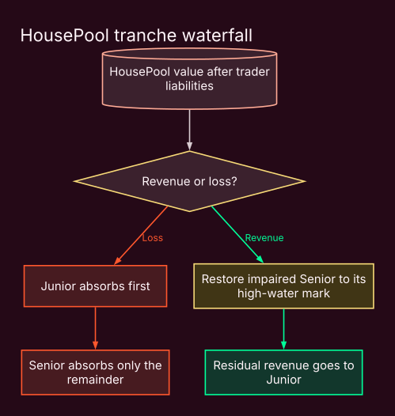
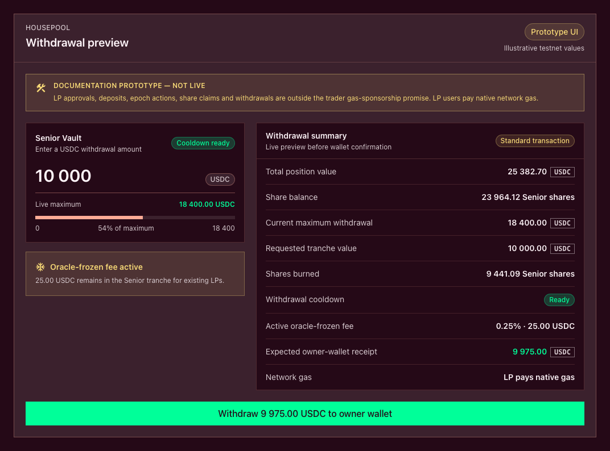

# The HousePool and tranche waterfall

The HousePool is the USDC[^usdc] capital base behind Plether Perps[^perps].

It does not set the market price. It does not operate an AMM[^amm] or match traders against one another. The oracle[^oracle] determines price.

The HousePool has a narrower role:

* underwrite bounded trader payouts;
* receive collected trader losses, positive VPI[^vpi] and carry[^carry];
* fund profitable trader settlements and VPI rebates;
* absorb bad debt;
* determine how much additional exposure Plether can safely accept.

LPs[^lp] provide this capital through two ERC-4626[^erc4626] vaults: **Senior** and **Junior**.

This page is the canonical reference for HousePool accounting and the tranche waterfall. For step-by-step LP actions, start with the [Liquidity provider quickstart](../liquidity-provider-quickstart.md) or the guides to [deposit liquidity](../providing-liquidity/deposit-liquidity.md), [manage a pending deposit](../providing-liquidity/manage-a-pending-deposit.md) and [withdraw liquidity](../providing-liquidity/withdraw-liquidity.md).

### Capital before yield

Core HousePool capital remains in USDC. It is not lent into an external yield protocol.

This avoids making Plether’s settlement capacity dependent on another protocol’s solvency or withdrawal liquidity precisely when cash may be needed most.

LP returns come from Plether’s internal economics:

* collected carry;
* positive VPI;
* realized trader losses;
* the tranche waterfall, including the Junior-funded Senior target coupon.

There is no separate yield reserve and no external base yield inside the HousePool.

### What counts as HousePool capital

The protocol distinguishes between:

* **Raw assets:** the literal USDC balance held by the HousePool.
* **Accounted assets:** USDC recognized as protocol-owned pool capital.
* **Excess assets:** unsolicited USDC not yet assigned to protocol economics.
* **Physical assets:** the conservative amount treated as actual backing.

```
Physical assets
= min(raw assets, accounted assets)
```

An unsolicited transfer does not automatically increase LP share value or trading capacity. It remains quarantined until explicitly accounted.

A raw-balance shortfall has the opposite treatment: it reduces effective backing immediately.

### What LP capital underwrites

The displayed market has a fixed settlement range:

```
0.00 ≤ Plether Dollar Index ≤ 2.00
```

That makes the maximum profit of every position calculable.

At the market level:

```
Maximum bounded trader liability
= max(
    aggregate LONG USD maximum profit,
    aggregate SHORT USD maximum profit
  )
```

Plether uses the larger side because LONG USD and SHORT USD reach their theoretical maximum profits at opposite ends of the same settlement range.

Before accepting more exposure, the protocol checks that effective HousePool backing remains sufficient for the resulting bounded liability.

Effective backing must also account for existing trader claims. LP capital cannot simultaneously back a new position and cash-settle an existing obligation.

> The fixed range makes liability measurable. It does not make LP capital risk-free.

### Senior and Junior at a glance

Senior and Junior are different claims on the same HousePool—not separate pools.

|                     | Senior                                | Junior                           |
| ------------------- | ------------------------------------- | -------------------------------- |
| Return model        | Target coupon funded by Junior        | Residual HousePool return        |
| Loss order          | After Junior is exhausted             | First loss                       |
| Revenue order       | Restored to its high-water mark first | Receives residual revenue        |
| Withdrawal priority | First claim on free LP cash           | Only cash above the Senior claim |
| Upside              | Primarily the target coupon           | Variable residual upside         |
| Can lose principal? | Yes                                   | Yes                              |
| Can be fully wiped? | Yes                                   | Yes                              |
| Return guaranteed?  | No                                    | No                               |

Senior exchanges residual upside for relative loss and withdrawal priority.

Junior receives residual upside because it funds the Senior coupon and absorbs losses first.

### The waterfall

HousePool reconciliation first determines how much value is economically distributable to LPs.

Conceptually:

```
Distributable LP value
= physical assets
− trader claims
− conservative unrealized trader-profit liabilities
− other protected claimant buckets
```

Plether does not count unrealized trader losses as current LP assets. A trader loss becomes pool value only when it is physically collected.

The resulting revenue or loss then passes through the waterfall:



#### When the pool realizes a loss

1. Junior principal absorbs the loss.
2. If Junior reaches zero, Senior absorbs the remainder.
3. Senior’s high-water mark remains as the reference for future restoration.

#### When the pool realizes revenue

1. Any Senior impairment is restored toward the high-water mark.
2. Remaining revenue becomes Junior principal.

Once Senior is fully restored, ordinary residual revenue belongs to Junior.

### The Senior target coupon

Senior accrues a configured target coupon against its current principal.

```
Coupon due
= Senior principal
× annualized target rate
× elapsed time ÷ one year
```

The actual payment is:

```
Coupon paid
= min(coupon due, available Junior principal)
```

The coupon is transferred from Junior principal to Senior principal. No new USDC enters the HousePool.

If Junior cannot fund the full amount:

* Senior receives only the available amount;
* Junior cannot fall below zero;
* the unpaid portion does not become an accumulating debt claim.

The coupon is therefore a target allocation rule, not guaranteed yield.

Paid coupon becomes part of Senior principal and, where applicable, its future coupon base. The configured rate and actual realized Senior return are not necessarily identical.

### The Senior high-water mark

The Senior high-water mark records the protected Senior claim. It initially rises with Senior deposits.

When Senior is unimpaired, paid coupon increases both Senior principal and the high-water mark. If Senior is impaired, paid coupon first restores principal toward the existing high-water mark without raising that mark. Only the portion remaining after the impairment gap is closed raises both principal and the high-water mark.

If Senior later takes a loss, its principal falls but its high-water mark does not. Future revenue must restore that gap before Junior receives residual upside.

A Senior withdrawal scales the high-water mark down proportionally. The mark protects the value associated with the remaining shares—it is not an immutable absolute number.

Senior impairment is defined as:

```
Senior principal < Senior high-water mark
```

During impairment, ordinary deposits into both tranches[^tranche] are blocked. Recovery must come from realized revenue or an explicit recapitalization path.

### Waterfall example

Assume:

```
Senior principal:          100 USDC
Senior high-water mark:    100 USDC
Junior principal:           50 USDC
```

Suppose an illustrative `8 USDC` coupon is checkpointed:

```
Senior principal:          108
Senior high-water mark:    108
Junior principal:           42
```

No new capital entered. Junior transferred `8 USDC` of its claim to Senior.

The pool then realizes a `60 USDC` loss:

```
Junior absorbs:             42
Senior absorbs:             18

Senior principal:           90
Senior high-water mark:    108
Junior principal:            0
```

Senior is impaired by `18 USDC`.

If the pool later realizes `25 USDC` of revenue:

```
Restore Senior:             18
Residual to Junior:          7

Senior principal:          108
Senior high-water mark:    108
Junior principal:            7
```

The figures are illustrative, not current protocol balances or rates.

### What creates LP revenue

Potential HousePool inflows include:

* collected trader losses;
* positive VPI charges;
* realized carry;
* seized settlement collateral;
* other protocol-authorized trading revenue.

Potential outflows or losses include:

* profitable trader settlements;
* VPI rebates;
* fresh liquidation residual payouts that must be funded by the HousePool;
* uncollectible trader losses and bad debt.

The protocol execution fee is designated for the protocol treasury. Order execution rewards normally belong to the order executor or clearer[^keeper], while liquidation bounties belong to successful liquidators. If liquidation clears pending orders first, their reserved execution rewards are forfeited to the protocol treasury. None of these amounts should be presented as direct LP yield.

Recapitalization is also not trading revenue. It is new capital explicitly introduced to repair the waterfall.

### Trader gains are LP liabilities

Plether treats trader gains conservatively.

For LP reconciliation:

* unrealized trader gains can reduce distributable LP value;
* unrealized trader losses do not increase LP value until collected;
* losing positions cannot be treated as if their collateral had already arrived in the HousePool.

This can temporarily understate tranche value. A later realized trader loss may restore value that the conservative accounting view previously refused to recognize.

That asymmetry is deliberate. It prevents LPs from withdrawing against money the protocol does not yet possess.

### Trader claims rank ahead of LPs

A profitable close can complete even if the HousePool cannot immediately fund the complete fresh payout. Released position margin follows separately. The complete fresh HousePool-funded payout is either credited immediately or recorded in full as a trader claim; Plether never splits it between the two.

Trader claims:

* remain liabilities of the HousePool;
* are reserved ahead of Senior and Junior withdrawals;
* reduce effective solvency assets;
* receive cash priority over discretionary LP withdrawals;
* are not counted as collateral for another trader position.

A trader can settle their claim only when aggregate trader claims are fully cash-covered. Settlement credits USDC into the Trading Account’s Margin Account.

Trader seniority comes before the internal Senior-versus-Junior distinction.

### Tranche shares

Each tranche has its own ERC-4626 share token.

Conceptually:

```
Tranche share value
= tranche accounting principal ÷ tranche share supply
```

Coupon, revenue and losses change tranche principal without changing the number of shares. Returns therefore appear through the USDC value per share rather than as a separate reward distribution.

Senior and Junior have separate:

* share supplies;
* share values;
* accounting principal;
* frozen-oracle fees;
* withdrawal limits.

The exact share conversion also includes ERC-4626 rounding and the protocol’s virtual-share protections.

A tranche share is a claim on that tranche’s accounting value. It is not an unconditional claim on an equal fraction of the HousePool’s raw USDC balance.

### Why deposit and withdrawal pricing differ

Deposits and withdrawals answer different accounting questions.

#### Withdrawal and reconciliation pricing

This view is conservative:

* trader claims are deducted;
* unrealized trader gains are recognized as liabilities;
* unrealized trader losses are not counted as assets.

#### Deposit pricing

Plether avoids minting discounted shares merely because conservative aggregate accounting temporarily over-reserves unrealized trader gains.

Realized losses still reduce deposit NAV[^nav]. But an inexact conservative mark-to-market reserve is not offered to new LPs as a discount.

Because the protocol cannot safely calculate exact per-position loser receivables from its constant-time market aggregates, immediate deposits are disabled whenever trader positions are open.

Ordinary entry then uses delayed deposit epochs.

### Immediate deposits

An LP may receive active shares immediately only when:

* trading has been activated;
* deposits are not paused;
* the applicable mark-freshness rule is satisfied;
* Senior is not impaired;
* no unassigned assets await ownership assignment;
* no trader positions are open.

The LP deposits USDC into the selected tranche vault and receives active shares at the current deposit-side price.

LPs interact with the Senior or Junior vault. They do not deposit directly into internal HousePool accounting functions.

### Delayed deposit epochs

When trader positions are open, ordinary LP entry uses a pending deposit request.

The lifecycle is:

1. The LP funds a request with USDC.
2. The USDC moves into the tranche vault’s escrow.
3. The request is assigned to a future activation epoch.
4. Before activation, the owner may cancel and recover the USDC.
5. Once the epoch becomes active, normal cancellation is unavailable.
6. Anyone may finalize the epoch permissionlessly.
7. Finalization determines one share price for the entire batch.
8. The escrowed USDC enters the HousePool.
9. The vault mints batch shares into escrow.
10. Each depositor claims their proportional shares.

Before finalization:

* the depositor does not hold active tranche shares;
* the USDC does not earn Senior coupon or Junior residual return;
* the final number of shares is not yet fixed.

The current contracts use one-hour epoch identifiers and assign requests two epochs ahead. Depending on when a request is submitted within the current hour, activation occurs roughly one to two hours later.

#### Cancellation during impairment

If Senior becomes impaired and prevents an active epoch from being finalized, depositors retain a special cancellation path even after activation.

This prevents escrowed deposits from becoming permanently trapped behind an unresolved Senior deficit.

#### Finalization risk

Epoch finalization is permissionless but is not currently assigned a separate protocol bounty.

A matured epoch should therefore be finalized promptly. Until finalization:

* the batch price is not fixed;
* depositors cannot normally cancel;
* transaction ordering can affect which pool events are reflected in the final price.

A finalizer could process the epoch immediately before another transaction realizes a large trader loss. The depositor committed before activation, but the exact finalization ordering remains a residual risk of the current design.

The frozen-oracle surcharge, if active, is also determined at finalization rather than when the request was first submitted.

### Deposit cooldown

Active tranche shares are subject to a fixed one-hour cooldown after an immediate deposit.

During the cooldown:

* shares cannot be withdrawn;
* shares cannot be transferred to bypass the restriction;
* `maxWithdraw` and `maxRedeem` return zero.

A share transfer propagates the relevant cooldown timestamp to the receiver.

A withdrawal or redemption resets the holder’s cooldown. This means multiple partial withdrawals generally require a new cooldown between them.

Ordinary deposits and partial withdrawals must meet the protocol’s minimum amount. A complete dust exit remains possible when the holder’s full remaining claim is below that minimum.

### The withdrawal firewall

Having positive tranche NAV does not mean all of it can leave immediately.

Before allowing an LP withdrawal, Plether reserves cash for trader obligations.

```
Free USDC
= physical HousePool assets
− withdrawal reserves
```

Withdrawal reserves include:

* maximum bounded trader liability;
* existing trader claims;
* funded pending claimant buckets;
* unassigned assets;
* any additional explicit protocol reserve.

Only physically free USDC may leave the HousePool.

This withdrawal view is intentionally stricter than the check used to admit new trader risk.

### Senior and Junior withdrawal caps

Senior receives first access to free LP cash:

```
Senior maximum withdrawal
= min(free USDC, Senior principal)
```

Junior is subordinated behind the complete Senior claim:

```
Junior maximum withdrawal
= min(
    Junior principal,
    max(free USDC − Senior principal, 0)
  )
```

Each holder is then further limited by:

* their own share balance;
* the holder cooldown;
* current oracle and protocol state;
* the tranche’s active frozen-oracle fee.

### Withdrawal example

Assume:

```
Physical HousePool assets:  1,000,000 USDC
Withdrawal reserves:          700,000 USDC
Free USDC:                    300,000 USDC

Senior principal:             600,000 USDC
Junior principal:             400,000 USDC
```

The pool-level caps are:

```
Senior cap
= min(300,000, 600,000)
= 300,000 USDC
```

```
Junior cap
= min(400,000, max(300,000 − 600,000, 0))
= 0 USDC
```

Junior shares can retain positive accounting value while Junior withdrawals are temporarily unavailable.

If free USDC later rises to `800,000 USDC`:

```
Senior cap = 600,000 USDC

Junior cap
= min(400,000, 800,000 − 600,000)
= 200,000 USDC
```

### Withdrawals are synchronous

The current vaults do not have an LP withdrawal queue.

A withdrawal or redemption either:

* succeeds immediately within the current cap; or
* cannot be submitted for more than the current cap.

If `maxWithdraw` is below the desired amount, the LP must wait for conditions to change and try again.

Conditions that can restrict withdrawals include:

* trader liabilities;
* trader claims;
* insufficient physical cash;
* Senior priority;
* stale oracle data;
* degraded mode;
* holder cooldown;
* an active frozen-oracle surcharge.

Each successful partial withdrawal restarts the holder cooldown.

### Frozen-oracle LP actions

A scheduled close-only runway does not, by itself, activate frozen-oracle tranche fees.

While the onchain `oracleFrozen` state is active:

* withdrawals use the extended frozen-market freshness policy;
* immediate deposits remain possible only when no positions are open;
* pending epochs remain the ordinary entry route while positions are open;
* each tranche applies its configured frozen-oracle surcharge.

For a deposit, the surcharge results in fewer shares.

For an asset-denominated withdrawal, delivering the target USDC amount requires more shares.

For a share-denominated redemption, the submitted shares return less USDC.

The retained value:

* does not go to the protocol treasury;
* does not move to the other tranche;
* remains inside the same tranche for incumbent LPs.

The extended frozen-market window is not indefinite. Once the accepted oracle data becomes over-stale, entry and exit can be blocked until valid data or protocol recovery becomes available.

On the current Arbitrum Sepolia deployment, the frozen-oracle surcharge is `25 bps` for Senior actions and `75 bps` for Junior actions. Live onchain values are authoritative.

### Pause and degraded mode

A HousePool pause blocks new deposits. It does not, by itself, block protective withdrawals.

Degraded mode is different. It indicates that a realized terminal transition exposed insufficient effective pool solvency.

During degraded mode:

* new trader risk is blocked;
* LP withdrawals are blocked;
* closes and liquidations remain available;
* recapitalization can move the system back toward solvency.

Degraded mode is latched. Restoring effective solvency makes the protocol eligible for recovery, but the protocol owner must explicitly clear the mode.

Deposit availability continues to follow its separate lifecycle, freshness, pause, impairment and ownership-assignment gates.

### Senior impairment and tranche wipeout

Senior is relatively protected, not immune.

If losses exhaust Junior and reduce Senior below its high-water mark:

* Senior is impaired;
* ordinary deposits into both tranches stop;
* future revenue restores Senior before Junior receives residual value;
* Senior shares remain claims on the reduced Senior principal;
* Senior withdrawals may still be limited by free cash and runtime state.

A tranche is terminally wiped when shares still exist but its accounting assets reach zero.

An ordinary deposit cannot silently revive a wiped tranche. Recovery can come from realized protocol revenue allocated through the waterfall or from an explicit recapitalization path that preserves existing ownership rights.

This prevents a new depositor from obtaining the recovery rights of previously wiped holders through a nominal first deposit.

### Current interface status

The published Plether testnet frontend does not yet expose LP actions or tranche accounting. A separate `Vaults` frontend implementation is in progress.

The published interface currently has no controls or views for:

* Senior or Junior deposits;
* pending deposit epochs;
* epoch cancellation or finalization;
* claiming tranche shares;
* LP withdrawals;
* share balances or share price;
* tranche return history;
* cooldowns or frozen-oracle fees.

The visible **Deposit** and **Withdraw** buttons on the Perps page operate the Trading Account’s Margin Account. They are not HousePool LP actions.

The LP withdrawal image below is a documentation prototype, not a live control.



#### “Pool liquidity” is not total LP capital

The current trader interface shows **Pool liquidity**.

That value represents free HousePool USDC after protected reserves—not total HousePool assets, total tranche NAV or the amount every LP can withdraw.

The interface’s supporting detail also shows:

* estimated LONG USD and SHORT USD opening-capacity headroom based on pool assets, open interest and the skew limit;
* minimum order size;
* minimum new position.

These figures are not subdivisions of free HousePool USDC, and the capacity estimates do not guarantee that a particular order will pass every execution-time check.

### Senior risks

Senior LPs face:

* losses after Junior is exhausted;
* insufficient Junior principal to fund the target coupon;
* temporary or prolonged withdrawal constraints;
* Senior impairment below the high-water mark;
* full wipeout in an extreme loss;
* oracle, smart-contract, governance and USDC risks.

“Last loss” describes priority. It does not mean “no loss.”

### Junior risks

Junior LPs face the same shared protocol risks plus:

* first-loss exposure;
* continuous funding of the Senior target coupon;
* subordinated withdrawal access;
* more volatile share value;
* full wipeout before Senior is impaired;
* residual deposit-epoch finalization risk.

Junior receives residual upside because it bears these subordinated obligations.

### Solvency at a glance

Plether’s solvency model asks one central question:

> After accounting for senior claims, does the HousePool have enough backing for the maximum modeled payout of its open positions?

Solvency is not the same as liquidity. A protocol can remain solvent while temporarily lacking free cash for an immediate trader payout or LP withdrawal.

#### 1. Start with effective backing

Plether begins with the physical USDC backing recognized by the HousePool.

Trader claims are then deducted because they are senior obligations already owed to traders:

```
Effective backing
= max(
    physical HousePool assets
    − aggregate trader claims,
    0
  )
```

Trader claims are not LP capital and cannot be used to support new exposure.

#### 2. Calculate the maximum live liability

Every position’s maximum payout is calculable because the Plether Dollar Index is bounded between `0.00` and `2.00`.

Plether tracks the maximum payout of LONG USD and SHORT USD positions separately:

```
Maximum live liability
= max(
    maximum LONG USD payout,
    maximum SHORT USD payout
  )
```

The protocol uses the larger value—not their sum—because the two maximums occur at opposite index boundaries. They cannot both be realized in the same settlement state.

New exposure is accepted only if the post-trade position remains fully backed:

```
Effective backing
≥ post-trade maximum live liability
```

If a new order would break this condition, the order is rejected.

#### 3. Protect backing from LP withdrawals

LPs cannot withdraw cash that may still be needed to settle traders.

The simplified withdrawal firewall is:

```
Free LP liquidity
= max(
    physical HousePool assets
    − maximum live liability
    − aggregate trader claims
    − other explicit reserves,
    0
  )
```

This is the pool-level amount available before applying:

* Senior and Junior tranche limits
* LP cooldowns
* Mark-freshness requirements
* Frozen-market pricing
* Senior impairment rules
* Pool lifecycle and degraded-mode restrictions

Free LP liquidity is therefore not a guaranteed withdrawal amount for an individual LP.

It is also not the same as tranche NAV. Withdrawal capacity asks how much cash can safely leave now, while reconciliation determines how the remaining pool value belongs to Senior and Junior LPs.

#### 4. Treat uncertain value conservatively

Plether recognizes potential trader profits as liabilities.

It does not treat unrealized or uncollected trader losses as spendable HousePool assets.

This prevents LPs from withdrawing against value that the protocol has not physically collected.

The same principle explains how accumulated bad debt is treated:

> Accumulated bad debt records trader value that Plether failed to collect. It is not deducted from physical assets a second time because the missing value never became HousePool cash.

Bad debt is therefore protocol telemetry and a recapitalization target—not an additional withdrawal reserve or NAV deduction.

Clearing bad debt improves live backing only because new USDC is transferred into the HousePool. Reducing the counter by itself would not create value.

### Example

Assume:

```
Physical HousePool assets:      1,000,000 USDC
Aggregate trader claims:          100,000 USDC

Maximum LONG USD payout:          700,000 USDC
Maximum SHORT USD payout:         500,000 USDC
```

Effective backing is:

```
1,000,000 − 100,000
= 900,000 USDC
```

Maximum live liability is:

```
max(700,000, 500,000)
= 700,000 USDC
```

The HousePool therefore has:

```
900,000 − 700,000
= 200,000 USDC
```

of solvency headroom.

Before other reserves and tranche-specific restrictions, the same values produce:

```
Free LP liquidity
= 1,000,000 − 700,000 − 100,000
= 200,000 USDC
```

If a new order would increase maximum live liability to `950,000 USDC`, it would be rejected:

```
900,000 effective backing
< 950,000 post-trade liability
```

### When the condition is broken

Risk-reducing actions such as full closes and liquidations are designed to complete even when they reveal a shortfall.

If the resulting effective backing falls below the maximum liability of the positions that remain open, Plether enters **degraded mode**.

While degraded:

* New trader risk is blocked.
* LP withdrawals are blocked.
* Risk-reducing closes and liquidations remain available.
* Margin additions and recovery actions remain available.
* Recapitalization can restore backing.

Degraded mode contains the problem. It does not guarantee that trader claims can be paid immediately or that LP capital will avoid losses.

### The distinction to remember

| Check | Question it answers |
| --- | --- |
| **Solvency** | Are the remaining liabilities fully backed? |
| **Settlement liquidity** | Can a trader be paid now? |
| **Withdrawal liquidity** | How much cash can safely leave the HousePool? |
| **Tranche waterfall** | Which LP capital absorbs a realized loss? |

These checks use the same physical backing, but they answer different questions.

### What LPs should monitor

Before depositing:

* Senior or Junior priority;
* current tranche principal and share value;
* Senior high-water mark and impairment status;
* physical HousePool assets;
* bounded trader liability;
* outstanding trader claims;
* free USDC;
* current and projected withdrawal cap;
* directional carry utilization;
* active deposit mode;
* pending epoch status;
* oracle state and frozen fee;
* protocol deployment and security status.

After depositing:

* claim finalized epoch shares;
* distinguish tranche NAV from immediately withdrawable cash;
* monitor the cooldown before planning an exit;
* track Senior impairment and Junior loss absorption;
* treat displayed or projected return as variable, never guaranteed.

### The central distinction

The HousePool has three layers of obligation:

1. Protect trader settlement liabilities.
2. Apply Senior and Junior accounting priority.
3. Allow LP withdrawals only from physically free USDC.

Senior and Junior divide the residual economic claim on the HousePool. They do not outrank traders, remove liquidity constraints or convert unrealized trader losses into cash.

Senior receives a Junior-funded target coupon and relative loss priority.

Junior receives residual upside and absorbs first loss.

[^usdc]: A US dollar-denominated stablecoin Plether uses for margin and settlement.
[^perps]: Perpetual contracts, derivatives with no scheduled expiry.
[^amm]: Automated market maker, an onchain liquidity mechanism that prices trades using a pool and formula.
[^oracle]: A service that supplies external market data to smart contracts; Plether uses Pyth price feeds.
[^vpi]: Virtual Price Impact, a separate USDC charge or rebate based on how a trade changes HousePool directional imbalance.
[^carry]: The time-based cost charged on the portion of a position financed by LP capital.
[^lp]: Liquidity provider, a participant that supplies USDC capital to the HousePool.
[^erc4626]: The Ethereum tokenized-vault standard used for Plether tranche shares.
[^tranche]: A pool layer with its own loss priority, withdrawal priority and return profile.
[^keeper]: A permissionless actor or bot that submits order-finalization or protocol-maintenance transactions.
[^nav]: Net asset value, the accounting value of a pool or tranche after assets and liabilities.
