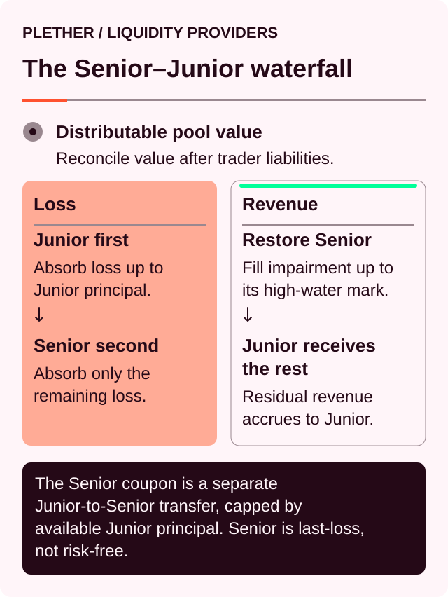
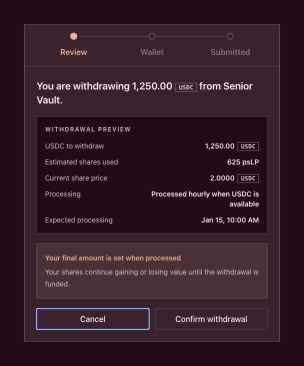

# The liquidity pool and tranche waterfall

The liquidity pool is the USDC[^usdc] capital base behind Plether Perps[^perps].

It does not set the market price. It does not operate an AMM[^amm] or match traders against one another. The oracle[^oracle] determines price.

The liquidity pool has a narrower role:

* underwrite bounded trader payouts;
* receive collected trader losses, positive VPI[^vpi] and carry[^carry];
* fund profitable trader settlements and VPI rebates;
* absorb bad debt;
* determine how much additional exposure Plether can safely accept.

LPs[^lp] provide this capital through two ERC-4626[^erc4626] vaults: **Senior** and **Junior**.

This page is the canonical reference for pool accounting and the tranche waterfall. For step-by-step LP actions, start with the [Liquidity provider quickstart](../liquidity-provider-quickstart.md) or the guides to [deposit liquidity](../providing-liquidity/deposit-liquidity.md), [manage a pending deposit](../providing-liquidity/manage-a-pending-deposit.md) and [withdraw liquidity](../providing-liquidity/withdraw-liquidity.md).

### Capital before yield

Core pool capital remains in USDC. It is not lent into an external yield protocol.

This avoids making Plether’s settlement capacity dependent on another protocol’s solvency or withdrawal liquidity precisely when cash may be needed most.

LP returns come from Plether’s internal economics:

* collected carry;
* positive VPI;
* collateral- and claim-capped collectible marked trader losses and collected trader losses;
* the tranche waterfall, including the Junior-funded Senior target coupon.

There is no separate yield reserve and no external base yield inside the liquidity pool.

### What counts as pool capital

The protocol distinguishes between:

* **Raw assets:** the literal USDC balance held by the liquidity pool.
* **Accounted assets:** USDC recognized as protocol-owned pool capital.
* **Excess assets:** unsolicited USDC not yet assigned to protocol economics.
* **Physical assets:** the conservative amount treated as actual backing.

```
Physical assets
= min(raw assets, accounted assets)
```

An unsolicited transfer does not automatically increase LP share value or trading capacity. It remains quarantined until explicitly accounted.

A raw-balance shortfall has the opposite treatment: it reduces effective backing immediately.

### What LP capital underwrites

The displayed market has a fixed settlement range:

```
0.00 ≤ Plether Dollar Index ≤ 2.00
```

That makes the maximum profit of every position calculable.

At the market level:

```
Maximum bounded trader liability
= max(
    aggregate LONG USD maximum profit,
    aggregate SHORT USD maximum profit
  )
```

Plether uses the larger side because LONG USD and SHORT USD reach their theoretical maximum profits at opposite ends of the same settlement range.

Before accepting more exposure, the protocol checks that effective pool backing covers the resulting bounded liability plus the configured liability-scaled settlement buffer.

Effective backing must also account for existing trader claims. LP capital cannot simultaneously back a new position and cash-settle an existing obligation.

> The fixed range makes liability measurable. It does not make LP capital risk-free.

### Senior and Junior at a glance

Senior and Junior are different claims on the same liquidity pool—not separate pools.

|                     | Senior                                | Junior                           |
| ------------------- | ------------------------------------- | -------------------------------- |
| Return model        | Target coupon funded by Junior        | Residual return from the liquidity pool |
| Loss order          | After Junior is exhausted             | First loss                       |
| Revenue order       | Restored to its high-water mark first | Receives residual revenue        |
| Withdrawal priority | Matured requests funded before Junior | Funded after matured Senior demand, then capped by the Senior-share covenant |
| Upside              | Primarily the target coupon           | Variable residual upside         |
| Can lose principal? | Yes                                   | Yes                              |
| Can be fully wiped? | Yes                                   | Yes                              |
| Return guaranteed?  | No                                    | No                               |

Senior exchanges residual upside for relative loss and withdrawal priority.

Junior receives residual upside because it funds the Senior coupon and absorbs losses first.

### The waterfall

Pool reconciliation first determines how much value is economically distributable to LPs.

Conceptually:

```
Distributable LP value
= physical assets
− trader claims
± exact capped terminal price delta
− other protected claimant buckets
```

The signed terminal price delta comes from one authenticated Terminal NAV snapshot. Marked trader profits reduce LP value. Collateral- and claim-capped marked trader losses can increase LP accounting value before close, but that receivable is not physical pool cash and cannot increase free withdrawal liquidity until collected.

The resulting reconciled LP-owned value or loss then passes through the waterfall:



#### When reconciliation applies a loss

1. Junior principal absorbs the loss.
2. If Junior reaches zero, Senior absorbs the remainder.
3. Senior’s high-water mark remains as the reference for future restoration.

#### When reconciliation applies LP-owned value

1. Any Senior impairment is restored toward the high-water mark.
2. Remaining LP-owned value becomes Junior principal.

Once Senior is fully restored, ordinary residual LP-owned value belongs to Junior.

### The Senior target coupon

Senior accrues a configured target coupon against its current principal.

```
Coupon due
= Senior principal
× annualized target rate
× elapsed time ÷ one year
```

The actual payment is:

```
Coupon paid
= min(coupon due, available Junior principal)
```

The coupon is transferred from Junior principal to Senior principal. No new USDC enters the liquidity pool.

If Junior cannot fund the full amount:

* Senior receives only the available amount;
* Junior cannot fall below zero;
* the unpaid portion does not become an accumulating debt claim.

The coupon is therefore a target allocation rule, not guaranteed yield.

Paid coupon becomes part of Senior principal and, where applicable, its future coupon base. The configured rate and actual realized Senior return are not necessarily identical.

### The Senior high-water mark

The Senior high-water mark records the protected Senior claim. It initially rises with Senior deposits.

When Senior is unimpaired, paid coupon increases both Senior principal and the high-water mark. If Senior is impaired, paid coupon first restores principal toward the existing high-water mark without raising that mark. Only the portion remaining after the impairment gap is closed raises both principal and the high-water mark.

If Senior later takes a loss, its principal falls but its high-water mark does not. Future reconciled LP-owned value restores that gap before Junior receives residual upside.

A Senior withdrawal scales the high-water mark down proportionally. The mark protects the value associated with the remaining shares—it is not an immutable absolute number.

Senior impairment is defined as:

```
Senior principal < Senior high-water mark
```

During impairment, ordinary deposits into both tranches[^tranche] are blocked. Recovery can come from reconciled LP-owned value—including the collectible positive side of the signed Terminal NAV delta—or an explicit recapitalization path. A marked receivable still does not become withdrawal cash before collection.

### Waterfall example

Assume:

```
Senior principal:          100 USDC
Senior high-water mark:    100 USDC
Junior principal:           50 USDC
```

Suppose an illustrative `8 USDC` coupon is checkpointed:

```
Senior principal:          108
Senior high-water mark:    108
Junior principal:           42
```

No new capital entered. Junior transferred `8 USDC` of its claim to Senior.

The pool then realizes a `60 USDC` loss:

```
Junior absorbs:             42
Senior absorbs:             18

Senior principal:           90
Senior high-water mark:    108
Junior principal:            0
```

Senior is impaired by `18 USDC`.

If the pool later realizes `25 USDC` of revenue:

```
Restore Senior:             18
Residual to Junior:          7

Senior principal:          108
Senior high-water mark:    108
Junior principal:            7
```

The figures are illustrative, not current protocol balances or rates.

### What creates LP revenue

Potential pool inflows include:

* collected trader losses;
* positive VPI charges;
* realized carry;
* seized settlement collateral;
* other protocol-authorized trading revenue.

Potential outflows or losses include:

* profitable trader settlements;
* VPI rebates;
* fresh liquidation residual payouts that must be funded by the liquidity pool;
* uncollectible trader losses and bad debt.

The protocol execution fee is designated for the protocol treasury. Order execution rewards normally belong to the order executor or clearer[^keeper], while liquidation bounties belong to successful liquidators. If liquidation clears pending orders first, their reserved execution rewards are forfeited to the protocol treasury. None of these amounts should be presented as direct LP yield.

Recapitalization is also not trading revenue. It is new capital explicitly introduced to repair the waterfall.

### Marked trader PnL changes LP NAV

Plether uses one exact signed, collateral-capped Terminal NAV snapshot for LP accounting.

For LP reconciliation:

* marked trader gains reduce distributable LP value as liabilities;
* marked trader losses can increase distributable LP value only up to the amount the protocol can collect from pledged collateral and eligible same-account claims; and
* that positive marked receivable changes NAV, but it is not physical USDC held by the liquidity pool and does not increase free withdrawal liquidity until collected.

The distinction is deliberate: share price can reflect a collectible marked receivable while the withdrawal firewall still limits exits to physical free cash.

### Trader claims rank ahead of LPs

A profitable close can complete even if the liquidity pool cannot immediately fund the complete fresh payout. Released position margin follows separately. The complete fresh pool-funded payout is either credited immediately or recorded in full as a trader claim; Plether never splits it between the two.

Trader claims:

* remain liabilities of the liquidity pool;
* are reserved ahead of Senior and Junior withdrawals;
* reduce effective solvency assets;
* receive cash priority over discretionary LP withdrawals;
* are not counted as collateral for another trader position.

A trader can settle their claim only when aggregate trader claims are fully cash-covered. If the Trading Account still has an open position, settlement credits its PnL pledge and the amount is not free, withdrawable or reusable margin. Only a flat account receives free Margin Account balance.

Trader seniority comes before the internal Senior-versus-Junior distinction.

### Tranche shares

Each tranche has its own ERC-4626 share token.

Conceptually:

```
Tranche share value
= tranche accounting principal ÷ effective tranche share supply
```

Coupon, revenue and losses normally change tranche principal without changing holder balances. Junior maintenance fees instead add pending fee shares to effective supply before those shares are minted. Returns therefore appear through the USDC value per effective share rather than as a separate reward distribution.

Senior and Junior have separate:

* effective share supplies;
* share values;
* accounting principal;
* frozen-oracle withdrawal fees;
* withdrawal limits.

The exact share conversion also includes ERC-4626 rounding, the protocol’s virtual-share protections and, for Junior, accrued maintenance-fee shares in effective supply.

A tranche share is a claim on that tranche’s accounting value. It is not an unconditional claim on an equal fraction of the liquidity pool’s raw USDC balance.

### How deposit and withdrawal pricing use Terminal NAV

Deposits and withdrawals reconcile against the same exact Terminal NAV snapshot. It combines physical pool assets, trader claims and the signed, collateral-capped terminal price delta for every open position. Marked trader profits reduce tranche NAV; collectible marked trader losses can increase NAV before collection.

That accounting value is distinct from withdrawal liquidity. A marked receivable can affect share price, but only physical USDC left after trader reserves and the settlement buffer can fund an exit. Deposit and withdrawal conversions can also differ because ERC-4626 rounds them in opposite directions, and the frozen-oracle surcharge applies only to withdrawal funding.

Every deposit is assigned to an hourly processing window so the complete batch can be priced against one reconciled pool state.

### Hourly deposit requests

The lifecycle is:

1. The LP enters a USDC amount in the selected Senior or Junior Vault.
2. If needed, the owner wallet approves that exact USDC amount for the selected tranche vault.
3. `requestDeposit` moves the USDC into tranche-vault escrow and assigns a request reference and expected processing time.
4. Before processing, the owner may use **Cancel deposit** while the interface offers it.
5. When LP settlement is enabled, a healthy keeper can process an eligible hourly batch after the protocol's safety checks pass. The processing path is permissionless, but the current interface does not expose a user **Finalize** action.
6. Processing fixes the batch share conversion, moves the deposit into active accounting, records its activation time, starts its one-hour withdrawal cooldown and makes the depositor's shares claimable in vault escrow.
7. The depositor uses **Move shares to wallet**, which preserves that activation timestamp and cannot weaken a newer wallet cooldown. After the source cooldown elapses, the depositor can instead use **Queue direct withdrawal** when shown to route shares from that claimable deposit into the current withdrawal queue without a wallet transfer or token approval.

Before processing:

* the depositor does not hold active tranche shares;
* the final number of shares is not fixed;
* the request can move from **Pending** to **Waiting for processing** if its expected time passes.

Deposits and withdrawals become eligible at assigned hourly boundaries; actual processing can occur later. The contract uses the request transaction's block-inclusion timestamp: inclusion strictly before the five-minute cutoff targets the next boundary, while inclusion at or after the cutoff targets the following one. Signing or sending earlier is not enough if confirmation lands after the cutoff. Treat the confirmed onchain request target shown in its record as authoritative; the displayed time is an expectation, not a guarantee.

LPs interact with the verified Senior or Junior vault. They do not deposit directly into internal pool accounting functions.

#### Refund and exceptional mature cancellation

If the processed batch's aggregate deposit quote rounds to zero shares, the contract rejects that epoch and marks the deposit refundable. **Refund available** and **Return USDC to wallet** then recover the escrowed amount. Pause, stale pricing, impairment, caps and shortfalls ordinarily defer activation instead of creating this refund state.

Separately, after the ordinary pre-boundary cancellation window closes, the contract permits narrow mature-deposit cancellation when the epoch was rejected, processing would create a terminal wipe, Senior is impaired or the Senior reservation is invalid. That exceptional path prevents escrowed deposits from becoming permanently trapped behind an unresolved Senior deficit.

#### Hourly-processing risk

An enabled keeper is intended to monitor eligible batches, but processing can wait when that service is disabled or unavailable, or when an oracle, pool-health, liquidity or governance gate is not satisfied. **Hourly processing paused** stops new deposits from starting to earn and stops new withdrawal funding; it does not prevent users from submitting requests or taking already available cancel, claim and refund actions.

Until a batch is processed:

* its conversion is not fixed;
* cancellation is available only while the interface offers it;
* transaction ordering can affect which pool events are reflected in the final conversion.

For a queued withdrawal, the frozen-oracle surcharge is determined when funding is processed rather than when its preview was first opened. Deposit activation is deferred while the oracle is frozen and pays no such surcharge.

### Withdrawal cooldown

Each successfully activated deposit receives a fixed one-hour cooldown timestamp at processing. Claiming those shares to a wallet preserves the source timestamp and applies the later of it and the wallet's existing timestamp.

During the cooldown:

* shares cannot be withdrawn;
* shares cannot be transferred to bypass the restriction;
* **Shares available to withdraw** can be zero.

A share transfer propagates the relevant cooldown timestamp to the receiver.

Cancelling a queued withdrawal or returning a zero-value withdrawal remainder restarts the cooldown for the wallet's entire position in that tranche. Claiming processed deposit shares does not restart it. Once a claimable source deposit's cooldown has elapsed, its shares can be queued directly for withdrawal, one source request per transaction, without an ERC-20 transfer or approval and without changing controller.

Deposits must meet the live minimum shown by the vault. A partial withdrawal request must also estimate to at least that live minimum, currently `1 USDC`; a complete exit of all remaining requestable shares may use the contract's smaller dust exception.

### The withdrawal firewall

Having positive tranche NAV does not mean all of it can leave immediately.

Before allocating cash to an LP withdrawal, Plether reserves cash for trader obligations.

```
Free USDC
= physical pool assets
− withdrawal reserves
```

Withdrawal reserves include:

* maximum bounded trader liability;
* the configured liability-scaled settlement buffer;
* existing trader claims;
* funded pending claimant buckets;
* unassigned assets;
* any additional explicit protocol reserve.

Only physically free USDC may leave the liquidity pool.

This withdrawal view is intentionally stricter than the check used to admit new trader risk.

### Senior and Junior withdrawal caps

Senior's pool-wide capacity is:

```
Senior maximum withdrawal
= min(free USDC, Senior principal)
```

At each hourly settlement, matured Senior requests are funded before Junior work. If matured Senior demand remains backlogged, no Junior request is funded in that cycle. Once the matured Senior queue is clear, Junior does not reserve all dormant Senior principal. Its capacity is independently constrained by remaining free cash, Junior principal and the governed maximum Senior share of protected tranche capital:

```
Junior maximum withdrawal
= min(
    remaining free USDC,
    Junior principal,
    max(Junior principal − required Junior backing for protected Senior exposure, 0)
  )
```

The required Junior backing is rounded up from the greater of current Senior principal and the Senior high-water mark using the live `maxSeniorShareBps` covenant. The exact live contract value is authoritative.

Each holder is then further limited by:

* their own share balance;
* the holder cooldown;
* a valid current quote and complete wallet/vault data.

Those checks determine how many shares can enter a request. The later USDC allocation also depends on matured Senior demand, oracle and protocol state, the exit-only pricing fee, hourly-settlement status and available withdrawal liquidity.

### Withdrawal example

Assume:

```
Physical pool assets:  1,000,000 USDC
Withdrawal reserves:          700,000 USDC
Free USDC:                    300,000 USDC

Senior principal:             600,000 USDC
Senior high-water mark:       600,000 USDC
Junior principal:             400,000 USDC
Maximum Senior share:                  75%
```

Assume no matured Senior request is waiting. The governed Senior-share covenant requires at least `200,000 USDC` of Junior backing, so Junior's ratio cap is `200,000 USDC`:

```
Senior cap
= min(300,000, 600,000)
= 300,000 USDC
```

```
Junior cap
= min(300,000 free, 400,000 principal, 200,000 ratio cap)
= 200,000 USDC
```

The ratio cap above is:

```
Required Junior backing
= 600,000 × (25% ÷ 75%)
= 200,000 USDC

Junior ratio cap
= 400,000 − 200,000
= 200,000 USDC
```

This example shows why dormant Senior principal is not a cash reserve against Junior. If matured Senior requests are present, they are funded first. Junior receives only the free cash left after those requests, and receives nothing while a matured Senior backlog remains.

### Hourly withdrawal requests

The current Vaults interface queues withdrawals. The LP enters a target USDC amount, the vault quotes the estimated number of shares required, and the owner submits `requestRedeem` for those shares.

Before processing, **Cancel withdrawal** returns the queued shares and restarts the one-hour cooldown. After processing:

* **USDC ready** means the funded amount can be moved with **Move USDC to wallet**; and
* **Shares ready to return** means a remaining share amount quoted to zero assets and entered terminal refund state; it can be recovered with **Return shares to wallet**, which also restarts the cooldown.

A partially funded request can expose both actions when its remaining shares quote to zero. When claimable USDC is nonzero, the interface uses **USDC ready** as the request status even if that remainder is also ready to return. A remainder that merely exceeds current funding stays queued for a later cycle.

The shares continue gaining or losing value until the request is funded, so the final USDC can differ from the preview. Senior requests are funded before Junior requests at each processing window. A Junior request can therefore show **Waiting for USDC** even while the Junior vault retains positive accounting value.

Conditions that can restrict or delay withdrawal funding include:

* trader liabilities;
* trader claims;
* insufficient physical cash;
* Senior priority;
* pricing that is stale or unavailable even under the bounded frozen-pricing rules;
* degraded mode;
* an hourly-processing pause or backlog.

### Frozen-oracle LP actions

A scheduled close-only runway does not, by itself, activate frozen-oracle withdrawal fees.

While the onchain `oracleFrozen` state is active:

* withdrawals use the extended frozen-market freshness policy;
* the interface blocks new deposit requests until live pricing returns;
* previously queued deposits remain pending until the entry gates and live pricing recover;
* eligible withdrawal funding applies the selected tranche's configured frozen-oracle surcharge.

For an asset-denominated withdrawal, delivering the target USDC amount requires more shares.

For a share-denominated redemption, the submitted shares return less USDC.

The retained value:

* does not go to the protocol treasury;
* does not move to the other tranche;
* remains inside the same tranche for incumbent LPs.

The extended frozen-market window is not indefinite. Once the accepted oracle data becomes over-stale, entry and exit can be blocked until valid data or protocol recovery becomes available.

On the current Arbitrum Sepolia deployment, the frozen-oracle withdrawal surcharge is `25 bps` for Senior and `75 bps` for Junior. Live onchain values are authoritative.

### Pause and degraded mode

A pool pause blocks new deposits. It does not, by itself, block protective withdrawals.

Degraded mode is different. It indicates that a realized terminal transition exposed insufficient effective pool solvency.

During degraded mode:

* new trader risk and new vault deposits are blocked;
* the interface may still accept a withdrawal request, but no new withdrawal USDC is allocated while degraded mode remains latched;
* closes and liquidations remain available;
* recapitalization can move the system back toward solvency.

Degraded mode is latched. Restoring effective solvency makes the protocol eligible for recovery, but the protocol owner must explicitly clear the mode before new withdrawal funding resumes. Already-funded withdrawal actions remain usable throughout.

Deposit availability continues to follow its separate lifecycle, freshness, pause, impairment and ownership-assignment gates.

### Senior impairment and tranche wipeout

Senior is relatively protected, not immune.

If losses exhaust Junior and reduce Senior below its high-water mark:

* Senior is impaired;
* ordinary deposits into both tranches stop;
* future reconciled LP-owned value restores Senior before Junior receives residual value;
* Senior shares remain claims on the reduced Senior principal;
* Senior withdrawals may still be limited by free cash and runtime state.

A tranche is terminally wiped when shares still exist but its accounting assets reach zero.

An ordinary deposit cannot silently revive a wiped tranche. Recovery can come from future reconciled LP-owned value allocated through the waterfall or from an explicit recapitalization path that preserves existing ownership rights. A positive marked receivable can affect NAV but does not provide withdrawal cash until collected.

This prevents a new depositor from obtaining the recovery rights of previously wiped holders through a nominal first deposit.

### Current Vaults interface

The Vaults interface provides `/vaults`, `/vaults/senior` and `/vaults/junior`. It shows the two tranche cards, live pool and vault metrics, conditional seven-day performance, the connected wallet's position and pending requests, and recent tranche activity.

Deposits and withdrawals use the connected owner wallet and are not covered by the trader gas-sponsorship flow. Keep enough Arbitrum Sepolia ETH for every approval, request, cancellation, claim or refund transaction.

The visible **Deposit** and **Withdraw** actions on the Perps page still operate the Trading Account’s Margin Account. They are not liquidity-provider actions.



#### “Pool liquidity” is not total LP capital

The current trader interface shows **Pool liquidity**.

That value represents free USDC in the liquidity pool after protected reserves—not total pool assets, total tranche NAV or the amount every LP can withdraw.

The interface’s supporting detail also shows:

* estimated LONG USD and SHORT USD opening-capacity headroom based on pool assets, open interest and the skew limit;
* minimum order size;
* minimum new position.

These figures are not subdivisions of free USDC in the liquidity pool, and the capacity estimates do not guarantee that a particular order will pass every execution-time check.

### Senior risks

Senior LPs face:

* losses after Junior is exhausted;
* insufficient Junior principal to fund the target coupon;
* temporary or prolonged withdrawal constraints;
* Senior impairment below the high-water mark;
* full wipeout in an extreme loss;
* oracle, smart-contract, governance and USDC risks.

“Last loss” describes priority. It does not mean “no loss.”

### Junior risks

Junior LPs face the same shared protocol risks plus:

* first-loss exposure;
* continuous funding of the Senior target coupon;
* subordinated withdrawal access;
* more volatile share value;
* full wipeout before Senior is impaired;
* delayed hourly processing and request-pricing risk.

Junior receives residual upside because it bears these subordinated obligations.

### Solvency at a glance

Plether’s solvency model asks one central question:

> After accounting for trader claims, does the liquidity pool have enough backing for the maximum modeled payout of its open positions and the configured settlement buffer?

Solvency is not the same as liquidity. A protocol can remain solvent while temporarily lacking free cash for an immediate trader payout or LP withdrawal.

#### 1. Start with effective backing

Plether begins with the physical USDC backing recognized by the liquidity pool.

Trader claims are then deducted because they are senior obligations already owed to traders:

```
Effective backing
= max(
    physical pool assets
    − aggregate trader claims,
    0
  )
```

Trader claims are not LP capital and cannot be used to support new exposure.

#### 2. Calculate the maximum live liability

Every position’s maximum payout is calculable because the Plether Dollar Index is bounded between `0.00` and `2.00`.

Plether tracks the maximum payout of LONG USD and SHORT USD positions separately:

```
Maximum live liability
= max(
    maximum LONG USD payout,
    maximum SHORT USD payout
  )
```

The protocol uses the larger value—not their sum—because the two maximums occur at opposite index boundaries. They cannot both be realized in the same settlement state.

New exposure is accepted only if the post-trade position remains fully backed with its configured buffer:

```
Effective backing
≥ post-trade maximum live liability
  + ceil(post-trade liability × settlementBufferBps ÷ 10,000)
```

If a new order would break this condition, the order is rejected.

#### 3. Protect backing from LP withdrawals

LPs cannot withdraw cash that may still be needed to settle traders.

The simplified withdrawal firewall is:

```
Free LP liquidity
= max(
    physical pool assets
    − maximum live liability
    − liability-scaled settlement buffer
    − aggregate trader claims
    − other explicit reserves,
    0
  )
```

This is the pool-level amount available before applying:

* Senior and Junior tranche limits
* LP cooldowns
* Mark-freshness requirements
* Frozen-market pricing
* Senior impairment rules
* Pool lifecycle and degraded-mode funding restrictions

Free LP liquidity is therefore not a guaranteed withdrawal amount for an individual LP.

It is also not the same as tranche NAV. Withdrawal capacity asks how much cash can safely leave now, while reconciliation determines how the remaining pool value belongs to Senior and Junior LPs.

#### 4. Treat uncertain value conservatively

Plether recognizes marked trader profits as liabilities. Collateral- and claim-capped marked trader losses can increase Terminal NAV before collection, but the resulting receivable is not spendable pool cash.

This prevents LPs from withdrawing against accounting value that the protocol has not physically collected.

The same principle explains how accumulated bad debt is treated:

> Accumulated bad debt records trader value that Plether failed to collect. It is not deducted from physical assets a second time because the missing value never became pool cash.

Bad debt is therefore protocol telemetry and a recapitalization target—not an additional withdrawal reserve or NAV deduction.

Clearing bad debt improves live backing only because new USDC is transferred into the liquidity pool. Reducing the counter by itself would not create value.

### Example

Assume:

```
Physical pool assets:      1,000,000 USDC
Aggregate trader claims:          100,000 USDC

Maximum LONG USD payout:          700,000 USDC
Maximum SHORT USD payout:         500,000 USDC
Settlement buffer:                    0.25%
```

Effective backing is:

```
1,000,000 − 100,000
= 900,000 USDC
```

Maximum live liability is:

```
max(700,000, 500,000)
= 700,000 USDC
```

The `700,000 USDC` maximum liability requires a `1,750 USDC` settlement buffer. The liquidity pool therefore has:

```
900,000 − 700,000 − 1,750
= 198,250 USDC
```

of solvency headroom.

Before other reserves and tranche-specific restrictions, the same values produce:

```
Free LP liquidity
= 1,000,000 − 700,000 − 1,750 − 100,000
= 198,250 USDC
```

If a new order would increase maximum live liability to `950,000 USDC`, its buffer would be `2,375 USDC` and it would be rejected:

```
900,000 effective backing
< 950,000 post-trade liability + 2,375 buffer
```

### When the condition is broken

Risk-reducing actions such as full closes and liquidations are designed to complete even when they reveal a shortfall.

If the resulting effective backing falls below the maximum liability of the positions that remain open, Plether enters **degraded mode**.

While degraded:

* New trader risk is blocked.
* New LP deposits are blocked.
* Otherwise-eligible LP withdrawal requests may still be submitted, but no new withdrawal USDC is allocated while degraded mode remains latched.
* Risk-reducing closes and liquidations remain available.
* Margin additions and recovery actions remain available.
* Recapitalization can restore backing; after effective solvency recovers, the protocol owner must explicitly clear degraded mode before withdrawal funding resumes.

Degraded mode contains the problem. It does not guarantee that trader claims can be paid immediately or that LP capital will avoid losses.

### The distinction to remember

| Check | Question it answers |
| --- | --- |
| **Solvency** | Are the remaining liabilities fully backed? |
| **Settlement liquidity** | Can a trader be paid now? |
| **Withdrawal liquidity** | How much cash can safely leave the liquidity pool? |
| **Tranche waterfall** | Which LP capital absorbs a reconciled LP loss? |

These checks use the same physical backing, but they answer different questions.

### What LPs should monitor

Before depositing:

* Senior or Junior priority;
* current tranche principal and share value;
* Senior high-water mark and impairment status;
* physical pool assets;
* bounded trader liability;
* outstanding trader claims;
* free USDC;
* current and projected withdrawal cap;
* directional carry utilization;
* live deposit capacity and the next hourly processing window;
* pending deposit and withdrawal status;
* oracle state and frozen fee;
* protocol deployment and security status.

After depositing:

* move ready shares or USDC from vault escrow to the owner wallet;
* distinguish tranche NAV from immediately withdrawable cash;
* monitor the cooldown before planning an exit;
* track Senior impairment and Junior loss absorption;
* treat displayed or projected return as variable, never guaranteed.

### The central distinction

The liquidity pool has three layers of obligation:

1. Protect trader settlement liabilities.
2. Apply Senior and Junior accounting priority.
3. Allow LP withdrawals only from physically free USDC.

Senior and Junior divide the residual economic claim on the liquidity pool. They do not outrank traders, remove liquidity constraints or convert unrealized trader losses into cash.

Senior receives a Junior-funded target coupon and relative loss priority.

Junior receives residual upside and absorbs first loss.

[^usdc]: A US dollar-denominated stablecoin Plether uses for margin and settlement.
[^perps]: Perpetual contracts, derivatives with no scheduled expiry.
[^amm]: Automated market maker, an onchain liquidity mechanism that prices trades using a pool and formula.
[^oracle]: A service that supplies external market data to smart contracts; Plether uses Pyth price feeds.
[^vpi]: Virtual Price Impact, a separate USDC charge or rebate based on how a trade changes pool directional imbalance.
[^carry]: The time-based cost charged on the portion of a position financed by LP capital.
[^lp]: Liquidity provider, a participant that supplies USDC capital to the liquidity pool.
[^erc4626]: The Ethereum tokenized-vault standard used for Plether tranche shares.
[^tranche]: A pool layer with its own loss priority, withdrawal priority and return profile.
[^keeper]: A permissionless actor or bot that submits order-finalization or protocol-maintenance transactions.
[^nav]: Net asset value, the accounting value of a pool or tranche after assets and liabilities.
