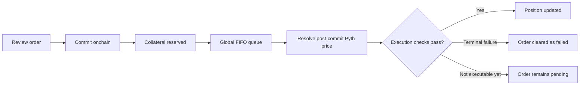

# The Plether Perps market model

> **The price comes from the market. The liability sits onchain.**

Plether is an oracle-priced, cash-settled market for leveraged **LONG USD** and **SHORT USD** exposure.

Traders do not buy currencies, receive a position token or borrow a notional amount of dollars. They enter a contract whose value changes with the Plether Dollar Index. Only the resulting difference is settled in USDC.

Plether separates the functions that many trading venues combine:

| Function                  | Plether mechanism                          |
| ------------------------- | ------------------------------------------ |
| **Reference price**       | External FX oracle data                    |
| **Order sequencing**      | Binding, delayed FIFO queue                |
| **Trade-cost adjustment** | Oracle confidence and virtual price impact |
| **Trader collateral**     | USDC margin account                        |
| **Settlement capital**    | USDC-funded HousePool                      |
| **LP risk allocation**    | Senior and Junior tranches                 |

The oracle supplies the market price. The HousePool supplies the balance sheet behind it.

### One market, two directions

The Plether Dollar Index begins with a normalized basket of six foreign currencies priced in US dollars.

The raw basket therefore moves inversely to dollar strength:

* When USD strengthens, the raw basket falls.
* When USD weakens, the raw basket rises.

For the trading interface, Plether converts that raw basket into a dollar-oriented price:

```
Displayed dollar price
= 2.00 − bounded raw basket
```

This makes LONG and SHORT behave conventionally in the application:

| Position      | Raw basket | Displayed dollar price | Trader benefits |
| ------------- | ---------- | ---------------------- | --------------- |
| **LONG USD**  | Falls      | Rises                  | USD strengthens |
| **SHORT USD** | Rises      | Falls                  | USD weakens     |

The contracts account against the raw basket. The interface displays its fixed complement. Both describe the same economic position.

For the basket construction itself, see **Understanding the Plether Dollar Index**.

### Not an order book

Plether does not match bids and asks.

A LONG USD trader does not need to wait for another trader to open an equivalent SHORT USD position. There is no requirement for directional open interest to balance.

That means Plether has:

* No order-book spread set by market makers
* No queue of resting limit orders
* No peer-to-peer position matching
* No local trade price produced by the last matched order

The Plether chart does not move because someone opens, closes or liquidates a position. It moves because the external FX feeds move.

A large oracle move can still liquidate many positions at once. But those liquidations do not mechanically sell into a Plether order book and push the next execution price farther.

### Not an AMM

The HousePool holds liquidity, but it is not an AMM.

Traders do not swap one asset for another through a reserve curve. LPs do not quote the index price, and opening a position does not remove a LONG or SHORT token from pool inventory.

The HousePool provides **settlement capacity**. It does not provide price discovery.

Trading can still change:

* Directional open interest
* Available LONG USD and SHORT USD capacity
* Pool liability
* Virtual price impact
* Carry
* LP withdrawal availability

Plether separates price discovery from risk pricing:

> The oracle supplies the market price. VPI, carry and capacity limits price the burden a position places on the pool.

### How an order becomes a position

A Plether order follows a commit-now, price-later process:

1. The trader deposits USDC into a Plether margin account.
2. The trader commits a LONG USD or SHORT USD order.
3. Margin and an execution reward are reserved.
4. The order enters the global FIFO queue.
5. Plether resolves the first eligible Pyth observation strictly after commitment.
6. The protocol applies an adverse oracle-confidence adjustment.
7. The order’s execution limit and risk checks are evaluated.
8. If valid, the engine records the position and locks its margin.

The order is binding once committed. The trader cannot cancel because the market moved, and the keeper cannot choose a later, more favourable oracle observation.

Virtual price impact is applied separately to the trade’s economics. It does not replace the oracle or become the new market price.

The full process is covered in **How orders execute**.

### The HousePool is the economic counterparty

A Plether trader does not face an individual LP or an opposite-direction trader.

The **HousePool** is the economic counterparty to every position:

* When traders realize losses, collectible value enters pool economics.
* When traders realize profits, the pool funds those profits.
* When traders pay carry, realized carry becomes LP revenue.
* When a trader receives a VPI rebate, the pool funds it.
* When a trader pays positive VPI, the non-protocol portion strengthens the pool.

The HousePool is funded through the Senior and Junior LP vaults. Both tranches back the same market. One tranche does not back LONG USD while the other backs SHORT USD.

Their role is to decide how pool returns and losses are allocated:

* Junior absorbs losses first and receives residual upside.
* Senior receives a Junior-funded target coupon and absorbs losses after Junior is exhausted.

The HousePool is not an emergency insurance fund added behind another counterparty. It is the primary balance sheet underwriting trader settlement.

### Why the settlement range is fixed

For execution and PnL accounting, Plether uses a fixed settlement range:

```
0.00 ≤ raw basket ≤ 2.00
```

If the external basket observation exceeds 2.00, Plether uses 2.00. The lower boundary is zero.

This creates finite endpoints for both directions:

| Position      | Maximum modeled profit                                      |
| ------------- | ----------------------------------------------------------- |
| **LONG USD**  | Raw basket approaches 0.00; displayed price approaches 2.00 |
| **SHORT USD** | Raw basket reaches 2.00; displayed price reaches 0.00       |

Because those endpoints are known, Plether can calculate every position’s maximum modeled profit before accepting it.

At the market level, the engine tracks the aggregate maximum-profit envelope for each direction. In simplified form, new exposure is accepted only while:

```
Effective HousePool backing after the trade
≥ max(
    aggregate LONG USD maximum profit,
    aggregate SHORT USD maximum profit
  )
```

Effective backing accounts for physical pool assets and existing trader-claim liabilities.

If the post-trade liability cannot be supported, the order is rejected. The protocol does not accept unlimited exposure and hope that enough losing traders appear later.

> **Solvency before volume.**
>
> Plether accepts new exposure only while its bounded liability remains supportable.

#### What the boundary does not mean

The 2.00 settlement ceiling is not:

* A market forecast
* A claim that external FX relationships cannot move farther
* A trader stop-loss
* An automatic position close
* A guarantee that every profit is paid immediately
* A guarantee that LP principal cannot decline
* A guarantee that no bad debt can occur

If the external basket moves beyond the settlement range, Plether PnL stops extending beyond the boundary. This creates basis risk relative to the unrestricted external FX market.

The boundary makes liability measurable. It does not make risk disappear.

### Margin is collateral, not the purchase price

Opening a leveraged position does not transfer a large notional loan to the trader.

Instead, Plether records market exposure and locks USDC collateral against it. Leverage describes the relationship between that exposure and the collateral supporting it.

A trader account separates USDC into several states:

| Account balance              | Purpose                                       |
| ---------------------------- | --------------------------------------------- |
| **Free settlement balance**  | Available for new orders, costs or withdrawal |
| **Position margin**          | Assigned to the live position                 |
| **Committed-order margin**   | Reserved for a pending order                  |
| **Execution-reward reserve** | Reserved for whoever finalizes the order      |

Reserved balances are not free buying power.

Although the interface displays margin assigned to the position, Plether uses account-level collateral. Free USDC inside the same Plether account can contribute to position health.

This means a trader’s loss is not necessarily limited to the margin initially assigned on the trade ticket. A full close or liquidation can consume other economically reachable USDC held inside the Plether account.

Plether cannot debit assets sitting outside the protocol in the trader’s wallet.

### How value moves through the system

The simplified value flow is:

| Event                 | Trader side                                      | HousePool side                                    |
| --------------------- | ------------------------------------------------ | ------------------------------------------------- |
| **Deposit margin**    | USDC enters the trader margin account            | No change                                         |
| **Commit order**      | Margin and execution reward are reserved         | No change                                         |
| **Open position**     | Position margin is locked and trade costs settle | Pool assumes a bounded payout liability           |
| **Price movement**    | Unrealized PnL changes                           | Liability views change; no cash necessarily moves |
| **Losing close**      | Reachable trader USDC is collected               | Realized value enters pool economics              |
| **Profitable close**  | Margin is released and profit is credited        | Pool funds the profit or records a trader claim   |
| **Carry realization** | Carry is collected from reachable collateral     | Realized carry becomes LP revenue                 |
| **LP deposit**        | No change to trader margin                       | USDC enters through a tranche vault               |

Protocol execution fees belong to the treasury rather than LPs. Order-execution rewards are funded from trader collateral rather than HousePool capital.

### Unrealized PnL is not cash

Plether distinguishes between a mathematical gain or loss and USDC that has physically moved.

For conservative pool accounting:

* Unrealized trader profits are treated as liabilities.
* Unrealized trader losses are not treated as spendable LP assets.
* A trader loss becomes pool value only when it is physically collected.
* A trader profit becomes a margin credit or an explicit trader claim.
* An uncovered realized loss becomes bad debt.

This avoids treating money owed by a losing trader as if the pool already possessed it.

> **A number on a ledger is not cash in a contract. Plether accounts for the difference.**

### When a trader closes at a profit

A profitable close accounts for:

* Realized directional PnL
* VPI
* Execution fee
* Accrued carry
* Released position margin

If sufficient unreserved HousePool cash is available, the net result is credited to the trader’s Plether margin account.

It is not sent directly to the wallet. The trader withdraws separately.

If the pool cannot fund the profit immediately, the position can still close. The unpaid amount becomes a **trader claim** associated with that address.

The claim:

* Remains a senior HousePool liability
* Is excluded from LP-withdrawable value
* Is not placed in a FIFO queue
* Can be settled only by its beneficiary
* Settles into the trader margin account
* Requires aggregate trader claims to be fully cash-covered before settlement

Bounded solvency and immediate liquidity are different questions. A liability can be fully recorded even when it cannot yet be paid out as free USDC.

### When a trader closes at a loss

Plether collects the loss from physically reachable collateral inside the trader’s account.

A partial close cannot externalize an uncovered loss to LPs while leaving the remainder of the position protected. If the partial close cannot leave the account valid, it is rejected.

A full close can consume the terminally reachable collateral defined by the protocol. Any remaining shortfall becomes explicit bad debt and is absorbed by LP capital through the tranche waterfall.

### Liquidation and counterparty auto-deleveraging

Plether does not use **counterparty auto-deleveraging**.

A profitable trader’s position is not forcibly reduced simply because another trader is losing or the pool is under stress.

Instead, Plether uses:

* Bounded maximum payouts
* Pre-trade solvency checks
* Directional capacity limits
* VPI and carry
* Conservative LP withdrawal reserves
* Trader claims
* Explicit bad-debt accounting
* Degraded-mode containment
* Recapitalization when required

No counterparty auto-deleveraging does not mean no liquidation.

If a trader’s own account equity falls to or below the active maintenance requirement, the complete position can be liquidated. Plether liquidations are full rather than partial.

The protocol can also apply higher margin requirements around FX-market closures.

### How Plether prices imbalance

Because traders are not matched against one another, LONG USD and SHORT USD open interest can diverge.

Plether manages that imbalance through three mechanisms.

#### Capacity

The protocol limits how much additional liability the HousePool may accept in each direction. An order can be rejected even when the trader has sufficient margin if the pool cannot safely underwrite it.

#### Virtual price impact

VPI is a one-time charge or rebate based on factors including:

* Trade direction
* Current market skew
* Trade size
* Available pool depth
* The protocol’s VPI factor

VPI affects the economics of the trade. It does not set the oracle index or move the chart price.

#### Carry

Carry is the ongoing cost of using LP capital to support a position’s bounded payout.

It is not a payment transferred from LONG USD traders to SHORT USD traders, or vice versa. Both directions can pay carry at the same time when both use HousePool capital.

Realized carry becomes LP revenue.

### How Plether differs from common perpetual markets

Perpetual designs vary, but the main structural differences are:

|                              | Plether                                                       | Common perpetual model                                          |
| ---------------------------- | ------------------------------------------------------------- | --------------------------------------------------------------- |
| **Reference price**          | Six-currency external FX basket                               | Exchange index, order book or AMM reference                     |
| **Counterparty**             | Tranched USDC HousePool                                       | Other traders, market makers or pooled AMM liquidity            |
| **Execution**                | Delayed, binding FIFO orders                                  | Commonly immediate matching or pool execution                   |
| **Price discovery**          | External oracle                                               | Often influenced by venue trading                               |
| **Price impact**             | Separate VPI adjustment                                       | Often produced by order-book or AMM liquidity                   |
| **Settlement range**         | Fixed between 0.00 and 2.00                                   | Often not bounded by an equivalent protocol-wide range          |
| **Ongoing cost**             | Carry paid for LP-backed capital                              | Commonly side-to-side funding                                   |
| **Net directional exposure** | HousePool can warehouse imbalance within limits               | Often balanced through traders or market makers                 |
| **Stress handling**          | Capacity limits, LP waterfall, claims and bad-debt accounting | May use insurance funds, socialized losses or auto-deleveraging |
| **Liquidation execution**    | Settles against an external bounded mark                      | May require selling into an order book or AMM                   |

### The shortest useful mental model

Plether separates three things:

1. **The oracle defines the market.**
2. **The delayed queue defines execution.**
3. **The HousePool underwrites the result.**

Traders post USDC margin and choose LONG USD or SHORT USD. The protocol calculates the position’s maximum possible profit inside the fixed settlement range. It accepts the order only if the HousePool can support the resulting liability.

When the position settles, value moves between the trader’s margin account and the HousePool. Junior and Senior LP capital determine how the pool absorbs the outcome.

That is the Plether market model: **oracle-priced, margin-backed and bounded by design.**

### Continue reading

Next: **How orders execute**

6:14 PMWorked for 7m 18s

## How orders execute

> The order is binding before the execution price is known. That is the point.

Plether uses delayed, oracle-priced execution.

A trader first commits an order with a direction, size, margin and acceptable-price boundary. Plether then settles that order against the first eligible Pyth basket observation after commitment.

The trader chooses the exposure. The oracle determines the price. The queue determines the order of execution.

````

````

### Why execution is delayed

Plether does not execute a trade in the same transaction in which it is submitted.

That separation prevents either party from choosing the price after seeing the other side’s action:

* The trader cannot observe the post-commit price and then cancel an unfavourable order.
* The executor cannot ignore the first eligible price and select a more convenient later observation.
* Every committed order follows the same verifiable execution rule.

This is different from an order book, where an order matches against another market participant, and different from an AMM, where a reserve curve determines the execution price.

Plether’s price comes from the oracle. The HousePool provides the settlement capacity.

### Step 1: Preview the order

The trade ticket lets you choose:

* **LONG USD** or **SHORT USD**
* Position size
* Margin and leverage
* Whether you are opening, increasing or reducing exposure
* Your acceptable price or slippage setting

Depending on the action, the ticket displays **Review Long**, **Review Short**, **Review Reduce** or **Review Close**.

The preview estimates the resulting position, margin, liquidation level, VPI and applicable costs using the current protocol state.

It is not a guaranteed quote.

Between preview and execution, several things can change:

* The Plether Dollar Index
* Oracle confidence
* HousePool depth
* Directional imbalance
* Available market capacity
* Your account state
* Protocol market state

The preview and the final executor use the same accounting rules, but they evaluate different moments in time.

`[Screenshot placeholder: Commit Preview showing Preview → Commit → Finalize, the Delayed execution notice, Cancel and Confirm Commit]`

### Step 2: Commit the order

Selecting **Confirm Commit** submits the order onchain.

The commitment records:

* Direction
* Position-size change
* Margin assigned to the order
* Acceptable-price boundary
* Whether the order is an open, increase or reduction
* Commit time and block
* The order’s position in the execution queue

Any margin attached to the order is reserved immediately. Plether also reserves an execution bounty used to reward whoever finalizes or clears the order.

Reserved funds remain inside the Margin Account, but they are no longer available for withdrawal or for another order.

The commitment does not create the new exposure yet.

| Pending instruction | What has happened                | What has not happened                 |
| ------------------- | -------------------------------- | ------------------------------------- |
| Open                | Margin and bounty are reserved   | The new position does not exist yet   |
| Increase            | Additional funds are reserved    | Existing exposure has not increased   |
| Reduce or close     | The close instruction is binding | The existing position is still active |

> Committing a close does not close the position. PnL, carry and liquidation risk continue until the close executes.

#### Cancel before commit is not order cancellation

The **Cancel** button in the preview simply closes the review window before an order exists.

Once **Confirm Commit** succeeds, the order cannot be cancelled or replaced. The Open Orders tab therefore shows **Cancel unavailable**.

This is deliberate. Allowing post-commit cancellation would turn every pending order into a free option on the next oracle movement.

### Step 3: Enter the global FIFO queue

Every committed order enters one global first-in, first-out queue.

Only the first unresolved order can execute. An executor cannot skip an inconvenient order to process a later one.

This applies across all traders, not only within one account.

Batch execution can process several consecutive orders efficiently, but it must preserve the same order. Manual finalization cannot jump the queue either.

Plether also tracks each account’s pending instructions in sequence. This allows it to understand, for example, that a pending close follows a pending increase. However, each instruction is checked again when it reaches execution.

If an earlier instruction fails, a later instruction that depended on it may also become invalid.

Do not submit duplicate orders simply because the first one is still pending.

### Step 4: Select the oracle observation

During normal live-market operation, Plether does not use:

* The price displayed when you opened the trade ticket
* The latest price when the executor arrives
* A price chosen by a keeper
* An average of the waiting period

It uses the first valid Pyth basket observation strictly after commitment and within the protocol’s settlement window.

The historical proof also establishes that the preceding observation was no later than the commitment. This prevents an executor from skipping the first eligible observation and submitting a later one.

The selected basket must pass several checks:

* All six FX component prices must be positive and valid.
* Each component must satisfy the confidence-width limit.
* Component publish times must be sufficiently aligned.
* The observation must fall inside the permitted settlement window.
* Execution cannot occur in the commitment block during normal live-market operation.
* The resulting basket must satisfy the active oracle policy.

The order may be finalized later while still using the price from its original post-commit settlement window. Finalization time does not become execution time.

If an eligible observation cannot yet be proven, Plether does not invent a fallback price. The order remains pending.

### The mark price and execution price are different

Pyth publishes both a price and a confidence interval. The confidence interval represents uncertainty around the observation.

Plether first calculates the central basket mark. It then applies a protocol-defined fraction of the basket confidence against the trader to obtain the order’s execution price.

Using the dollar-oriented price shown in the interface:

| Order           | Confidence adjustment       |
| --------------- | --------------------------- |
| Open LONG USD   | Slightly higher entry price |
| Close LONG USD  | Slightly lower exit price   |
| Open SHORT USD  | Slightly lower entry price  |
| Close SHORT USD | Slightly higher exit price  |

The central mark itself is not moved by this adjustment. It applies only to execution.

This adjustment is:

* Not AMM slippage
* Not VPI
* Not a protocol fee
* Not selected by the executor

As elsewhere in Plether, the raw basket is bounded to the fixed `0.00–2.00` settlement range. The interface then presents the dollar-oriented price:

```
Displayed price = 2.00 − bounded raw basket
```

### Step 5: Check the acceptable price

The interface translates your slippage setting into an acceptable-price boundary.

Using the displayed dollar-oriented price:

| Order           | Execution requirement                |
| --------------- | ------------------------------------ |
| Open LONG USD   | At or below your maximum entry price |
| Close LONG USD  | At or above your minimum exit price  |
| Open SHORT USD  | At or above your minimum entry price |
| Close SHORT USD | At or below your maximum exit price  |

If the confidence-adjusted execution price falls outside that boundary, the order fails.

It is not automatically retried at another price. To try again, you must submit a new order with a fresh commitment.

#### What the price limit does not cover

The acceptable-price boundary protects the oracle execution price. It does not cap every USDC amount associated with the trade.

The following remain separate:

* **VPI:** a charge or rebate based on how the trade changes directional imbalance
* **Protocol execution fee:** charged on executed notional
* **Carry:** accumulated cost of LP-backed exposure
* **Execution bounty:** reserved to pay for finalizing or clearing the order

A trade can therefore execute within its price tolerance while its final USDC accounting differs from the preview.

### Step 6: Finalize the order

After commitment, the interface displays **Waiting for verified market data** while the automated execution system attempts to finalize the order.

The finalization panel shows:

* **Settlement Details**
* **Manual finalization**
* **Available in …**
* Progress toward manual finalization becoming available

The interface initially gives automation a short grace period. This is an interface convention, not an exclusive keeper right at the protocol level.

Execution is permissionless. Any address can finalize the queue head by providing the required Pyth data and oracle update fee.

If automated finalization does not complete, the interface displays:

* **Ready to finalize manually**
* **Manual finalization — Available now**
* **Finalize Trade**

Manual finalization requires another wallet transaction. It uses the same price-selection and FIFO rules as automated finalization; it cannot select a different price or bypass earlier orders.

`[Screenshot placeholder: Waiting for verified market data with the finalization progress indicator and Manual finalization — Available in …]`

`[Screenshot placeholder: Ready to finalize manually with the Finalize Trade button]`

Messages such as **Final price not ready yet**, **Historical price data required** or **Retry shortly** generally mean the required oracle proof was not available to that attempt. They do not necessarily mean the order has failed.

### Step 7: Revalidate the trade

Passing the oracle and price-limit checks is not enough by itself.

Immediately before changing state, Plether revalidates the complete trade.

For an opening or increase, this includes:

* Account collateral
* Initial-margin requirements
* Position direction
* Minimum position economics
* Directional imbalance limits
* Available HousePool capacity
* Maximum bounded payout liability
* Current protocol and market state

For a reduction or close, the engine calculates:

* Realized PnL
* Accrued carry
* VPI
* Protocol execution fee
* Margin released
* Collectible trader loss or trader payout
* Health of any remaining position

Only after the complete transition passes does Plether update the position and settle the corresponding balances.

This is why a trade can pass its preview and commitment checks but still fail at execution. A preview describes the current state; execution must be safe in the state that actually exists when the order is processed.

### Possible order outcomes

#### Executed

All checks pass.

* The position is created or updated.
* Margin and settlement balances are updated.
* The execution bounty is credited to the finalizer.
* The order moves to Order History as **Executed**.
* The finalization window displays **Trade executed at …**.

#### Still pending

Execution cannot safely proceed yet, but the instruction has not terminally failed.

Possible reasons include:

* Eligible historical Pyth data is not yet available.
* The submitted data does not prove the required first post-commit observation.
* The order is still behind an earlier queue head.
* Finalization was attempted in the commitment block.
* A previously committed opening has entered a close-only period.

While pending, committed margin and the execution bounty remain reserved.

The interface may describe this state as **Pending reveal**. Here, “reveal” means resolving the verified historical oracle price. It does not require a second trader signature.

#### Failed

A terminal condition prevents execution.

Examples include:

* **Failed: Slippage exceeded**
* **Failed: Engine rejected**
* **Failed: Account liquidated**
* Another execution-time account or protocol invalidation

The requested position change does not occur. For an ordinary terminal failure, committed position margin is released and the reserved bounty is paid to the address that clears the order.

> A failed order can still consume its execution bounty. The bounty pays for resolving the order lifecycle—not for guaranteeing a fill.

There is no automatic retry or requeue. A fresh trade requires a new order.

### Expiry and cleanup

Orders have a protocol-configured maximum age. The live interface displays the applicable countdown as **Expires in …**.

Expiry does not perform an automatic background transaction. Once the timeout passes, the order still needs to be cleared onchain.

The Open Orders tab then displays:

* **Expired**
* **Clean up to release reserved margin**
* **Clean Up**

Cleanup:

* Marks the order as terminally failed
* Removes it from the live queue
* Releases committed position margin
* Resolves the reserved execution bounty
* Allows later orders to proceed

Cleanup is not early cancellation. It is permissionless settlement of an order that has already expired.

`[Screenshot placeholder: Open Orders showing Pending reveal, Expires in … and Cancel unavailable, followed by an expired order showing Clean Up]`

### Close-only and frozen-oracle periods

Plether preserves risk-reducing actions when the protocol stops accepting new exposure.

During a close-only period:

* New openings and increases cannot be committed.
* Valid reductions and full closes can still be submitted.
* A previously committed opening may remain pending if the market enters close-only mode before it executes.
* That order must eventually execute, become terminally invalid or expire before later orders can pass it.

When the FX oracle is genuinely frozen, closes use Plether’s frozen-market execution policy. The normal strictly post-commit rule is relaxed so traders are not trapped solely because the underlying FX feeds are offline.

New risk remains blocked, and frozen-market closes use additional LP protections, including one-way VPI rather than a skew-reduction rebate.

The fixed `0.00–2.00` settlement range continues to apply.

### A pending close does not prevent liquidation

Liquidation is a separate keeper path. It does not wait for a trader-submitted close to reach the front of the order queue.

If an account becomes liquidatable while its close is pending, the position can be fully liquidated first. Its pending instructions are then failed and their reserved value is resolved through the liquidation accounting path.

A pending close is an instruction—not protection from market movement.

### What traders should remember

* The price on the ticket is a preview, not a guaranteed fill.
* A committed order cannot be cancelled.
* Normal execution uses the first eligible Pyth observation after commitment.
* All orders follow one global FIFO queue.
* Manual finalization cannot bypass that queue.
* Slippage protects the oracle execution price, not VPI, fees or carry.
* Failed and expired orders can still consume their execution bounty.
* An opening creates no exposure until execution.
* A position remains active until its close actually executes.

Plether does not promise instant execution. It defines an execution rule that can be independently verified.

**Next: How PnL is calculated.**
