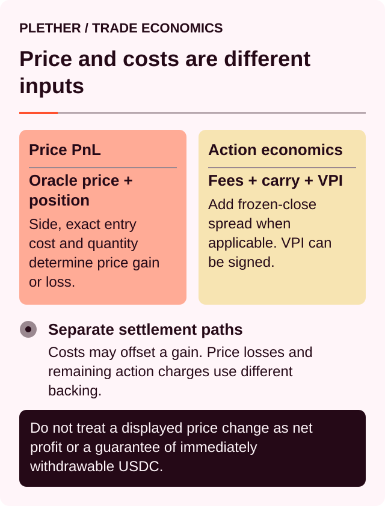
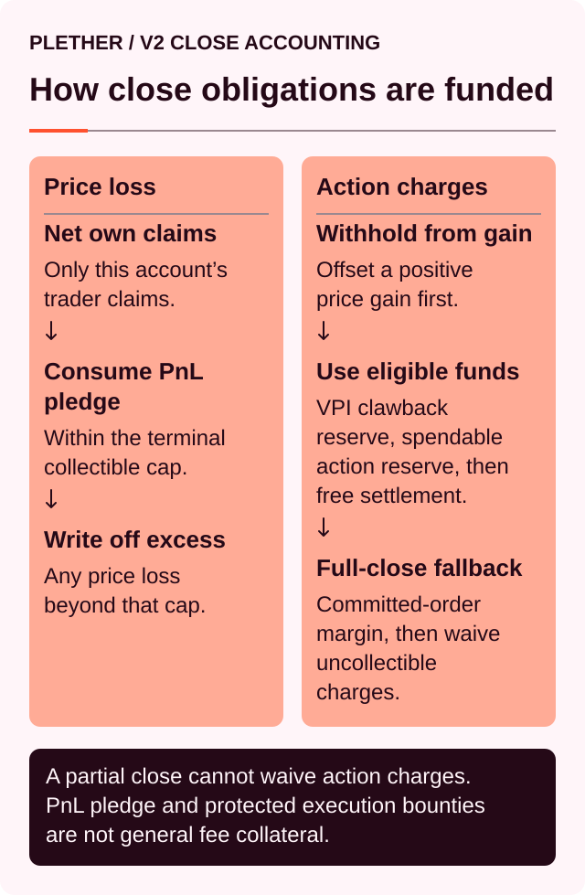
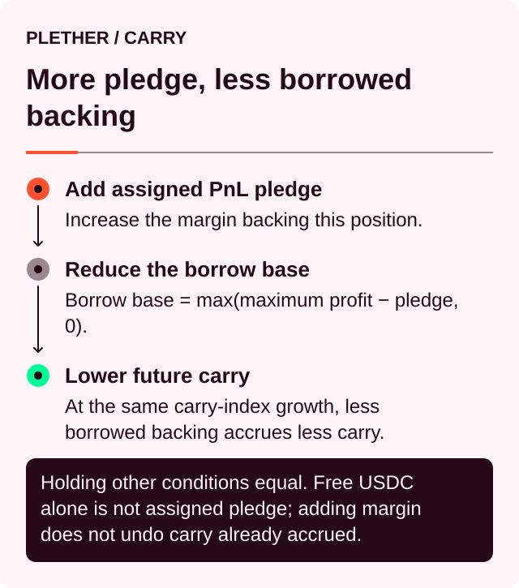

# Trading costs: fees, carry and VPI

A Plether trade has one oracle-derived[^oracle] execution price, but several separate USDC[^usdc] adjustments.

The distinction matters:

* The oracle price determines entry, exit and directional PnL[^pnl].
* The execution fee is the protocol-designated charge for completed trades.
* VPI[^vpi] prices the change in HousePool imbalance.
* The frozen-close spread compensates LPs[^lp] when a voluntary close settles during `oracleFrozen`.
* Carry[^carry] pays LPs for capital committed through time.
* The execution reward pays whoever processes the delayed order.

Only the oracle adjustment changes the price recorded on the position. The other items change the USDC economics around that price.



### Sponsored network gas is not a trading discount

Plether sponsors the network gas for eligible trader actions, subject to availability and policy limits. The connected wallet authorizes the action, the Trading Account submits it through a UserOperation[^useroperation], and Plether pays the eligible native-token network cost.

That sponsorship is separate from the trade’s USDC economics:

| Category                         | Denomination          | Who pays or receives it                                                        |
| -------------------------------- | --------------------- | -------------------------------------------------------------------------------- |
| **Sponsored network gas**        | Network native token  | Plether pays for an eligible sponsored operation                               |
| **Execution fee**                | USDC                  | Trader is assessed the protocol-designated fee after successful execution       |
| **VPI**                          | USDC                  | Trader pays or receives value against the HousePool                             |
| **Carry**                        | USDC                  | Trader pays the HousePool over time                                             |
| **Order execution reward**       | USDC                  | Trading Account reserves it for the order executor or clearer                   |
| **Frozen-close spread**          | USDC                  | Trader pays the HousePool when applicable                                       |
| **Direct oracle-update costs**   | Native token          | A permissionless contract caller pays unless that exact operation is sponsored  |

Gas sponsorship does not make trading free. It removes the owner wallet’s native-gas prerequisite for eligible actions; it does not remove margin requirements, trading costs, losses or settlement obligations.

The contracts expose permissionless execution and liquidation paths whose direct callers supply any required native-token oracle-update fee. The current trader interface does not expose owner-driven manual finalization; it relies on keepers to process the queue. A user interacting with those contract paths outside the interface must fund the required update fee unless that specific call is sponsored separately.

See [Gas-sponsored trading and your Plether Trading Account](../trading-on-plether-perps/gas-sponsored-trading-and-your-plether-trading-account.md) for eligible actions and availability limits.

### Cost summary

| Item                         | When it applies                                             | Economic destination                        |
| ---------------------------- | ----------------------------------------------------------- | ------------------------------------------- |
| Protocol execution fee       | Successful open, increase, reduction or voluntary close     | Protocol treasury when cash-credited        |
| VPI                          | Successful position-size change                             | Trader ↔ HousePool                          |
| Frozen-close spread          | Voluntary reduction or close executed during `oracleFrozen` | HousePool; entirely LP-owned                |
| Carry                        | Continuously while LP capital supports a position           | HousePool                                   |
| Order execution reward       | Reserved in USDC when an order is committed                 | Order executor or clearer                   |
| Liquidation bounty           | Successful liquidation                                      | Liquidation keeper                          |
| Oracle confidence adjustment | Opens, live/FAD voluntary closes and liquidations           | Changes execution or liquidation price; not a separate fee |

These USDC costs and price adjustments should not be combined with sponsored network gas or into one unexplained “price impact” number. They perform different jobs and behave differently.

### Protocol execution fee

Plether charges a configured fee on the contract notional[^notional] being executed.

The public dollar-oriented price is:

```
D = 2.00 − B
```

Where `B` is the raw basket price used by protocol accounting.

For a change in position size:

```
Executed contract notional
= size executed × Bexecution
= size executed × (2.00 − Dexecution)
```

The fee is:

```
Protocol execution fee
= executed contract notional × execution fee rate
```

It applies when:

* opening a position;
* increasing an existing position;
* partially reducing;
* fully closing.

Opening and closing are separate executions, so a round trip normally pays the fee twice. The two fees may differ because the raw basket price can change.

Adding position margin without changing size does not incur an execution fee or VPI.

The fee is based on the actual executed amount and price—not the number shown when the order was first committed. Use the live onchain rate surfaced by the interface rather than a rate from a static example.

The fee is protocol-designated, but terminal settlement remains physical-cash-first. Only a fee collected from trader collateral or funded from available HousePool cash is credited to treasury margin. Any amount that cannot be cash-credited under trader-payout and claim seniority is not recorded as a protocol receivable or as LP bad debt.

### Virtual Price Impact

Virtual Price Impact, or VPI, prices how a trade changes the directional liability carried by the HousePool.

It is “virtual” because Plether does not move the oracle price or execute through an AMM[^amm]. VPI is settled as a separate USDC adjustment.

#### The VPI curve

Plether first assigns a theoretical cost to the current absolute market imbalance:

```
Skew cost(K)
= ½ × k × K² ÷ L
```

Where:

* `K` is the absolute USDC-valued difference between aggregate LONG USD and SHORT USD open interest;
* `L` is current HousePool depth, implemented as total pool assets;
* `k` is the configured VPI factor.

The skew[^skew] is valued using the raw basket price `B`.

A trade’s VPI is the movement along that curve:

```
VPI
= post-trade skew cost − pre-trade skew cost
```

Therefore:

* Positive VPI is a charge.
* Negative VPI is a rebate.
* Zero VPI means the modeled skew cost did not change.

Positive VPI is a HousePool inflow. Negative VPI is funded by the HousePool, subject to the position-lifecycle rules below.

### Direction alone does not determine VPI

LONG USD does not always pay VPI. SHORT USD does not always receive it.

What matters is how the trade changes absolute imbalance.

Suppose aggregate exposure is:

```
LONG USD:   $1,200,000
SHORT USD:    $800,000

Absolute skew: $400,000 toward LONG USD
```

A new LONG USD order increases the imbalance and normally pays VPI.

A new SHORT USD order that moves the market closer to balance reduces the imbalance and may receive a rebate.

The same applies to closes:

* closing exposure on the dominant side can reduce skew;
* closing exposure on the smaller side can increase skew.

VPI is unrelated to whether the trader is profitable. It depends on the trade’s effect on HousePool concentration.

### Why VPI is quadratic

The skew-cost curve uses `K²`.

That means:

* moving away from balance becomes progressively more expensive;
* the same order has more impact when the market is already heavily imbalanced;
* deeper HousePool capital reduces the cost of a given imbalance.

Under unchanged price, pool depth and market state, splitting one large order into smaller orders does not avoid VPI. Each movement along the curve adds back to the same total change.

In practice, other orders and LP actions can change skew or depth between executions. A preview is therefore a snapshot, not a guaranteed VPI quote.

### VPI is not oracle slippage

The interface currently labels this value **VPI / Price impact**. “Price impact” is an economic analogy; VPI does not alter the oracle execution price stored on the position.

The order’s acceptable-price setting controls the oracle-derived execution price under the active confidence policy. It does not directly cap:

* VPI;
* the execution fee;
* accrued carry;
* the frozen-close spread, when applicable;
* the execution reward.

```
Oracle price protection ≠ maximum USDC trade-cost protection
```

VPI is calculated from the market state at execution. It can change while an order waits in the queue.

The execution-time market state also determines whether the frozen-close spread applies. A close committed under live-oracle rules can therefore incur the spread if it is finalized after Plether enters `oracleFrozen`.

### VPI over a position’s lifecycle

Plether stores signed accumulated VPI on each position.

A positive value represents charges already paid. A negative value represents a provisional rebate.

#### Why negative VPI is provisional

A negative VPI amount may be credited into position settlement, but the same amount is deducted when calculating account risk equity.

Conceptually:

```
VPI rebate liability
= max(− accumulated VPI, 0)
```

A `$50` provisional VPI rebate therefore does not create `$50` of additional liquidation headroom.

During any voluntary reduction or close, Plether allocates accumulated VPI proportionally to the position size being closed. It then enforces:

```
VPI attributed to closed portion
+ new close VPI
≥ 0
```

The closed portion cannot complete its voluntary-close lifecycle with net-negative VPI.

In practice:

* a closing rebate can offset VPI charges previously paid by that portion;
* it cannot turn the round trip into pure rebate income;
* a provisional rebate received while opening may be reclaimed when that exposure closes;
* a partial close reconciles a proportional share of the VPI history.

#### VPI clamp example

Suppose a position previously paid `$60` of VPI.

If closing it would generate an `$80` rebate, the realized close rebate is limited so lifetime VPI for that exposure reaches zero—not negative `$20`.

Conversely, if opening produced a provisional `$40` rebate, the close must reconcile at least that `$40` before the closed exposure can complete its lifecycle.

The position can still profit from directional movement. The clamp only prevents rebate-only extraction from the HousePool.

### VPI and the frozen-close spread

A scheduled close-only runway with a functioning oracle continues using normal signed VPI.

The same remains true during `oracleFrozen`. Voluntary reductions and closes use the ordinary signed VPI curve and the existing lifetime rebate clamp:

* A skew-increasing close can pay positive VPI.
* A skew-reducing close can receive a bounded negative VPI rebate.
* The closed exposure cannot finish with net-negative lifetime VPI.

Frozen-market stale-price protection is handled separately.

A voluntary reduction or close executed during `oracleFrozen` is assessed a fixed spread:

```
Reduced contract notional
= size reduced × Bexecution
= size reduced × (2.00 − Dexecution)

Frozen-close spread
= reduced contract notional × frozen-close spread rate
```

The current rate is **50 bps[^bps]**, or **0.50% of reduced contract notional**.

For example:

```
Reduced contract notional: $10,000
Frozen-close spread:          0.50%

$10,000 × 0.50%
= $50
```

The spread:

* Applies only to voluntary reductions and closes executed during `oracleFrozen`
* Does not apply during open markets
* Does not apply during FAD-only[^fad] close-only windows with a live oracle
* Does not apply to liquidations
* Is separate from VPI, the execution fee, carry and the active oracle-confidence policy
* Is fixed rather than dependent on pool skew or oracle age
* Belongs entirely to LPs when retained or collected
* Never credits the protocol treasury

“Fixed” means the percentage does not change dynamically with VPI, skew, elapsed closure time or mark staleness. It does not mean that the parameter is immutable.

The active rate is part of the 48-hour timelocked risk configuration. It must remain nonzero and cannot exceed **1,000 bps**, or **10.00%**. The live onchain value is authoritative.

#### Collection priority and terminal waiver

When the trader’s available value is limited, close settlement follows this order:



A partial reduction must settle its complete obligation, including the full frozen-close spread. If it cannot, the reduction does not execute.

A terminal full close is not trapped solely by an uncollectible spread. Plether collects the portion that remains reachable and waives only the uncollectible spread.

The waived amount:

* Does not become bad debt
* Does not become a trader claim
* Does not become LP revenue or an LP receivable

Genuine base trading-loss shortfall continues through the ordinary bad-debt rules.

The onchain close preview exposes:

* `frozenSpreadUsdc` — total spread assessed
* `frozenSpreadPaidUsdc` — amount retained or collected for LPs
* `frozenSpreadWaivedUsdc` — terminally uncollectible amount waived

For a valid close:

```
assessed spread
= paid spread
+ waived spread
```

All three values are zero outside `oracleFrozen`.

A successful close with a nonzero assessment emits:

```
FrozenCloseSpreadSettled(
    account,
    assessedUsdc,
    paidUsdc,
    waivedUsdc
)
```

The spread is selected by the market state at execution, not commitment. A close committed during FAD-only operation but executed after `oracleFrozen` begins pays the active spread. A close executed after frozen operation ends does not.

### Cost of carry

Plether does not transfer funding payments between LONG USD and SHORT USD traders.

Instead, carry compensates LPs for the part of a position’s bounded maximum payout financed by the HousePool.

Both directions can pay carry at the same time.

### The position borrow base

Within the fixed `0.00–2.00` settlement range:

```
LONG USD maximum profit
= size × (2.00 − entry price)

SHORT USD maximum profit
= size × entry price
```

The position’s LP-backed borrow base is:

```
Borrow base
= max(maximum bounded profit − assigned position margin, 0)
```

This is the amount of maximum payout capacity supported by LP capital rather than assigned position margin.

If assigned position margin fully covers the position’s maximum possible profit:

```
Borrow base = 0
```

No new carry accrues on that basis.

Free USDC elsewhere in the account supports liquidation health, but it does not reduce carry. It must be explicitly assigned as position margin to reduce the borrow base.

> Carry is the price of keeping LP capital committed—not a payment from losing traders to winning traders.

### Side utilization determines the rate

Plether tracks the total borrow base separately for LONG USD and SHORT USD.

```
Side utilization
= min(
    total same-side borrow base ÷ HousePool assets,
    100%
  )
```

The effective annualized rate for that direction is:

```
Effective side carry rate
= configured base carry rate × side utilization
```

At `20%` utilization, the active rate is `20%` of the configured base rate. At `100%` utilization, it reaches the configured maximum.

For a stable rate over an interval:

```
Position carry
≈ borrow base
× effective side rate
× elapsed time ÷ one year
```

The implementation uses a continuously advancing side index so changes in utilization are accounted for over time.

#### Illustrative example

Assume:

```
Position maximum profit:       $25,000
Assigned position margin:       $5,000
Position borrow base:          $20,000

Total same-side borrow base:  $500,000
HousePool assets:           $1,000,000
Side utilization:                  50%

Illustrative base rate:             10%
Effective annualized rate:           5%
Time open:                       30 days
```

Approximate carry is:

```
$20,000 × 5% × 30 ÷ 365
≈ $82.19
```

The values are illustrative and are not live Plether parameters.

### Both directions can pay carry

Conventional perpetual exchanges often transfer funding from one side of the market to the other.

Plether does not.

LONG USD and SHORT USD use separate carry indexes. If both sides have non-zero LP-backed borrow bases, both sides can accrue positive carry simultaneously.

A balanced open-interest chart therefore does not imply zero carry. Each side may still be using HousePool capital to support bounded payout capacity.

### Carry accrues continuously

Carry follows wall-clock time.

It continues while:

* the trader takes no action;
* a close remains pending;
* the market is close-only;
* the oracle is stale;
* the oracle is frozen.

Not executing a transaction does not pause carry.

Carry accrues against the stored borrow base between checkpoints rather than recalculating the entire basis from every new mark price.

Pending carry reduces account equity before it is physically collected. It can:

* reduce withdrawable USDC;
* lower the payout from a close;
* make an increase invalid;
* consume free balance or position margin;
* contribute to liquidation without an index move.

### When carry is realized

Carry is checkpointed before an action changes the basis or rate on which it was earned.

Relevant actions include:

* increasing a position;
* reducing or closing;
* adding position margin;
* depositing or withdrawing account USDC;
* changing collateral reservations;
* changing HousePool assets;
* changing carry-related parameters.

This prevents retroactive repricing.

For example:

* adding position margin can reduce future carry, but does not erase carry already accrued;
* an LP deposit can reduce future utilization, but does not dilute carry earned before the deposit;
* a parameter change applies prospectively after the existing index is checkpointed.

Any voluntary reduction—including a partial close—settles all carry accrued on the position up to that execution time. The remaining position then begins accruing again from the new checkpoint.

### How carry is collected

When carry is realized, Plether consumes:

1. Free account USDC.
2. Assigned position margin.
3. If those are insufficient, the remainder persists as unsettled carry debt.

Unsettled carry continues reducing account equity.

A deposit can therefore be used partly to pay existing carry in the same transaction. Similarly, if carry reaches assigned position margin, the position’s LP-backed borrow base can increase, raising future carry all else equal.

Realized carry enters the HousePool as LP trading revenue.

### How additional margin affects carry

Moving existing free USDC into assigned position margin does not add new account equity. The same USDC was already inside the shared-collateral account.

It can still reduce future carry:



This is why adding position margin can matter even when it has little immediate effect on account-level liquidation health.

### Opening and increasing

For an opening or increase:

```
Immediate trade adjustment
= protocol execution fee + signed VPI
```

Resulting position margin is approximately:

```
Carry-adjusted existing margin
+ submitted margin
− protocol execution fee
− VPI
```

Because VPI is signed:

* positive VPI reduces resulting margin;
* negative VPI increases resulting margin provisionally.

On an increase, existing carry is realized first. Fees, VPI and carry can therefore leave less assigned margin than a simple `existing margin + submitted margin` calculation suggests.

If the resulting position fails initial-margin or solvency checks, the order fails rather than opening an invalid position.

### Reducing and closing

For a voluntary reduction or close:

```
Net close economics
= gross realized PnL
− protocol execution fee
− signed close VPI
− all pending carry
− frozen-close spread, when applicable
```

A negative VPI is a rebate, so subtracting it increases the result—subject to the normal lifetime clamp.

The frozen-close spread is a separate non-negative charge. It does not replace or suppress an eligible VPI rebate, and it is zero outside `oracleFrozen`.

Released position margin is separate:

```
Final account movement
≈ released trader margin + net close economics
```

Released margin is the return of the trader’s own collateral. It should not be described as trading profit.

#### Close-economics example

The following example assumes live or FAD-only execution, so no frozen-close spread applies.

Suppose a close produces:

```
Gross realized PnL:     +$1,200
Execution fee:              $25
VPI charge:                 $40
Pending carry:              $75
```

Then:

```
Net close economics
= $1,200 − $25 − $40 − $75
= $1,060
```

If the close instead receives an eligible `$40` VPI rebate:

```
Net close economics
= $1,200 − $25 − (−$40) − $75
= $1,140
```

Any released position margin is added separately.

#### The same close during `oracleFrozen`

If the first close reduced `$10,000` of contract notional during `oracleFrozen`, it would also be assessed a `$50` frozen-close spread at the current rate:

```
Net close economics
= $1,200 − $25 − $40 − $75 − $50
= $1,010
```

This assumes the entire spread is collectible. A terminal full close may show part of it as waived under the rules described above.

### Liquidation treatment

Liquidation does not charge the normal execution fee, does not calculate a new closing VPI and does not assess the frozen-close spread—even during `oracleFrozen`.

It does include:

* all pending carry;
* any negative accumulated VPI subject to clawback;
* the side-adverse liquidation price;
* the separate liquidation bounty.

Previously paid positive VPI is not charged again.

Any remaining positive value is preserved for the trader. Any remaining uncovered terminal obligation becomes bad debt borne by the LP waterfall.

### The order execution reward

The interface and this documentation call this the **Execution reward**. It is reserved for the account that executes or clears the order.

It is separate from the protocol execution fee.

For an opening or increase, the reward is quoted from the order’s commit-time contract notional, subject to configured minimum and maximum amounts.

For a close, it is a configured fixed amount.

The reward is reserved immediately when the order is committed:

* open-order rewards come from free USDC;
* close-order rewards use free USDC first and may use eligible position margin;
* successful execution pays the reward to the executor;
* terminal failure or expiry can still pay the executor or clearer;
* a temporarily blocked order keeps its reward reserved;
* liquidation forfeits pending-order rewards to the protocol treasury.

A failed order does not pay the protocol execution fee, VPI or frozen-close spread because no trade occurred. It can still lose its execution reward because the queue entry had to be processed and cleared.

### Oracle confidence adjustment

For opens and live or FAD-only voluntary closes, Plether executes against the side adverse to the trader within the accepted oracle confidence interval.

This behaves like a small execution spread, but it is neither a separate USDC fee nor the frozen-close spread.

It changes the execution price itself and can therefore indirectly affect:

* executed contract notional;
* execution fee;
* VPI;
* entry price and PnL.

During an `oracleFrozen` voluntary reduction or close, confidence-width validation remains active but the adverse price shift is waived. The validated unshifted price is used, and the separate frozen-close spread applies instead. Liquidations continue using their own adverse confidence policy.

When applicable, the interface displays the confidence adjustment separately as **Adverse oracle confidence spread**.

### Reading the current interface

The trade preview shows:

* **Estimated protocol execution fee**
* **VPI / Price impact**
* **Estimated execution reward**
* **Adverse oracle confidence spread**

For VPI:

```
12.3 USDC  = charge
−12.3 USDC = rebate
```

Positive values are displayed without a `+` sign. Small non-zero costs may appear as `0.0 USDC` because preview values are rounded.

After execution, **Final Result** changes the labels to:

* **Protocol execution fee**
* **VPI / Price impact**
* **Execution reward**
* **Oracle confidence spread**

If indexed execution data has not arrived, VPI remains labelled **Estimated VPI / Price impact**.

At contract level, close previews expose frozen-market settlement separately:

* `frozenSpreadUsdc` — assessed
* `frozenSpreadPaidUsdc` — amount retained or collected for LPs
* `frozenSpreadWaivedUsdc` — waived

A successful close with a nonzero assessment emits `FrozenCloseSpreadSettled`, preserving the assessed, paid and waived amounts in the execution record.

If the active frontend does not yet display these fields, the onchain preview and event remain the authoritative breakdown.

#### Two meanings of “Cost of carry”

The current interface uses **Cost of carry** in two places:

* In the market header, it shows the configured maximum annualized base rate.
* In **Current Position**, it shows accrued unpaid carry in USDC.

The header does not currently show the position’s live side-utilization-adjusted annualized rate.

#### Current preview limitations

The current interface does not fully itemize:

* pending carry applied during an increase;
* estimated net payout for a reduction or close;
* accumulated VPI subject to possible clawback;
* fees and carry in persistent order history.

The execution-reward preview is also derived from frontend defaults rather than reading every live router parameter.

Treat the commit preview as an estimate. The onchain result and updated clearinghouse balance are authoritative.

### What LPs receive

Positive VPI, realized carry and every retained or collected dollar of frozen-close spread are HousePool trading revenue owned by LPs.

Negative VPI is a HousePool outflow. A waived frozen-close spread is uncollected revenue—not LP revenue, protocol revenue or bad debt.

Trader profits, claims and bad debt can also offset or exceed VPI, spread and carry income.

A cash-credited protocol execution fee belongs to the protocol treasury. An uncredited amount is not a treasury receivable or LP revenue. The order execution reward normally belongs to its executor or clearer[^keeper]; if liquidation clears the pending order first, the reserved reward is forfeited to the protocol treasury. Neither should be presented as direct LP yield.

Once revenue enters the HousePool, tranche[^tranche] accounting determines its allocation:

* senior claims receive waterfall priority;
* junior capital absorbs first loss;
* junior receives residual upside after senior priority is satisfied.

High VPI, frozen-close spread or carry revenue should never be read without the liability side of the pool.

> Liability is the product. Return is what LPs receive for underwriting it.

### What traders should check

Before committing an order, review:

* the oracle execution price under the active market-state policy;
* the acceptable-price boundary;
* the estimated protocol execution fee;
* whether VPI is a charge or provisional rebate;
* whether execution may occur during `oracleFrozen` and therefore assess the frozen-close spread;
* the reserved execution reward;
* current pending carry;
* resulting position margin;
* account equity and maintenance margin;
* the active market state.

Before closing, distinguish:

* gross directional PnL;
* execution fee;
* signed VPI;
* frozen-close spread assessed, paid and waived, when applicable;
* accumulated carry;
* position margin released;
* net account settlement.

### The central distinction

* **Execution fees** are protocol-designated charges for completed trades; only cash-credited amounts reach the treasury.
* **VPI** prices the trade’s change in HousePool imbalance.
* **Carry** pays LPs for bounded payout capacity committed through time.
* **Frozen-close spreads** compensate LPs for voluntary exits executed against bounded stale oracle data.
* **Execution rewards** pay keepers to process the delayed-order queue.

None of these changes the underlying foreign-exchange market.

The oracle decides the price. Fees, VPI, carry and any frozen-close spread decide the USDC economics around it.

[^usdc]: A US dollar-denominated stablecoin Plether uses for margin and settlement.
[^oracle]: A service that supplies external market data to smart contracts; Plether uses Pyth price feeds.
[^pnl]: Profit and loss, the financial result of market-price movement on a position.
[^vpi]: Virtual Price Impact, a separate USDC charge or rebate based on how a trade changes HousePool directional imbalance.
[^lp]: Liquidity provider, a participant that supplies USDC capital to the HousePool.
[^carry]: The time-based cost charged on the portion of a position financed by LP capital.
[^useroperation]: A signed smart-account instruction sent to a bundler for onchain inclusion.
[^notional]: The face value of a position’s market exposure, not the amount of collateral posted.
[^amm]: Automated market maker, an onchain liquidity mechanism that prices trades using a pool and formula.
[^skew]: The imbalance between aggregate LONG USD and SHORT USD exposure.
[^bps]: Basis points; 100 bps equals 1%.
[^fad]: Friday Afternoon Deleverage, Plether’s wider scheduled close-only window around the weekly FX closure.
[^keeper]: A permissionless actor or bot that submits order-finalization or protocol-maintenance transactions.
[^tranche]: A pool layer with its own loss priority, withdrawal priority and return profile.
