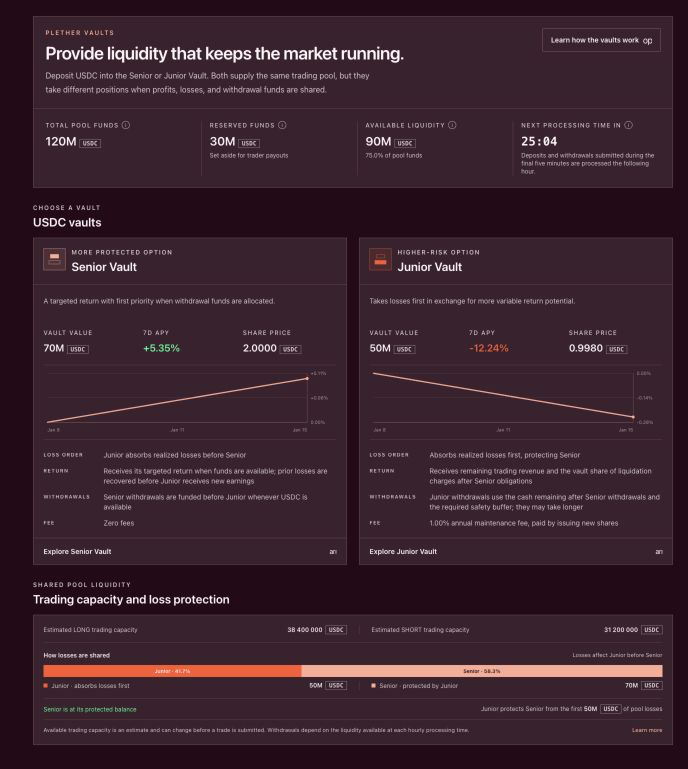

# Liquidity provider quickstart

> **Supply the balance sheet behind the market.**

Plether liquidity providers deposit USDC[^usdc] through the **Senior Vault** or **Junior Vault**. Their capital becomes part of the HousePool, which stands behind trader profits and other protocol liabilities.

In return, LPs[^lp] receive vault shares whose value reflects their tranche's share of pool revenue and losses. This is underwriting capital, not a savings balance: share value can rise or fall, and not all share value is necessarily withdrawable at once.

> **Use the Vaults page for LP actions**
>
> The `Deposit` control in the existing Perps trade interface funds the Trading Account's **Margin Account**. It does **not** provide liquidity to either LP vault.
>
> LP actions execute from the connected **owner wallet**, which must hold the USDC being deposited and enough ETH for transaction fees. The current Vaults flow does not sponsor USDC approvals, requests, cancellations, wallet moves or asset returns.

### The LP flow in one line

`Owner-wallet USDC → queued vault deposit → eligible hourly settlement → active, claimable shares in vault custody → Move shares to wallet → wallet-held position → queued withdrawal → eligible hourly funding → claimable USDC → owner wallet`

Never send USDC directly to the HousePool. Deposit only through the verified Senior or Junior Vault surfaced by the official application and active deployment metadata.

For the protocol-level model, read [The HousePool and tranche waterfall](how-plether-works/the-housepool-and-tranche-waterfall.md).

### Before you begin

You need:

* A compatible self-custody wallet
* Arbitrum Sepolia selected in your wallet
* MockUSDC held by the connected owner wallet
* Enough Arbitrum Sepolia ETH for every required transaction
* The official application and verified contract metadata for the active deployment
* Time to monitor queued deposits and withdrawals through hourly processing and the separate wallet-claim step

The welcome faucet may fund the separate **Trading Account** rather than the owner wallet. A Trading Account balance cannot be approved for an owner-wallet LP deposit. Confirm which address holds the MockUSDC before you start.

MockUSDC is test collateral. It is not issued by Circle and cannot be redeemed for real dollars.

### 1. Choose Senior or Junior

Both tranches supply the same HousePool, but they occupy different positions in its waterfall.

|                         | Senior Vault                                      | Junior Vault                                                 |
| ----------------------- | ------------------------------------------------- | ------------------------------------------------------------ |
| **Return profile**      | Target coupon funded from Junior NAV[^nav]        | Residual pool revenue after Senior obligations               |
| **Loss priority**       | Absorbs losses after Junior is exhausted          | Absorbs losses first                                         |
| **Withdrawal priority** | Matured requests are funded before Junior        | Funded after matured Senior demand, then capped by free cash, Junior principal and the governed Senior-share ratio |
| **Central risk**        | Coupon can stop; principal can still be impaired  | Share value can be partially or completely wiped out first   |

Senior is **last-loss**, not risk-free. Its coupon is a target rather than a guaranteed return and is limited by available Junior capital.

Junior takes losses first and funds the Senior target coupon, but receives the residual upside after Senior obligations are met.

Read [Choose Senior or Junior](providing-liquidity/choose-senior-or-junior.md) before selecting a tranche.

### 2. Know what your shares represent

Each tranche is an ERC-4626[^erc4626] vault. A deposit mints shares representing proportional ownership of that tranche.

Shares are not fixed at one USDC. Their value may increase through a collateral- and claim-capped collectible marked trader loss, collected trader losses, collected carry[^carry], positive VPI[^vpi] and other LP-owned value. Their value may decrease when marked or realized trader profits, VPI rebates, bad debt and other losses flow through the waterfall.

Cash-credited protocol execution fees belong to the treasury and should not be counted as LP returns.

Plether uses an exact signed Terminal NAV snapshot: marked trader profits reduce LP accounting value, while marked trader losses can increase it only up to a collectible collateral-and-claim cap. That positive marked receivable is not spendable pool cash until collected. Consequently:

* Share value can change before a trader position closes.
* Displayed position value can exceed currently withdrawable USDC.
* A historical return does not predict the next period's return.

See [Understand LP returns and share value](providing-liquidity/understand-lp-returns-and-share-value.md) and [Trading costs: fees, carry and VPI](how-plether-works/trading-costs-fees-carry-and-vpi.md).

### 3. Understand hourly processing

Every deposit and withdrawal is queued. The request transaction escrows the deposited USDC or withdrawal shares, but it does not immediately mint shares to your wallet or return USDC.

| Onchain inclusion time | Scheduled processing | What happens next |
| --------------- | -------------------- | ----------------- |
| Strictly before the five-minute cutoff | The next hourly processing time | Eligible settlement can process the request when the required pricing, health and liquidity checks pass |
| At or after the five-minute cutoff | The following hourly processing time | The request remains queued for the later hour |
| Hourly processing is paused or a required gate is blocked | Delayed | The request remains visible under **Your position** until processing can resume |

The displayed time is an expectation, not a guarantee that the request will finish at that exact minute. Keeper availability, pricing, protocol-health gates and—in the case of withdrawals—available USDC can delay processing.

The contract uses the request transaction's block-inclusion timestamp. A transaction signed or sent before the cutoff but included at or after it targets the following window; treat the confirmed request record as authoritative.

Read [Deposit liquidity](providing-liquidity/deposit-liquidity.md) for all deposit checks and [Manage a pending deposit](providing-liquidity/manage-a-pending-deposit.md) for the complete queued-deposit lifecycle.

### 4. Review the tranche and pool

Open `Vaults`. The overview shows **Total pool funds**, **Reserved funds**, **Available liquidity**, **Next processing time in**, and the two vault cards. Each card shows **Vault value**, **Share price**, loss order, return model, withdrawal priority and fee. When complete history is available, it also shows **7d APY** and a seven-day share-price chart.

Select **Explore Senior Vault** or **Explore Junior Vault**. The vault page is organized into **Overview**, **Performance**, **Your position** and **Activity**. **Performance** appears when the complete seven-day history for the active deployment is available.

Before entering an amount, check the live values for:

* Current vault value, share price, 7d realized APY and seven-day return
* Current Senior and Junior capital
* Senior impairment status
* **Deposit availability**, **Shares available to withdraw** and **Available withdrawal liquidity**
* Oracle[^oracle] and market state
* Any active **Temporary pricing fee** before a withdrawal

Do not select a tranche from its displayed return alone. Review [LP risks and safeguards](providing-liquidity/lp-risks-and-safeguards.md) and [Market states and oracle closures](how-plether-works/market-states-and-oracle-closures.md) first.

### 5. Make your first deposit

Proceed only when the selected vault's deposit action is enabled.

1. Select the `deposit` mode on the intended vault; the action panel should read `Deposit USDC`.
2. Enter the amount held by the connected owner wallet.
3. Select `Review deposit`.
4. Verify **USDC to deposit**, **Estimated shares received**, **Current share price**, **Processing** and **Expected processing**. When complete history is available, the preview also shows **7d realized APY**. Confirm the `Wallet balance` shown on the amount form separately.
5. Confirm that the approval spender is the selected **Tranche Vault**, not the HousePool, Margin Clearinghouse or an unknown contract.
6. Select `Confirm deposit`. If approval is required, the wallet first shows `Approve USDC` and then `Queue deposit`; confirm only the expected owner-wallet transactions.
7. Keep the application open until the modal reports that the request was submitted, then use `View activity` or open **Your position**.

The requested USDC moves into vault custody when the request is queued. The estimated share amount is not final: contract processing fixes the batch result when the request becomes eligible and its gates pass.

Every deposit follows this lifecycle:

`Queue deposit → cancellable before processing → eligible hourly settlement → Shares ready → Move shares to wallet`

Once **Shares ready** appears, the deposit is active and already participates in vault performance, even before the shares are moved out of vault escrow. `Move shares to wallet` is a separate owner-wallet transaction. Moving those processed shares out of vault escrow starts or restarts the one-hour withdrawal cooldown for the entire position in that vault.

Withdrawals mirror that separation:

`Queue withdrawal → eligible hourly settlement allocates funding → USDC ready → Move USDC to wallet`

The request escrows shares, and their value can continue changing until funding. An ordinary insufficient-liquidity remainder stays queued. If a remaining share amount instead quotes to zero assets and enters refund state, use `Return shares to wallet`; receiving those shares restarts the one-hour withdrawal cooldown.

### 6. Verify the result

After queuing the deposit, and again after moving processed shares to the wallet, confirm all of the following:

* The transaction succeeded on Arbitrum Sepolia.
* The event names the intended Senior or Junior Vault.
* Owner-wallet USDC decreased by the expected amount.
* **Pending deposits** shows the expected deposit reference, amount and processing time until eligible settlement processes it.
* **Shares ready** appears after successful processing, followed by wallet-held shares after `Move shares to wallet` succeeds.
* No active pending request remains for an amount already moved or returned.
* **Current value**, **Shares available to withdraw** and **USDC ready for wallet** are treated as different values.

If USDC moved but no shares or queued request appear, stop before trying again. Use [LP troubleshooting](providing-liquidity/lp-troubleshooting.md) to distinguish a Margin Account deposit, an undiscovered vault request, a failed claim or a wrong-wallet issue.

To monitor the position, read [Read your LP position and pool health](providing-liquidity/read-your-lp-position-and-pool-health.md).

### First-deposit checklist

Before you approve anything:

* I am using the official application and the active deployment.
* My MockUSDC is in the connected owner wallet, not only the Trading Account.
* I have enough Arbitrum Sepolia ETH for every required LP transaction.
* I chose Senior or Junior based on its loss and withdrawal priority.
* I verified the selected Tranche Vault as the approval spender.
* I understand that every deposit is queued for hourly processing.
* I checked the five-minute submission deadline and expected processing time.
* I understand that ordinary UI cancellation closes at the request's processing boundary; the contract retains narrow mature-deposit escape paths for a rejected epoch, projected terminal wipe, Senior impairment or invalid Senior reservation.
* I reviewed the estimated shares and live share price.
* I accept that share value can fall and withdrawals can be constrained.
* I will verify the queued request, then separately move ready shares to my wallet.

### Continue from here

* [Choose Senior or Junior](providing-liquidity/choose-senior-or-junior.md)
* [Understand LP returns and share value](providing-liquidity/understand-lp-returns-and-share-value.md)
* [LP risks and safeguards](providing-liquidity/lp-risks-and-safeguards.md)
* [Deposit liquidity](providing-liquidity/deposit-liquidity.md)
* [Manage a pending deposit](providing-liquidity/manage-a-pending-deposit.md)
* [Read your LP position and pool health](providing-liquidity/read-your-lp-position-and-pool-health.md)
* [Withdraw liquidity](providing-liquidity/withdraw-liquidity.md)
* [LP troubleshooting](providing-liquidity/lp-troubleshooting.md)

Trader liabilities rank ahead of LP withdrawals; see [Settlement liquidity and trader claims](how-plether-works/settlement-liquidity-and-trader-claims.md) for the rationale.

[^usdc]: A US dollar-denominated stablecoin Plether uses for margin and settlement.
[^lp]: Liquidity provider, a participant that supplies USDC capital to the HousePool.
[^nav]: Net asset value, the accounting value of a pool or tranche after assets and liabilities.
[^erc4626]: The Ethereum tokenized-vault standard used for Plether tranche shares.
[^carry]: The time-based cost charged on the portion of a position financed by LP capital.
[^vpi]: Virtual Price Impact, a separate USDC charge or rebate based on how a trade changes HousePool directional imbalance.
[^oracle]: A service that supplies external market data to smart contracts; Plether uses Pyth price feeds.
