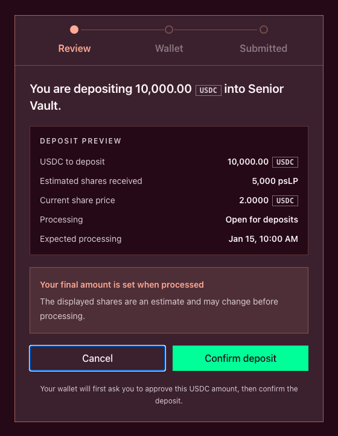

# Deposit liquidity

> **An LP deposit goes through a verified Senior or Junior Vault.**
>
> The trader `Deposit` action funds a Trading Account's Margin Account. It does not provide pool liquidity and does not issue LP shares.

Plether liquidity-provider (LP)[^lp] deposits are queued and processed hourly. Submitting a deposit moves USDC[^usdc] into the selected tranche[^tranche] vault, but it does not immediately put vault shares in your wallet.

Use this guide after deciding which tranche fits your risk tolerance. If you have not made that choice, start with [Choose Senior or Junior](choose-senior-or-junior.md) and [LP risks and safeguards](lp-risks-and-safeguards.md).

### Before you start

For the current Arbitrum Sepolia test environment, prepare:

* A compatible self-custody owner wallet
* Arbitrum Sepolia selected in both the application and wallet
* MockUSDC at the connected **owner-wallet address**
* Arbitrum Sepolia ETH for every required transaction
* Time to monitor the deposit until its shares are ready and moved to your wallet

LP approvals, deposits, cancellations, claims and recovery actions are ordinary owner-wallet transactions. They are not covered by the trader gas-sponsorship flow.

The testnet welcome flow may fund the separate **Trading Account** rather than the owner wallet. MockUSDC held by the Trading Account cannot be approved for an owner-wallet vault deposit. Check the deposit form's **Wallet balance** before continuing.

### 1. Open the LP deposit—not the trader deposit

Open `Vaults`, select **Explore Senior Vault** or **Explore Junior Vault**, then select the `deposit` mode. The action-panel heading should read **Deposit USDC**.

The two deposit systems have different purposes:

| | LP vault deposit | Trader Margin Account deposit |
| --- | --- | --- |
| **Where it starts** | `Vaults` → **Explore Senior Vault** or **Explore Junior Vault** → `deposit` | The Perps or welcome deposit flow |
| **USDC source** | Connected owner wallet | Trading Account balance, with an owner-wallet shortfall transfer when needed |
| **Destination** | Selected tranche-vault queue | Trading Account's Margin Account |
| **What the user receives** | A queued deposit, followed by vault shares after processing | Trading collateral and fee balance |
| **Purpose** | Underwrite pool liabilities | Fund trading collateral and fees |
| **Gas policy** | Owner wallet pays network gas | Eligible Trading Account actions can be sponsored |

Depositing to the Margin Account does not later convert the balance into vault shares. Read [Your Margin Account](../trading-on-plether-perps/your-margin-account.md) if you are unsure which balance you are viewing.

### 2. Confirm the wallet, network and balance

The owner wallet and Plether Trading Account are separate onchain addresses.

Confirm that:

* the connected owner wallet is the address you intend to use;
* the application and wallet are on Arbitrum Sepolia;
* **Wallet balance** covers the deposit amount; and
* the owner wallet has enough ETH for an optional approval and the deposit transaction.

If the owner-wallet MockUSDC balance is too low, obtain or transfer test MockUSDC to that exact address and wait for confirmation before reopening the preview.

### 3. Verify the selected tranche vault

Never rely on the **Senior Vault** or **Junior Vault** label alone. The vault-page header links the abbreviated vault address to the block explorer. Open it and compare the complete address with the active deployment's official contract metadata.

Verify all of the following:

* **Network:** Arbitrum Sepolia for the current test deployment
* **Token:** the official MockUSDC contract for that deployment
* **Selected tranche:** Senior or Junior
* **Vault address:** the official address for that exact tranche
* **Approval spender:** the selected tranche vault

The spender must not be the liquidity pool, Margin Clearinghouse, Trading Account, owner wallet or an address supplied only through an unverified message or link.

Do not make a plain MockUSDC transfer to the liquidity pool or tranche vault. Use the application's deposit flow so `requestDeposit` creates the queue accounting needed for processing, cancellation and share delivery.

### 4. Check deposit availability and timing

Every accepted deposit is queued for an hourly processing time. There is no immediate-deposit path in the current interface.

The vault overview shows:

* **Deposit availability** and the current deposit limit
* **Next processing time**
* A countdown for the current hourly window
* Whether hourly processing is paused
* Whether deposits are past their expected processing time

The contract uses the deposit transaction's block-inclusion timestamp. Inclusion strictly before the five-minute cutoff—more than five minutes before the hour—targets that processing time; inclusion at or after the cutoff targets the following hour. Signing or sending earlier is not enough if confirmation lands after the cutoff, so treat the confirmed deposit record as authoritative.

An available deposit form does not guarantee processing at the displayed time. The protocol rechecks its safety conditions when the queue is processed. A safety pause, stale pricing, Senior impairment, a cap, an unresolved pool shortfall or another live gate can defer activation. **Refund available** is narrower: it means the processed batch's aggregate deposit quote rounded to zero shares and the epoch was rejected.

### 5. Enter the amount and review the deposit

Enter the MockUSDC amount and select **Review deposit**. Keep the amount within the displayed owner-wallet balance, current deposit limit and live minimum.

The amount form shows:

* **Share price**
* **Estimated shares you'll receive**
* **Deposit status**
* **Expected processing**
* **7d realized APY**, when a complete history is available

The review modal shows the USDC to deposit, estimated shares, current share price, processing status and expected processing time. It also warns that the final share amount is set when the deposit is processed.

The estimate is not a locked conversion rate. Tranche accounting and trader outcomes can change before processing. Deposits do not pay the frozen-oracle withdrawal surcharge; if live pricing is unavailable, deposit activation waits until the entry gates clear.



### 6. Confirm the transactions

Select **Confirm deposit** after reviewing the latest values.

If the owner wallet does not already have enough allowance, the guided transaction sequence first asks you to **Approve USDC**. The decoded approval must be equivalent to:

```solidity
MockUSDC.approve(selectedTrancheVault, depositAmount)
```

Check the approval carefully:

| Approval field | Expected value |
| --- | --- |
| **Transaction target** | Official MockUSDC token contract |
| **Function** | `approve(address spender, uint256 amount)` |
| **Spender** | Official selected Senior or Junior Vault |
| **Amount** | Exact MockUSDC deposit amount |
| **Caller** | Connected owner wallet |
| **Network** | Arbitrum Sepolia |

The approval transaction changes allowance only. It does not move USDC or create a deposit. Reject an unlimited allowance, unfamiliar token, wrong vault or network change.

After any required approval confirms, the sequence asks you to confirm **Queue deposit**. This transaction calls the selected vault's funded deposit-request method and moves the USDC into vault escrow.

Keep the flow open until the application reports **Deposit submitted**. Save both transaction hashes when an approval was required.

### 7. Verify the queued deposit

After **Queue deposit** confirms, open **Vaults → Your position** and verify:

* the correct tranche;
* the deposit reference;
* the deposited USDC amount;
* **Expected processing**;
* the estimated shares; and
* the current status.

The initial status is normally **Pending**. Before processing, **Cancel deposit** returns the escrowed USDC to the owner wallet and issues no shares. Use that action only from the matching deposit record and verify its receipt before submitting a replacement.

Do not submit another deposit merely because wallet-held shares are still zero. Queued USDC is not an active wallet share balance.

### 8. Complete the deposit after processing

When LP settlement is enabled, a healthy keeper[^keeper] can submit eligible hourly processing through the permissionless path. The current interface does not expose a user `Finalize epoch` transaction.

The deposit record can move through these states:

| Status | Meaning | Available action |
| --- | --- | --- |
| **Pending** | USDC is queued before its expected processing time | Wait or **Cancel deposit** |
| **Waiting for processing** | The expected time has passed, but neither ready shares nor a refund exists yet | Wait and check processing or protocol status |
| **Shares ready** | Processing created your vault-share allocation | **Move shares to wallet** |
| **Refund available** | The processed batch's aggregate deposit quote rounded to zero shares, so the epoch was rejected and its USDC is recoverable | **Return USDC to wallet** |

When **Shares ready** appears, the shares already participate in vault performance while held by the vault. Select **Move shares to wallet** to complete delivery.

Moving shares into the owner wallet starts or restarts the one-hour withdrawal cooldown for the owner's entire position in that vault. During the cooldown, those wallet-held shares cannot be transferred or used for a withdrawal request.

When **Refund available** appears, select **Return USDC to wallet** and verify that the correct amount returns before attempting another deposit.

### If the result is not what you expected

| Symptom | Most likely explanation | What to do |
| --- | --- | --- |
| Approval confirmed, but the owner-wallet balance did not change | Approval creates allowance only | Return to the review flow and confirm **Queue deposit** |
| USDC moved, but wallet-held shares are zero | The deposit is pending, waiting for processing or has shares ready in vault custody | Open **Your position** and read the matching deposit record |
| No deposit record appears | The queue transaction failed, only approval confirmed or request discovery is refreshing | Check the transaction receipt and retry discovery before submitting again |
| **Waiting for processing** persists | Hourly settlement is paused, delayed or blocked by the keeper path or a live safety gate | Check hourly-processing, backlog, market-price and safety status; do not look for a user finalization action |
| Final shares differ from the preview | The preview was an estimate and processing used the then-current batch accounting and share price | Review the processed allocation rather than the request-time estimate |
| **Refund available** appears | The processed batch's aggregate deposit quote rounded to zero shares and its epoch was rejected | Use **Return USDC to wallet** and verify the recovery transaction |
| Shares are ready but absent from the wallet | The allocation still needs its delivery transaction | Select **Move shares to wallet** and verify the cooldown start |

See [Manage a pending deposit](manage-a-pending-deposit.md) for the complete monitoring lifecycle and [LP troubleshooting](lp-troubleshooting.md) for broader recovery guidance.

### Deposit checklist

Before confirming:

* Confirm the owner wallet—not only the Trading Account—holds the MockUSDC.
* Confirm Arbitrum Sepolia and the official MockUSDC contract.
* Confirm Senior or Junior and understand its loss position.
* Match the complete vault address with official deployment metadata.
* Approve only the exact amount to the selected tranche vault.
* Check the live minimum, deposit limit and expected processing time.
* Have the transaction included onchain before the five-minute cutoff if you need the next hourly window; verify the confirmed request target.
* Treat estimated shares and recent APY as historical or indicative, not guaranteed.
* Distinguish **Approve USDC** from **Queue deposit**.
* Keep native gas for cancellation, share delivery or refund recovery.
* Accept that share value and future withdrawal liquidity can decrease.

[^tranche]: A pool layer with its own loss priority, withdrawal priority and return profile.
[^usdc]: A US dollar-denominated stablecoin Plether uses for margin and settlement; the current testnet uses MockUSDC with no claim on real dollars.
[^lp]: Liquidity provider, a participant that supplies USDC capital to the liquidity pool.
[^keeper]: An enabled service that can submit eligible protocol-maintenance transactions, including hourly vault processing, through the permissionless settlement path.
