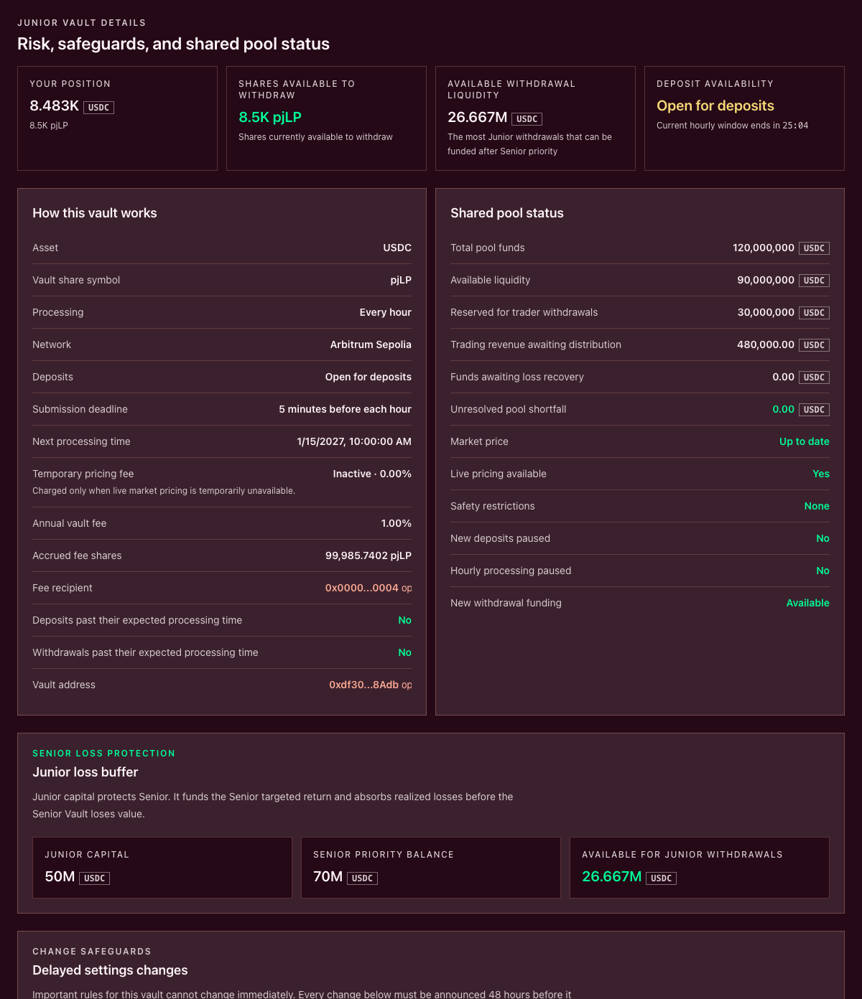

# LP risks and safeguards

> **LP return is compensation for underwriting trader liabilities. It is not risk-free yield.**
>
> Senior and Junior shares can lose value. A positive share balance may not be immediately withdrawable, and either tranche can be completely wiped out.

Plether uses solvency checks, a Senior–Junior waterfall, conservative accounting, protected liquidity and hourly request processing to limit specific risks. These controls change when and how losses or delays can occur. They do not guarantee principal, return, liquidity, processing time or correct protocol operation.

> **Testnet, wallet and gas**
>
> The current test configuration targets Arbitrum Sepolia and uses the connected owner wallet. LP approvals, deposits, withdrawals, cancellations, claims and refunds are ordinary wallet transactions. They are not Plether Trading Account-sponsored actions and require Arbitrum Sepolia ETH for gas.

### Start with the economic risk

The liquidity pool is the USDC[^usdc] balance sheet behind Plether Perps[^perps]. LP[^lp] capital can be used to pay profitable traders, fund VPI[^vpi] rebates and absorb bad debt. Collectible marked or collected trader losses, collected carry[^carry], positive VPI, paid frozen-close spread, the LP remainder of a collected liquidation charge and temporary withdrawal pricing fees can add accounting or physical value to the pool or a tranche.

This creates a direct tradeoff:

* More reconciled LP-owned value can increase tranche value.
* Trader profits, rebates, shortfalls and other pool losses can decrease tranche value.
* Senior and Junior take those changes in a different order, but neither tranche is protected from every loss.
* Accounting value can remain positive while cash is unavailable to fund a withdrawal request.

Read [The liquidity pool and tranche waterfall](../how-plether-works/the-liquidity-pool-and-tranche-waterfall.md) for the canonical accounting model.

### Safeguards are controls, not guarantees

| Safeguard | What it is designed to do | What it does not guarantee |
| --- | --- | --- |
| **Fixed `0.00–2.00` settlement range** | Makes the maximum modeled directional payout of the Plether index calculable | That component FX prices are bounded, or that non-directional losses and failures are bounded |
| **Entry solvency check** | Rejects new trader exposure when effective backing would not cover the resulting maximum modeled liability plus the configured liability-scaled settlement buffer | That LP principal cannot decline, bad debt is impossible or every obligation is immediately payable |
| **Physical-asset accounting** | Uses conservative pool assets and keeps unassigned transfers outside ordinary tranche value until reconciliation | That USDC remains worth one dollar or that token, chain and contract failures cannot occur |
| **Terminal NAV reconciliation** | Uses one exact signed snapshot: marked gains reduce LP NAV and collectible marked losses can raise it only up to collateral and claim caps | That accounting NAV is physical withdrawal cash or an exact future receipt |
| **Junior first-loss position** | Makes Junior absorb pool losses before Senior | Principal protection for Senior or a limit on Junior loss |
| **Senior restoration priority** | Routes future reconciled LP-owned value toward an impaired Senior tranche before new residual value reaches Junior | That Senior will be restored or when restoration will occur |
| **Protected liquidity** | Keeps cash reserved for trader withdrawals and other protected payments inside the liquidity pool | Immediate or unconditional LP withdrawals |
| **Hourly request processing** | Prices deposits and funds withdrawals at controlled hourly boundaries | A fixed request-time conversion, exact processing at the displayed time or sufficient cash for every withdrawal |
| **Cancellation and recovery actions** | Let users use ordinary UI cancellation before processing or recover refundable USDC or zero-value share remainders | Ordinary cancellation after the processing boundary or automatic movement of ready assets into the owner wallet; the contract retains narrow mature-deposit escape paths for a rejected epoch, projected terminal wipe, Senior impairment or invalid Senior reservation |
| **Temporary withdrawal pricing fee** | Retains value inside the selected tranche when an eligible withdrawal is funded without live pricing | Full compensation for external FX moves or action availability after accepted data becomes too old |
| **Pause and safety controls** | Block new deposits or hourly settlement when the current state is unsafe | A loss-free recovery or uninterrupted access to capital |
| **Non-upgradeable perps logic and 48-hour settings delays** | Limit in-place code replacement and provide notice before displayed risk, fee, trading and pricing settings change | Correct code, safe governance decisions or immutability of every external dependency |

The fixed settlement range and solvency check are admission controls. If an admitted market liability is realized, LP capital is still expected to pay traders.

### Principal-loss risk differs by tranche

Senior and Junior are tranche[^tranche] claims on the same liquidity pool, not isolated pools.

| | Senior Vault | Junior Vault |
| --- | --- | --- |
| **Loss position** | Absorbs losses after Junior is exhausted | Absorbs losses first |
| **Return position** | Receives a targeted return funded from available Junior value | Receives residual reconciled LP-owned value after Senior priority |
| **Withdrawal position** | Funded before Junior | Funded only after Senior priority |
| **Annual maintenance fee** | None; the current vault card shows **Zero fees** | Pays the live **Annual vault fee** through newly issued pjLP shares |
| **Severe outcome** | Can be impaired or completely wiped out | Can lose value or be completely wiped out before Senior loses value |

The Senior targeted return is an allocation from Junior value. It is not external yield, a guaranteed APY[^apy] or a debt claim against future revenue. If Junior cannot fund the target, the unpaid portion does not become an accumulating amount owed to Senior.

Junior receives residual upside because it funds the Senior target and bears first loss. Its annual maintenance fee creates additional dilution: newly issued fee shares increase effective supply and reduce each existing holder's proportional claim. Read the live **Annual vault fee**, **Accrued fee shares** and **Fee recipient** rather than assuming the fee is zero or paid as a separate USDC charge.

A wiped tranche cannot be silently revived by an ordinary deposit. Recovery requires reconciled LP-owned value allocated through the waterfall or an explicit recapitalization path. A marked receivable can affect NAV but does not become withdrawal cash until collected.

Use [Choose Senior or Junior](choose-senior-or-junior.md) to compare the two risk positions before depositing.

### Hourly requests introduce timing and pricing risk

Every deposit and withdrawal is a queued request. Requests become eligible at an assigned hourly boundary. The contract assigns that boundary from the request transaction's block-inclusion timestamp, so inclusion at or after the five-minute cutoff targets the following hour even if the transaction was signed or sent earlier. Treat the confirmed request record as authoritative.

The displayed **Expected processing** time is not a guarantee. Processing can wait because of:

* a governance **Hourly processing paused** state;
* a stale or unavailable market price;
* an unknown dependency or runtime safety restriction;
* an unresolved pool shortfall or Senior impairment affecting deposits;
* insufficient available USDC for a withdrawal; or
* keeper, RPC or chain disruption.

When LP settlement is enabled, a healthy keeper handles eligible processing through the permissionless path; the current interface exposes no user settlement transaction. A disabled or unavailable keeper is therefore another delay risk. If a request changes to **Waiting for processing** or **Waiting for USDC**, submitting a duplicate does not advance the original request and can create another commitment.

The ordinary interface cancellation is available only before the request reaches its processing boundary. A delayed request can therefore be non-cancellable in the UI even though shares or USDC are not yet ready. At contract level, a mature deposit also has narrow escape paths when its epoch was rejected, processing would create a terminal wipe, Senior is impaired or the Senior reservation is invalid.

### Deposit-request risks

Submitting a deposit moves USDC out of the owner wallet and into vault custody. It does not immediately deliver wallet-held shares.

| Status | Risk and user action |
| --- | --- |
| **Pending** | The USDC is held for hourly processing. The share amount is still an estimate. **Cancel deposit** is available before the processing boundary. |
| **Waiting for processing** | The expected time passed without processing. The request is not a wallet-held share position, and cancellation is no longer offered. |
| **Shares ready** | The processed shares already participate in vault performance but remain in vault custody until **Move shares to wallet** confirms. |
| **Refund available** | The processed batch's aggregate deposit quote rounded to zero shares, so the epoch was rejected. The user must select **Return USDC to wallet** to recover the refundable assets. |

The final shares can differ from **Estimated shares** because the share price and applicable pricing conditions can change before processing. Approval confirmation alone is not a deposit request; **Queue deposit** must also confirm.

Moving ready shares into the wallet starts or restarts a one-hour withdrawal cooldown for the wallet's entire position in that tranche.

### Withdrawal-request risks

The **Withdraw USDC** form accepts a desired USDC amount, but the queued object is the refreshed **Estimated shares used** quote. The request does not lock in the displayed USDC value.

| Status | Risk and user action |
| --- | --- |
| **Pending** | The shares remain exposed to gains and losses while waiting. **Cancel withdrawal** is available before the processing boundary. |
| **Waiting for USDC** | The expected processing epoch has arrived or passed, but no USDC has been allocated. A pause, pricing, health, liquidity or Senior-priority gate may still block funding. |
| **USDC ready** | Some USDC has been allocated but still requires **Move USDC to wallet**. A share remainder may also be ready to return. |
| **Shares ready to return** | A remaining share amount quoted to zero assets and entered terminal refund state. **Return shares to wallet** can coexist with claimable USDC after partial funding. |

The final USDC can be higher or lower than the request-time estimate because queued shares continue changing in value until processing. The request locks the refreshed share quote; if the temporary pricing fee or share price changes afterward, the fixed shares yield a different USDC amount rather than the vault pulling more shares.

Canceling a withdrawal or returning a zero-value share remainder moves shares back into the wallet and restarts the one-hour cooldown for the entire tranche position. An ordinary insufficient-liquidity remainder remains queued.

There is no guaranteed date on which a waiting withdrawal, including a Junior request behind Senior priority, will receive enough USDC.

### Cooldown and transfer risk

The vault's share-delivery, withdrawal-cancellation and zero-value-remainder return actions start or restart a one-hour cooldown for that wallet's entire position in the same tranche. An ordinary wallet-to-wallet transfer can occur only after the sender cooldown and propagates the sender's timestamp rather than starting a fresh hour. Until the live **Available in** countdown ends, those shares cannot be transferred or used for another withdrawal request.

The current flow explicitly warns about the cooldown when the user:

* selects **Move shares to wallet** after a deposit;
* selects **Cancel withdrawal**; or
* selects **Return shares to wallet** for a zero-value withdrawal remainder.

The cooldown is a holder-level restriction, not an accounting loss. **Current value** can continue moving while **Shares available to withdraw** is zero.

### Share value is not withdrawal liquidity

An ERC-4626[^erc4626] share represents a proportional claim on one tranche's accounting value. It is not an unconditional claim on the same fraction of the liquidity pool's raw USDC balance.

Before LP cash can be allocated, Plether protects value for:

* maximum bounded trader liability and its configured liability-scaled settlement buffer;
* outstanding trader claims;
* USDC already reserved for trader withdrawals and other protected payments; and
* unassigned assets and explicit protocol reserves.

Trader claims rank ahead of both LP tranches. After those obligations determine **Available liquidity**, Senior withdrawal requests are funded before Junior.

Read these current labels as distinct measurements:

* **Total pool funds** — canonical physically backed pool depth: the smaller of raw pool assets and accounted assets, excluding quarantined excess; it is not an LP withdrawal limit.
* **Reserved funds** or **Reserved for trader withdrawals** — protected amounts that are not free LP cash.
* **Available liquidity** — pool cash after protected amounts.
* **Current vault value** — accounting value of the selected tranche.
* **Shares available to withdraw** — wallet shares currently eligible for a request after the holder cooldown and request limit.
* **Available withdrawal liquidity** — estimated pool-level funding capacity for the tranche, after priority.
* **USDC ready for wallet** — already allocated withdrawal proceeds still waiting for a wallet transaction.

Read [Settlement liquidity and trader claims](../how-plether-works/settlement-liquidity-and-trader-claims.md) for why a protocol can remain modeled as solvent while withdrawal funding is temporarily unavailable.

### Accounting and performance can move at different times

Plether uses one exact signed, collateral-capped Terminal NAV snapshot for entry and exit accounting:

* Marked trader gains reduce distributable LP value because they are potential pool liabilities.
* Marked trader losses can increase LP value only up to the collectible amount backed by pledged collateral and eligible same-account claims.
* That positive marked receivable is not physical pool cash and does not increase free withdrawal liquidity until collected.

This keeps accounting share value distinct from the cash that can safely leave now.

A deposit estimate, current share price, position value, withdrawal share quote and final withdrawal receipt answer different questions. They should not be expected to remain equal or move together. ERC-4626 rounding, virtual-share protections and Junior fee-share issuance also affect exact conversions.

When complete deployment-matched history exists, the interface shows **7d realized APY**, **7d return**, **Start share price** and **Current share price**. Realized APY annualizes the actual seven-day share-price change. It can be negative and is not a forecast. If the app omits **Performance**, do not interpret missing history as zero return.

Read [Understand LP returns and share value](understand-lp-returns-and-share-value.md) before treating any displayed performance figure as an expected rate.

### Directional and model risk remain with LPs

LPs do not select LONG USD or SHORT USD, but the liquidity pool takes the economic other side of aggregate trader exposure.

* A LONG USD-heavy market creates greater pool liability when the dollar index strengthens.
* A SHORT USD-heavy market creates greater pool liability when the index weakens.
* A more balanced market can still owe profitable traders on either side.

Plether admits new exposure only when effective backing covers the resulting maximum modeled directional liability plus the configured liability-scaled settlement buffer. That check depends on correct code, accounting, oracle data and model assumptions. It does not prevent LP capital from being paid out when an admitted liability is realized.

The index is DXY-inspired, uses a weighted arithmetic basket with fixed reference coefficients and clamps settlement to `0.00–2.00`. Effective currency weights can drift. External FX behavior, trader concentration and liquidation incentives can therefore produce outcomes that differ from a simple historical-return assumption.

### Oracle and market-state risk

Plether relies on Pyth[^pyth] data for every basket component. Freshness, confidence and timestamp-alignment rules reject some unsafe observations, but they cannot eliminate incorrect data, feed compromise, publication outages or integration defects.

The current Vaults behavior distinguishes these conditions:

* A scheduled close-only period with live pricing does not, by itself, activate the **Temporary pricing fee**.
* When live pricing is unavailable and the protocol is in its frozen state, new deposits are unavailable.
* A withdrawal can still be queued while frozen. Its current quote can require more shares because of the selected tranche's temporary pricing fee. Once queued, that share amount is fixed; later fee or price changes affect final USDC. The interface recommends waiting for live pricing when possible.
* Previously queued work can wait if no acceptable mark or safe execution path is available.
* The extended frozen-data window is finite. Once data is too old for the active policy, pricing-dependent processing can stop.

The temporary pricing fee remains inside the affected tranche. It is not protocol-treasury revenue, and it does not guarantee that the retained value covers the next external FX move.

See [Market states and oracle closures](../how-plether-works/market-states-and-oracle-closures.md) for the full calendar and oracle policy.

### Pause, safety and backlog risk

Do not treat every warning as the same kind of pause:

| Displayed state | Current effect |
| --- | --- |
| **New deposits paused** | New deposit requests are blocked. A withdrawal request can still be submitted unless a separate limit applies. |
| **Safety restrictions: Active** | Deposits are blocked. The interface can still accept withdrawal requests, but no new withdrawal USDC is allocated until effective solvency recovers and the protocol owner explicitly clears degraded mode. Already-funded actions remain usable. |
| **Hourly processing paused** | New requests can still be submitted when other limits permit; pre-boundary cancellations and already-ready move, claim or return actions remain available. Deposits do not begin earning and withdrawals receive no new funding until processing resumes. |
| **New withdrawal funding: Waiting** | Withdrawal requests can remain pending even if their expected processing time has passed. |
| **Deposits past their expected processing time: Yes** | At least one deposit backlog exists. Review request status and do not duplicate it. |
| **Withdrawals past their expected processing time: Yes** | At least one withdrawal backlog exists. Junior can wait longer because Senior is funded first. |
| **Unresolved pool shortfall** | Pool accounting has a remaining deficit; new deposits are blocked and recovery rules apply. |

An emergency deposit pause is therefore not proof that withdrawals are disabled, while an enabled withdrawal form is not proof that funding will be immediate.

### Technical, operational and external risks

| Risk | Possible LP impact | What to verify or monitor |
| --- | --- | --- |
| **Smart contract** | Incorrect accounting, lost funds, blocked actions or permanent disruption | Exact source commit, deployed bytecode, contract addresses and current security disclosures |
| **Immutability** | A defect in non-upgradeable perps logic can require a new deployment and migration | Whether the deployment and review scope cover the code actually in use |
| **Testnet** | Unproven operational and economic behavior | Treat MockUSDC and testnet results as testing only, not evidence of mainnet safety |
| **Governance and pause** | Changed terms, blocked deposits or delayed hourly processing | **Delayed settings changes**, emergency state and admin addresses |
| **Keeper** | Delayed hourly request processing, including when the LP settlement worker is disabled or unavailable | **Next processing time**, backlog indicators and the exact request status; the UI exposes no user finalization action |
| **Chain and RPC** | Delayed, reordered or unavailable transactions | Correct network, confirmed receipts and an independent block explorer |
| **USDC** | Depeg, issuer freeze, token upgrade or transfer disruption | Exact token contract and collateral status; MockUSDC has no claim on real dollars |
| **Wallet and approval** | Unauthorized token use or an unrecoverable transaction | Owner wallet, selected vault, exact spender, allowance, transaction call and network before signing |
| **Interface and history services** | Missing onchain metrics or previews, pending-request discovery, holders, activity or performance | `Unavailable` and `--` apply to affected onchain metrics or previews and are not zero; incomplete Performance is omitted, while Activity uses explicit empty/error text; use receipts and onchain state as authoritative |

Holder distribution and recent activity depend on block-explorer indexing. Pending-request discovery checks current and nearby request IDs plus older activity found through local history and explorer logs. If **Older activity is unavailable** appears, the app still checks recent pending work; use **Retry history** and verify receipts before concluding that a request is gone.

### What to review before depositing

At minimum, check:

* The official deployment, connected owner wallet, network and selected Senior or Junior Vault address.
* **Current vault value**, **Share price** and the tranche's loss and return position.
* Senior **Protected balance** or the **Junior loss buffer**.
* Junior **Annual vault fee**, **Accrued fee shares** and **Fee recipient**, when selecting Junior.
* Senior capacity and the amount reserved for pending deposits, when selecting Senior.
* **Total pool funds**, **Reserved funds**, **Available liquidity** and **Available withdrawal liquidity**.
* **Unresolved pool shortfall**, **Market price**, **Live pricing available** and the **Temporary pricing fee**.
* **New deposits paused**, **Safety restrictions**, **Hourly processing paused** and **New withdrawal funding**.
* Deposit and withdrawal backlog indicators.
* The five-minute **Submission deadline** and **Next processing time**.
* The cancellation boundary and the separate **Move shares to wallet**, **Move USDC to wallet**, **Return USDC to wallet** and **Return shares to wallet** actions.
* The one-hour cooldown and its live countdown.
* The exact owner-wallet transactions and native gas required to manage and eventually exit the position.

No single metric, including **7d realized APY**, **Current vault value** or **Available liquidity**, summarizes all of these risks.

### Decide whether the position is suitable

Do not provide liquidity if you require:

* guaranteed principal or yield;
* a guaranteed processing or withdrawal date;
* a position whose value cannot depend on trader performance;
* a request that can always be cancelled;
* a fixed request-time deposit or withdrawal conversion; or
* protocol actions that are always gas-sponsored.

If these risks are acceptable, continue with [Deposit liquidity](deposit-liquidity.md) and verify every address, amount, preview and request state before signing.

For the broader protocol risk model, read [Risks you should understand first](../welcome/risks-you-should-understand-first.md).

[^usdc]: A US dollar-denominated stablecoin Plether uses for margin and settlement.
[^perps]: Perpetual contracts, derivatives with no scheduled expiry.
[^lp]: Liquidity provider, a participant that supplies USDC capital to the liquidity pool.
[^vpi]: Virtual Price Impact, a separate USDC charge or rebate based on how a trade changes pool directional imbalance.
[^carry]: The time-based cost charged on the portion of a position financed by LP capital.
[^nav]: Net asset value, the accounting value of a pool or tranche after assets and liabilities.
[^apy]: Annual percentage yield, an annualized return measure that includes compounding.
[^erc4626]: The Ethereum tokenized-vault standard used for Plether tranche shares.
[^tranche]: A pool layer with its own loss priority, withdrawal priority and return profile.
[^pyth]: The oracle network that supplies Plether's external FX price feeds.
