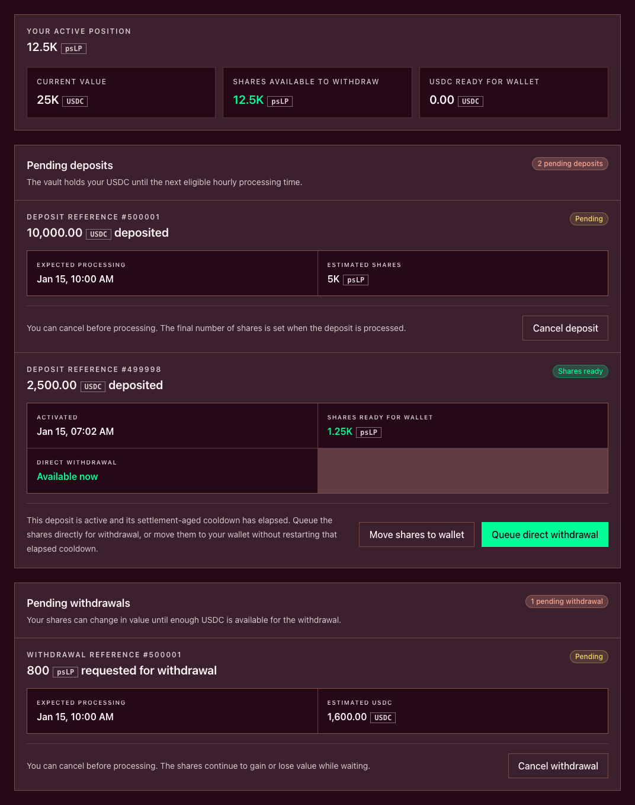

# Manage a pending deposit

Every accepted Plether liquidity-provider (LP)[^lp] deposit is queued for hourly processing. The request moves USDC[^usdc] into the selected Senior or Junior tranche[^tranche] vault, but it does not immediately put vault shares in the owner wallet.

The normal lifecycle is:

```text
Queue deposit → Pending → Eligible hourly settlement and cooldown start → Shares ready → Move shares to wallet or Queue direct withdrawal after cooldown
```

Two recovery outcomes are also possible:

```text
Pending → Cancel deposit → USDC returned
Aggregate deposit quote rounds to zero → Epoch rejected → Refund available → Return USDC to wallet
```

There is no user-facing `Finalize epoch` step. The settlement path is permissionless, and an enabled, healthy keeper[^keeper] can submit eligible hourly processing.



### Understand hourly processing

Deposits are grouped by expected hourly processing time. The Vaults overview shows the next processing countdown, and each queued record shows its own **Expected processing** value.

The contract uses the deposit transaction's block-inclusion timestamp. Inclusion strictly before the five-minute cutoff—more than five minutes before the hour—targets that processing time; inclusion at or after the cutoff targets the following hour. Signing or sending earlier is not enough if confirmation lands after the cutoff, so treat the confirmed deposit record as authoritative.

The displayed time is an expectation, not a guaranteed completion time. Processing can wait when hourly settlement is paused or when the protocol cannot safely reconcile the pool. Do not submit a duplicate merely because the expected time has passed.

### Read the lifecycle correctly

| Status | Where the value is | What it means | Available action |
| --- | --- | --- | --- |
| **Pending** | USDC in vault escrow | The expected processing time has not passed | Wait or **Cancel deposit** |
| **Waiting for processing** | USDC in vault escrow | The expected time passed, but neither ready shares nor a refund exists yet | Wait and check live protocol status |
| **Shares ready** | Processed shares held by the vault for you | The deposit is active, participates in vault performance and has an activation-aged cooldown | **Move shares to wallet**, or **Queue direct withdrawal** after cooldown when shown |
| **Refund available** | Recoverable USDC held by the vault | The processed batch's aggregate deposit quote rounded to zero shares, so the epoch was rejected | **Return USDC to wallet** |

Pending USDC is not part of the active share balance. Once **Shares ready** appears, the allocation is active even though the shares have not yet been moved into the wallet.

### 1. Verify the submitted request

After the transaction flow reports **Deposit submitted**, select **View activity** or open **Vaults → Your position**.

Match the record to the transaction using:

* the selected Senior or Junior Vault;
* **Deposit reference**;
* deposited USDC amount;
* **Expected processing**; and
* estimated shares.

The request transaction—not an allowance approval—is proof that the deposit entered the queue. If an approval confirmed but no record appears, check whether the separate **Queue deposit** transaction was submitted and confirmed.

Record the transaction hash and deposit reference before closing the application.

### 2. Use the cancellation window

While the record is **Pending**, the interface can offer **Cancel deposit**.

A successful cancellation:

* removes the pending request;
* returns the escrowed USDC to the owner wallet; and
* creates no vault shares.

Open the cancellation modal, verify the deposit reference and **USDC returned**, then confirm **Cancel deposit** in the owner wallet.

Once the expected processing time has passed and the record changes to **Waiting for processing**, ordinary cancellation is no longer offered. A processing delay does not reopen the earlier cancellation action.

Do not submit repeated cancellation or deposit transactions while the first transaction's result is unknown.

### 3. Wait for eligible settlement

When LP settlement is enabled, a healthy keeper monitors eligible hourly work and submits the protocol-maintenance transaction. The current interface does not let users finalize the batch themselves. If the keeper path is disabled or unavailable, the request can remain waiting beyond its expected time.

When processing succeeds, the protocol:

1. reconciles liquidity pool and tranche accounting;
2. determines the batch share conversion;
3. moves the accepted USDC into the liquidity pool; and
4. creates the depositor's share allocation in vault custody.

Depositors processed together use the same batch accounting. The final share amount can differ from the request estimate because the tranche share price and pool economics can change before processing.

Before processing completes:

* you do not hold wallet shares;
* the estimate is not a locked conversion rate; and
* the queued USDC is not available for trading or wallet withdrawal.

### If processing is late

**Waiting for processing** means the expected time passed without a completed allocation or refund.

Check:

* whether **Hourly processing paused** is shown;
* whether deposits are past their expected processing time;
* market-price freshness and live-pricing availability;
* active safety restrictions or an unresolved pool shortfall; and
* the request transaction and latest onchain state.

A delayed record does not imply that the deposit was lost, cancelled or ready to claim. It also does not create a user **Finalize** action. Wait for eligible settlement or for the interface to expose a terminal shares/refund state.

### 4. Move ready shares or queue a direct withdrawal

When processing succeeds, the record changes to **Shares ready** and shows **Shares ready for wallet**.

The processed shares already participate in vault performance while held in vault custody. To complete delivery:

1. Open the matching record under **Vaults → Your position**.
2. Verify the deposit reference and share quantity.
3. Select **Move shares to wallet**.
4. Review the modal and confirm **Move shares**.
5. Wait for the transaction to confirm.
6. Verify the wallet-held `psLP` or `pjLP` balance and updated position value.

The one-hour withdrawal cooldown began when processing activated this deposit. Moving shares into the wallet preserves that activation timestamp and cannot replace a newer wallet timestamp with an older one. Until the wallet countdown ends, wallet-held shares cannot be transferred or used for a withdrawal request.

If the record shows **Queue direct withdrawal**, the source deposit's cooldown has elapsed. Confirming it moves shares from that one claimable deposit directly into the current withdrawal queue, with the same controller, without first transferring shares to the wallet or approving the vault. Each transaction acts on one source deposit record.

The delivery transaction does not create a separate interest payment. Senior targeted return, pool revenue and losses are reflected through the value of the vault shares.

### 5. Recover a refundable deposit

If the processed batch's aggregate deposit quote rounds to zero shares, the contract rejects that epoch. The status changes to **Refund available** and the record shows **USDC ready to return**. Pause, stale pricing, impairment, caps and shortfalls ordinarily defer activation or enable an exceptional mature cancellation rather than creating this refund state.

To recover it:

1. Open the matching record.
2. Verify the deposit reference and refundable USDC amount.
3. Select **Return USDC to wallet**.
4. Review the modal and confirm **Return USDC**.
5. Verify the transaction receipt and owner-wallet balance.

A refund creates no vault shares. Do not submit a replacement deposit until the return transaction is confirmed and the old record no longer exposes a refundable balance.

### Price and ordering risk

Queueing commits USDC before the exact share amount is known. The final result can change because:

* tranche accounting changes before processing;
* trader outcomes alter the value reconciled into the waterfall;
* Senior targeted-return or recovery state changes.

Transaction ordering remains relevant. Events included before the keeper's processing transaction can affect the batch price; later events are not part of that checkpoint.

There is no request-time lock on share price or share quantity.

### Oracle and protocol state

A scheduled close-only period does not itself stop deposit processing. Oracle-frozen operation does: new deposit requests are unavailable and previously queued deposits wait until live pricing and the other entry gates clear. Deposits do not pay the frozen-oracle withdrawal surcharge.

If the keeper path, pricing or another required dependency is unavailable, settlement can wait. Hourly processing may also be paused independently of new deposit submission. The Vaults page distinguishes:

* **New deposits paused** — new requests are unavailable;
* **Hourly processing paused** — queued work does not receive new processing; and
* **Deposits past their expected processing time** — matured work remains outstanding.

Use [Market states and oracle closures](../how-plether-works/market-states-and-oracle-closures.md#what-closures-mean-for-lps) for the broader pricing rules.

### Troubleshoot by status

| What you see | Likely meaning | What to do |
| --- | --- | --- |
| Approval confirmed, but no deposit record appears | Only the allowance changed | Confirm whether **Queue deposit** was submitted before retrying |
| USDC left the wallet, but shares are zero | The request is pending or waiting for processing | Match the deposit reference and expected processing time |
| **Cancel deposit** is unavailable | The record is no longer in its cancellable pending stage | Read its current status; do not submit repeated cancellations |
| **Waiting for processing** persists | Settlement is paused, delayed or blocked | Check processing, backlog, pricing and safety status; do not look for a user finalization control |
| Final shares differ from the estimate | Processing used current batch accounting and share price | Review the processed allocation rather than the request-time estimate |
| **Shares ready** but wallet balance is unchanged | Shares remain in vault custody | Select **Move shares to wallet** and verify its receipt |
| **Refund available** | The processed batch's aggregate deposit quote rounded to zero shares and the epoch was rejected | Select **Return USDC to wallet** and verify the refund |
| A pending amount is absent from position value | Queued USDC is not an active wallet-share position | Keep it separate until shares are ready or a refund is available |

### Before you stop monitoring

Confirm one terminal owner outcome:

* **Cancelled:** escrowed USDC returned and no shares were created.
* **Delivered:** ready shares were moved into the owner wallet.
* **Directly queued:** ready shares entered a withdrawal request after their source cooldown without passing through the wallet.
* **Refunded:** recoverable USDC was returned after processing could not complete the deposit.

**Deposit submitted**, an expected processing timestamp or **Shares ready** alone does not mean every owner action is complete.

For how the resulting position gains or loses value, continue to [Understand LP returns and share value](understand-lp-returns-and-share-value.md). For the complete accounting model, see [The liquidity pool and tranche waterfall](../how-plether-works/the-liquidity-pool-and-tranche-waterfall.md).

[^lp]: Liquidity provider, a participant that supplies USDC capital to the liquidity pool.
[^usdc]: A US dollar-denominated stablecoin Plether uses for margin and settlement.
[^tranche]: A pool layer with its own loss priority, withdrawal priority and return profile.
[^keeper]: An enabled service that can submit eligible protocol-maintenance transactions, including hourly vault processing, through the permissionless settlement path.
