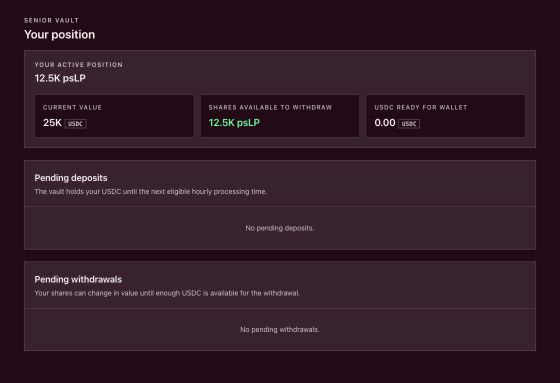
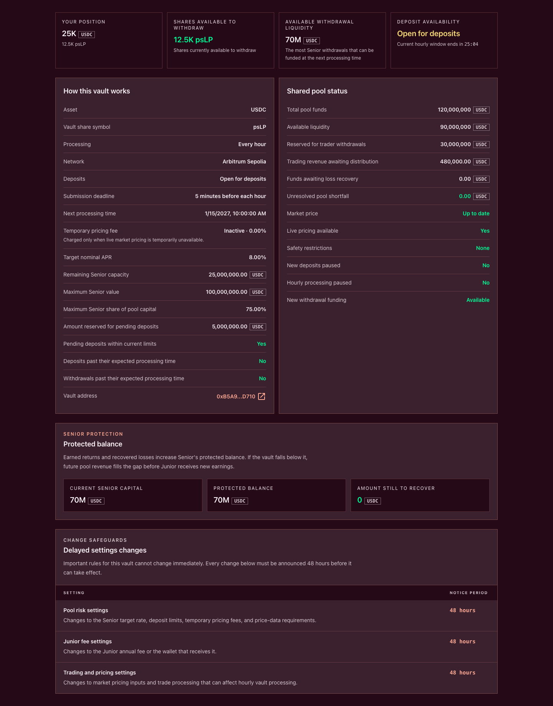

# Read your LP position and pool health

An LP[^lp] position is a balance of Senior or Junior vault shares. Those shares record a proportional claim on one tranche[^tranche] of the liquidity pool. They are not a fixed USDC[^usdc] balance, and a positive position value does not guarantee that the same amount can be withdrawn immediately.

Read the page as three separate questions:

1. **What is my tranche claim worth?** Read your share balance, **Share price** and **Current value**.
2. **How many shares can I use for a withdrawal request?** Read **Shares available to withdraw** and its cooldown countdown.
3. **How much pool cash may fund withdrawals?** Read **Available withdrawal liquidity**, **Available liquidity**, Senior priority and the current processing state.

These values can differ substantially without any of them being an interface error.

> **Wallet and network scope**
>
> The current `Vaults` interface runs on Arbitrum Sepolia. It reads the connected owner wallet, not the separate Plether Trading Account used by the Perps page. LP approvals, requests, cancellations and wallet transfers are ordinary owner-wallet transactions and require Arbitrum Sepolia ETH for gas.

### Know your way around the Vaults interface

The top-level `Vaults` page shows the shared pool summary and a card for each tranche. Select **Explore Senior Vault** or **Explore Junior Vault** to open its detail page.

The detail page uses this navigation:

* **Overview** — your high-level position, vault rules, shared pool status, tranche protection and delayed settings changes.
* **Performance** — seven days of complete historical share-price data, when that history is available.
* **Your position** — wallet-held shares plus pending deposit and withdrawal requests.
* **Activity** — wallet-held share distribution and recent deposit and withdrawal submissions.

**Performance** is conditional. If the app cannot verify a complete seven-day history for the active deployment, it omits the section rather than presenting partial history as a valid return.



### Start with the selected tranche

Senior and Junior are separate ERC-4626[^erc4626] vaults with separate share supplies, share prices, return profiles, fees, request limits and withdrawal priority.

| | Senior | Junior |
| --- | --- | --- |
| **Return profile** | Targeted return funded from available Junior value | Residual return from the liquidity pool |
| **Loss order** | Absorbs losses after Junior reaches zero | Absorbs losses first |
| **Revenue order** | Restored toward its protected balance before Junior receives new residual revenue | Receives residual revenue after Senior priority |
| **Withdrawal priority** | Funded before Junior | Funded after Senior |
| **Annual maintenance fee** | None; the current card shows **Zero fees** | The live **Annual vault fee** is paid by issuing new pjLP shares, which dilutes existing holders |

Always confirm the vault name, share symbol and linked vault address before acting. psLP and pjLP are not interchangeable, even though both tranches supply the same liquidity pool.

### Read the headline values

The selected vault header separates accounting value, historical performance and estimated liquidity:

| Label | How to read it |
| --- | --- |
| **Current vault value** | Current accounting value assigned to the selected tranche. It is not cumulative deposits and is not a promise of immediate redemption. |
| **7d realized APY** | Annualized historical return derived from the actual seven-day share-price change. It appears only with complete history and is not a forecast. |
| **Share price** | Current accounting value of one psLP or pjLP share. |
| **Estimated withdrawal liquidity** | Pool-level USDC that may be available to fund the selected tranche, with Senior funded first. It is not your wallet's guaranteed receipt. |
| **How returns work** | A summary of the tranche's targeted or residual return model. |

On **Overview**, the first four metrics answer more personal and operational questions:

| Label | How to read it |
| --- | --- |
| **Your position** | Estimated current USDC value of the connected wallet's active shares. |
| **Shares available to withdraw** | Shares the wallet can currently place into a withdrawal request. During cooldown, the live **Available in** countdown explains why this can be zero. |
| **Available withdrawal liquidity** | Pool-level funding capacity for the selected tranche at the next processing time. Junior is shown after Senior priority. |
| **Deposit availability** | Whether new deposit requests are open, together with the current hourly-window countdown. |

In **Your position**, the app also shows **Your active position**, **Current value**, **Shares available to withdraw** and **USDC ready for wallet**. The last value is USDC already allocated to processed withdrawal requests but not yet moved into the owner wallet.

### Read shares, share price and current value

Conceptually:

```text
Tranche share price
= tranche accounting value ÷ effective tranche share supply
```

```text
Current value
≈ wallet-held shares × current tranche share price
```

The exact conversion follows ERC-4626 rounding and the protocol's virtual-share and fee-share accounting. Use the live interface and onchain preview for a transaction.

LP economics appear through value per share. There is no periodic interest payment that must be harvested.

Senior share value can change through:

* targeted return transferred from Junior;
* restoration toward the Senior protected balance;
* losses that reach Senior after Junior is exhausted; and
* temporary withdrawal pricing fees retained by the tranche.

Junior share value can change through:

* collectible marked trader losses, collected trader losses, collected carry, positive VPI[^vpi], paid frozen-close spread, the LP remainder of collected liquidation charges and other LP-owned value;
* the Senior targeted return paid from Junior value;
* first-loss absorption;
* temporary withdrawal pricing fees retained by the tranche; and
* dilution from the Junior annual maintenance fee, which is paid by issuing new pjLP shares.

Trader profits, rebates, liquidation shortfalls and bad debt can reduce LP value. Protocol execution fees and keeper rewards are not direct LP yield.

Plether uses one exact signed, collateral-capped Terminal NAV snapshot for entry and exit accounting:

* marked trader profits reduce distributable LP value as liabilities;
* marked trader losses can increase LP value only up to the collectible amount backed by pledged collateral and eligible same-account claims;
* that marked receivable is not physical withdrawal cash until collected; and
* trader claims rank ahead of both LP tranches.

A share price can therefore fall. A historical increase, a targeted Senior return or a displayed APY[^apy] does not guarantee future performance.

For the complete allocation rules, see [The liquidity pool and tranche waterfall](../how-plether-works/the-liquidity-pool-and-tranche-waterfall.md#the-waterfall) and [Trading costs: fees, carry and VPI](../how-plether-works/trading-costs-fees-carry-and-vpi.md#what-lps-receive).

### Current value is not immediately withdrawable USDC

All withdrawals use the hourly request flow. The **Withdraw USDC** form accepts a desired USDC amount, refreshes an **Estimated shares used** quote, and queues those shares. It does not exchange the shares for a fixed USDC receipt in the submission transaction.

The shares continue to gain or lose value while the request waits. The final USDC amount is set when Plether processes and funds the withdrawal, so it can differ from the request-time estimate.

Before LP capital can leave, Plether protects cash for trader liabilities, outstanding trader claims and other reserved amounts. Read these figures separately:

```text
Available liquidity
= max(Total pool funds − Reserved funds, 0)
```

**Reserved funds** already includes the protected amounts used by this display.

Senior withdrawal requests are funded before Junior requests. Junior can therefore retain positive share value while **Available withdrawal liquidity** is zero. Senior can also have less estimated withdrawal liquidity than its complete accounting value.

This is why:

* **Current value** can be positive while **Shares available to withdraw** is zero during cooldown.
* Eligible shares can be queued while the request later waits for enough USDC.
* Junior can wait longer than Senior for funding.
* A large **Total pool funds** value does not mean the same amount is available for LP withdrawals.

Trader claims are protected ahead of Senior as well as Junior. “Senior” describes priority inside the LP stack, not priority over traders. See [Settlement liquidity and trader claims](../how-plether-works/settlement-liquidity-and-trader-claims.md#how-claims-affect-lp-withdrawals).

### Read the detail Overview



The **How this vault works** panel shows operational terms rather than a return guarantee:

* **Processing** — every hour.
* **Network** — Arbitrum Sepolia.
* **Asset** — USDC.
* **Vault share symbol** — `psLP` for Senior or `pjLP` for Junior.
* **Deposits** — the current deposit status.
* **Submission deadline** — five minutes before each hour.
* **Next processing time** — the request epoch currently targeted.
* **Temporary pricing fee** — the selected tranche's live frozen-pricing fee state.
* **Deposits past their expected processing time** and **Withdrawals past their expected processing time** — whether a backlog is visible.
* **Vault address** — the selected tranche vault's deployed contract address.

Junior additionally shows **Annual vault fee**, **Accrued fee shares** and **Fee recipient**. Senior instead shows **Remaining Senior capacity**, **Maximum Senior value**, **Maximum Senior share of pool capital**, **Amount reserved for pending deposits** and whether pending deposits remain within current limits.

The **Shared pool status** panel uses these exact labels:

| Label | How to read it |
| --- | --- |
| **Total pool funds** | Canonical physically backed pool depth: `min(raw assets, accounted assets)`, excluding quarantined excess. It is not necessarily the liquidity pool's literal token balance. |
| **Available liquidity** | Pool cash left after protected amounts; this is before applying your share balance and request state. |
| **Reserved for trader withdrawals** | USDC set aside for trader payouts and other protected payments. |
| **Trading revenue awaiting distribution** | Collected value not yet assigned through tranche accounting. |
| **Funds awaiting loss recovery** | Recovery capital awaiting assignment. It is not ordinary current yield. |
| **Unresolved pool shortfall** | A remaining deficit. A positive value is a severe accounting and deposit-availability warning. |
| **Market price** | Whether the current mark is up to date. |
| **Live pricing available** | Whether live, rather than frozen, pricing is available. |
| **Safety restrictions** | Whether degraded safety restrictions are active. |
| **New deposits paused** | Whether the emergency pool pause blocks new deposits. |
| **Hourly processing paused** | Whether new shares and withdrawal funding are waiting for processing to resume. |
| **New withdrawal funding** | Whether the current state permits new USDC allocation to withdrawal requests. |

The remaining Overview sections show **Protected balance** for Senior or **Junior loss buffer** for Junior, followed by **Delayed settings changes**. The displayed pool risk, Junior fee, trading and pricing settings require 48 hours' notice before taking effect.

If required onchain action data is missing, the affected metric shows `Unavailable` or `--` and the preview is disabled. Missing optional history, activity or non-action metrics does not necessarily disable a transaction. Missing data is never a zero balance and should not be used to infer that an action is safe.

### Understand hourly processing

Every deposit and withdrawal is a queued request:

```text
Owner-wallet USDC
→ queued deposit
→ hourly processing and source-deposit cooldown start
→ shares ready
→ move shares to wallet, or queue a direct withdrawal after cooldown
→ queued withdrawal
→ hourly funding
→ move USDC to wallet
```

Plether assigns requests to hourly eligibility boundaries; actual processing can occur later. The contract uses the request transaction's block-inclusion timestamp: inclusion strictly before the five-minute cutoff targets the next boundary, while inclusion at or after it targets the following one. Signing or sending earlier is not enough if confirmation lands after the cutoff; treat the confirmed request record as authoritative.

The displayed **Expected processing** time is a target, not a guarantee. When LP settlement is enabled, a healthy keeper handles eligible settlement through the permissionless path; the current interface does not expose that transaction to users. A disabled or unavailable keeper, pause, unavailable dependency, safety restriction, stale price or insufficient liquidity can delay the next state.

Do not submit a duplicate request just because its expected time has passed. Read its status and available action first.

### Read pending deposits

Pending deposit USDC is separate from wallet-held shares. The final share amount is set when processing occurs, not when the request is submitted.

| Status | What it means | Available action |
| --- | --- | --- |
| **Pending** | The vault holds the submitted USDC for a future hourly processing time. | **Cancel deposit** is available before the processing boundary. |
| **Waiting for processing** | The expected time has passed, but neither ready shares nor a refund exists yet. | Wait; do not submit a duplicate. |
| **Shares ready** | The processed shares already participate in vault performance, remain in vault custody and age from their activation time. | **Move shares to wallet**, or **Queue direct withdrawal** after cooldown when shown. |
| **Refund available** | The processed batch's aggregate deposit quote rounded to zero shares, so the epoch was rejected and USDC is available to recover. | **Return USDC to wallet**. |

Each item includes a deposit reference, **Expected processing**, **Estimated shares**, and—when applicable—**Shares ready for wallet** or **USDC ready to return**.

### Read pending withdrawals

A withdrawal request escrows shares, not a fixed USDC amount. The displayed **Estimated USDC** can change while those shares wait.

| Status | What it means | Available action |
| --- | --- | --- |
| **Pending** | Shares are queued for a future hourly processing time and continue to gain or lose value. | **Cancel withdrawal** is available before the processing boundary. |
| **Waiting for USDC** | The expected processing epoch has arrived or passed, but no USDC has been allocated. A pause, pricing, health, liquidity or matured-Senior gate may still block funding. | Wait and check the live funding state. |
| **USDC ready** | USDC has been allocated to all or part of the request. A zero-value share remainder may also be returnable. | **Move USDC to wallet**. |
| **Shares ready to return** | A remaining share amount quoted to zero assets and entered the terminal refund state. | **Return shares to wallet**. |

A partially funded request can show **USDC ready** while also exposing **Return shares to wallet** for a zero-value remainder. Ordinary insufficient-liquidity remainders stay queued for later funding rather than becoming returnable.

If older request discovery fails, the app warns **Older activity is unavailable** while continuing to check the latest pending activity. Use **Retry history** rather than assuming an older request disappeared.

### Check the one-hour cooldown

Successful processing starts a one-hour cooldown for that source deposit. Claiming its shares preserves the activation timestamp and applies the later of it and the wallet's current timestamp, so it cannot weaken a newer wallet cooldown.

The following recovery actions restart the cooldown for the connected wallet's entire position in the selected tranche:

* selecting **Cancel withdrawal**, which returns queued shares; and
* selecting **Return shares to wallet** for a zero-value withdrawal remainder.

An ordinary wallet-to-wallet transfer is possible only after the sender cooldown and propagates the sender's timestamp rather than starting a fresh hour. Until the countdown ends, wallet-held shares cannot be transferred or used for a new withdrawal request. **Shares available to withdraw** shows a live **Available in** countdown. A claimable deposit with an elapsed source cooldown can instead show **Queue direct withdrawal**, which moves shares from that single deposit into the current withdrawal queue without a wallet transfer or approval. Waiting shares can still gain or lose value during the cooldown.

Moving already allocated USDC to the wallet does not return shares and is not described as a cooldown-triggering action.

### Read Performance when it is present

The optional **Performance** section shows **Seven-day share price** recorded at hourly checkpoints, plus:

* **7d realized APY** — the actual seven-day share-price change annualized for comparison;
* **7d return** — the non-annualized share-price change over the period;
* **Start share price**; and
* **Current share price** — the last hourly checkpoint in that historical series, which can differ from the separate live share price in the vault header.

Realized APY can be negative. It is historical, not a forecast or a promised rate. If complete deployment-matched history is unavailable, the app omits the section; that omission does not mean the return was zero.

### Read Activity with its limits in mind

**Holder distribution** shows the current value already moved into user wallets and each holder's percentage of wallet-held vault value. It excludes pending deposits and processed shares still waiting to be moved.

**Recent deposits and withdrawals** shows submitted requests with **Date**, **Type**, **Amount**, **User** and **Transaction**. A withdrawal row displays an approximate current USDC value because its final amount is set at processing. Both lists are tranche-specific and paginated five rows at a time.

Holder and recent-activity data comes from block-explorer indexing. A temporary activity error does not change the onchain vault balance, but it can make the list incomplete until the indexer recovers.

### Read impairment and wipeout warnings

Senior impairment is defined as:

```text
Senior principal < Senior protected balance
```

During impairment:

* ordinary deposits into both tranches are blocked;
* Senior shares remain claims on reduced Senior value;
* future reconciled LP-owned value restores Senior toward the protected balance before Junior receives new residual value; and
* withdrawal funding still depends on available cash and current protocol state.

Junior can be completely exhausted without Senior yet being impaired. Senior can also be fully wiped out if losses continue after Junior reaches zero.

A tranche with shares outstanding and zero accounting assets is terminally wiped. Treat an impairment, unresolved shortfall or wipeout indicator as an accounting-loss warning, not merely a temporary liquidity warning.

### Check the current market and protocol state

| State | Current Vaults behavior |
| --- | --- |
| **Scheduled close-only, live pricing** | Normal request, cooldown and liquidity rules continue. The schedule alone does not activate the temporary pricing fee. |
| **Live pricing unavailable / oracle frozen** | New deposits are unavailable. A withdrawal can still be queued, and its current share quote includes the displayed temporary pricing fee. The queued shares are fixed; later pricing or fee changes affect final USDC. Wait for live pricing when possible. |
| **Market price out of date or required data unavailable** | Pricing-dependent processing or actions can wait until acceptable data returns. |
| **New deposits paused** | New deposit requests are blocked. Withdrawal requests remain available unless a separate limit applies. |
| **Safety restrictions active** | Deposits are blocked. The interface can still accept withdrawal requests, but no new withdrawal USDC is allocated until effective solvency recovers and the protocol owner explicitly clears degraded mode. Already-funded actions remain usable. |
| **Hourly processing paused** | Requests can still be submitted when other limits permit; pre-boundary cancellations and already-ready claim or return actions remain available. Deposits do not start earning and withdrawals receive no new funding until processing resumes. |
| **Senior impaired or unresolved pool shortfall** | New deposits are blocked and future value follows the recovery waterfall. |

### A practical monitoring routine

Before depositing:

1. Confirm the selected tranche, share symbol and vault address.
2. Review **Current vault value**, **Share price**, fee terms and Senior protection or Junior first-loss position.
3. Compare **Total pool funds**, **Reserved funds**, **Available liquidity** and **Available withdrawal liquidity**.
4. Check **Deposit availability**, **Live pricing available**, **Safety restrictions** and **Hourly processing paused**.
5. Note the five-minute submission deadline and **Next processing time**.

While invested:

1. Keep **Your active position** separate from pending deposits, pending withdrawals and **USDC ready for wallet**.
2. Review every pending item's exact status before taking an action or submitting another request.
3. Compare **Current value**, **Shares available to withdraw** and **Available withdrawal liquidity**.
4. Watch the live cooldown countdown.
5. Check backlog, pricing, shortfall and impairment indicators.
6. Treat **7d realized APY** as historical context only.

When planning an exit, continue to [Withdraw liquidity](withdraw-liquidity.md). If an amount, request or transaction does not match the expected state, use [LP troubleshooting](lp-troubleshooting.md) before retrying.

The distinction to remember is simple: **shares measure an accounting claim; the hourly request state and available liquidity determine when cash can move to the wallet.**

[^lp]: Liquidity provider, a participant that supplies USDC capital to the liquidity pool.
[^tranche]: A pool layer with its own loss priority, withdrawal priority and return profile.
[^usdc]: A US dollar-denominated stablecoin Plether uses for margin and settlement.
[^erc4626]: The Ethereum tokenized-vault standard used for Plether tranche shares.
[^vpi]: Virtual Price Impact, a separate USDC charge or rebate based on how a trade changes pool directional imbalance.
[^apy]: Annual percentage yield, an annualized return measure that includes compounding.
