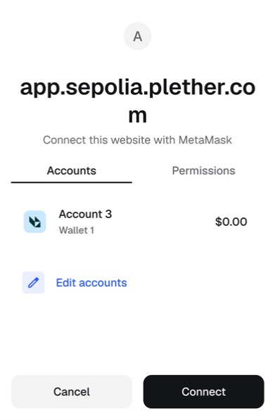
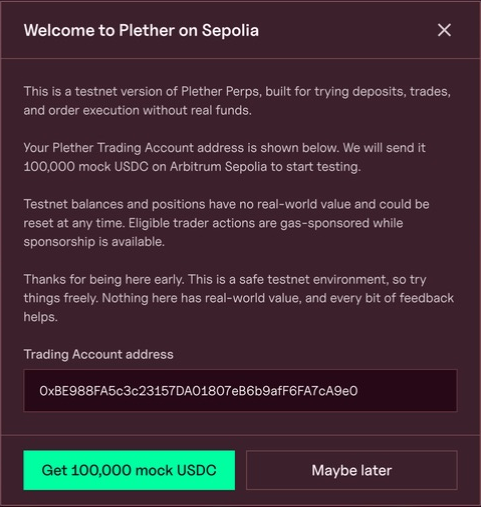
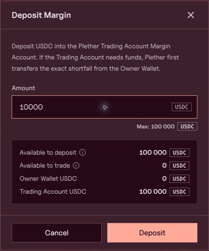
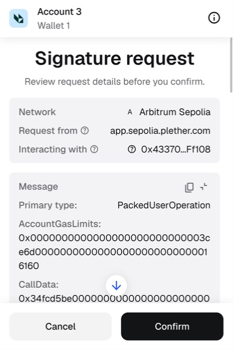
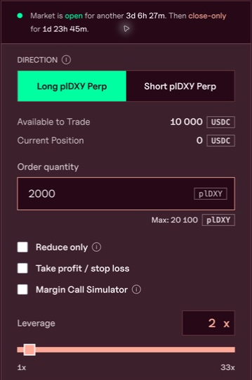
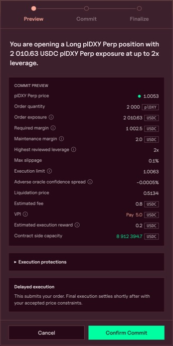

# Trader quickstart

> **Connect your wallet. Deposit test USDC. Review your first dollar trade.**

Try Plether on **Arbitrum Sepolia** with MockUSDC, a test token with no real-world value. This walkthrough uses a **10,000 USDC deposit** and a **2,000 plDXY order at 2x leverage** to illustrate the controls. Prices, fees and limits change; follow the live preview.

Your wallet controls a separate **Plether Trading Account**. That account holds your collateral and positions. You do not receive a LONG or SHORT token in your wallet.

You need MetaMask or another compatible wallet and time to watch the order finish. Eligible actions are gas-sponsored while sponsorship is available, so the faucet-funded path below does not require native ETH. Use only the official app and never share your seed phrase.

### 1. Connect and get test funds

Open [Plether on Arbitrum Sepolia](https://app.sepolia.plether.com), select `Connect Wallet`, then choose `MetaMask`.

In MetaMask, check **app.sepolia.plether.com** and select your intended owner account. Connect it, then confirm that the app and wallet use **Arbitrum Sepolia**, chain ID **421614**.

Select `Get mock USDC` in the testnet banner. Check the pre-filled **Trading Account address**, then select `Get 100,000 mock USDC`. The faucet funds this separate account, not your owner wallet.

Wait for `Mock USDC minted to your Trading Account`. If prompted, use `Check confirmation` to refresh the pending transaction.

### 2. Deposit 10,000 USDC

In the trade ticket's **Margin Account** section, select `Deposit`.

Check that **Trading Account USDC** includes the faucet funds. Enter `10000` and select `Deposit`. Your wallet authorizes one sponsored action to approve the exact amount and move it into your Margin Account.

In MetaMask, verify the owner account, requesting site and **Arbitrum Sepolia** network before confirming the signature request. Wait for confirmation, then check **Available to Trade**. Depositing funds the account; it does not open a position.

If the button says `Transfer & Deposit`, some funds would come from your owner wallet and that transfer needs ETH for gas. For this walkthrough, first check that the faucet funded the Trading Account. See [deposit sources and account balances](trading-on-plether-perps/your-margin-account.md) for the alternative path.

### 3. Set a small example order

Check the market banner above the ticket. A new position needs an **Open** market and a valid preview. If the interface blocks the order, follow its message before continuing.

Choose your direction:

| Button | Dollar view | Benefits when the displayed price… |
| --- | --- | --- |
| **Long plDXY Perp** | USD strengthens against the currency basket | Rises |
| **Short plDXY Perp** | USD weakens against the currency basket | Falls |

For the example, select `Long plDXY Perp`, enter `2000` in **Order quantity**, and set **Leverage** to `2x`. Leave **Reduce only**, **Take profit / stop loss** and **Margin Call Simulator** unchecked for this first walkthrough.

Quantity is measured in **plDXY contracts**. **Order exposure** values those contracts in USDC at the current price. It is not the deposit amount. Higher leverage uses less position margin and leaves less room before liquidation; keep free USDC available in the account.

Review **Max slippage**. It sets the worst acceptable execution price. Avoid **Infinity**, which removes that protection. The [position-opening guide](trading-on-plether-perps/open-or-increase-a-position.md) covers sizing and limits in more detail.

### 4. Review and authorize

Select `Review Long` or `Review Short`. In **Commit Preview**, check:

* **Direction, Order quantity and Order exposure** — the trade you intend.
* **Required margin, Highest reviewed leverage and Liquidation price** — the collateral and risk.
* **Execution limit, Estimated fee, VPI, oracle confidence spread and execution reward** — the price protection and costs.

VPI is a separate USDC charge or credit for price impact. The preview is an estimate; execution uses eligible oracle data published after commitment. Learn more in [trading costs](how-plether-works/trading-costs-fees-carry-and-vpi.md).

**Once confirmed onchain, the order is binding and cannot be cancelled.** Its margin and execution reward are reserved while it waits to execute.

If the preview matches your intent, select `Confirm Commit`. Plether prepares the sponsored action, then MetaMask asks for a signature. Check the account, site and network again. MetaMask may label the message `PackedUserOperation`; the readable trade terms are in Plether's preview.

### 5. Wait, then check the position

**Confirmed** means the commitment reached the chain. Wait for `Finalizing execution price` to finish; confirmation alone does not mean you have an open position.

A keeper finalizes the order automatically. Follow **Open Orders** while it is pending and **Order History** for the result. Do not submit a duplicate because the first order is still waiting.

When the status is **Executed**, open **Position** and check direction, quantity, entry price, leverage, liquidation price and unrealized profit or loss. Use the executed values rather than the original estimate.

Carry accrues while the position is open. Monitor account health even when the market price is quiet. See [position and account health](trading-on-plether-perps/read-your-position-and-account-health.md) for adding margin and other management actions.

If the order **fails**, read its reason before trying again. If it **expires**, wait for keeper cleanup. Neither is retried automatically. [Pending and failed orders](trading-on-plether-perps/why-is-my-order-pending-or-failed.md) explains the next steps.

### 6. Close when you are ready

In **Position**, select `Close position`. Review the close terms, select `Confirm Commit`, authorize it in MetaMask and wait for **Executed** again. A pending close leaves the position exposed until execution.

Closing releases funds into the **Margin Account**; it does not send them directly to your owner wallet. In a pool funding shortfall, a payout may instead become a [trader claim](trading-on-plether-perps/check-and-settle-a-trader-claim.md) that must settle before it becomes available margin.

For partial closes or changing direction, see [reduce or close a position](trading-on-plether-perps/reduce-or-close-a-position.md). An existing position must finish closing before you open the opposite direction.

### 7. Withdraw to your wallet

Select `Withdraw` in **Margin Account**. Enter an amount within **Withdrawable**, review it and authorize the sponsored action in MetaMask. It sends the exact withdrawal through your Trading Account to the connected owner wallet.

Withdrawable can be below Settlement balance because margin or rewards are reserved and withdrawal checks apply. Free-fund withdrawals reduce carry coverage; price equity is backed separately by position margin and claims. See [your Margin Account](trading-on-plether-perps/your-margin-account.md) for the balance rules.

For connection, sponsorship or validation problems, use [trader troubleshooting](trading-on-plether-perps/trader-troubleshooting.md).
