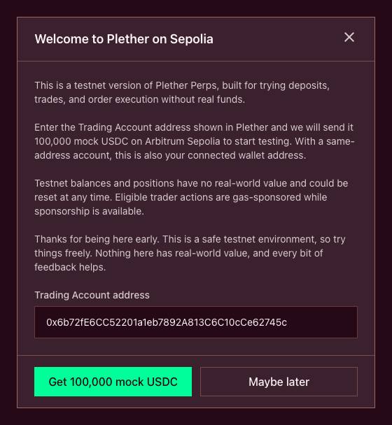
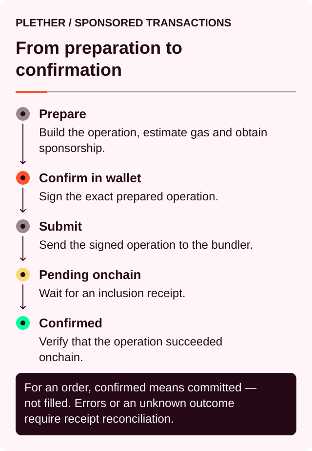

# Trader quickstart

> **Deposit USDC[^usdc]. Choose your dollar view. Commit now; price later.**

Plether Perps[^perps] lets you take a leveraged **LONG USD** or **SHORT USD** position against the Plether currency basket. Eligible trader actions use USDC-first, gas-sponsored execution.

This is not a spot swap. You do not receive a LONG or SHORT token in your wallet. Your connected wallet authorizes a Plether **Trading Account**, which owns your positions, orders, Margin Account and trader claims.

Depending on the supported account model, the connected wallet and Trading Account may have the same address or two different addresses. Confirm the active Trading Account before funding or trading. See [Gas-sponsored trading and your Plether Trading Account](trading-on-plether-perps/gas-sponsored-trading-and-your-plether-trading-account.md) for details.

### The flow in one line

`Trading Account MockUSDC → Margin Account → Sponsored order commitment → Open position → Closed settlement → Margin Account credit or trader claim → Owner wallet after withdrawal`

Closing a position does not send funds directly to the owner wallet. Released margin and any fully funded fresh payout first credit the Trading Account’s Margin Account. If the HousePool cannot fund the complete fresh payout immediately, that payout is recorded in full as a trader claim and reaches the Margin Account only after claim settlement. You withdraw separately.

### Before you begin

You need:

* A compatible self-custody wallet
* Arbitrum Sepolia selected in your wallet
* MockUSDC for collateral
* Enough time to monitor your order until it executes or fails

Use only the official Plether application. Never send tokens directly to a Plether contract or share your seed phrase with anyone.

### 1. Connect your wallet and get test funds

Open [Plether Perps DEX](https://app.sepolia.plether.com) and select `Connect Wallet`.

Confirm that your wallet is connected to **Arbitrum Sepolia**, chain ID **421614**. The account panel then shows:

* Your connected owner wallet
* Your active Trading Account address
* Whether the two addresses are the same or different

MockUSDC acts as testnet collateral. Eligible trader operations are gas-sponsored, subject to sponsorship availability and policy limits, so native ETH is not a prerequisite for this quickstart.

The welcome window lets you enter an address and select `Get 100,000 mock USDC`. Enter the **Trading Account address shown in the account panel**, not a different owner-wallet address. With a same-address account, these are naturally the same.

If you previously closed the welcome window, select `Get mock USDC` in the testnet notice bar to open it again.

MockUSDC is test collateral. It is not issued by Circle and cannot be redeemed for real dollars.

_Enter the active Trading Account address—not a separate owner-wallet address—before requesting MockUSDC._

### 2. Deposit USDC into your Margin Account

First confirm that the faucet-funded MockUSDC appears as **Trading Account USDC**. This is token balance held at the Trading Account address, outside Plether’s internal Margin Account.

Find the **Margin Account** section in the trade ticket and select `Deposit`.

Enter the amount of MockUSDC you want to deposit and review the active Trading Account. The normal flow uses a wallet authorization and sponsored operation.

Depending on the account model and token capabilities, the wallet may request:

1. A USDC transfer or approval authorization.
2. Authorization for the sponsored deposit operation.

Wait for the sponsored operation to confirm. Depositing does not open a position. It moves MockUSDC into the Trading Account’s Margin Account, where it becomes available for trading.

The interface separates several balances:

| Balance                  | Meaning                                                             |
| ------------------------ | ------------------------------------------------------------------- |
| **Owner-wallet USDC**    | MockUSDC held by the connected owner wallet outside Plether         |
| **Trading Account USDC** | MockUSDC held at the Trading Account address outside Plether        |
| **Available to Trade**   | Margin Account collateral currently available for orders           |
| **Position margin**      | Margin Account USDC assigned to an open position                    |
| **Withdrawable**         | Free Margin Account USDC that can currently reach the owner wallet  |
| **Portfolio value**      | Current Trading Account equity, including position PnL              |

These values do not need to be equal. Open positions, pending orders, carry[^carry] and margin requirements can make your withdrawable balance lower than your portfolio value.

Keep some USDC free rather than committing the entire account to one position.

_A first deposit can require wallet authorization followed by one atomic sponsored Trading Account operation._

### 3. Check the market state

Before configuring the order, read the **Market State** panel above the trade ticket.

* **Open** means new positions and increases are available, subject to live risk limits.
* **Close-only** means you may reduce or close exposure but cannot add new exposure.
* **Closed** or **Paused** means orders cannot execute normally.
* **Degraded** means additional protocol restrictions may apply.

The panel shows how long the current state is expected to last. Always follow the live validation shown in the trade ticket.

### 4. Choose LONG USD or SHORT USD

Choose the direction that matches your view:

| Position      | Your view                  | Benefits when                                 |
| ------------- | -------------------------- | --------------------------------------------- |
| **LONG USD**  | The dollar will strengthen | USD gains against the Plether currency basket |
| **SHORT USD** | The dollar will weaken     | USD loses against the Plether currency basket |

The raw foreign-currency basket moves inversely to dollar strength:

* **LONG USD** benefits when the raw basket falls.
* **SHORT USD** benefits when the raw basket rises.

The displayed perps price is dollar-oriented, so the interface behaves conventionally: LONG benefits from a rising displayed price, while SHORT benefits from a falling displayed price.

On the current testnet interface, the direction buttons may appear as `Long plDXY Perp` and `Short plDXY Perp`. These correspond to **LONG USD** and **SHORT USD** respectively.

Plether supports one live direction per Trading Account. You can increase a position in the same direction, but you cannot reverse it in one order. To change from LONG USD to SHORT USD—or the other way around—you must close the existing position first and wait for that close to execute.

For a new position:

* Leave `Reduce only` disabled.
* Leave `Margin Call Simulator` disabled. It is a boundary-testing mode that can place a position extremely close to liquidation.

### 5. Set your exposure and leverage

Enter your intended size in the `plDXY Perp exposure` field.

This is your market exposure, not the amount of USDC being spent. The **Leverage** control determines how much position margin supports that exposure.

For the same exposure:

* Lower leverage assigns more margin and provides more room before liquidation.
* Higher leverage assigns less margin and makes fees, carry and small price movements more consequential.

The interface’s maximum leverage is a limit, not a recommendation.

Next, review `Max slippage`. Plether uses it to calculate your execution limit—the worst price at which the order may execute.

A tighter limit provides stronger price protection but makes failure more likely if the market moves before execution. An unlimited setting removes that protection and is not appropriate for a first trade.

### 6. Read the preview

The preview is the most important part of the ticket. Review at least:

* Direction
* plDXY Perp exposure
* Contract notional[^notional]
* Initial margin
* Maintenance margin
* Resulting leverage
* Execution limit
* Liquidation price
* Estimated protocol execution fee
* VPI[^vpi] or price impact
* Adverse oracle[^oracle] confidence spread
* Estimated execution reward

These costs are different:

* The **protocol execution fee** is charged when the trade executes.
* **VPI** adjusts for trade size, available pool depth and directional imbalance. It can be a cost or a rebate.
* The **oracle confidence spread** adjusts the execution price for oracle uncertainty. It is not a separate USDC fee.
* The **execution reward** is reserved for whoever finalizes the order.
* **Carry** accrues after the position is open. Either direction can pay it.

A preview is an estimate, not an executable quote. The final price comes from eligible oracle data published after commitment.

If the preview is invalid, do not proceed. The ticket may require you to reduce exposure, deposit more margin, adjust slippage or wait for market conditions to change.

### 7. Review and commit the order

Select `Review Long` or `Review Short`.

The **Commit Preview** repeats the order terms. Check the direction, exposure, leverage, execution limit, liquidation price and total funding requirement one final time.

If everything matches your intent, select `Confirm Commit`. Your wallet authorizes the Trading Account action, and Plether submits the eligible sponsored operation.

The submission lifecycle is:

**Confirmed** means the order commitment reached the chain. It does not mean the position has changed yet.

You can close the review window before committing. Once the commitment confirms onchain, the rules change:

* The order becomes binding.
* It cannot be cancelled.
* Its margin and execution reward are reserved.
* It enters the global first-in, first-out queue.
* It is not yet an open position.

Plether does not let the trader or keeper[^keeper] choose a favorable future price. Live execution uses the first eligible Pyth observation strictly after commitment and applies the active confidence policy and your execution limit. VPI is calculated separately in USDC. An oracle-frozen voluntary close instead uses the validated unshifted price and the separate frozen-close spread.

If that price exceeds your slippage limit, the order fails rather than executing outside it.

### 8. Wait for finalization

After commitment, the application displays `Finalizing execution price`.

A keeper gets the first opportunity to finalize the order. If automatic finalization does not happen during the initial grace period, the interface exposes `Finalize Trade`.

Manual finalization requires a separate wallet authorization and onchain operation. It does not let you choose a different price; it submits the data needed to settle the already committed order. Manual finalization remains outside sponsorship unless the interface explicitly marks it as **Sponsored**.

Monitor the order until it reaches a terminal state:

| Status             | Meaning                                                   |
| ------------------ | --------------------------------------------------------- |
| **Pending reveal** | Waiting for an eligible oracle update or finalization     |
| **Executed**       | The position was opened, increased or reduced             |
| **Failed**         | The order will not execute                                |
| **Expired**        | Its execution window ended before successful finalization |

The **Open Orders** tab shows the current countdown and explicitly displays `Cancel unavailable`.

Do not submit a duplicate order simply because the first remains pending. Global FIFO[^fifo] ordering means earlier orders must be resolved first.

If an order expires, use `Clean Up` when the action becomes available. If it fails, check **Order History** for the reason before submitting another order. Failed and expired orders are not retried automatically.

### 9. Check and manage the position

After execution, open the **Position** tab and verify:

* Direction
* plDXY Perp exposure
* Entry notional
* Entry price
* Leverage
* Liquidation price
* Unrealized PnL[^pnl]
* Cost of carry

The preview and final result can differ. Use the executed position—not the original preview—as the record of what you own.

Plether uses a shared-collateral account. Position leverage is calculated from the margin assigned to that position, but free USDC elsewhere in the account can also contribute to account equity and protect it from liquidation.

Carry continues to accrue while the position is open. It reduces account equity and can move a position toward liquidation even when the market price changes very little.

A pending close order does not protect you from liquidation before that close executes.

#### Add margin

To strengthen the position without increasing its size:

1. Select the pencil icon next to **Leverage**.
2. Open `Edit Position Margin`.
3. Enter an amount under `Add margin`.
4. Review the resulting margin and leverage.
5. Select `Add Margin`.

Adding margin is immediate and does not enter the delayed order queue. It reduces position leverage but does not change exposure.

Direct position-margin removal is not supported. Margin is released proportionally when the position is reduced or closed.

#### Increase the position

To increase exposure, submit another order in the same direction. It follows the same delayed, binding order process as the original open.

Review the resulting combined position rather than evaluating the increase in isolation.

### 10. Reduce or close the position

Use the trade ticket to exit. The Position panel does not have a separate close button.

Enable `Reduce only`, then enter the exposure you want to close.

* For a partial close, enter part of the current exposure. The action becomes `Review Reduce`.
* For a full close, select `Current Position` or `Max` to fill the available position size. The action becomes `Review Close`.

Review the close preview, including execution price, realized PnL, VPI and execution fee. Then commit and monitor the order exactly as you did when opening.

A reduction or close is still:

* Delayed
* Binding after commitment
* Non-cancellable
* Subject to oracle confidence and slippage
* Processed through the global FIFO queue

Partial reductions must satisfy the current minimum-order and remaining-position rules. A complete residual close may be permitted even when the remaining amount is below the ordinary minimum.

When the close executes, released margin follows the normal Margin Account path. The complete fresh HousePool-funded payout is either credited to the Margin Account immediately in full or recorded in full as a trader claim. Neither outcome sends USDC directly to the owner wallet.

> **Trader claims**
>
> In an exceptional cash-shortfall scenario, released position margin follows the normal account path, while the complete fresh HousePool-funded payout is either credited immediately in full or recorded in full as a **trader claim**. Plether never splits one fresh payout between an immediate credit and a new claim.
>
> A trader claim is a protocol liability owned by the Trading Account. It is not wallet USDC and cannot be treated as available margin until settled. See [**Check and settle a trader claim**](trading-on-plether-perps/check-and-settle-a-trader-claim.md) for the complete settlement process and liquidity conditions.

### 11. Withdraw USDC

In the **Margin Account** section, select `Withdraw`.

Enter an amount no greater than the displayed **Withdrawable** balance and authorize the sponsored withdrawal operation.

Withdrawable USDC excludes collateral or funds required for:

* Position margin
* Pending-order margin
* Reserved execution rewards
* Accrued carry
* Maintenance requirements
* Other active protocol safeguards

You can withdraw free USDC while a position remains open, but doing so can reduce the account buffer protecting that position. Review the position’s health and liquidation price before confirming.

For a separate smart account, the sponsored withdrawal atomically moves MockUSDC from the Margin Account through the Trading Account to its verified owner wallet. For a same-address Trading Account, the withdrawn MockUSDC reaches that shared address directly.

### Common problems

| Problem                                              | What to check                                                                     |
| ---------------------------------------------------- | --------------------------------------------------------------------------------- |
| Wallet is connected but trading is disabled          | Switch to Arbitrum Sepolia                                                        |
| Deposit does not proceed                             | Trading Account address, MockUSDC balance, authorization and sponsorship status   |
| Order preview is invalid                             | Minimum size, deposited margin, side capacity, market state and fresh oracle data |
| Order remains pending                                | Open Orders countdown, earlier FIFO orders and oracle availability                |
| Order expired                                        | Use `Clean Up`, then submit a new order                                           |
| Order failed                                         | Check Order History before changing slippage or resubmitting                      |
| Opposite direction is unavailable                    | Close the current position and wait for execution first                           |
| Withdrawal is below portfolio value                  | Position margin, pending reservations, carry and maintenance requirements         |
| Position health worsened without much price movement | Check accumulated carry and account equity                                        |

### First-trade checklist

Before selecting `Confirm Commit`:

* Start with a small test position.
* Confirm whether you are **LONG USD** or **SHORT USD**.
* Keep free USDC outside the position.
* Read the execution limit and avoid unlimited slippage.
* Review the liquidation price.
* Review the execution fee, VPI, confidence spread and execution reward.
* Accept that the committed order cannot be cancelled.
* Monitor the order until it executes, fails or expires.
* Verify the final position after execution.

### Continue reading

* [**How delayed orders execute**](how-plether-works/how-orders-execute.md)
* [**Margin and liquidation**](how-plether-works/margin-leverage-and-liquidation.md)
* [**Fees, VPI and cost of carry**](how-plether-works/trading-costs-fees-carry-and-vpi.md)
* [**Managing and closing a position**](trading-on-plether-perps/reduce-or-close-a-position.md)
* [**Trader claims**](trading-on-plether-perps/check-and-settle-a-trader-claim.md)
* [**Market hours and closures**](how-plether-works/market-states-and-oracle-closures.md)

[^usdc]: A US dollar-denominated stablecoin Plether uses for margin and settlement.
[^perps]: Perpetual contracts, derivatives with no scheduled expiry.
[^carry]: The time-based cost charged on the portion of a position financed by LP capital.
[^notional]: The face value of a position’s market exposure, not the amount of collateral posted.
[^vpi]: Virtual Price Impact, a separate USDC charge or rebate based on how a trade changes HousePool directional imbalance.
[^oracle]: A service that supplies external market data to smart contracts; Plether uses Pyth price feeds.
[^keeper]: A permissionless actor or bot that submits order-finalization or protocol-maintenance transactions.
[^fifo]: First in, first out; orders at the front of the queue are processed before later orders.
[^pnl]: Profit and loss, the financial result of market-price movement on a position.
