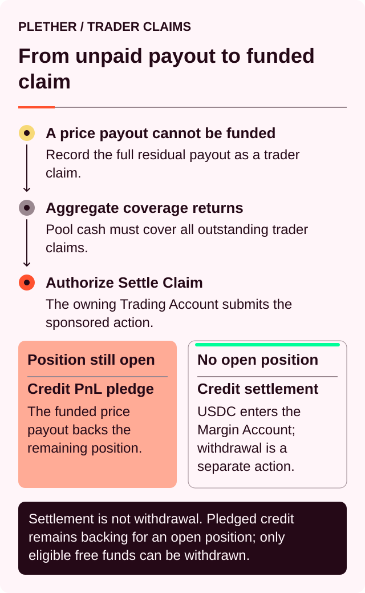
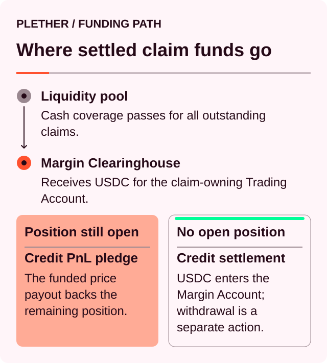

# Check and settle a trader claim

A trader claim records USDC[^usdc] owed to the **Trading Account** when the liquidity pool cannot fund a fresh trader payout in full at execution. The Trading Account owns the claim; its connected owner wallet authorizes settlement.

Claims can arise from:

* A profitable position reduction
* A profitable full close
* A positive residual after liquidation

The position action still completes. Released position margin follows the normal account settlement path, while the unfunded payment from the liquidity pool is recorded separately as a trader claim.



### How a claim is created

Plether calculates the fresh trader payout after applying the position’s realized PnL[^pnl], execution fee, signed VPI[^vpi], carry[^carry] and any applicable frozen-close spread.

Existing position margin remains separate from this calculation. The claim covers only the fresh payment that requires pool cash.

Fresh payouts follow an all-or-nothing rule:

* The complete fresh payout is credited immediately when sufficient free pool cash is available.
* The complete fresh payout becomes a trader claim when the liquidity pool cannot fund it immediately.

Plether does not divide a fresh payout between an immediate credit and a new claim.

For example:

```
Position margin released:            2,000 USDC
Fresh pool-funded payout:         500 USDC
Cash available for fresh payouts:      300 USDC
```

The `2,000 USDC` of position margin follows the normal account path. The complete `500 USDC` fresh payout becomes a trader claim.

Additional complete fresh payouts that cannot be funded immediately are recorded in full and added to the account’s existing claim balance.

### Check your claim

Open the **Position** tab in the account panel and find the **Trader claim** card. The card appears only while the active Trading Account has a nonzero claim.

The current card shows:

* Claim balance
* **Settle Claim**

The current interface does not display aggregate claim coverage or a separate availability status. The contract performs the coverage check when the sponsored operation is simulated and executed. If coverage is insufficient, settlement fails and the complete claim remains recorded.

Before settlement, the claim remains separate from your usable account collateral.

| Account value          | Treatment of an unsettled claim |
| ---------------------- | ------------------------------- |
| Margin Account balance | Excluded                        |
| Portfolio value        | Excluded                        |
| Available to Trade     | Excluded                        |
| Withdrawable           | Excluded                        |
| Position health        | Excluded                        |
| Liquidation protection | Excluded                        |

The claim remains denominated in USDC. It does not accrue interest or yield and has no expiry.

Claims are included in the protocol’s liability and LP-withdrawal[^lp] accounting while they remain outstanding.

### When a claim becomes available to settle

Claim settlement becomes available when recognized pool assets cover all outstanding trader claims:

```
Recognized pool assets
≥
Total outstanding trader claims
```

Recognized assets are the pool assets admitted into protocol accounting and physically held by the pool. A displayed token balance or headline TVL[^tvl] may differ from the amount used by the settlement check.

The test applies to aggregate claims rather than one account at a time.

Assume:

```
Your claim:                            600 USDC
Another account’s claim:              400 USDC
Total outstanding claims:           1,000 USDC
Recognized pool assets:           900 USDC
```

Although the liquidity pool could physically cover your individual `600 USDC` claim, neither claim can settle because aggregate coverage is short by `100 USDC`.

If recognized assets later reach `1,000 USDC`, both claims become available.

If you settle first:

```
Your claim paid:                       600 USDC
Pool assets remaining:            400 USDC
Outstanding claims remaining:          400 USDC
```

The remaining claim stays fully covered.

#### There is no claim queue

Trader claims are recorded as balances for individual Trading Accounts. Creation time does not determine settlement priority.

While aggregate coverage is insufficient, settlement remains unavailable to every claimant. Once full coverage returns, each Trading Account can settle its complete balance after its owner wallet authorizes the action.

#### Settlement is all-or-nothing

The settlement transaction processes your entire current claim balance. There is no amount field and no partial-claim settlement.

If aggregate coverage is insufficient, the transaction reverts and the complete claim remains recorded.

### How to settle your claim

#### 1. Connect the owner wallet

Connect the owner wallet that controls the claim-owning Trading Account, then confirm the active Trading Account address in the interface.

A different wallet cannot authorize settlement for that Trading Account. The sponsor and bundler[^bundler] can relay the authorized operation, but they cannot create the owner signature.

#### 2. Review the claim card

Confirm the active Trading Account and the complete claim balance shown on the card.

The card does not pre-approve settlement or show aggregate pool coverage. Liquidity can change between loading the page and operation confirmation, and the contract performs the final check when the operation executes.

#### 3. Select Settle Claim

The current card submits the complete claim balance; there is no amount field or separate settlement-review modal. The destination is the Trading Account’s Margin Account. Transferring the credited USDC to the owner wallet requires a separate withdrawal.

#### 4. Authorize the sponsored operation

The connected wallet signs the settlement authorization, and Plether submits the eligible sponsored Trading Account operation. The owner wallet does not need the network’s native gas token while settlement sponsorship is available.

It does not require:

* A USDC approval
* A Pyth price update
* An acceptable price
* An execution fee or keeper[^keeper] reward

Sponsorship remains subject to availability and policy limits. A sponsorship or bundler failure does not change the claim balance; request a fresh operation after the displayed issue is resolved.

The settlement path does not depend on a live FX[^fx] oracle[^oracle] or an open trading session. FAD[^fad], an oracle closure, frozen-oracle mode or degraded mode do not independently block it when the cash-coverage requirement is satisfied.

#### 5. Check the result

After confirmation:

* The trader claim balance should fall to zero.
* The full settled amount should be credited to the Margin Account.
* Available to Trade and Withdrawable should be recalculated.
* Any carry associated with an open position should be updated.



The sponsored settlement operation does not transfer USDC directly to the owner wallet.

### Carry when you have an open position

Plether checkpoints carry before crediting a claim to an account with an open position.

When the accrued carry can be collected from existing account collateral, it is collected before the claim credit. The visible change in your total Margin Account balance may therefore be smaller than the settled claim.

For example:

```
Trader claim settled:               +5,000 USDC
Carry collected:                      −120 USDC
Net account balance change:         +4,880 USDC
```

The claim itself is still settled for the full `5,000 USDC`.

If the account cannot fully cover carry at the checkpoint, the unpaid amount remains recorded as unsettled carry. It continues to affect account equity and later settlement checks.

### Withdraw the credited USDC

After settlement, the credited amount follows the normal Margin Account rules.

To move available USDC to your wallet:

1. Open the **Margin Account**.
2. Select **Withdraw**.
3. Check the current Withdrawable amount.
4. Enter an amount within that limit.
5. Confirm the separate transaction.

With a flat account and no active reservations, most or all of the credit will generally be withdrawable.

With an open position or pending orders, Withdrawable may be lower because Plether must preserve:

* Required position margin
* Pending carry
* Committed order margin
* Reserved execution rewards
* Current market-state withdrawal requirements

Claim settlement and wallet withdrawal are separate sponsored operations.

### A claim can be consumed before settlement

An outstanding claim belonging to the same account can be used against a shortfall from:

* A losing terminal full close
* A liquidation

Plether consumes the claim before recording protocol bad debt.

Example:

```
Existing trader claim:               3,000 USDC
Terminal settlement shortfall:       1,200 USDC
Claim consumed:                      1,200 USDC
Remaining trader claim:              1,800 USDC
Bad debt:                                0 USDC
```

This consumption does not produce a Margin Account credit because the claim is being netted against an account obligation.

A partial reduction cannot rely on an unsettled claim to cover underfunding. The partial reduction must be fully supported by eligible account collateral.

If your claim balance falls without a claim-settlement transaction, review the account’s latest full close or liquidation.

### Why settlement may be unavailable

#### Settlement liquidity is insufficient

Recognized pool assets remain below aggregate trader claims. Your complete claim stays recorded until coverage returns.

#### Insufficient liquidity transaction error

Coverage was insufficient when the transaction executed. This can happen if onchain state changed after the page loaded.

The claim remains unchanged. For an eligible sponsored settlement, Plether pays any network gas consumed by the included operation rather than charging the owner wallet’s native-token balance.

#### No trader claim

The active Trading Account currently has no claim. It may have been:

* Settled previously
* Consumed during a terminal full close
* Consumed during liquidation
* Recorded under another Trading Account

#### Account owner required

Connect the owner wallet that controls the claim-owning Trading Account. The wallet authorizes settlement; the sponsored operation is submitted from the Trading Account.

#### Wallet USDC did not increase

Successful settlement credits the Margin Account. Use a separate withdrawal to transfer the USDC to your wallet.

#### Account balance increased by less than the claim

Check whether carry was collected during the same transaction. Review the claim amount, carry update, free USDC and position margin together.

#### Claim settled but withdrawal is unavailable

The credited USDC may be required by an open position, pending order or carry obligation. The normal Margin Account withdrawal checks still apply.

### Worked example

A trader reduces a profitable LONG USD position.

At execution:

```
Position margin released:            2,000 USDC
Fresh trader payout:                   800 USDC
Recognized pool assets:         45,000 USDC
Existing aggregate claims:           44,500 USDC
Cash free above existing claims:        500 USDC
```

Only `500 USDC` is free above existing claims, so the complete `800 USDC` fresh payout becomes a new trader claim.

After execution:

```
Trader claim balance:                  800 USDC
Total outstanding claims:           45,300 USDC
Recognized pool assets:        45,000 USDC
```

Settlement remains unavailable because claims exceed recognized assets by `300 USDC`.

Later, recognized assets rise to `45,300 USDC`. The claim becomes serviceable, although the current claim card does not show that coverage status in advance.

After the trader selects **Settle Claim**:

```
Trader claim balance:                    0 USDC
Margin Account credit:                +800 USDC
Pool assets remaining:         44,500 USDC
Outstanding claims remaining:       44,500 USDC
```

The remaining claims continue to be fully covered.

[^usdc]: A US dollar-denominated stablecoin Plether uses for margin and settlement.
[^vpi]: Virtual Price Impact, a separate USDC charge or rebate based on how a trade changes pool directional imbalance.
[^pnl]: Profit and loss, the financial result of market-price movement on a position.
[^carry]: The time-based cost charged on the portion of a position financed by LP capital.
[^lp]: Liquidity provider, a participant that supplies USDC capital to the liquidity pool.
[^tvl]: Total value locked, the headline value of assets deposited in a protocol.
[^bundler]: A service that packages smart-account operations and submits them for onchain inclusion.
[^keeper]: A permissionless actor or bot that submits order-finalization or protocol-maintenance transactions.
[^fad]: Friday Afternoon Deleverage, Plether’s wider scheduled close-only window around the weekly FX closure.
[^fx]: Foreign exchange, the market for trading one currency against another.
[^oracle]: A service that supplies external market data to smart contracts; Plether uses Pyth price feeds.
