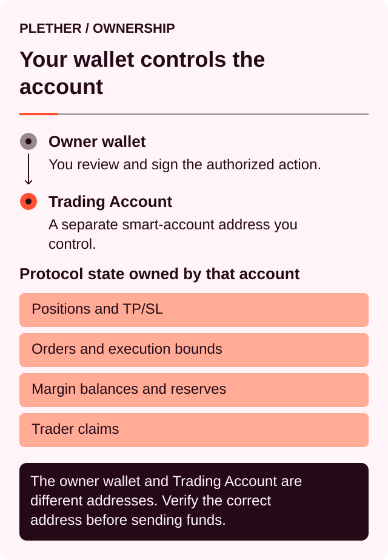
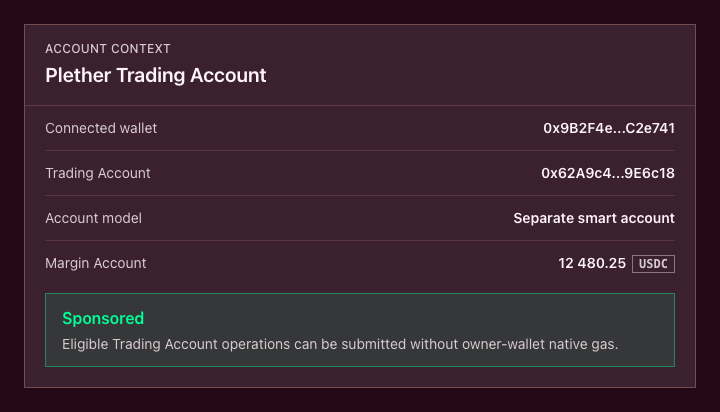
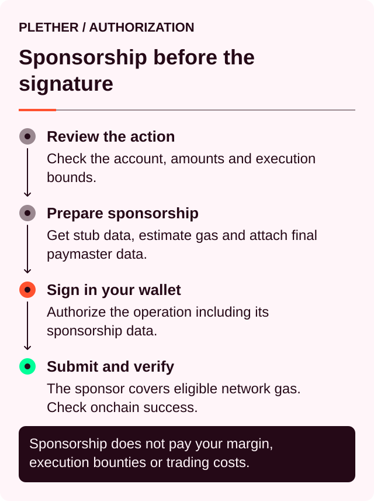
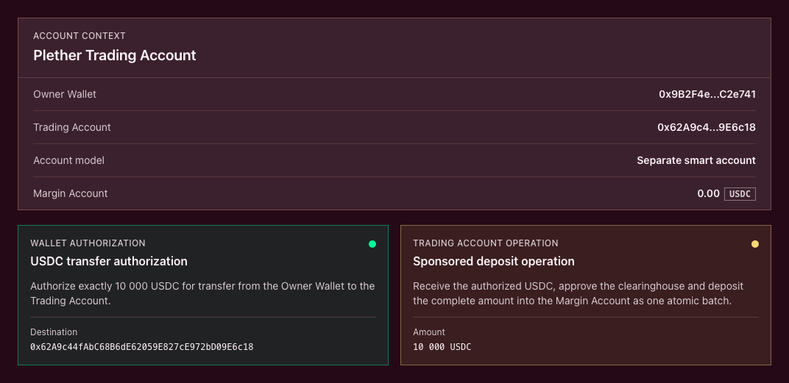
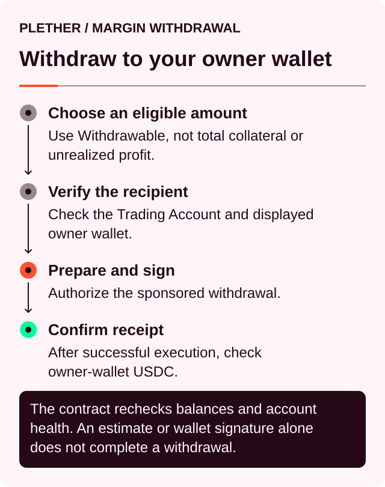
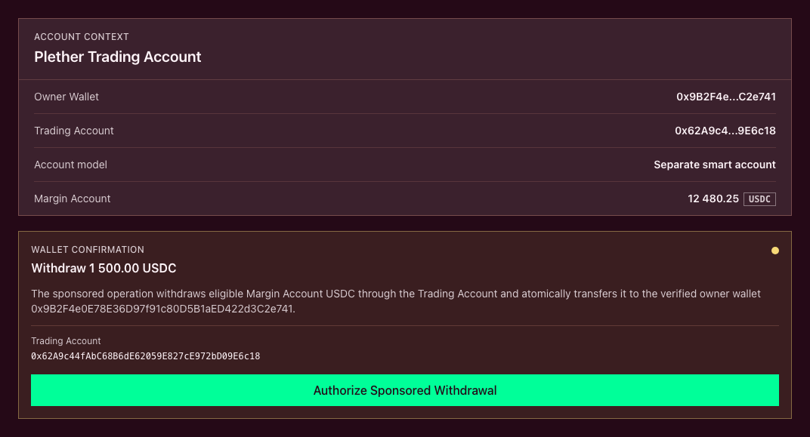
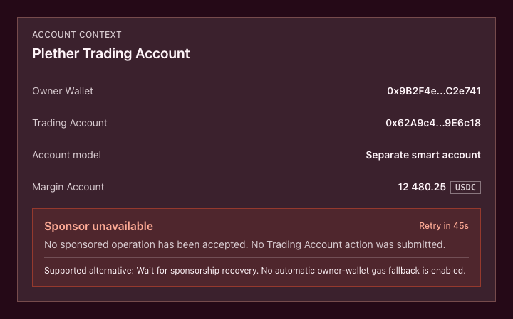

# Gas-sponsored trading and your Plether trading account

Plether sponsors network gas for eligible perps[^perps] actions, subject to availability and policy limits. You continue using your existing wallet and approve every action.

Your connected wallet controls your Plether Trading Account through its signature rules. The Trading Account submits authorized operations to Plether’s contracts, while Plether pays the eligible network gas.

Gas sponsorship covers network gas only. Protocol execution fees, VPI[^vpi], carry[^carry], execution rewards and frozen-close spreads remain USDC[^usdc] costs.

### Your wallet, Trading Account and Margin Account

| Term                 | Meaning                                                                                               |
| -------------------- | ----------------------------------------------------------------------------------------------------- |
| **Connected wallet** | The MetaMask, Rabby, Trust Wallet or other supported wallet account used for ownership and signatures |
| **Trading Account**  | The onchain account that owns your positions, orders, margin and trader claims                        |
| **Margin Account**   | The USDC balance recorded inside Plether for the Trading Account                                      |

The relationship can be summarized as:



Your Margin Account has no separate wallet address. It is part of Plether’s internal accounting and belongs to the Trading Account address.

Depending on your network, wallet and account history, the Connected wallet and Trading Account may use the same address or two different addresses.



### Which actions Plether can sponsor

Eligible actions include:

| Action                    | What the sponsored operation does                                 |
| ------------------------- | ----------------------------------------------------------------- |
| **Deposit USDC**          | Moves USDC into the Trading Account’s Margin Account              |
| **Open or increase**      | Commits an order to open a position or increase existing exposure |
| **Reduce or close**       | Commits an order to reduce or fully close a position              |
| **Add margin**            | Assigns additional Margin Account USDC to an existing position    |
| **Settle a trader claim** | Credits available settlement liquidity to the Margin Account      |
| **Withdraw USDC**         | Withdraws eligible USDC from the Margin Account                   |

Reduce, close and add-margin actions receive protective priority under the sponsorship policy. This helps preserve sponsorship capacity for risk-reducing actions when ordinary usage is high. It does not guarantee availability during a service outage or when protective limits have also been reached.

The sponsored trading action commits the order. Plether’s normal execution process then places it in FIFO[^fifo] and waits for keeper[^keeper] execution. The execution reward remains a USDC cost reserved from your Margin Account.

Keeper finalization follows its existing execution path. Manual finalization, expired-order cleanup, arbitrary contract calls and unrelated token transfers remain outside the sponsored path unless the interface explicitly marks them as **Sponsored**.

### What sponsorship pays

Plether pays the network gas required to include an eligible sponsored action.

The following amounts remain part of the trade or account operation:

* Position margin
* Execution fees
* VPI charges or credits
* Carry charges or credits
* The order execution reward
* The fixed 50 bps[^bps] frozen-close spread, when applicable
* The USDC being deposited

Gas sponsorship does not change execution price, FIFO priority, slippage protection, margin requirements, liquidation rules or the solvency checks applied to an order.

It also does not guarantee that a committed order will execute. Oracle[^oracle] availability, market state, margin checks and FIFO execution still apply.

### What you sign

Your wallet signs an authorization for the action you reviewed. Depending on the account model and action, this may include:

* A Trading Account operation
* A one-time USDC transfer authorization
* An EIP-7702[^eip7702] delegation authorization
* An explicitly selected self-funded transaction

Before signing, check:

* The network
* Your Connected wallet
* Your Trading Account
* The action and USDC amount
* Any token approval
* The withdrawal recipient
* The authorization expiry
* Whether network gas is marked as sponsored

#### Why signing is not a gas payment

A wallet signature is created offchain. Producing it does not submit a transaction and does not consume network gas.



The signature remains an important authorization. It allows the Trading Account to perform the specific action shown in the wallet and application.

Plether’s sponsor can decide whether to fund the gas. It cannot replace your signed instruction with another action or provide the owner authorization required to trade or withdraw.

### Two Trading Account models

Plether supports two ways of operating a Trading Account.

#### Separate smart account

With a separate smart account, the two addresses are different:

```
Connected wallet: 0xOwner...
Trading Account:  0xTrading...
```

Your Connected wallet signs for and controls the Trading Account. Plether records positions, orders, margin and claims under the Trading Account address.

The smart account must be active and its owner must be verifiable before Plether accepts sponsored actions. Account setup is handled during onboarding.

Use the Trading Account address when reviewing Plether activity in a block explorer or contacting support.

#### Same-address EIP-7702 account

On compatible networks and wallets, EIP-7702 allows the Connected wallet to use smart-account execution while keeping its existing address:

**Same-address account:** the Connected wallet and Trading Account use the same address.

Positions, orders, margin and claims remain associated with the same address. This provides the simplest continuity for traders who already have Plether activity under their wallet address.

Your wallet may ask you to authorize the account delegation before sponsored trading becomes available. Changing or removing that delegation invalidates any outstanding sponsored operation that has not yet been submitted.

|                                      | Separate smart account           | Same-address EIP-7702         |
| ------------------------------------ | -------------------------------- | ----------------------------- |
| Connected wallet and Trading Account | Different addresses              | Same address                  |
| Plether state belongs to             | Smart-account address            | Existing wallet address       |
| Owner approval                       | Connected wallet signature       | Same-address wallet signature |
| Existing address-based state         | Requires a deliberate transition | Remains at the same address   |

Plether shows the active account model and Trading Account address before you sign.


### Your first deposit

The exact first-deposit flow depends on the account model.

#### Deposit into a separate smart account

When USDC starts in your Connected wallet, the usual flow requires two signatures:

1.  **Authorize USDC**

    You sign a one-time authorization allowing the specified amount of USDC to move from your Connected wallet to the Trading Account. The authorization uses an exact amount and a limited validity period.
2.  **Deposit USDC**

    You sign the sponsored Trading Account operation. It receives the authorized USDC, grants the clearinghouse an exact approval and deposits the amount into your Margin Account.

The interface may label these prompts `Authorize 1,000 USDC` and `Deposit 1,000 USDC`.

Both are signatures. Plether pays the network gas for the eligible onchain operation.

The transfer, approval and deposit are executed as one batch. If the batch reverts, the Margin Account is not credited.

Some test tokens and network deployments do not support signed wallet-to-account transfers. In that case, USDC must already be held by the Trading Account before the sponsored deposit can proceed. The interface will show the required funding address.

#### Deposit using EIP-7702

The Connected wallet and Trading Account share the same address, so USDC does not need to move between two accounts.

The sponsored operation grants an exact USDC approval and deposits the selected amount into the Margin Account. First use may also require an EIP-7702 delegation authorization.

After confirmation, the deposited amount appears in the Trading Account’s Margin Account.



### Withdrawing USDC

A withdrawal begins with the Trading Account’s withdrawable Margin Account balance.



Your withdrawable balance continues to account for open positions, maintenance requirements, pending orders, reserved execution rewards, accrued carry and other settlement obligations.

#### Separate smart-account withdrawal

The sponsored operation performs two steps as one batch:

1. Withdraw eligible USDC from the Margin Account to the Trading Account.
2. Transfer that USDC from the Trading Account to its verified owner wallet.

The withdrawal review shows both the Trading Account and destination address.

#### Same-address withdrawal

The Connected wallet and Trading Account use the same address. USDC withdrawn from the Margin Account therefore reaches that address directly.

Gas sponsorship does not increase the amount available for withdrawal.



### Existing users and account continuity

Plether state belongs to the Trading Account address that created it. This includes:

* Open positions
* Pending orders
* Free and reserved margin
* Position margin
* Trader claims
* Execution-reward reservations

Plether checks existing account state when you connect:

| Existing state                                       | Account selection                           |
| ---------------------------------------------------- | ------------------------------------------- |
| State exists only under the wallet address           | Continue with that address                  |
| State exists only under its associated smart account | Continue with the smart account             |
| Neither address has state                            | Offer the default supported sponsored route |
| Both addresses have state                            | Ask you to choose which account to use      |

Once a Trading Account has protocol state, Plether does not automatically switch it to another address.

#### Same-address continuity

An EIP-7702 account retains the existing wallet address. Existing positions, margin, orders and claims remain where they are, so no protocol-state migration is required.

#### Moving to a separate Trading Account

A separate smart account has a different address and a separate account history. Plether does not merge or automatically transfer state between the two addresses.

Moving active trading to that account generally requires:

1. Allowing pending orders under the old account to reach a terminal state.
2. Managing or closing its open position.
3. Settling any available trader claim.
4. Withdrawing eligible Margin Account USDC.
5. Depositing USDC into the new Trading Account.
6. Confirming the new Trading Account before placing another order.

Access to the original wallet remains necessary while it owns unresolved state.

### Sponsorship availability and limits

Gas sponsorship is evaluated for each action. Availability can be affected by:

* Network or wallet support
* Trading Account compatibility
* The current action allowlist
* Per-action gas or amount limits
* Per-account rate limits
* Daily or protocol-wide budgets
* Current network fees
* Sponsor, bundler[^bundler] or RPC[^rpc] availability
* Transaction simulation
* Expired signatures or invalid nonces
* Changes to smart-account code or EIP-7702 delegation

Exact operational limits may change as network conditions change. The status shown during action review is authoritative for that submission.

Possible statuses include:

| Status                      | Meaning                                                     |
| --------------------------- | ----------------------------------------------------------- |
| **Checking sponsorship**    | Plether is evaluating the prepared action                   |
| **Sponsored**               | The action is eligible and Plether will pay its network gas |
| **Sponsorship unavailable** | No sponsored submission has been accepted                   |
| **Submitted**               | The operation has been sent for onchain inclusion           |
| **Confirmed**               | The sponsored operation completed                           |
| **Order Pending**           | The order commitment succeeded and is waiting for execution |
| **Failed**                  | The operation or underlying contract call did not complete  |

### Retrying a failed sponsored action

If sponsorship is rejected before submission, no onchain action has occurred. The interface will show the reason and, where possible, when to retry.

If an operation was submitted but its outcome is uncertain:

1. Check the operation or transaction status.
2. Refresh the Trading Account.
3. Check for an emitted order ID.
4. Check **Open Orders** before submitting another trade.
5. Request a new sponsored operation only after the previous result is known.

A retry may require a fresh gas estimate, sponsorship approval and wallet signature.

Avoid repeating an order because its status took longer than expected. A confirmed commitment may already be waiting in FIFO even when the final trade execution has not happened.

During a sponsorship outage, positions remain active, carry continues to accrue, pending orders remain in FIFO and liquidation rules continue to apply.



### Why Plether never silently falls back to the owner EOA

With a separate smart account, the owner wallet and Trading Account are different onchain addresses.

Submitting the action directly from the owner EOA[^eoa] would change the caller. Plether could then read a different Margin Account, fail an ownership check, or create an order under the wrong address. It could also charge native gas to the Connected wallet without clear approval.

When sponsorship is unavailable, Plether keeps the selected Trading Account and shows the available options. These may include:

* Retry after a displayed time
* Wait for the sponsorship service to recover
* Contact support
* Use an explicitly supported self-funded route for the same Trading Account
* Select direct EOA mode when the EOA is already the account that owns the relevant Plether state

Any self-funded route must be chosen deliberately. The confirmation shows which address submits the transaction and which address pays the network gas.

Plether never changes the sender address or begins charging the Connected wallet’s native token in the background.

### Frequently asked questions

#### Do I need a new wallet?

No. Continue using MetaMask, Rabby, Trust Wallet or another supported wallet.

A separate Trading Account does not create another recovery phrase or private key for you to manage. Your existing wallet owns and signs for it.

#### Why do I see two addresses?

You are using the separate smart-account model.

The Connected wallet address is used for ownership and signatures. The Trading Account address owns your Plether positions, orders, Margin Account and claims.

With same-address EIP-7702 operation, both roles use the same address.

#### Who controls my funds?

Your Connected wallet controls the Trading Account through its signature rules.

USDC deposited into Plether is recorded under the Trading Account’s Margin Account and remains subject to Plether’s margin and settlement rules. The sponsor decides whether to pay network gas; it cannot sign trader actions or withdraw funds on your behalf.

Never share your private key or recovery phrase with Plether support.

#### Do I need the network’s native gas token?

Eligible sponsored actions do not require your wallet to pay network gas while sponsorship is available.

Native gas may still be required for external applications, unsponsored actions or an explicitly selected self-funded route. Plether shows this before requesting approval.

#### Why is my sponsored order still pending?

Sponsorship covers the operation that commits the order. Execution remains a separate step.

After the commitment is confirmed, the order enters Plether’s FIFO queue and waits for the required oracle and keeper conditions.

#### Does sponsorship cover my trading costs?

It covers eligible network gas. Execution fees, VPI, carry, execution rewards and frozen-close spreads continue to be accounted for in USDC.

[^perps]: Perpetual contracts, derivatives with no scheduled expiry.
[^vpi]: Virtual Price Impact, a separate USDC charge or rebate based on how a trade changes HousePool directional imbalance.
[^usdc]: A US dollar-denominated stablecoin Plether uses for margin and settlement.
[^carry]: The time-based cost charged on the portion of a position financed by LP capital.
[^fifo]: First in, first out; orders at the front of the queue are processed before later orders.
[^keeper]: A permissionless actor or bot that submits order-finalization or protocol-maintenance transactions.
[^bps]: Basis points; 100 bps equals 1%.
[^oracle]: A service that supplies external market data to smart contracts; Plether uses Pyth price feeds.
[^eip7702]: Ethereum Improvement Proposal 7702, which lets an existing wallet address use delegated smart-account execution.
[^rpc]: Remote Procedure Call, an interface used to communicate with a blockchain node.
[^bundler]: A service that packages smart-account operations and submits them for onchain inclusion.
[^eoa]: Externally owned account, a conventional blockchain account controlled by a private key.
