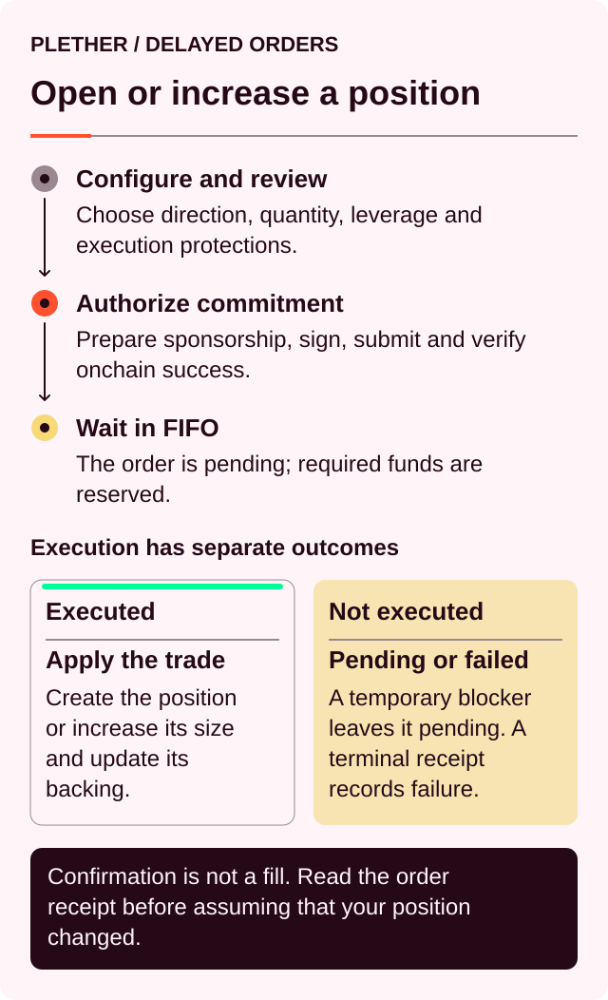
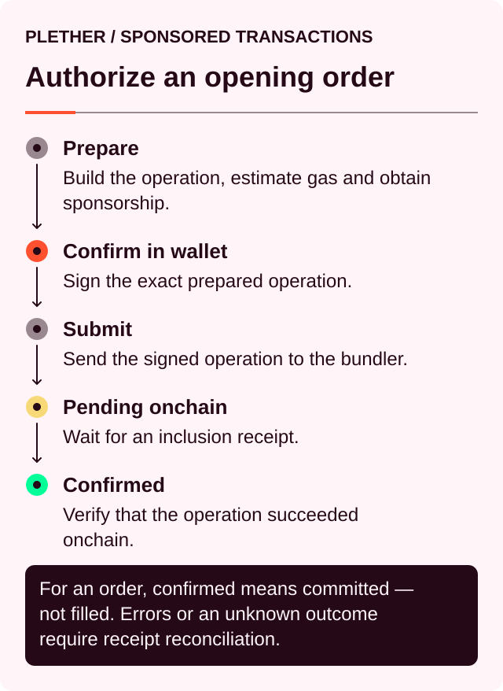
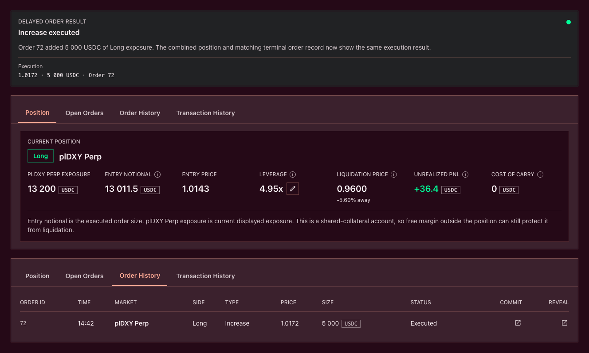

# Open or increase a position

Use the trade ticket to open a **Long plDXY Perp** (LONG USD) or **Short plDXY Perp** (SHORT USD) position, or to add exposure to an existing position in the same direction.

Both actions begin with a sponsored submission and then follow Plether’s delayed-order process:



The sponsored operation is **Confirmed** when the order commitment reaches the chain. The position changes only when that committed order later executes.

### Opening and increasing

| Action       | Account state before execution            | Result after execution                           |
| ------------ | ----------------------------------------- | ------------------------------------------------ |
| **Open**     | No live position                          | A new LONG USD or SHORT USD position             |
| **Increase** | A live position in the selected direction | Added exposure merged into the existing position |

Each account holds one combined position direction.

A same-direction increase updates the position’s:

* Total exposure
* Average entry price
* Position margin
* Leverage
* Liquidation price
* Maximum modeled payout
* Future carry[^carry] basis

Changing direction requires a complete close. Wait for that close to execute before submitting an order in the opposite direction.

### Before submitting an order

Check that:

* The **Market State** is `Open`.
* The Margin Account has enough **Available to Trade**.
* The correct owner wallet and Trading Account are selected.
* Sponsorship is shown as available for the prepared action.
* Any existing position is in the same direction as the intended increase.
* Existing pending orders do not duplicate or conflict with the instruction.

New opening and increase commitments are blocked during:

* FAD[^fad] close-only operation
* `oracleFrozen`
* Degraded mode
* Router pause
* Protocol setup or inactive trading state

A previously committed order cannot execute while the market is close-only. It remains pending only until the market reopens or the order reaches its maximum age. With the current `60-second` maximum order age, an order blocked by a scheduled close-only interval normally expires before the market reopens and then awaits keeper cleanup.

### 1. Choose Long plDXY Perp or Short plDXY Perp

Choose the direction that matches your view:

| Ticket label          | Market view                                                | Benefits when                   |
| --------------------- | ---------------------------------------------------------- | ------------------------------- |
| **Long plDXY Perp**   | The dollar strengthens against the Plether currency basket | The displayed perps price rises |
| **Short plDXY Perp**  | The dollar weakens against the Plether currency basket     | The displayed perps price falls |

For an increase, select the direction already held by the account.

The dollar-oriented price shown by the interface is:

```
D = 2.00 − B
```

Where:

* `D` is the displayed dollar-oriented perps[^perps] price.
* `B` is the raw foreign-currency basket used by protocol accounting.

The application handles this conversion when building the order.

### 2. Enter the exposure

Enter the USDC target amount to add in the `Target plDXY Perp exposure` field. This is a target, not the quantity stored in the order.

The application converts the target at the current displayed price, then rounds the result down to a whole `100 plDXY` lot:

```
Unrounded added quantity
≈ Target exposure ÷ Dpreview

Order quantity
= floor(Unrounded added quantity ÷ 100 plDXY) × 100 plDXY

Order exposure
= Order quantity × Dpreview
```

The **Preview** shows **Order exposure** in USDC and the underlying **Order quantity** in plDXY. Because the quantity is rounded down, Order exposure can be lower than the amount entered as Target exposure.

For a new position, that quantity becomes the initial position. For an increase, it is added to the existing contract quantity:

```
Resulting contract quantity
= current contract quantity
+ added contract quantity
```

The entered target is an addition, not an intended final position size. The committed Order quantity remains fixed, but displayed exposure is `contract quantity × current D`. Final execution exposure can therefore differ from both Target exposure and previewed Order exposure when the price changes before execution.

The execution price determines the added contract notional[^notional]:

```
Added contract notional
= added contract quantity × Bexecution
= added contract quantity × (2.00 − Dexecution)
```

Execution-time contract notional is used for:

* The execution fee
* Minimum-order validation
* Margin calculations
* HousePool capacity and solvency checks

The trade ticket calculates an estimate using current market data. That commit-time estimate is also used to quote and reserve the execution reward. Execution recalculates contract notional for the other checks using the order’s resolved price; the already-reserved reward does not change.

### 3. Set leverage and margin

The leverage control determines how much USDC[^usdc] the order assigns as position margin.

For the same contract quantity:

* More assigned margin produces lower displayed position leverage and a smaller LP-backed carry basis.
* Less assigned margin produces higher displayed position leverage and may fail the position-level initial-margin check.

Assigned margin comes from USDC already in the Margin Account. Moving existing free USDC into position margin does not by itself add account-wide collateral or immediate liquidation headroom. Depositing new USDC does.

For an increase, the resulting leverage applies to the complete combined position.

Plether checks both assigned position margin and total account equity. After execution:

* Position margin must meet the initial margin requirement.
* Account equity must also meet the initial margin requirement.
* The resulting position must remain above its liquidation threshold.

Free USDC elsewhere in the account can support account health. The position’s assigned margin still has to satisfy its own initial-margin check.

#### How costs affect resulting margin

The simplified position-margin calculation is:

```
Resulting position margin
= position margin after carry
+ submitted margin
− execution fee
− signed VPI
```

A positive VPI[^vpi] is a charge. A negative VPI is a provisional rebate, so subtracting it increases resulting margin.

A provisional VPI rebate remains subject to the position’s lifetime VPI rules and does not provide additional risk equity by itself.

The execution reward is reserved separately and stays outside position margin.

#### Carry on an increase

Creating account reservations can checkpoint and collect carry from an existing position. Additional carry continues accruing while the increase waits in the queue.

Before execution changes the position’s size and carry basis, Plether realizes carry again.

Carry is collected from:

1. Free account USDC
2. Position margin

The increase fails if the account cannot cover all carry due at execution.

Keep enough Available to Trade for:

* Submitted margin
* Execution reward
* Accrued carry
* Possible changes in execution fee or VPI

### 4. Set Max slippage

`Max slippage` determines the acceptable-price boundary.

In the dollar-oriented interface:

| Order                      | Execution condition                                                          |
| -------------------------- | ---------------------------------------------------------------------------- |
| Open or increase LONG USD  | Displayed execution price must stay at or below the maximum acceptable price |
| Open or increase SHORT USD | Displayed execution price must stay at or above the minimum acceptable price |

The application converts this boundary into the equivalent raw-basket target used onchain.

Plether checks the boundary against the execution price after:

1. Selecting the eligible post-commit oracle[^oracle] observation
2. Applying the adverse oracle confidence adjustment
3. Bounding the result within the `0.00–2.00` settlement range

The confidence adjustment moves entry against the trader:

* LONG USD receives a higher dollar-oriented entry price.
* SHORT USD receives a lower dollar-oriented entry price.

`Max slippage` governs this confidence-adjusted execution price. The execution fee, VPI, carry and execution reward are calculated separately.

Selecting `Infinity` for Max slippage shows `Market` as the execution limit and submits the order without a target-price check. It can execute at any eligible price within the protocol’s settlement range.

A slippage miss ends the order. Resubmission requires a new commitment.

### 5. Review the preview

The review uses current account, oracle and HousePool data. Its summary identifies the direction and whether the action opens or increases a position.

The current `Commit Preview` shows:

* plDXY Perp price
* Order exposure, meaning the whole-lot Order quantity valued at the current displayed price
* Order quantity in plDXY
* Contract notional
* Initial margin, meaning the margin submitted with this order
* Maintenance margin
* Resulting leverage
* Max slippage and execution limit
* Adverse oracle confidence spread
* Liquidation price
* Estimated protocol execution fee
* VPI / Price impact
* Estimated execution reward
* Contract side capacity

It does not show resulting position margin, average entry price, pending carry, projected account equity or a complete post-trade account-health calculation. Those values are still checked during execution and appear in the relevant account views after a successful trade.

An invalid preview may show incomplete or zero values when validation stops before the full calculation. Follow the displayed failure reason before changing the order.

The preview uses the current state. Execution runs the calculation again after earlier FIFO[^fifo] orders have been processed and the order’s own oracle price has been resolved.

Price, pool depth, market skew[^skew], carry and account balances can all change during that interval.

### How an increase changes entry price

Plether merges same-direction exposure into one position.

The new entry price is weighted by contract quantity, not by the displayed USDC exposure at two different prices:

```
Resulting entry price
=
(
  current contract quantity × current entry price
  + added contract quantity × increase execution price
)
÷ resulting contract quantity
```

Position margin has no weight in this calculation.

#### Example

Assume:

```
Current contract quantity:       10,000 at 1.0500
Added contract quantity:          5,000 at 1.1000
```

The combined position becomes:

```
Resulting contract quantity
= 10,000 + 5,000
= 15,000
```

```
Resulting entry price
= (10,000 × 1.0500 + 5,000 × 1.1000)
  ÷ 15,000

= 1.0667
```

Now assume:

```
Current position margin:  3,000 USDC
Submitted margin:          1,500 USDC
Execution fee:              1.80 USDC
VPI charge:                   25 USDC
```

With accrued carry already paid from free account USDC:

```
Resulting position margin
= 3,000 + 1,500 − 1.80 − 25
= 4,473.20 USDC
```

The interface then recalculates displayed exposure, leverage and liquidation price for the complete `15,000` contract-quantity position using the current mark.

### 6. Review and commit

Select `Review Long` or `Review Short`.

The review window repeats the complete `Commit Preview` described above. For an increase, its summary also states the selected added exposure and a current-state combined exposure estimate.

Select `Confirm Commit` and approve the wallet authorization. Plether then submits the sponsored Trading Account operation.

The interface reports:



If the wallet signature, sponsorship request or UserOperation[^useroperation] submission fails before confirmation, no order is created. Check the operation status before retrying.

After the sponsored commitment confirms:

* Submitted margin enters the pending-order margin bucket.
* The execution reward enters reserved settlement.
* Available to Trade decreases.
* The order enters the global FIFO queue.
* The commitment becomes binding.
* Position exposure remains unchanged until execution.

The current order surface has no trader cancellation function. Submitting another order leaves the original commitment active.

The protocol checks predictable failures during commitment when a sufficiently fresh stored mark is available. Complete validation runs again during execution.

### 7. Wait for execution

Track the order under **Open Orders**. The order’s Pending state is separate from the earlier Pending state of the sponsored operation.

| Open Orders status | Meaning                                                               |
| ------------------ | --------------------------------------------------------------------- |
| **Pending**        | Waiting for reveal or for expiry data to load                         |
| **Pending reveal** | Waiting for its turn and an eligible post-commit oracle observation   |
| **Expired**        | The maximum order age passed; the sponsored keeper is cleaning it up  |

After terminal processing, the order leaves **Open Orders**. **Order History** records whether it was **Executed** or **Failed**, together with its commit and reveal transactions.

The global queue follows FIFO ordering. Earlier orders must resolve before later orders can execute.

During live-market execution, Plether uses a unique Pyth basket observation:

* Strictly after the commitment timestamp
* Inside the configured settlement window
* Built from valid basket components
* Within the confidence and publish-time-divergence limits

Execution in the commitment block is blocked.

For the currently supported sponsored Trading Account, finalization and expired-order cleanup are keeper-operated. The owner wallet is not asked to pay native gas or select `Finalize Trade`. An expired row shows `Keeper processing` until cleanup completes.

### Waiting and terminal outcomes

Some conditions leave the order pending:

| Condition                                                     | Result                                                |
| ------------------------------------------------------------- | ----------------------------------------------------- |
| An older FIFO order remains unresolved                        | The order waits                                       |
| The market becomes close-only                                 | Execution is blocked; with the current 60-second maximum age, the order normally expires before scheduled reopening |
| No eligible post-commit oracle observation is available       | The order waits                                       |
| Oracle update data or the attached oracle fee is insufficient | The execution transaction reverts and the order waits |
| The execution attempt provides insufficient engine gas        | The order waits                                       |

Other conditions end the order:

| Condition                                  | Result                              |
| ------------------------------------------ | ----------------------------------- |
| Acceptable price exceeded                  | Order fails                         |
| Opposite position exists at execution      | Order fails                         |
| Carry or costs drain the available margin  | Order fails                         |
| Initial margin requirement fails           | Order fails                         |
| Resulting position falls below the minimum | Order fails                         |
| Directional skew limit is exceeded         | Order fails                         |
| HousePool solvency capacity is exceeded    | Order fails                         |
| Degraded mode is entered before execution  | Order fails                         |
| Maximum order age passes                   | Order expires and can be cleaned up |

On a terminal failure or expiry:

* Committed margin is released.
* Carry may be checkpointed as the reservation is released.
* The execution reward is paid to the account that processes the terminal order.
* Exposure remains unchanged.

If the account is liquidated first, its pending orders are cleared and their execution rewards go to the protocol treasury.

A failed or expired order is not retried automatically.

### 8. Check the executed position

After execution, open the **Position** panel and review its current fields:

* Long or Short direction
* plDXY Perp exposure
* Entry notional
* Entry price
* Leverage
* Liquidation price
* Unrealized PnL[^pnl]
* Cost of carry

The lifecycle window’s **Final Result** records Target exposure, Order quantity, execution exposure, contract notional, the execution fee, VPI, oracle confidence spread, execution reward and transaction links. Execution exposure can differ from both the entered Target exposure and previewed Order exposure because the fixed Order quantity is valued at the final execution price. **Order History** records the terminal order status. `Available to Trade` remains a separate trade-ticket value, and assigned position margin is available in `Edit Position Margin`.

The executed position is the current account record.

For an increase, the added exposure appears inside the existing position. A failed increase leaves the existing position size and entry price unchanged.

#### Immediate PnL after execution

The position records its entry using the confidence-adjusted execution price. Account valuation uses the accepted unadjusted mark.

This can produce an immediate unrealized loss after execution:

* LONG USD enters above the unadjusted dollar-oriented mark.
* SHORT USD enters below the unadjusted dollar-oriented mark.

The difference reflects the adverse oracle confidence adjustment shown in the trade preview.

Carry begins on a new position after execution. An increased position starts its next carry period from the updated size, margin and LP-backed[^lp] borrow base.



### Why an opening or increase may be unavailable

| Message or condition              | What to check                                          |
| --------------------------------- | ------------------------------------------------------ |
| Market is close-only or frozen    | Current Market State and reopening time                |
| Trading is paused or inactive     | Protocol status                                        |
| Insufficient available balance    | Submitted margin, execution reward and accrued carry   |
| Direction conflict                | Existing position and earlier pending orders           |
| Position too small                | Added contract notional and resulting position minimum |
| Initial margin requirement failed | Submitted margin, fees, VPI and total account equity   |
| Skew limit exceeded               | Current LONG USD and SHORT USD imbalance               |
| Solvency or capacity limit        | Available HousePool backing                            |
| Too many pending orders           | Open Orders and the current account limit              |
| Slippage exceeded                 | Execution limit and resolved confidence-adjusted price |
| Oracle execution unavailable      | Oracle status, pending timer and finalization data     |

### Before confirming

* Confirm the Market State is `Open`.
* Confirm the selected direction.
* Distinguish selected exposure from execution-time displayed exposure.
* Review the combined position after an increase executes.
* Check submitted margin and resulting leverage after costs.
* Read the acceptable-price boundary.
* Review the execution fee, VPI, carry and execution reward separately.
* Check the liquidation price.
* Account for the binding FIFO commitment.
* Monitor the order until it executes, fails or expires.

[^carry]: The time-based cost charged on the portion of a position financed by LP capital.
[^fad]: Friday Afternoon Deleverage, Plether’s wider scheduled close-only window around the weekly FX closure.
[^perps]: Perpetual contracts, derivatives with no scheduled expiry.
[^notional]: The face value of a position’s market exposure, not the amount of collateral posted.
[^usdc]: A US dollar-denominated stablecoin Plether uses for margin and settlement.
[^vpi]: Virtual Price Impact, a separate USDC charge or rebate based on how a trade changes HousePool directional imbalance.
[^oracle]: A service that supplies external market data to smart contracts; Plether uses Pyth price feeds.
[^fifo]: First in, first out; orders at the front of the queue are processed before later orders.
[^skew]: The imbalance between aggregate LONG USD and SHORT USD exposure.
[^useroperation]: A signed smart-account instruction sent to a bundler for onchain inclusion.
[^pnl]: Profit and loss, the financial result of market-price movement on a position.
[^lp]: Liquidity provider, a participant that supplies USDC capital to the HousePool.
