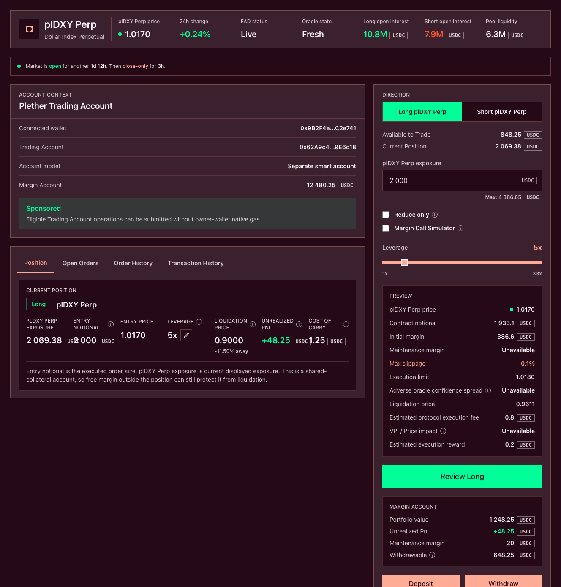
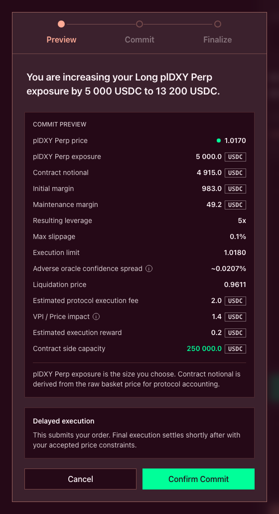

# Open or increase a position

Use the trade ticket to open a **LONG USD** or **SHORT USD** position, or to add exposure to an existing position in the same direction.

Both actions begin with a sponsored submission and then follow Plether’s delayed-order process:


The sponsored operation is **Confirmed** when the order commitment reaches the chain. The position changes only when that committed order later executes.

### Opening and increasing

| Action       | Account state before execution            | Result after execution                           |
| ------------ | ----------------------------------------- | ------------------------------------------------ |
| **Open**     | No live position                          | A new LONG USD or SHORT USD position             |
| **Increase** | A live position in the selected direction | Added exposure merged into the existing position |

Each account holds one combined position direction.

A same-direction increase updates the position’s:

* Total exposure
* Average entry price
* Position margin
* Leverage
* Liquidation price
* Maximum modeled payout
* Future carry basis

Changing direction requires a complete close. Wait for that close to execute before submitting an order in the opposite direction.

### Before submitting an order

Check that:

* The **Market State** is `Open`.
* The Margin Account has enough **Available to Trade**.
* The correct owner wallet and Trading Account are selected.
* Sponsorship is shown as available for the prepared action.
* Any existing position is in the same direction as the intended increase.
* Existing pending orders do not duplicate or conflict with the instruction.

New opening and increase commitments are blocked during:

* FAD close-only operation
* `oracleFrozen`
* Degraded mode
* Router pause
* Protocol setup or inactive trading state

A previously committed order can remain pending if the market becomes close-only while it waits.


>
> Show the `Open` market state, Available to Trade and either an empty Position panel or an existing same-direction position.

### 1. Choose LONG USD or SHORT USD

Choose the direction that matches your view:

| Position      | Market view                                                | Benefits when                   |
| ------------- | ---------------------------------------------------------- | ------------------------------- |
| **LONG USD**  | The dollar strengthens against the Plether currency basket | The displayed perps price rises |
| **SHORT USD** | The dollar weakens against the Plether currency basket     | The displayed perps price falls |

For an increase, select the direction already held by the account.

The dollar-oriented price shown by the interface is:

```
D = 2.00 − B
```

Where:

* `D` is the displayed dollar-oriented perps price.
* `B` is the raw foreign-currency basket used by protocol accounting.

The application handles this conversion when building the order.

### 2. Enter the exposure

Enter the amount you want to add in the exposure field.

For a new position, this becomes the initial exposure.

For an increase:

```
Resulting exposure
= current exposure
+ added exposure
```

The entered increase is an additional amount, rather than the intended final position size. Review **Resulting exposure** before committing.

The execution price determines the added contract notional:

```
Added contract notional
= added exposure × Bexecution
= added exposure × (2.00 − Dexecution)
```

Contract notional is used for:

* The execution fee
* Minimum-order validation
* The execution reward
* Margin calculations
* HousePool capacity and solvency checks

The trade ticket calculates an estimate using current market data. Execution recalculates it using the order’s resolved price.

### 3. Set leverage and margin

The leverage control determines how much USDC the order assigns as position margin.

For the same exposure:

* More margin produces lower leverage and more liquidation headroom.
* Less margin produces higher leverage and less liquidation headroom.

For an increase, the resulting leverage applies to the complete combined position.

Plether checks both assigned position margin and total account equity. After execution:

* Position margin must meet the initial margin requirement.
* Account equity must also meet the initial margin requirement.
* The resulting position must remain above its liquidation threshold.

Free USDC elsewhere in the account can support account health. The position’s assigned margin still has to satisfy its own initial-margin check.

#### How costs affect resulting margin

The simplified position-margin calculation is:

```
Resulting position margin
= position margin after carry
+ submitted margin
− execution fee
− signed VPI
```

A positive VPI is a charge. A negative VPI is a provisional rebate, so subtracting it increases resulting margin.

A provisional VPI rebate remains subject to the position’s lifetime VPI rules and does not provide additional risk equity by itself.

The execution reward is reserved separately and stays outside position margin.

#### Carry on an increase

Creating account reservations can checkpoint and collect carry from an existing position. Additional carry continues accruing while the increase waits in the queue.

Before execution changes the position’s size and carry basis, Plether realizes carry again.

Carry is collected from:

1. Free account USDC
2. Position margin

The increase fails if the account cannot cover all carry due at execution.

Keep enough Available to Trade for:

* Submitted margin
* Execution reward
* Accrued carry
* Possible changes in execution fee or VPI

### 4. Set Max slippage

`Max slippage` determines the acceptable-price boundary.

In the dollar-oriented interface:

| Order                      | Execution condition                                                          |
| -------------------------- | ---------------------------------------------------------------------------- |
| Open or increase LONG USD  | Displayed execution price must stay at or below the maximum acceptable price |
| Open or increase SHORT USD | Displayed execution price must stay at or above the minimum acceptable price |

The application converts this boundary into the equivalent raw-basket target used onchain.

Plether checks the boundary against the execution price after:

1. Selecting the eligible post-commit oracle observation
2. Applying the adverse oracle confidence adjustment
3. Bounding the result within the `0.00–2.00` settlement range

The confidence adjustment moves entry against the trader:

* LONG USD receives a higher dollar-oriented entry price.
* SHORT USD receives a lower dollar-oriented entry price.

`Max slippage` governs this confidence-adjusted execution price. The execution fee, VPI, carry and execution reward are calculated separately.

An unlimited setting submits the order without a target-price check. It can execute at any eligible price within the protocol’s settlement range.

A slippage miss ends the order. Resubmission requires a new commitment.

### 5. Review the preview

The preview projects the complete post-trade position using current account, oracle and HousePool data.

Review:

* Direction
* Exposure being added
* Resulting total exposure
* Estimated execution price
* Max slippage and execution limit
* Added contract notional
* Submitted margin
* Resulting position margin
* Resulting leverage
* Resulting average entry price
* Initial margin requirement
* Maintenance margin requirement
* Liquidation price
* Protocol execution fee
* Signed VPI
* Oracle confidence adjustment
* Pending carry
* Execution reward
* Total amount reserved from Available to Trade
* Projected account equity and health

An invalid preview may show incomplete or zero values when validation stops before the full calculation. Follow the displayed failure reason before changing the order.

The preview uses the current state. Execution runs the calculation again after earlier FIFO orders have been processed and the order’s own oracle price has been resolved.

Price, pool depth, market skew, carry and account balances can all change during that interval.


>
> Show direction, exposure, leverage, margin, execution limit, liquidation price, execution fee, VPI, confidence adjustment and execution reward.


>
> Place the current position beside the projected result. Include total exposure, average entry price, resulting margin, leverage and liquidation price.

### How an increase changes entry price

Plether merges same-direction exposure into one position.

The new entry price is weighted by position size:

```
Resulting entry price
=
(
  current exposure × current entry price
  + added exposure × increase execution price
)
÷ resulting exposure
```

Position margin has no weight in this calculation.

#### Example

Assume:

```
Current exposure:       10,000 at 1.0500
Added exposure:          5,000 at 1.1000
```

The combined position becomes:

```
Resulting exposure
= 10,000 + 5,000
= 15,000
```

```
Resulting entry price
= (10,000 × 1.0500 + 5,000 × 1.1000)
  ÷ 15,000

= 1.0667
```

Now assume:

```
Current position margin:  3,000 USDC
Submitted margin:          1,500 USDC
Execution fee:                15 USDC
VPI charge:                   25 USDC
```

With accrued carry already paid from free account USDC:

```
Resulting position margin
= 3,000 + 1,500 − 15 − 25
= 4,460 USDC
```

The interface then recalculates leverage and liquidation price for the complete `15,000` exposure position.

### 6. Review and commit

Select `Review Long` or `Review Short`.

The review window should repeat:

* Direction
* Added exposure
* Resulting exposure
* Margin submitted
* Resulting position margin
* Execution limit
* Estimated execution fee
* Estimated VPI
* Execution reward
* Resulting leverage
* Liquidation price

Select `Confirm Commit` and approve the wallet authorization. Plether then submits the sponsored Trading Account operation.

The interface reports:


If the wallet signature, sponsorship request or UserOperation submission fails before confirmation, no order is created. Check the operation status before retrying.

After the sponsored commitment confirms:

* Submitted margin enters the pending-order margin bucket.
* The execution reward enters reserved settlement.
* Available to Trade decreases.
* The order enters the global FIFO queue.
* The commitment becomes binding.
* Position exposure remains unchanged until execution.

The current order surface has no trader cancellation function. Submitting another order leaves the original commitment active.

The protocol checks predictable failures during commitment when a sufficiently fresh stored mark is available. Complete validation runs again during execution.

### 7. Wait for execution

Track the order under **Open Orders**. The order’s Pending state is separate from the earlier Pending state of the sponsored operation.

| Status             | Meaning                                                             |
| ------------------ | ------------------------------------------------------------------- |
| **Pending reveal** | Waiting for its turn and an eligible post-commit oracle observation |
| **Executed**       | The position was opened or increased                                |
| **Failed**         | Slippage or an execution-time engine check ended the order          |
| **Expired**        | The maximum order age passed and terminal cleanup is required       |

The global queue follows FIFO ordering. Earlier orders must resolve before later orders can execute.

During live-market execution, Plether uses a unique Pyth basket observation:

* Strictly after the commitment timestamp
* Inside the configured settlement window
* Built from valid basket components
* Within the confidence and publish-time-divergence limits

Execution in the commitment block is blocked.

If `Finalize Trade` becomes available in the interface, manual finalization submits the data needed to process the same pending order. It follows the same FIFO, oracle and acceptable-price rules.


>
> Show `Pending reveal`, the expiry countdown, `Cancel unavailable` and any manual-finalization action.

### Waiting and terminal outcomes

Some conditions leave the order pending:

| Condition                                                     | Result                                                |
| ------------------------------------------------------------- | ----------------------------------------------------- |
| An older FIFO order remains unresolved                        | The order waits                                       |
| The market becomes close-only                                 | The opening or increase waits                         |
| No eligible post-commit oracle observation is available       | The order waits                                       |
| Oracle update data or the attached oracle fee is insufficient | The execution transaction reverts and the order waits |
| The execution attempt provides insufficient engine gas        | The order waits                                       |

Other conditions end the order:

| Condition                                  | Result                              |
| ------------------------------------------ | ----------------------------------- |
| Acceptable price exceeded                  | Order fails                         |
| Opposite position exists at execution      | Order fails                         |
| Carry or costs drain the available margin  | Order fails                         |
| Initial margin requirement fails           | Order fails                         |
| Resulting position falls below the minimum | Order fails                         |
| Directional skew limit is exceeded         | Order fails                         |
| HousePool solvency capacity is exceeded    | Order fails                         |
| Degraded mode is entered before execution  | Order fails                         |
| Maximum order age passes                   | Order expires and can be cleaned up |

On a terminal failure or expiry:

* Committed margin is released.
* Carry may be checkpointed as the reservation is released.
* The execution reward is paid to the account that processes the terminal order.
* Exposure remains unchanged.

If the account is liquidated first, its pending orders are cleared and their execution rewards go to the protocol treasury.

A failed or expired order is not retried automatically.

### 8. Check the executed position

After execution, open the **Position** panel and review:

* Direction
* Total exposure
* Executed increase amount
* Average entry price
* Position margin
* Leverage
* Liquidation price
* Unrealized PnL
* Accrued VPI
* Cost of carry
* Remaining Available to Trade

The executed position is the current account record.

For an increase, the added exposure appears inside the existing position. A failed increase leaves the existing position size and entry price unchanged.

#### Immediate PnL after execution

The position records its entry using the confidence-adjusted execution price. Account valuation uses the accepted unadjusted mark.

This can produce an immediate unrealized loss after execution:

* LONG USD enters above the unadjusted dollar-oriented mark.
* SHORT USD enters below the unadjusted dollar-oriented mark.

The difference reflects the adverse oracle confidence adjustment shown in the trade preview.

Carry begins on a new position after execution. An increased position starts its next carry period from the updated size, margin and LP-backed borrow base.


>
> Show the updated Position panel together with the matching entry in Order History.

### Why an opening or increase may be unavailable

| Message or condition              | What to check                                          |
| --------------------------------- | ------------------------------------------------------ |
| Market is close-only or frozen    | Current Market State and reopening time                |
| Trading is paused or inactive     | Protocol status                                        |
| Insufficient available balance    | Submitted margin, execution reward and accrued carry   |
| Direction conflict                | Existing position and earlier pending orders           |
| Position too small                | Added contract notional and resulting position minimum |
| Initial margin requirement failed | Submitted margin, fees, VPI and total account equity   |
| Skew limit exceeded               | Current LONG USD and SHORT USD imbalance               |
| Solvency or capacity limit        | Available HousePool backing                            |
| Too many pending orders           | Open Orders and the current account limit              |
| Slippage exceeded                 | Execution limit and resolved confidence-adjusted price |
| Oracle execution unavailable      | Oracle status, pending timer and finalization data     |

### Before confirming

* Confirm the Market State is `Open`.
* Confirm the selected direction.
* Distinguish added exposure from resulting exposure.
* Review the combined position after an increase.
* Check resulting margin and leverage after costs.
* Read the acceptable-price boundary.
* Review the execution fee, VPI, carry and execution reward separately.
* Check the liquidation price.
* Account for the binding FIFO commitment.
* Monitor the order until it executes, fails or expires.
