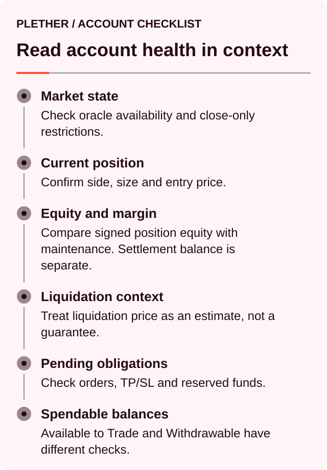
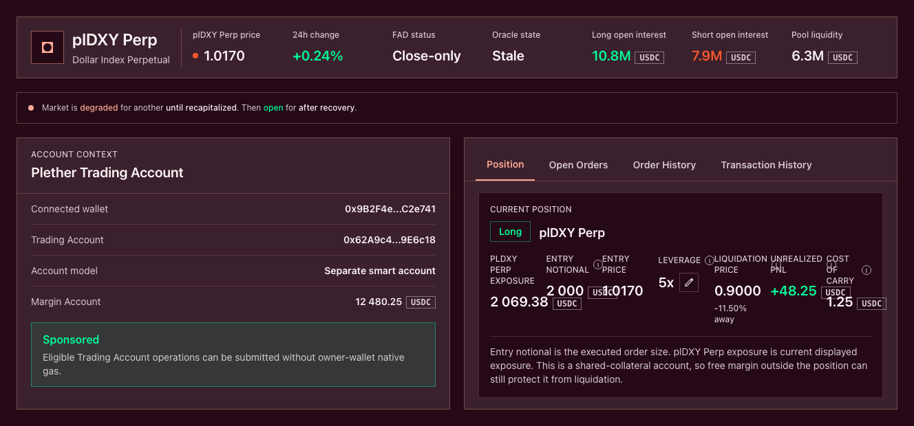
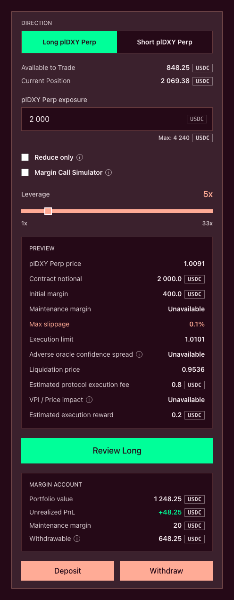

# Read your position and account health

The **Current Position** panel shows executed exposure and price performance. The **Margin Account** shows the collateral supporting that position.

Plether evaluates liquidation with account-wide collateral. Free USDC and eligible margin committed to pending orders can support an open position alongside its assigned position margin.

A useful reading order is:



### Check the market state first

Before relying on a position estimate, check:

* Current Plether Dollar Index mark
* Mark timestamp
* Live, FAD or `oracleFrozen` state
* Protocol degraded-mode status
* Pending orders on the account

Current PnL and health use Plether’s latest stored mark. The health calculation can still display a result when that mark is stale, so the timestamp and oracle state matter.

A new eligible observation may change PnL, maintenance margin and liquidation status.

During a FAD window, Plether applies the active FAD margin requirement. This can reduce account health without any change in the index.

Degraded mode is a protocol-wide containment state. It blocks new exposure and position-backed withdrawals. Closes, liquidations, mark updates and recapitalization remain available.



### Read the Current Position panel

The position panel contains:

| Field                   | Meaning                                                               |
| ----------------------- | --------------------------------------------------------------------- |
| **Direction**           | Whether the position is LONG USD or SHORT USD                         |
| **plDXY Perp exposure** | Current dollar-oriented exposure at the displayed index               |
| **Entry notional**      | Contract notional recorded at the average entry price                 |
| **Entry price**         | Average execution price of the remaining position                     |
| **Leverage**            | Current contract notional relative to assigned position margin        |
| **Liquidation price**   | Estimated index level where account equity reaches maintenance margin |
| **Unrealized PnL**      | Price PnL between entry and the current mark                          |
| **Cost of carry**       | Carry accrued since the last position checkpoint                      |


### Direction

A **LONG USD** position gains when the displayed Plether Dollar Index rises:

```
LONG USD unrealized PnL
= contract quantity × (current index − entry index)
```

A **SHORT USD** position gains when the displayed index falls:

```
SHORT USD unrealized PnL
= contract quantity × (entry index − current index)
```

PnL remains bounded by the protocol’s fixed `0.00–2.00` settlement range.

### Exposure and entry notional

The interface presents the dollar-oriented index:

```
D = 2.00 − B
```

Where:

* `D` is the Plether Dollar Index shown to traders.
* `B` is the underlying basket value used by contract accounting.
* `q` is the position’s contract quantity.

The two position values are derived differently:

```
Displayed plDXY Perp exposure
= q × Dcurrent
```

```
Current contract notional
= q × Bcurrent
```

```
Entry notional
= q × Bentry
```

Displayed exposure follows the public LONG USD and SHORT USD view. Contract notional is used for maintenance margin, leverage, execution fees and liquidation-bounty calculations.

Entry notional stays unchanged between size-changing executions. An increase recalculates the average entry price. A partial reduction lowers the remaining entry notional proportionally while leaving the average entry price unchanged.

### Entry price

Entry price is the size-weighted average execution price of the remaining position.

For an increase:

```
New average entry
=
(existing size × existing entry
+ added size × added execution price)
÷ new total size
```

A pending increase does not alter the entry price. The value changes only after execution.

A partial reduction preserves the entry price of the remaining exposure.

### Current mark

The current mark is the latest accepted oracle observation stored by Plether.

It is used to estimate:

* Current exposure and contract notional
* Unrealized PnL
* Portfolio value
* Maintenance margin
* Current liquidation status
* Withdrawal headroom

The displayed mark is a valuation reference. Order execution occurs later through the FIFO queue and uses the eligible execution-time oracle observation.

Live and FAD-only executions may include the adverse Pyth confidence adjustment. Voluntary closes during `oracleFrozen` use the validated unshifted price and charge the separate frozen-close spread.

### Unrealized PnL

Unrealized PnL reflects price movement between entry and the current mark.

It excludes:

* Pending carry
* A future close execution fee
* Future close VPI
* The frozen-close spread
* The execution reward
* A potential liquidation bounty

Opening fees and opening VPI have already been applied to the account when the position was created or increased.

The eventual close result may differ because the position remains exposed while the close waits for execution.

For the full calculation, see [**How PnL is calculated**](../how-plether-works/how-pnl-is-calculated.md).

### Cost of carry

**Cost of carry** shows unpaid carry accrued since the position’s last checkpoint.

Pending carry:

* Reduces account equity as it accrues
* Continues during stale and frozen oracle periods
* Can consume free USDC or position margin when realized
* Reduces the settlement result of a close
* Can move an account toward liquidation without a price change

A deposit, withdrawal, order reservation, margin adjustment or position change can checkpoint and realize carry.

A partial reduction settles carry accrued by the entire position through execution. The remaining position then begins a new carry period.

### Position margin and leverage

Position leverage is calculated from the contract notional and USDC assigned to the position:

```
Position leverage
=
current contract notional ÷ position margin
```

This is the leverage shown beside the position.

The leverage tooltip may also show effective account leverage:

```
Effective account leverage
=
current contract notional ÷ Portfolio value
```

Effective account leverage includes the effect of free USDC, PnL, carry and other account-wide health adjustments.

Two accounts with the same position leverage can therefore have different liquidation buffers.

#### Adding position margin

Select the edit control beside **Leverage** to move free Margin Account USDC into the position-margin bucket.

Adding position margin:

* Leaves position size unchanged
* Reduces displayed position leverage
* Reduces the LP-backed carry base
* Can lower future carry accrual

This action reclassifies USDC already held in the account. Free USDC already contributes to account-wide liquidation health, so reclassification generally leaves immediate reachable collateral unchanged. Carry may be checkpointed during the transaction.

Depositing new USDC into the Margin Account adds collateral and increases account health.

Direct removal of assigned position margin is unavailable. A reduction releases position margin proportionally, and a full close releases the remainder.


### Read the Margin Account

The account summary separates economic value, free collateral and currently withdrawable USDC.

| Field                        | Meaning                                                                |
| ---------------------------- | ---------------------------------------------------------------------- |
| **Portfolio value**          | Current account equity after PnL, carry and applicable VPI adjustments |
| **Unrealized PnL**           | Price-only PnL of the open position                                    |
| **Maintenance margin**       | Current equity requirement for avoiding liquidation                    |
| **Available to Trade**       | Unencumbered Margin Account USDC                                       |
| **Withdrawable**             | Amount currently permitted to leave the protocol                       |
| **Pending-order margin**     | USDC committed to queued opens or increases                            |
| **Pending execution reward** | USDC reserved for terminal order processing                            |
| **Trader claim**             | Deferred HousePool payment awaiting settlement into the Margin Account |



### Portfolio value

With an open position, **Portfolio value** represents the account’s current risk equity.

The calculation can be summarized as:

```
Terminally reachable collateral
=
Margin Account settlement balance
− pending execution-reward reserves
```

```
Portfolio value
=
terminally reachable collateral
+ unrealized PnL
− pending carry
− applicable VPI rebate clawback
```

Terminally reachable collateral includes:

* Free Margin Account USDC
* Assigned position margin
* Margin committed to pending orders

Pending execution rewards are excluded because they have already been reserved for terminal order processing.

The VPI adjustment applies when the position carries an accumulated negative VPI balance. The risk calculation conservatively accounts for the portion subject to the lifetime rebate clamp.

Portfolio value excludes:

* Trader claims awaiting settlement
* USDC held by another wallet
* Future voluntary-close fees and VPI
* A possible frozen-close spread

The compact account view floors negative Portfolio value at zero. A displayed zero can therefore represent either zero or negative signed equity.

With no open position, Portfolio value corresponds to physically credited Margin Account USDC.

### Available to Trade

Available to Trade is unencumbered settlement USDC:

```
Available to Trade
=
Margin Account balance
− position margin
− committed-order margin
− reserved settlement
```

It can fund:

* New order margin
* Execution rewards
* Trading costs
* Loss settlement
* Withdrawals that pass the withdrawal checks

Unrealized profit increases Portfolio value but does not increase Available to Trade until it is realized and credited.

A pending opening order reduces Available to Trade immediately by reserving margin and its execution reward. Live position size remains unchanged until execution.

Pending carry may still be collected when the next account action checkpoints the position. The usable amount after that checkpoint can therefore be lower than the preceding display.

### Withdrawable

Withdrawable is the maximum amount currently permitted to leave the Margin Account.

For a flat account, it generally equals free USDC after active reservations.

With an open position, Plether also checks:

* Pending carry
* Current account equity
* Initial-margin headroom after withdrawal
* Active FAD requirements
* Mark availability and freshness
* Degraded mode
* Existing account reservations

A simplified calculation is:

```
Withdrawable
=
lower of:

free USDC after carry realization
and
net equity − required post-withdraw initial margin
```

The result is floored at zero.

Withdrawable can be lower than Available to Trade. It becomes zero for an account with an open position when:

* The required mark is unavailable or too stale
* The withdrawal would breach the post-withdraw margin requirement
* The protocol is in degraded mode

Closing or reducing exposure remains available through its separate rules.

### Pending-order margin

Margin committed to an opening or increase remains locked until the order executes or reaches a terminal outcome.

While pending:

* It is unavailable for another order or withdrawal.
* It remains part of the account’s terminally reachable collateral.
* It creates no additional live exposure.
* It can be consumed if the existing position is liquidated.

After execution, the required amount moves into the active position-margin bucket.

### Execution-reward reserves

Every queued order reserves an execution reward.

Once reserved, that USDC:

* Leaves Available to Trade
* Stops contributing to account health
* Pays the account that performs terminal processing
* Remains payable after execution, terminal failure or expiry

A close uses free USDC first. When permitted by close-path risk checks, it can source the reward from assigned position margin.

Position-margin sourcing lowers position margin and account health immediately while the full exposure remains open.

A failed close still pays the execution reward. Review health again before submitting a replacement.

### Trader claims

A trader claim is a HousePool obligation awaiting physical settlement.

Until settled, it remains outside:

* Portfolio value
* Position margin
* Available to Trade
* Withdrawable
* Liquidation protection

Claim settlement credits USDC into the Margin Account. The newly credited amount then contributes to collateral and account health.

A same-account claim may later be netted during terminal close or liquidation settlement, but it does not delay the liquidation threshold.

### Maintenance margin

Maintenance margin is the current equity requirement for the position:

```
Maintenance margin
=
current contract notional × active maintenance margin rate
```

The active onchain parameters determine the rate.

During a FAD window, the FAD margin rate replaces the ordinary maintenance rate. A position can become liquidatable when FAD begins even if its size, collateral and mark remain unchanged.

Use the active value shown by the interface rather than relying on a previously quoted percentage.

### Read account health

Compare signed net equity with maintenance margin:

```
Health ratio
=
net account equity ÷ maintenance margin
```

The same value expressed as a percentage is:

```
Health percentage
=
net account equity ÷ maintenance margin × 100%
```

| Health         | Meaning                                           |
| -------------- | ------------------------------------------------- |
| Above `100%`   | Account is above the current liquidation boundary |
| Exactly `100%` | Position is liquidatable                          |
| Below `100%`   | Position is liquidatable                          |

The protocol test is:

```
Liquidatable when
net account equity ≤ maintenance margin
```

There is no grace period after the condition is reached. An eligible keeper can submit a liquidation.

The absolute buffer is:

```
Liquidation buffer
=
net account equity − maintenance margin
```

This is the amount by which equity currently exceeds the requirement. Both sides of the equation can change: PnL and carry move equity, while price and market state can move maintenance margin.

### Liquidation price

The liquidation price estimates the displayed index level at which equity reaches maintenance margin.

For the public Plether Dollar Index:

* **LONG USD** becomes liquidatable at or below its liquidation price.
* **SHORT USD** becomes liquidatable at or above its liquidation price.

The boundary is inclusive.

The displayed price can change after:

* A USDC deposit or withdrawal
* Carry accrual or realization
* A position increase or reduction
* Adding assigned position margin
* Reserving an execution reward
* Execution of another pending order
* Activation of the FAD margin rate
* A new oracle mark

#### “Not in range”

**Not in range** means the current calculation finds no liquidation threshold inside the fixed `0.00–2.00` settlement range.

Carry, withdrawals, new reservations and FAD can later create an in-range threshold.

#### Execution-time liquidation price

Actual liquidation uses an eligible Pyth observation with the liquidation-specific adverse confidence adjustment:

* LONG USD is evaluated at a lower dollar-oriented price.
* SHORT USD is evaluated at a higher dollar-oriented price.

The central displayed mark may therefore appear short of the projected threshold when the confidence-adjusted liquidation price has already crossed it.

Near the boundary, compare Portfolio value with Maintenance margin and check the account’s liquidatable status. The liquidation-price display remains a projection.

A liquidatable reading based on a stale stored mark does not guarantee immediate keeper execution. The keeper must still provide oracle data eligible under the current market state.

### How pending orders affect health

#### Pending open or increase

Before execution:

* Position size and entry price remain unchanged.
* Unrealized PnL remains based on live exposure.
* Committed margin remains part of terminal collateral.
* The execution reward is excluded from health.
* Available to Trade is lower.

The order preview shows a hypothetical post-execution position. Earlier FIFO orders, carry and the final execution price can change the result.

#### Pending reduction or close

Before execution:

* The complete position remains exposed.
* Carry continues to accrue.
* Liquidation remains possible.
* The close execution reward remains reserved.
* Position margin may already be lower if it funded the reward.

A pending close does not reduce live exposure.

#### Liquidation before execution

If liquidation happens first:

* The position is closed through liquidation.
* Account-local pending orders are cleared.
* Pending execution rewards are forfeited under liquidation cleanup.
* Eligible committed margin can be consumed in terminal settlement.

### Worked example

Assume the account contains:

```
Margin Account balance:          3,000 USDC
Position margin:                 1,500 USDC
Committed-order margin:            500 USDC
Execution-reward reserves:           1 USDC
Trader claim:                      250 USDC

Unrealized PnL:                   −600 USDC
Pending carry:                      40 USDC
VPI rebate clawback:                10 USDC
Maintenance margin:                750 USDC
Initial margin requirement:      1,500 USDC
```

Available to Trade is:

```
Available to Trade
= 3,000 − 1,500 − 500 − 1
= 999 USDC
```

Terminally reachable collateral excludes the execution reward:

```
Terminally reachable collateral
= 3,000 − 1
= 2,999 USDC
```

Portfolio value is:

```
Portfolio value
= 2,999 − 600 − 40 − 10
= 2,349 USDC
```

Health is:

```
Health
= 2,349 ÷ 750
= 313.2%
```

The current liquidation buffer is:

```
Liquidation buffer
= 2,349 − 750
= 1,599 USDC
```

If carry is collected from free USDC, free balance becomes:

```
Free USDC after carry
= 999 − 40
= 959 USDC
```

Initial-margin headroom is:

```
Initial-margin headroom
= 2,349 − 1,500
= 849 USDC
```

Assuming the mark is fresh and no protocol restriction applies:

```
Withdrawable
= lower of 959 and 849
= 849 USDC
```

The separate `250 USDC` trader claim does not enter these calculations. Once settled into the Margin Account, it increases account collateral.

### Common readings

| What you see                                            | Likely explanation                                                                                |
| ------------------------------------------------------- | ------------------------------------------------------------------------------------------------- |
| Portfolio value is higher than Available to Trade       | Position margin, unrealized profit or committed margin contributes to equity but is not free USDC |
| Available to Trade is higher than Withdrawable          | Withdrawal must preserve initial-margin headroom and pass mark/state checks                       |
| Position leverage stays unchanged after depositing USDC | The deposit entered free account collateral rather than assigned position margin                  |
| Health improves while position leverage stays unchanged | Free USDC supports account-wide health                                                            |
| Position margin fell after submitting a close           | Part of the execution reward came from position margin, or carry was realized                     |
| Pending close is visible but exposure is unchanged      | Reductions take effect at execution                                                               |
| Liquidation price shows “Not in range”                  | No threshold exists inside `0.00–2.00` under the current inputs                                   |
| A claim exists beside low Portfolio value               | Claims remain outside Margin Account equity until settlement                                      |
| Withdrawable is zero despite positive Portfolio value   | Mark freshness, degraded mode or post-withdraw margin checks are blocking withdrawal              |

### A practical monitoring routine

1. Check the mark timestamp and market state.
2. Confirm direction and current exposure.
3. Review Unrealized PnL and Cost of carry.
4. Compare Portfolio value with Maintenance margin.
5. Check the liquidation price and distance.
6. Review pending orders and reserved rewards.
7. Read Available to Trade and Withdrawable separately.
8. Account for continued exposure while a close is pending.
9. Deposit additional USDC or reduce exposure before reaching the maintenance boundary.
10. Recheck the account after every order reaches a terminal state.
