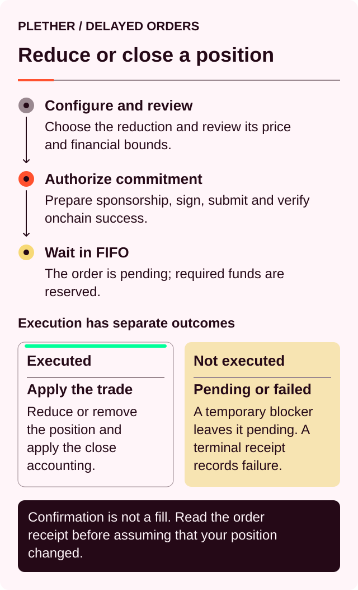
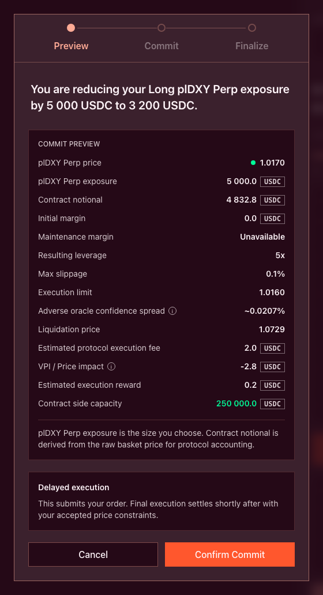
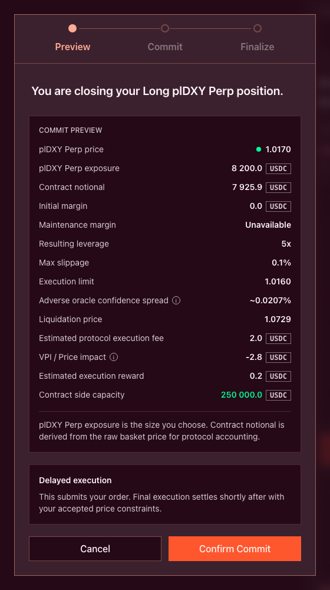
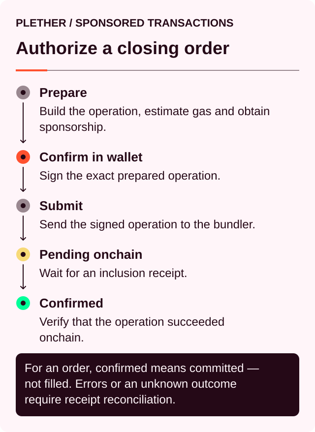
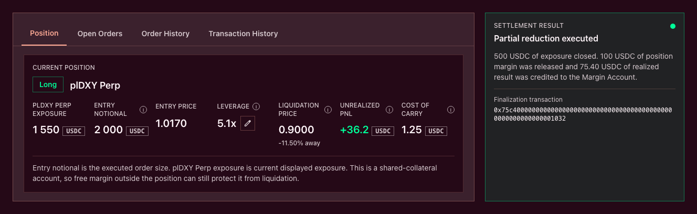
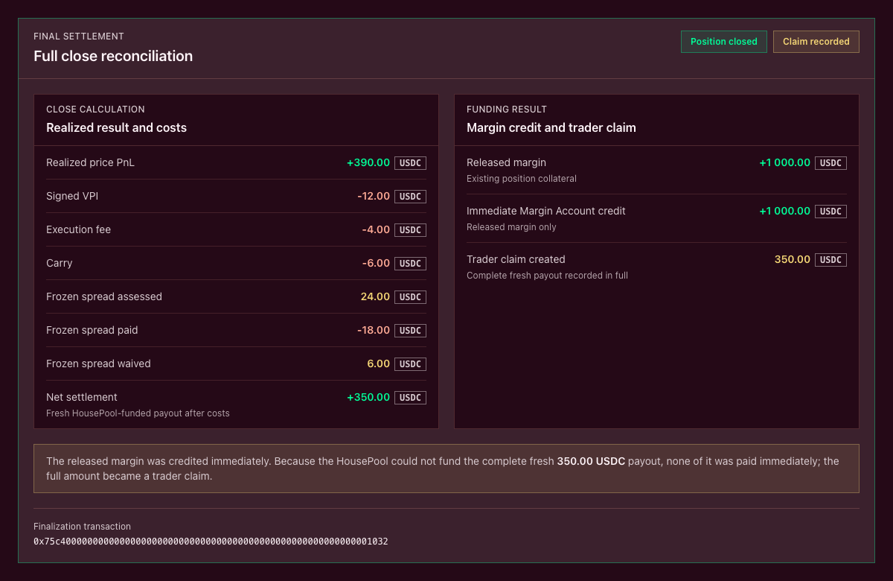

# Reduce or close a position

Reducing removes part of an existing position. Closing removes the complete position.

Both actions begin with a sponsored submission and then use Plether’s delayed-order process:



The sponsored operation is **Confirmed** when the close commitment reaches the chain. The position remains exposed until the committed order later executes.

### Reduce or close

| Action     | Amount submitted                      | Result after execution                                       |
| ---------- | ------------------------------------- | ------------------------------------------------------------ |
| **Reduce** | Less than the available position size | Part of the exposure is settled and the remainder stays open |
| **Close**  | The complete available position size  | The position is settled and removed                          |

A successful partial reduction:

* Realizes PnL[^pnl] on the reduced exposure
* Releases a proportional share of position margin
* Leaves the remaining entry price unchanged
* Updates leverage and liquidation information
* Continues carry[^carry] accrual on the remaining position

A successful full close:

* Realizes PnL on the complete position
* Releases all remaining position margin
* Settles accrued carry
* Ends future carry accrual for that position
* Removes the position from the account

Changing direction requires closing the existing position before opening exposure in the opposite direction.

### Before you start

Check:

* The account has an executed open position.
* Earlier pending closes have been accounted for.
* The close execution reward can be reserved.
* The correct owner wallet and Trading Account are selected.
* Sponsorship is shown as available for the prepared action.
* The acceptable execution price reflects the exit you intend.
* The position has enough liquidation buffer to remain open while the order waits.

Exposure that exists only as a pending opening order cannot be reduced yet. Wait for the opening order to execute first.

Risk-reducing close orders remain available during normal trading, FAD-only[^fad] close windows, `oracleFrozen`, degraded mode and router pause. Usable oracle[^oracle] data, execution-reward backing and the ordinary close validations are still required.


### 1. Choose the amount in the trade ticket

Use the Position panel to review the exposure you currently hold, then create the exit in the trade ticket. The Position panel does not have separate **Reduce** or **Close** controls.

In the trade ticket, enable `Reduce only`. This ensures the order can only reduce or close the current position; it cannot increase exposure or open a position in the opposite direction.

For a partial reduction, enter the amount of exposure to remove. The action becomes `Review Reduce`:

```
Remaining exposure
= current exposure − reduction amount
```

For a full close, select `Current Position` or `Max` to fill the complete amount currently available. The action becomes `Review Close`.

Earlier pending reductions count against the amount available to later orders. If the live position is 10,000 units and an earlier order is already reducing 3,000, only the projected remaining 7,000 units are available to a later close.

Review:

* Current exposure
* Amount being reduced
* Projected remaining exposure

#### Minimum-size rules

Plether rejects:

* A zero-size reduction
* An amount larger than the projected available position
* A partial reduction below the minimum close size
* A partial reduction that leaves insufficient margin on the residual position
* A partial reduction whose settlement obligation cannot be fully funded

A complete close can settle a small residual that falls below the ordinary minimum for partial reductions.

A reduce-only order cannot cross through zero and create exposure in the opposite direction.

### 2. Set the acceptable price

The price boundary protects the exit against an execution price outside the range you accept.

Using the dollar-oriented index displayed by the application:

| Position being reduced | Required execution condition                                          |
| ---------------------- | --------------------------------------------------------------------- |
| **LONG USD**           | Execution price must be at or above the minimum acceptable exit price |
| **SHORT USD**          | Execution price must be at or below the maximum acceptable exit price |

For example, a LONG USD close with a minimum acceptable price of `1.0400` can execute at `1.0400` or higher. A lower result fails the price check.

A SHORT USD close with a maximum acceptable price of `0.9700` can execute at `0.9700` or lower. A higher result fails the check.

During live and FAD-only execution, the price includes the adverse Pyth confidence adjustment:

* LONG USD receives a lower closing price.
* SHORT USD receives a higher closing price.

During `oracleFrozen`, the close uses the validated oracle price without that confidence-based shift. The separate frozen-close spread described below applies instead.

Slippage remains active in every market state. It applies to the execution price; fees, carry, VPI[^vpi] and the frozen-close spread are reviewed separately.

If the interface offers an **Unlimited** setting, it removes the execution-price boundary. The other close requirements continue to apply.



### 3. Review the close preview

The preview estimates the result using the current account, oracle and HousePool state. Execution recalculates the result after all earlier FIFO[^fifo] orders have been processed.

Review:

* Position direction
* Amount being reduced
* Remaining exposure
* Estimated execution price
* Acceptable price
* Released position margin
* Remaining position margin
* Realized PnL
* Execution fee
* Signed VPI
* Estimated carry
* Execution reward
* Immediate payout
* Trader claim created or consumed
* Collateral used to settle a loss
* Potential bad debt on a terminal full close
* Resulting leverage and liquidation price
* Frozen spread assessed, paid and waived, when applicable

A positive VPI value is a charge. A negative value is a rebate. The lifetime VPI clamp prevents the closed portion from receiving more cumulative VPI rebates than it previously paid.

Carry forms part of the final close economics. Depending on the interface, it may be shown separately or reflected in the projected net settlement.

An invalid preview may contain partial or zero economic values. Read the invalid reason before relying on the remaining fields.




### 4. Commit the order

After reviewing the close, confirm the wallet authorization. Plether submits the sponsored Trading Account operation.

The interface reports:



If the wallet signature, sponsorship request or UserOperation[^useroperation] submission fails before confirmation, no close order is created. Check the operation status before retrying.

After the sponsored commitment confirms:

* The order enters the global FIFO queue.
* The close execution reward is reserved.
* The amount counts against exposure available to later close orders.
* The position remains fully open.
* Carry continues to accrue.
* Liquidation rules continue to apply.

The execution reward pays the account that performs terminal order processing. It is separate from the trading execution fee.

Plether funds the reward from free Margin Account USDC[^usdc] first. When necessary, it may reserve a bounded amount from position margin after running the close-path risk checks.

If position margin funds part of the reward:

* Position margin decreases immediately.
* The same amount moves into reserved settlement.
* Exposure remains unchanged until execution.
* Displayed leverage and liquidation buffer can change.

Plether also checkpoints carry before reserving the reward. Carry then resumes while the close is pending.

The commitment fails if the complete reward cannot be backed without violating the applicable risk rules.

Close orders cannot currently be cancelled by the trader.

### 5. Wait for execution

The order appears under **Open Orders**.

While it remains pending:

* The unreduced position continues to move with the market.
* Unrealized PnL continues to change.
* Carry continues to accrue.
* The position can still be liquidated.
* The execution-time market state determines the final pricing path.
* Earlier FIFO orders may change the account state before the close is reached.

A pending close does not provide liquidation protection.

A voluntary full close also does not clear unrelated queued orders. Review the account’s remaining orders after the close. A later opening order may create new exposure after the account becomes flat.

If liquidation occurs first, Plether clears the account’s pending orders and transfers their reserved execution rewards to the protocol treasury.


### How settlement is calculated

Position margin is released in proportion to the exposure being reduced:

```
Released position margin
=
position margin at execution
× reduction amount
÷ current position size
```

PnL is realized only on the reduced exposure:

```
LONG USD realized PnL
= reduced exposure × (exit price − entry price)
```

```
SHORT USD realized PnL
= reduced exposure × (entry price − exit price)
```

The close economics can be summarized as:

```
Net close settlement
=
realized PnL
− signed VPI
− execution fee
− accrued carry
− frozen-close spread, when applicable
```

A negative signed VPI increases the settlement result.

The released margin is accounted for separately:

```
Account movement at execution
≈ released position margin + net close settlement
```

Losses and costs can consume some or all of the released margin. The execution reward was already reserved at commitment and is therefore outside this execution formula.

Any reduction checkpoints carry accrued by the complete position through execution. After a partial reduction, the remaining position begins a new carry period using its reduced margin and LP-backed[^lp] borrow base.

For the underlying calculations, see [**How PnL is calculated**](../how-plether-works/how-pnl-is-calculated.md) and [**Fees, VPI and cost of carry**](../how-plether-works/trading-costs-fees-carry-and-vpi.md).

### After a partial reduction

A successful partial reduction:

* Decreases position size
* Releases the same proportion of assigned position margin
* Reduces the maximum-profit envelope proportionally
* Allocates the position’s accumulated VPI proportionally
* Leaves direction and entry price unchanged
* Recalculates leverage and liquidation information

Rounding remains with the residual position.

Because size and position margin generally fall in the same proportion, isolated leverage may remain close to its previous level. Carry settlement, execution-reward funding, PnL and rounding can change the exact result.

#### Partial reductions must settle in full

A partial reduction can use:

* Free Margin Account USDC
* Margin released by the reduced portion

The residual position margin remains protected. Margin committed to other pending orders and reserved execution rewards also remain protected.

If the available amount cannot cover the complete loss and close costs, the reduction fails with an underwater partial-close result.

A partial reduction cannot:

* Create bad debt
* Waive a frozen-close spread
* Pass an unpaid obligation to the remaining position

The trader can deposit additional USDC, choose a different reduction amount or submit a complete close.

### After a full close

A full close releases all remaining position margin and removes the position.

For a losing full close, settlement can reach:

* Free Margin Account USDC
* All released position margin
* Eligible margin committed to other pending orders
* An existing trader claim belonging to the same account

Reserved execution rewards remain isolated.

If reachable collateral and existing claim value cannot cover the base trading obligation, the uncovered remainder becomes protocol bad debt. The position still reaches its terminal state and the trader is not left with a negative position balance.

Consuming margin committed to other orders can cause those orders to fail when they reach execution.

### Closing while the oracle is frozen

A voluntary reduction or full close executed during `oracleFrozen` is assessed the frozen-close spread.

The current setting is **50 bps[^bps]**, or **0.50%**, of the reduced contract notional[^notional]:

```
Frozen-close spread
= reduced contract notional × 0.50%
```

A reduction of `10,000 USDC` in contract notional therefore carries a `50 USDC` frozen-close spread.

The execution-time market state controls the charge:

* Committed live and executed frozen: spread applies
* Committed frozen and executed live or FAD-only: spread does not apply

During a frozen close:

* The validated oracle price is used without the adverse confidence-price shift.
* Normal signed VPI and its lifetime clamp remain active.
* The slippage boundary remains active.
* The frozen spread is charged separately.
* Confidence-width validation of the oracle data remains active.

The spread is absent from:

* Live-market closes
* FAD-only closes
* Liquidations

Settlement follows this order:

1. Execution fee
2. Base close obligation
3. Frozen-close spread

A partial reduction must fund the complete spread.

A terminal full close may waive only the uncollectible part of the frozen spread. Waived spread does not become bad debt, a trader claim or an LP receivable.

Paid frozen spread belongs entirely to LPs. The preview and the `FrozenCloseSpreadSettled` event expose the assessed, paid and waived amounts.

The active parameter is timelocked, must remain nonzero and cannot exceed `1,000 bps`. The value shown by the current onchain preview is authoritative.

### Immediate payout or trader claim

When a close produces a fresh payment from the HousePool, Plether checks physical settlement liquidity after reserving cash for older trader claims.

The fresh payment follows one complete path:

* Fully credited to the Margin Account
* Fully recorded as a trader claim

A new payment is not split between immediate settlement and a claim.

Released position margin comes from the trader’s existing collateral. After losses and costs have been deducted, the remainder returns to the free Margin Account independently of HousePool payout liquidity.

A trader claim remains outside Available to Trade, account equity and Withdrawable until it is settled. Settlement credits the Margin Account; withdrawal remains a separate action.

An existing same-account claim can later be consumed when settling a losing terminal full close.

See [**Settlement liquidity and trader claims**](../how-plether-works/settlement-liquidity-and-trader-claims.md) for the complete process.

### If the close does not execute

Some conditions leave the order pending for another attempt. These include temporarily unavailable oracle data and a blocked FIFO head.

Terminal outcomes include:

* Acceptable price exceeded
* Requested size no longer matches the executable position
* Partial reduction would leave an invalid residual
* Partial settlement cannot be fully funded
* Order expiry
* Other terminal engine validation failures

After a terminal failure:

* Position size remains unchanged.
* The reserved execution reward is paid to the terminal processor.
* A new close requires a new commitment.
* Any reward taken from position margin remains spent, so the position’s margin and health may be lower than before commitment.

### Example: reducing a LONG USD position

Assume:

```
Current exposure:        10,000
Entry price:             1.0000
Position margin:     2,000 USDC
Reduction amount:         2,500
Exit price:              1.0400
```

The trader reduces 25% of the position.

```
Remaining exposure
= 10,000 − 2,500
= 7,500
```

```
Released margin
= 2,000 × 2,500 ÷ 10,000
= 500 USDC
```

```
Realized PnL
= 2,500 × (1.0400 − 1.0000)
= +100 USDC
```

Assume:

```
Execution fee:      5 USDC
VPI charge:         8 USDC
Accrued carry:     12 USDC
```

The execution settlement is:

```
Net close settlement
= 100 − 5 − 8 − 12
= +75 USDC
```

```
Account movement at execution
= 500 + 75
= +575 USDC
```

The remaining position is approximately:

```
Exposure:          7,500
Entry price:      1.0000
Position margin:   1,500 USDC
```

The execution reward reserved at commitment is separate from these figures.

If HousePool liquidity cannot cover the fresh `75 USDC` payment, the released `500 USDC` returns to the Margin Account and `75 USDC` becomes a trader claim.

### Check the result

After a partial reduction, confirm:

* Remaining exposure
* Unchanged entry price
* Remaining position margin
* Updated leverage
* Updated liquidation price
* Realized PnL
* VPI and carry applied
* Available to Trade
* Any trader claim created

After a full close, confirm:

* The account has no active position.
* All remaining position margin has been released.
* Final PnL and costs appear in history.
* Any frozen spread is itemized.
* The Margin Account reflects released margin and any complete fresh payout funded immediately.
* If HousePool liquidity cannot fund that complete fresh payout, it appears in full as a trader claim instead.
* Remaining pending orders still match your intended exposure.





### Before confirming

* Verify the amount being reduced.
* Check the projected remaining exposure.
* Review earlier pending orders.
* Set the intended exit-price boundary.
* Review PnL, VPI, execution fee, carry and execution reward.
* Check whether the frozen-close spread applies.
* Review remaining leverage and liquidation risk.
* Allow for continued exposure while the order waits.
* Monitor the order until it executes, fails or expires.

[^pnl]: Profit and loss, the financial result of market-price movement on a position.
[^carry]: The time-based cost charged on the portion of a position financed by LP capital.
[^fad]: Friday Afternoon Deleverage, Plether’s wider scheduled close-only window around the weekly FX closure.
[^oracle]: A service that supplies external market data to smart contracts; Plether uses Pyth price feeds.
[^vpi]: Virtual Price Impact, a separate USDC charge or rebate based on how a trade changes HousePool directional imbalance.
[^fifo]: First in, first out; orders at the front of the queue are processed before later orders.
[^useroperation]: A signed smart-account instruction sent to a bundler for onchain inclusion.
[^usdc]: A US dollar-denominated stablecoin Plether uses for margin and settlement.
[^lp]: Liquidity provider, a participant that supplies USDC capital to the HousePool.
[^bps]: Basis points; 100 bps equals 1%.
[^notional]: The face value of a position’s market exposure, not the amount of collateral posted.
