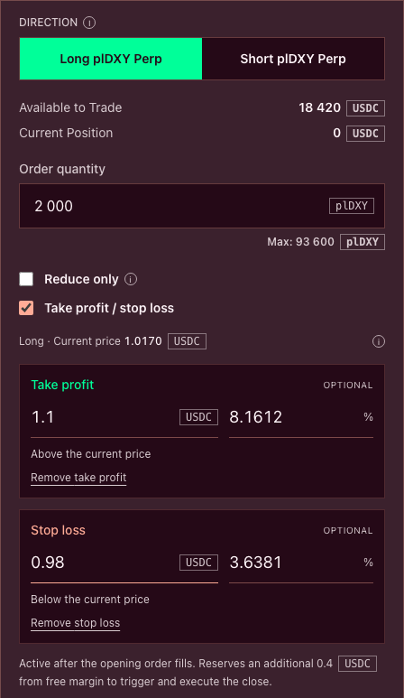
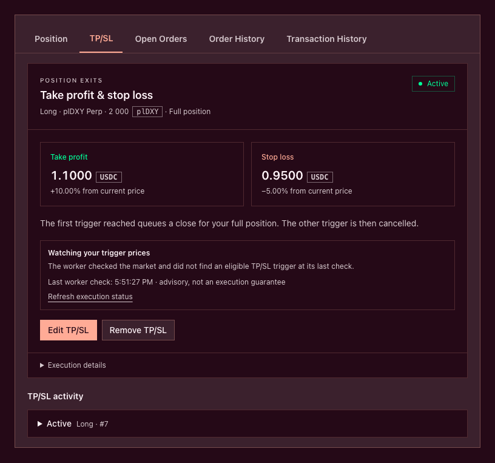
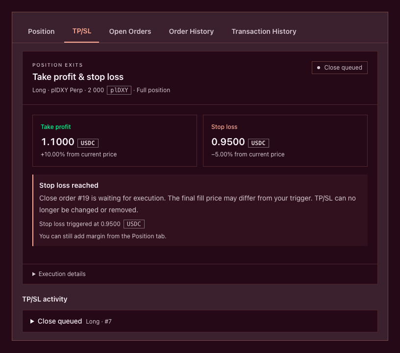
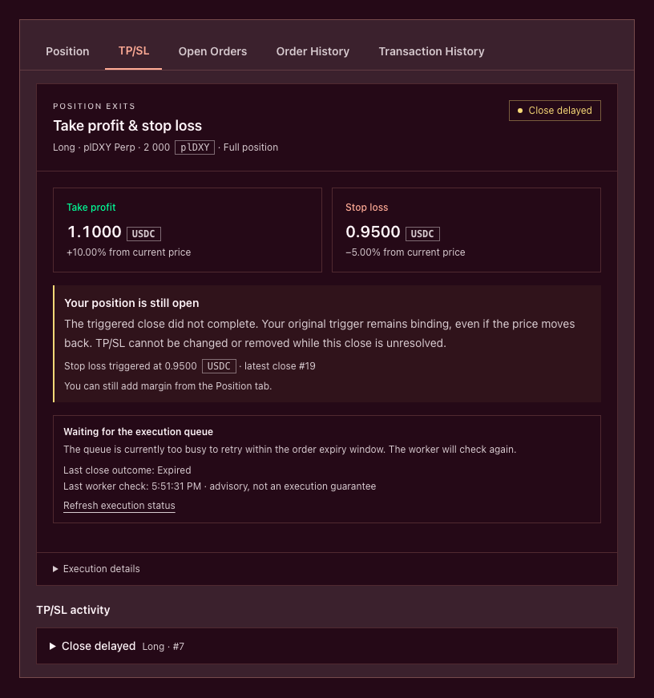
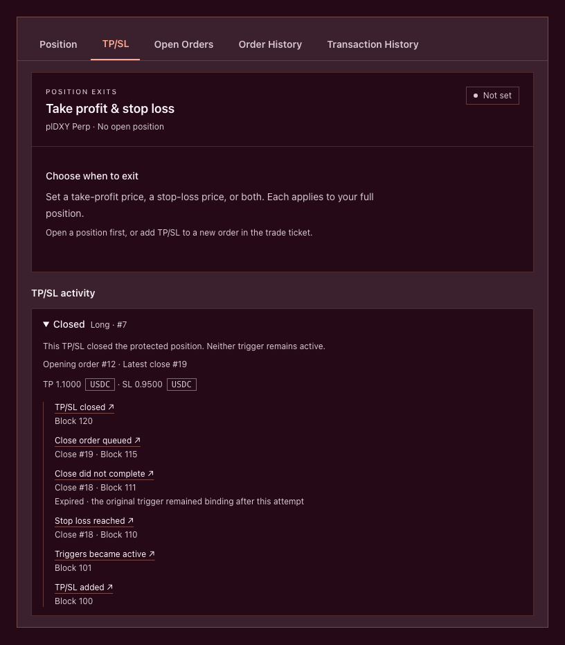

# Take profit and stop loss

Take profit (TP) and stop loss (SL) set price conditions for automatically closing your plDXY Perp position. You can set either trigger or both. Each applies to the **full position**, not a partial reduction.

When an eligible oracle price reaches a trigger, a keeper submits a transaction that queues a full-position close. The close then waits for execution. If both triggers are set, the first one accepted onchain determines the exit and the other is cancelled.


A trigger price is not a guaranteed fill price or maximum loss. Your position remains exposed to price changes, carry and liquidation until the close executes. A chart crossing alone does not confirm that a trigger or close has been processed.


Screenshots below use the current application components in Storybook with illustrative values. They are not live trades or execution guarantees.

### Choose your trigger prices

Use the dollar-oriented plDXY Perp price displayed in the application. The application converts it into the raw basket price used by the contracts; you do not need to invert it yourself.

| Position | Take profit | Stop loss |
| --- | --- | --- |
| Long plDXY Perp | Above the current displayed price | Below the current displayed price |
| Short plDXY Perp | Below the current displayed price | Above the current displayed price |

Each trigger has two editable fields:

* **Price**, in USDC: the absolute trigger price.
* **Gain** or **Loss**, in percent: a positive percentage distance from the current displayed price. Position direction determines whether the resulting price is above or below the market.

Editing either field recalculates the other when a valid current price is available. You can enter one trigger as a price and the other as a percentage. Prices support up to eight decimal places; percentages support up to four. Calculated percentage distances are rounded down to four decimals.

For example, at a displayed price of 1.00 USDC, a long position with a 5% gain trigger and a 3% loss trigger has TP at 1.05 and SL at 0.97. For a short position, those distances give TP at 0.95 and SL at 1.03. These are illustrative inputs, not recommended settings.

**Gain/Loss is price movement, not leveraged return or net PnL.** It is measured from the current price used by the editor, not necessarily your entry price, and excludes fees, carry and VPI. Read [How PnL is calculated](../how-plether-works/how-pnl-is-calculated.md).

While you edit a percentage, its calculated price can move with the market. Review fixes the absolute trigger prices for confirmation. Saved triggers do not trail the market or reset to a new percentage distance. Their displayed distance from the current price can change while their absolute prices stay fixed.

### Attach TP/SL to a new position

1. Configure a new opening order in the trade ticket.
2. Select **Take profit / stop loss** and enter one or both triggers.
3. Review the opening order, trigger prices and additional execution reserve.
4. Authorize the sponsored operation in your wallet and wait for onchain confirmation.
5. Check the **TP/SL** tab below the chart. Attached triggers show **Waiting for position** until the opening order fills, then **Active** when armed.

Opening-order confirmation is not an opening fill. Attached triggers cannot protect a position before it exists. If the opening order does not execute successfully, inspect its outcome and protection record rather than assuming the triggers became active.

The trade-ticket checkbox attaches triggers to a **new position**, not to an increase or reduction. For an existing position or protection, it is greyed out; its information tooltip directs you to the TP/SL tab. Selecting **Reduce only** hides the checkbox. Feature availability also depends on the deployment and service configuration.

### Add TP/SL to an existing position

1. Open the **TP/SL** tab below the chart.
2. Select **Add TP/SL**. The position must exist and its pending orders must have finished.
3. Enter one or both triggers, then select **Review TP/SL**.
4. Check the prices, **100% of the position**, execution reserve and activation timing.
5. Select **Confirm TP/SL**, authorize the wallet request, and wait for **TP/SL saved** and **Active**.

Only one active protection record can control the account at a time. If protection already exists, use **Edit TP/SL** instead of creating a second pair.

### Execution reserve and sponsorship

Creating TP/SL reserves USDC from free margin for the trigger bounty and close-order execution bounty. Attaching TP/SL to an opening order requires this additional reserve as well as the opening order's normal margin and reward.

Use the amount shown in the review: it comes from the deployment's configured bounties, not a fixed fee promised by this guide. For example, if each bounty is 0.2 USDC, the additional reserve is 0.4 USDC.

Gas sponsorship does not pay this USDC reserve or remove normal trading costs. When available, it pays network gas for an eligible create, edit or remove operation that you authorize. Triggering, retrying and executing a close are separate keeper transactions.

**Execution details** shows the remaining reserve, protection reference and latest close-order reference. Removing untriggered protection releases its unpaid reserve. See [Gas-sponsored trading](gas-sponsored-trading-and-your-plether-trading-account.md) and [Trading costs](../how-plether-works/trading-costs-fees-carry-and-vpi.md).

### Edit or remove TP/SL

You can edit or remove protection while it is **Waiting for position** or **Active**.

* **Edit TP/SL** opens the editor. Existing triggers remain in place until the replacement prices confirm onchain.
* **Remove TP/SL** asks for a separate confirmation. It does **not** close the position. If attached to a pending opening order, that order remains committed and can still fill without TP/SL.

If the account, position or protection changes during review, go back and review it again. A trigger may also be processed before an edit or removal confirms; opening the editor does not pause monitoring.

While protection controls the position, discretionary order submission is blocked. To increase, reduce or manually close the position, remove its untriggered TP/SL first and wait for confirmation. You can still add margin from the Position tab.

Once protection is **Close queued** or **Close delayed**, it cannot be edited or removed. Removal is not a way to cancel an already-triggered exit.

### Understand every protection state

These states are separate from the wallet's sponsored-operation status and the linked order's execution status.

| Interface status | Contract status | Meaning |
| --- | --- | --- |
| Not set | None | No active TP/SL record is selected. Older records may still appear in activity. |
| Waiting for position | PendingOpen | Triggers are attached to an opening order but are not active yet. |
| Active | Armed | An eligible trigger can queue a full close. The close has not necessarily started. |
| Close queued | Triggered | A trigger was accepted and a close order was queued. Execution has not necessarily completed. |
| Close delayed | Latched | A close attempt failed, but the original triggered exit remains binding. Protection is unresolved. |
| Closed | Executed | TP/SL successfully closed the protected position. Neither trigger remains active. |
| Not completed | Failed | Protection ended without a successful TP/SL close. Check the position and order outcome; do not assume the position is closed. |
| Removed | Cancelled | TP/SL was removed. This did not close a position or cancel its opening order. |
| Liquidated | Liquidated | The protected position was liquidated. Its triggers are no longer active. |

#### Close delayed: what “latched” means

A failed close attempt does not reset a triggered protection to ordinary price watching. The original exit stays binding **even if the price moves back across the trigger**. A retry does not need another crossing.

The current protection worker automatically considers retries for expired close attempts. It checks pending account orders, oracle availability and whether the queue can plausibly process a retry within its expiry window. Queue cleanup may be necessary first. These checks reduce unnecessary retries; they do not guarantee execution.

Failures outside the supported expiry case show **Operator review required** instead of being retried automatically. This is an operational alert, not permission to bypass contract rules or a statement that the position has closed. Contact support with the protection reference, linked close-order reference and transaction hash. Never share your seed phrase or private key.

While the close is unresolved, keep checking account health. You can add margin, but cannot edit or remove latched TP/SL. The interface leaves retries and finalization to keepers; it does not offer a wallet-operated retry button.

### Automatic execution status

The **Automatic execution status** notice is the worker's latest observation. It is advisory, not proof of an onchain transaction or an execution guarantee. Check its timestamp alongside protection and linked-order states.

| Notice | Meaning |
| --- | --- |
| Watching your trigger prices | The last check did not find an eligible trigger. |
| Preparing the close / Preparing a retry | An eligible action was identified; a new close is not confirmed yet. |
| Waiting for live prices / Waiting for a usable oracle price | Oracle conditions prevent progress. New triggers are paused while the oracle is frozen. |
| Waiting for your pending orders | Another account order must finish before a retry. |
| Waiting for the execution queue / Clearing an expired queue entry | Queue conditions or cleanup are delaying a retry. |
| Operator review required | The failure is outside the worker's automatic retry policy. |
| Automatic execution is paused | The worker is in monitoring-only mode. Onchain TP/SL has not been removed. |
| Execution check did not complete | The worker could not finish checking or preparing a transaction. A retry is not confirmed. |
| Waiting for updated contract state | The worker observed a different state; the current onchain state takes precedence. |

If the observation is unavailable or stale, there is no reliable fresh check to rely on. Refresh and inspect contract/order status rather than assuming a close was submitted.

Closing the browser does not remove onchain triggers or require your wallet to remain connected for a keeper to act. However, keepers, RPC access and valid oracle updates remain dependencies for timely execution.

### Oracle, queue and liquidation limitations

Trigger evaluation requires an eligible oracle observation after protection was armed. A chart tick, an old price or an unavailable oracle update is not proof that the contracts accepted a trigger.

New triggers are paused during `oracleFrozen`. An already-triggered close has a separate lifecycle: an eligible latched retry can still be queued under the applicable rules, and execution remains subject to the market's close policy. An oracle freeze does not cancel an already-triggered exit.

Once queued, the close follows the order router's execution process. Trigger and execution prices can differ; TP/SL is not a resting limit order and does not promise a fill at the trigger. See [How orders execute](../how-plether-works/how-orders-execute.md) and [Market states and oracle closures](../how-plether-works/market-states-and-oracle-closures.md).

TP/SL does not suspend liquidation, stop carry while a position remains open or guarantee immediate settlement of a profitable close. A successful close can still produce a [trader claim](check-and-settle-a-trader-claim.md).

### Check activity and troubleshoot

**TP/SL activity** lists protection records. Expand one to inspect trigger prices, opening/close references and events such as **TP/SL added**, **Triggers became active**, **Trigger prices updated**, **Exit price reached**, **Close order queued**, **Close did not complete**, **TP/SL removed** and **Protection finished**. Transaction links open the corresponding onchain actions.

In this completed example, the current panel shows **Not set** because no protection remains active. The expanded **Closed** record below preserves the earlier trigger, failed attempt, retry and final close.

Use **Order History** for the linked order outcome. A failed close attempt is not the same as terminally failed protection: **Close delayed** means the triggered exit remains unresolved.

If activity is unavailable, use **Try again**. Indexing can lag behind confirmation; an activity error alone does not remove protection or prove that a transaction failed. Check the current TP/SL state and transaction before submitting another operation.

If creation or editing is rejected because sponsorship or new protection is disabled, a wallet signature has not necessarily created onchain protection. Check for a confirmed transaction and the current record. Service availability and stored contract state are separate. See [Trader troubleshooting](trader-troubleshooting.md).
