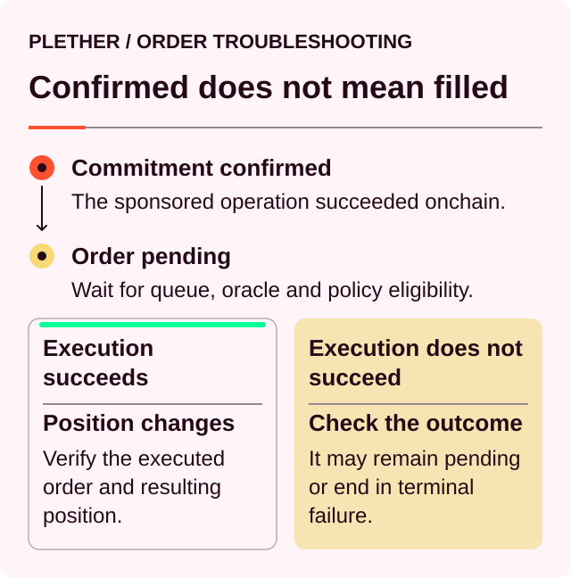
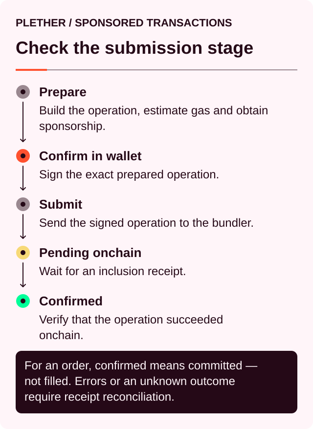
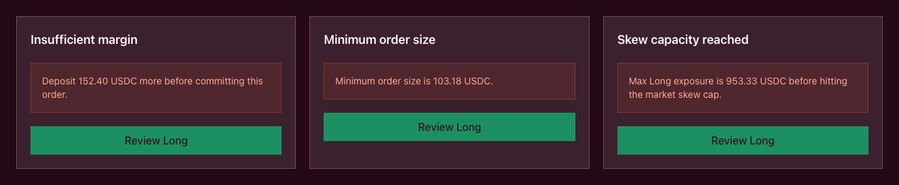

# Trader troubleshooting

Plether actions can stop at different stages. A rejected wallet signature, unavailable sponsorship, a rejected or dropped UserOperation[^useroperation], a pending order and a terminally failed order require different responses.

Start by checking the operation and onchain state before submitting another action.

### Check these first

1. Confirm the connected owner wallet and active Trading Account.
2. Confirm the supported network.
3. Check the sponsorship status and any UserOperation hash.
4. Check the market state and oracle[^oracle] timestamp.
5. Open **Open Orders** and **Order History**.
6. Inspect any linked transaction hash in the block explorer.
7. Refresh the application.

Do not commit a replacement order until the original is absent from **Open Orders**. A second commitment creates another binding order with its own margin and execution-reward reservations.

### Identify the current state

| What you see                       | Onchain result                         | Next step                                                     |
| ---------------------------------- | -------------------------------------- | ------------------------------------------------------------- |
| Wallet-signature rejected          | Nothing was authorized or submitted    | Review the request and sign again only if it matches your intent |
| Sponsor unavailable                | No sponsored operation was accepted    | Wait for recovery or contact support if it persists            |
| Sponsor rate-limited               | No sponsored operation was accepted    | Wait a moment, then request a fresh operation                  |
| Bundler rejected                   | UserOperation was not submitted onchain | Read the simulation or policy error and request a fresh operation |
| Pending onchain                    | Inclusion is not yet known             | Check the UserOperation hash; do not submit a duplicate        |
| Dropped by bundler                 | Usually nothing was submitted onchain  | Check for a transaction hash, then request a fresh operation   |
| Failed onchain (commit)             | No order was created                   | Read the contract error and adjust the order                   |
| Order appears in Open Orders       | Order is Pending                       | Wait for execution conditions or expiry                       |
| Keeper execution attempt reverted  | Order usually remains Pending          | Refresh and continue monitoring keeper processing             |
| Order appears as Failed            | Order is terminal                      | Create a new order after addressing the cause                 |
| Order appears as Executed          | Position settlement is final           | Refresh account and position data                             |
| App timed out after submission     | Result may still be pending             | Check the UserOperation and transaction hashes before retrying |

A successful commitment only creates an order. The position changes only after that order executes; depending on the action, its size, entry price or both may change.



### My sponsored operation did not confirm

The sponsored-submission lifecycle is:



These failures occur before the delayed order lifecycle:

#### Wallet-signature rejected

The owner wallet rejected or did not complete the authorization. Nothing was submitted, and Plether cannot create the signature on the user’s behalf.

Check the network, Trading Account, action, USDC[^usdc] amount and recipient before trying again.

#### Sponsor unavailable

The sponsor service did not approve gas funding. No sponsored operation or order was accepted.

Existing positions, carry[^carry], pending orders and liquidation rules continue while sponsorship is unavailable. The current application has no owner-wallet or self-funded fallback, so wait for service recovery or contact support if the problem persists.

#### Sponsor rate-limited

The request reached a sponsorship rate limit. Wait a moment and request a fresh operation. Repeated submissions do not bypass account or service limits.

#### Bundler rejected

The bundler[^bundler] refused the UserOperation because simulation, nonce, account state, gas limits or bundler policy did not pass. No order was created.

Refresh the Trading Account and request a newly prepared operation. A stale signed operation should not be resubmitted after account state changes.

#### Dropped by bundler

The bundler accepted the UserOperation but stopped tracking it before confirmed inclusion.

1. Check the UserOperation hash for a linked transaction hash.
2. Check **Open Orders** for an order ID.
3. Request a fresh sponsored operation only when neither exists.

A replacement normally requires a new wallet signature, nonce and sponsorship decision.

### I cannot review or commit an open or increase

Common causes include:

* The wallet is disconnected or on the wrong network.
* The plDXY price or oracle publish time is unavailable.
* The order size is zero or below the minimum.
* Available to Trade cannot cover the margin and execution reward.
* The requested margin fails the initial-margin requirement.
* The account already holds a position in the opposite direction.
* The account has reached its pending-order limit.
* The requested direction exceeds the current skew[^skew] limit.
* The HousePool cannot admit the additional maximum liability.
* The market is close-only.
* The account has an open position and the protocol is in degraded mode.
* New risk commitments are paused.

The interface may show messages such as:

* **Deposit … USDC more before committing this order**
* **Minimum order size is …**
* **Max Long/Short exposure is … before hitting the market skew cap**
* **Reduce or close the current position first**
* **Trade preview is unavailable**
* **You already have … pending orders**

Adjust the size, leverage or margin according to the displayed reason. Market-state, skew and solvency limits may require waiting for protocol conditions to change.

A reverted sponsored commitment rolls back the complete action. No order, margin reservation or execution-reward reservation remains.



See [**Open or increase a position**](open-or-increase-a-position.md), [**Market states and oracle closures**](../how-plether-works/market-states-and-oracle-closures.md) and [**Solvency at a glance**](../how-plether-works/the-housepool-and-tranche-waterfall.md#solvency-at-a-glance).

### I cannot reduce or close

Check the following:

* An executed position exists.
* The selected direction matches that position.
* Earlier pending reductions have not already reserved the requested size.
* The reduction does not exceed the remaining unreserved position.
* The residual position will remain above the minimum size.
* The account can reserve the complete close execution reward.
* A partial reduction can fully pay its losses and costs.

Exposure from a pending open cannot be reduced yet. Wait for the open order to execute.

#### Another order is already closing the position

Pending close orders reserve their requested position size. If existing orders already cover the full position, the interface blocks another reduction.

Wait for the keeper to execute the earlier order or clean it up after expiry.

#### The remaining position would be too small

Reduce a smaller amount or submit a full close.

#### The partial reduction would be underfunded

A partial reduction must fully cover its obligation, including:

* Trading loss
* Execution fee
* Signed VPI[^vpi]
* Carry
* Frozen-close spread, when applicable

Add collateral, reduce a smaller amount or submit a terminal full close.

A full close can consume all reachable collateral and record a genuine uncovered trading obligation as bad debt. During `oracleFrozen`, only an uncollectible frozen-close spread may be waived.

Full-close treatment does not bypass slippage, expiry, oracle validation or execution-reward backing.

Close commitments remain available at contract level during degraded mode and while new risk commitments are paused.

See [**Reduce or close a position**](reduce-or-close-a-position.md).

### My order remains Pending

An order can remain pending because:

* Earlier orders are ahead in the global FIFO[^fifo] queue.
* The first eligible post-commit Pyth observation is not available yet.
* The order is still protected by same-block execution rules.
* A keeper[^keeper] has not finalized it.
* Historical oracle data could not be fetched or validated.
* Oracle confidence is too wide.
* Basket component timestamps are not sufficiently aligned.
* An open order reached execution during a close-only state.
* An earlier expired order needs cleanup.
* The execution attempt supplied insufficient gas.
* The order has not yet crossed its expiry time.

A close-only block on a previously committed open leaves the order pending under the current contracts. The current maximum order age is 60 seconds, while scheduled close-only periods last much longer, so the blocked opening expires before the market reopens and then waits for keeper cleanup.

While an order is pending:

* Committed opening margin remains reserved.
* The execution reward remains reserved.
* A pending open creates no position exposure.
* A pending close removes no position exposure.
* The executed position continues accruing PnL[^pnl] and carry.
* The executed position remains liquidatable.

Pending orders cannot be cancelled or repriced. They end through execution, terminal failure or expiry cleanup.

The current sponsored interface leaves finalization and expired-order cleanup to the keeper. Keep monitoring **Open Orders**; the owner wallet is not asked to select **Finalize Trade** or **Clean Up** and does not pay native gas for either step.

See [**How orders execute**](../how-plether-works/how-orders-execute.md) and [**Why is my order pending or failed?**](why-is-my-order-pending-or-failed.md).

### The keeper has not finalized my order

A reverted keeper transaction usually leaves the order Pending.

Possible causes include:

* Finalization was attempted too early.
* Eligible historical Pyth data was unavailable.
* The Pyth update expired before confirmation.
* The Pyth fee changed.
* Oracle confidence was too wide.
* Basket component publish times diverged.
* An earlier FIFO order blocked execution.
* The transaction supplied insufficient gas.
* The network, RPC[^rpc] or oracle-data service was unavailable.

Open **Open Orders** and check whether the order is still present.

If it remains Pending and has not expired, no trader action is required. The keeper can retry after the transient condition changes.

If a keeper transaction confirmed, also check **Order History**. A confirmed transaction can produce either `OrderExecuted` or a terminal `OrderFailed` result.

If the row becomes **Expired**, the interface shows **Keeper cleanup in progress** and **Keeper processing** until cleanup removes it. The app does not expose manual finalization or owner-wallet cleanup for the current sponsored Trading Account.

### My order Failed

A Failed order cannot execute later. Creating another trade requires a new commitment.

Terminal reasons include:

* Expiry
* Slippage exceeded
* Execution-time engine rejection
* Account liquidation
* Unexpected engine failure

After an ordinary failure:

* The requested position change is not applied.
* Any remaining committed opening margin is released.
* The reserved execution reward is paid to the keeper or other account that processed the terminal result.
* The account’s pending-order count decreases.

The execution reward is spent even though the position change failed.

#### Slippage exceeded

The eligible execution price, including the oracle confidence adjustment, crossed the acceptable-price boundary.

Use a new preview. Increase slippage only after reviewing how much execution-price movement you are prepared to accept.

#### Order expired

An **Expired** row can remain under **Open Orders** until keeper cleanup makes it terminal.

Cleanup releases committed opening margin and pays the reserved execution reward to the cleanup keeper. After **Order History** shows **Expired / Cleaned up**, a new order is required.

#### Account liquidated

Liquidation removes the position and marks all of that account’s pending orders as Failed.

See [**Why is my order pending or failed?**](why-is-my-order-pending-or-failed.md) for the detailed failure lifecycle.

### My operation succeeded, but the position did not change

Check which operation or transaction succeeded.

A successful deposit changes the Margin Account. A successful sponsored commit creates a pending order. A successful keeper cleanup removes an expired order. Only successful order execution changes the position.

Review:

* Transaction events
* UserOperation hash
* Order ID
* Open Orders
* Order History
* Position size and entry price

If the order reached a terminal failure, the position remains unchanged.

### My deposit failed

Check:

* Trading Account USDC balance
* Deposit amount
* Active Trading Account
* Network
* Sponsorship status
* Owner-wallet Arbitrum Sepolia ETH when a transfer is required

The deposit modal includes both Trading Account and owner-wallet MockUSDC in **Available to deposit**. The testnet welcome flow normally funds the derived Trading Account directly. If the requested amount exceeds that balance, the application first transfers the exact shortfall from the owner wallet. That regular token transfer requires Arbitrum Sepolia ETH for gas.

After the required USDC is at the Trading Account address, the owner wallet authorizes one sponsored Trading Account operation. It batches:

1. An exact approval to the Margin Clearinghouse.
2. A deposit for the same amount.

If the owner-wallet transfer confirms but the sponsored operation fails, the transferred USDC remains at the Trading Account address. Retry the deposit from the same modal or refresh first. The application will not request the completed shortfall transfer again once the updated balance is visible.

#### The deposit succeeded, but Available to Trade increased by less

Depositing into an account with an open position checkpoints carry. Some of the deposited USDC may be collected against accrued carry.

Review:

* Margin Account balance
* Available to Trade
* Cost of carry
* Position margin
* Transaction events

A deposit increases free Margin Account USDC. To assign part of it directly to the current position, use **Edit Position Margin** and **Add margin**.

See [**Your Margin Account**](your-margin-account.md).

### I cannot add position margin

Adding position margin requires:

* The owner wallet controlling the Trading Account to be connected
* An existing open position
* Sufficient free Margin Account USDC
* An amount greater than zero

Carry is realized before the margin is assigned. If free USDC is insufficient after that carry collection, reduce the amount or deposit additional USDC first.

Position margin can be added directly. Releasing assigned position margin requires reducing or closing the position.

### Withdrawable is zero or my withdrawal failed

Withdrawable can be lower than the Margin Account balance or Available to Trade.

Common causes include:

* Position margin is locked.
* Pending orders reserve margin.
* Execution rewards remain reserved.
* Carry reduced the available balance.
* An open position does not have enough post-withdraw margin.
* The live mark required for an open-position withdrawal is stale.
* The protocol is in degraded mode.

An account with an open position must preserve the higher of the applicable initial-margin and current maintenance or FAD[^fad] requirement after withdrawal.

A flat account can still have funds reserved by pending orders and execution rewards.

Try:

* Reducing the withdrawal amount
* Waiting for keeper execution or cleanup of pending orders
* Waiting for a fresh mark
* Adding collateral
* Reducing or closing the position

Trader withdrawals are paid from the Margin Clearinghouse. HousePool payout liquidity and trader-claim coverage do not determine ordinary Margin Account withdrawals.

A reverted withdrawal leaves the account balance unchanged.

See [**Your Margin Account**](your-margin-account.md) and [**Read your position and account health**](read-your-position-and-account-health.md).

### The execution price differs from the preview

The preview uses the current market and account state. Execution uses the eligible oracle observation reached later through FIFO.

Differences can come from:

* Market movement while the order waits
* Adverse oracle-confidence adjustment
* Earlier orders changing market skew
* A change in market state
* Rounding

For the dollar-oriented price shown in the interface:

| Action                     | Acceptable-price condition                         |
| -------------------------- | -------------------------------------------------- |
| Open or increase LONG USD  | Execution at or below the maximum acceptable price |
| Open or increase SHORT USD | Execution at or above the minimum acceptable price |
| Reduce or close LONG USD   | Execution at or above the minimum acceptable price |
| Reduce or close SHORT USD  | Execution at or below the maximum acceptable price |

A voluntary close during `oracleFrozen` uses the validated frozen basket and the fixed `50 bps`[^bps] frozen-close spread. The usual adverse confidence price shift is removed for this path, while confidence-width validation and signed VPI remain active.

See [**How orders execute**](../how-plether-works/how-orders-execute.md) and [**Market states and oracle closures**](../how-plether-works/market-states-and-oracle-closures.md).

### My realized result differs from Unrealized PnL

Unrealized PnL reflects the price movement from entry to the current mark.

Final settlement can also include:

* Execution fee
* Signed VPI
* Carry
* Execution-price confidence adjustment
* Frozen-close spread
* Rounding

The execution reward is reserved separately when the order is committed.

Compare the final execution result with the close preview and transaction details rather than the displayed Unrealized PnL alone.

See [**How PnL is calculated**](../how-plether-works/how-pnl-is-calculated.md) and [**Fees, VPI and cost of carry**](../how-plether-works/trading-costs-fees-carry-and-vpi.md).

### Available to Trade is lower than expected

Available to Trade excludes:

* Assigned position margin
* Committed-order margin
* Reserved execution rewards

Carry can also reduce the balance when an account action checkpoints it.

Unrealized profit can contribute to Portfolio value before it becomes free Margin Account USDC. Released margin follows separately. At realization, the complete fresh HousePool-funded payout is either credited immediately in full or recorded in full as a trader claim, depending on HousePool settlement liquidity.

### My liquidation price or account health changed

Check for changes in:

* Current mark
* Unrealized PnL
* Carry
* Position margin
* Free Margin Account USDC
* Pending-order reservations
* Execution-reward reservations
* Current FAD margin requirement

Account health uses physically reachable Margin Account collateral and excludes reserved execution rewards. Pending carry reduces equity before it is collected.

Actual liquidation uses an adverse confidence-adjusted oracle price. A position close to the boundary can therefore become liquidatable before the central displayed mark reaches the estimated liquidation price.

If **Liquidation price** shows **Not in range**, the projected threshold is outside the protocol’s bounded settlement range under the current position state.

See [**Margin, leverage and liquidation**](../how-plether-works/margin-leverage-and-liquidation.md) and [**Read your position and account health**](read-your-position-and-account-health.md).

### My close is pending while liquidation risk is increasing

The complete position remains active until the close executes.

During the wait:

* PnL continues moving.
* Carry continues accruing.
* The position remains liquidatable.
* The close execution reward has already been reserved.
* Position margin may already have been used to back that reward.

Depositing additional USDC can improve account-wide health while leaving position size unchanged.

If liquidation executes first:

* The position is removed.
* Every pending order for the account becomes Failed.
* Reserved execution rewards are forfeited to the protocol treasury.
* Committed-order margin may be consumed by terminal settlement.
* Any remainder is released.
* Released margin follows separately; a complete fresh positive payout is either credited immediately in full or recorded in full as a trader claim.

Liquidation applies no new VPI delta and no frozen-close spread.

### What each market state means for troubleshooting

| Market state                | Trader effect                                                                                                                                                |
| --------------------------- | ------------------------------------------------------------------------------------------------------------------------------------------------------------ |
| **Open**                    | Opens, increases, reductions and closes are available subject to normal checks                                                                               |
| **FAD close-only**          | Opens are blocked; closes use live post-commit pricing, the FAD margin requirement and no frozen-close spread                                                |
| **Oracle frozen**           | Opens are blocked; voluntary closes use the validated frozen basket, signed VPI and the fixed `50 bps` spread                                                |
| **Degraded**                | Opens and withdrawals backed by an open position are blocked; deposits, margin additions, closes, liquidations and flat-account withdrawals remain available |
| **Risk commitments paused** | New opens are blocked; close commitments and existing order execution remain available at contract level                                                     |

An oracle-frozen close can still become unavailable if the stored basket exceeds the extended staleness limit.

Carry continues accruing through FAD, oracle-frozen and stale periods.

See [**Market states and oracle closures**](../how-plether-works/market-states-and-oracle-closures.md).

### I have a trader claim but cannot settle it

Settlement requires:

```
Recognized HousePool assets
≥
Total outstanding trader claims
```

The condition applies to aggregate claims. Cash sufficient for one individual claim does not make that claim serviceable during an aggregate shortfall.

Claim settlement processes the Trading Account’s complete claim balance. Retrying while coverage remains insufficient cannot make the claim serviceable and may be rejected during simulation.

Successful settlement credits the Margin Account. Moving the USDC to the wallet requires a separate withdrawal.

An existing claim may also be consumed against a shortfall from a losing terminal full close or liquidation.

See [**Check and settle a trader claim**](check-and-settle-a-trader-claim.md) and [**Settlement liquidity and trader claims**](../how-plether-works/settlement-liquidity-and-trader-claims.md).

### Open Orders and Order History disagree

**Open Orders** reads the current onchain queue. **Order History** and **Transaction History** depend on indexed events and may update later.

If an order disappears from Open Orders:

1. Check its commit or keeper transaction receipt.
2. Look for `OrderExecuted` or `OrderFailed`.
3. Refresh Order History.
4. Check the current position and Margin Account.

A history API error does not change the onchain order state.

Avoid submitting a replacement while the result remains unclear.

### Information to provide when reporting a problem

Include:

* Owner-wallet address
* Trading Account address
* Network
* UserOperation hash
* Order ID
* Commit transaction hash
* Keeper finalization or cleanup transaction hash, when shown in Order History
* Approximate time
* Market state
* Exact error message
* Screenshot of Open Orders
* Screenshot of Order History
* Screenshot of the relevant Margin Account or position field

Never share a seed phrase, private key or wallet recovery code.

[^useroperation]: A signed smart-account instruction sent to a bundler for onchain inclusion.
[^oracle]: A service that supplies external market data to smart contracts; Plether uses Pyth price feeds.
[^usdc]: A US dollar-denominated stablecoin Plether uses for margin and settlement.
[^carry]: The time-based cost charged on the portion of a position financed by LP capital.
[^bundler]: A service that packages smart-account operations and submits them for onchain inclusion.
[^skew]: The imbalance between aggregate LONG USD and SHORT USD exposure.
[^vpi]: Virtual Price Impact, a separate USDC charge or rebate based on how a trade changes HousePool directional imbalance.
[^fifo]: First in, first out; orders at the front of the queue are processed before later orders.
[^keeper]: A permissionless actor or bot that submits order-finalization or protocol-maintenance transactions.
[^pnl]: Profit and loss, the financial result of market-price movement on a position.
[^rpc]: Remote Procedure Call, an interface used to communicate with a blockchain node.
[^fad]: Friday Afternoon Deleverage, Plether’s wider scheduled close-only window around the weekly FX closure.
[^bps]: Basis points; 100 bps equals 1%.
