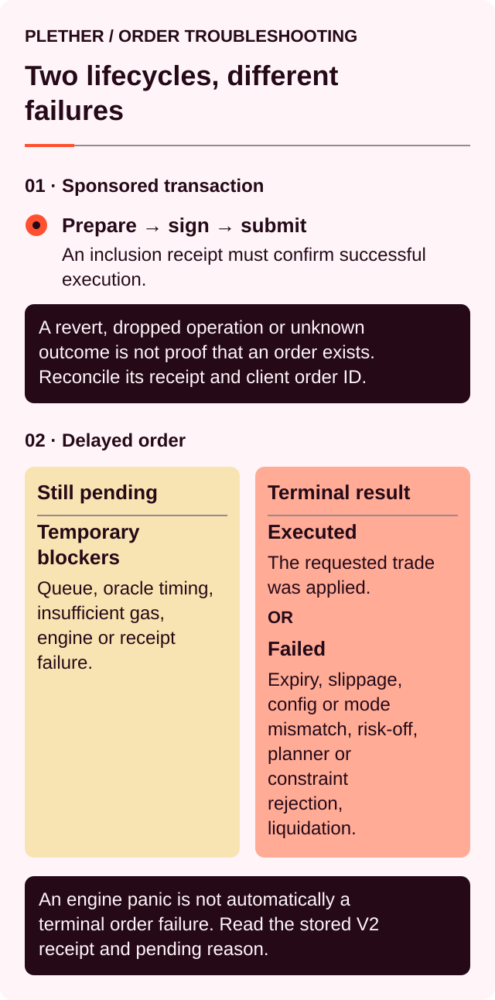

# Why is my order pending or failed?

An action can fail before an order exists or after a confirmed order commitment. These are separate lifecycles and require different responses.



The sponsored operation is **Confirmed** when the commitment call succeeds onchain and creates an order ID. The order then enters Plether’s global FIFO[^fifo] queue with its own **Pending** status. Margin and execution-reward reservations become active while the requested position change waits for execution.

A **Failed** order has reached a terminal state. The same order cannot execute later.

Committed orders cannot be cancelled, resized or given a new acceptable price.

### First identify what failed

| What you see                              | Does an order exist?        | Meaning                                                                  |
| ----------------------------------------- | --------------------------- | ------------------------------------------------------------------------ |
| **Wallet signature rejected**             | No                          | The owner wallet did not authorize the prepared action                   |
| **Sponsorship unavailable / rate-limited** | No                          | The sponsor did not approve gas funding for this attempt                 |
| **Bundler rejected**                      | No                          | The bundler refused the UserOperation before submission                  |
| **Pending onchain**                       | Not yet known               | The UserOperation is waiting for inclusion; do not submit a duplicate    |
| **Dropped by bundler**                    | Usually no                  | The bundler stopped tracking it; check for a transaction receipt first   |
| **Failed onchain**                        | No                          | The included commitment call failed and reservations reverted            |
| Order appears under **Open Orders**       | Yes                         | The commitment succeeded and the order remains Pending                   |
| **Keeper execution attempt failed**       | Yes, usually still Pending  | The delayed execution attempt reverted                                   |
| **Order failed**                          | No longer active            | An onchain `OrderFailed` event made the order terminal                    |
| **Expired** under Open Orders             | Yes, awaiting keeper cleanup | Its lifetime passed, but terminal cleanup is still required              |
| **Expired / Cleaned up** in Order History | No longer active            | The expired order has been terminally removed                            |
| **Executed**                              | No longer active            | The requested position change completed                                  |

A confirmed UserOperation[^useroperation] or transaction does not always mean the trade executed. A commitment only creates the order, and a later keeper transaction can confirm while emitting `OrderFailed`.

Check **Order History** for the terminal result.

### UserOperation hash versus transaction hash

A sponsored smart-account action can expose two different identifiers:

| Identifier             | What it identifies                                                                                                  |
| ---------------------- | ------------------------------------------------------------------------------------------------------------------- |
| **UserOperation hash** | The signed smart-account operation sent to the bundler; it can exist before any onchain transaction includes it     |
| **Transaction hash**   | The onchain transaction submitted by the bundler; it can contain one or more UserOperations                         |

Use the UserOperation hash to check sponsorship and bundler[^bundler] status. Once included, its receipt should identify the transaction hash. Use the transaction hash to inspect the block, EntryPoint events and Plether contract events.

A UserOperation hash is not interchangeable with a transaction hash. A dropped UserOperation may never receive a transaction hash. Conversely, a confirmed bundler transaction does not by itself prove that the specific UserOperation’s inner Plether call succeeded.

For an order commitment, the strongest confirmation is:

1. The UserOperation receipt shows successful inclusion.
2. The transaction receipt shows the successful Plether commitment event.
3. An order ID appears under **Open Orders** or **Order History**.

### A quick troubleshooting sequence

1. Check the sponsored operation status and UserOperation hash.
2. If included, open the linked transaction hash and check whether the commitment call succeeded.
3. Find the order ID under **Open Orders**.
4. Check its expiry countdown.
5. Check whether the market is live, FAD-only[^fad] or `oracleFrozen`.
6. Read the latest keeper-progress or oracle[^oracle] message.
7. Wait for automatic keeper[^keeper] processing.
8. If the order is **Expired**, leave it for keeper cleanup and continue monitoring **Open Orders**.
9. If **Order History** shows a terminal failure, request a new preview and create a new order.

Do not submit a replacement until you know whether the original order is still Pending. A replacement creates another binding FIFO order.

### The sponsored commitment failed

Failures before successful inclusion include:

* Sponsorship unavailable
* Sponsor rate limit reached
* Invalid owner signature or stale operation
* Invalid nonce
* Failed smart-account simulation
* Bundler policy rejection
* Dropped by bundler before inclusion

These failures create no order ID and no margin or execution-reward reservation.

If the UserOperation is included but the commitment call reverts, the attempted state changes revert atomically. No order or reservation remains. The sponsored submission can still consume network gas, but Plether pays that gas for an eligible sponsored operation rather than charging the owner wallet’s native-token balance.

The underlying commitment call can fail for:

| Commit error                     | Typical cause                                                                                   |
| -------------------------------- | ----------------------------------------------------------------------------------------------- |
| Insufficient free USDC           | Available to Trade cannot cover the margin and execution reward                                 |
| Too many pending orders          | The account has reached the active pending-order limit                                          |
| Position too small               | The opening or partial reduction is below the minimum supported size                            |
| Insufficient initial margin      | Size and margin would create excessive leverage                                                 |
| Opposing position                | The account already has exposure in the other direction                                         |
| Skew limit                       | The requested direction would exceed the current skew boundary                                  |
| Solvency limit                   | The liquidity pool cannot admit the requested maximum liability                                      |
| Close-only or frozen market      | New exposure is unavailable in the current market state                                         |
| Degraded mode                    | New risk is blocked                                                                             |
| Router pause or pool restriction | Risk-increasing commits are temporarily unavailable                                             |
| Invalid reduction                | No executed position exists, the side differs or earlier queued reductions already use the size |
| Close reward unavailable         | Eligible account collateral cannot safely back the execution reward                             |

Correct the displayed sponsorship, account or ticket issue and request a fresh operation. Use **Retry Commit** only after the previous UserOperation is confirmed failed or dropped and no order ID exists.

### Why an order remains Pending

#### It is behind an earlier global order

Plether processes all accounts through one global FIFO queue.

An order can execute after every earlier unresolved order has:

* Executed
* Failed
* Expired and been cleaned
* Been removed during liquidation cleanup

Your Open Orders list shows account-local orders. It does not show the complete global queue ahead of them.

A temporary problem at the global head delays every later order. FIFO does not prioritize reductions and closes. An opening order blocked by a close-only state can therefore delay a later close until the earlier order becomes executable or expires.

Expired-head cleanup is bounded per transaction. Several expired orders may require multiple keeper calls.

#### It is waiting for the post-commit price

During live and FAD-only execution, Plether requires:

```
execution block > commit block
```

and:

```
oracle publish time > commit time
```

The execution price comes from the unique first eligible Pyth basket observation inside the order’s historical settlement window.

A keeper cannot skip that observation and select a later, more favorable price.

Immediately after commitment, the interface may show:

* **Pending**
* **Waiting for reveal**
* **Pending reveal**

Wait for the next eligible observation and FIFO processing.

#### The historical oracle payload is unavailable

The keeper needs Pyth data covering the order’s specific execution window.

A finalization attempt can revert because of:

* Missing update data
* Historical data retrieval delay
* Hermes rate limiting
* Pyth update fee changing before submission
* Failure to identify a unique post-commit tick
* Confidence width above the permitted limit
* Basket component timestamps too far apart
* Invalid or out-of-order oracle data

These failures normally leave the order Pending.

The current sponsored interface leaves these retries to the keeper. Keep the order under **Open Orders** and monitor its status; the owner wallet is not asked to fetch price data or submit a finalization transaction.

Retries still target the order’s eligible historical observation. They do not move the order to the latest market price.

#### The market became close-only

An open or increase committed while live remains Pending if it reaches execution during:

* A FAD close-only window
* `oracleFrozen`

At protocol level it could execute if risk-increasing trading resumed before expiry. On the current deployment, however, the maximum order age is 60 seconds and scheduled close-only periods last much longer, so such an order expires before reopening and then waits for keeper cleanup.

| Market state                       | Open or increase                          | Reduce or close                           |
| ---------------------------------- | ----------------------------------------- | ----------------------------------------- |
| Live                               | Eligible under historical execution rules | Eligible under historical execution rules |
| FAD-only                           | Blocked and remains Pending               | Eligible under live historical rules      |
| `oracleFrozen`                     | Blocked and remains Pending               | Eligible under frozen-market rules        |
| Frozen data beyond its allowed age | Blocked                                   | Ineligible unless eligible data arrives before expiry |

A voluntary frozen close uses the validated unshifted oracle price, retains slippage and normal signed VPI[^vpi], and pays the separate frozen-close spread.

#### A finalization attempt was too early

During live and FAD-only execution, same-block execution and observations published at or before commitment are rejected.

The keeper transaction reverts and the order stays Pending. A later keeper attempt can retry after the same-block restriction has passed.

#### The keeper finalization transaction lacked enough gas

Insufficient forwarded gas prevents the execution attempt from reaching the engine.

The order and its reservations remain unchanged. The keeper can retry with a sufficient gas limit; the owner wallet does not configure this transaction in the current interface.

#### Keeper or network delay

A confirmed commitment still requires a keeper to submit the finalization transaction.

RPC[^rpc] interruptions, congestion, keeper downtime and delayed Pyth caching can extend the wait.

The trade modal continues to show keeper progress. It does not expose **Finalize Trade** for the current sponsored Trading Account.

### Keeper-operated finalization

The underlying order-execution function is permissionless, but the current sponsored interface does not expose an owner-wallet manual-finalization route. Plether’s keeper supplies the execution transaction, the required Pyth update data and any native-token Pyth fee.

For an ordinary terminal result processed by the keeper, the reserved USDC[^usdc] execution reward is credited to the keeper account. If liquidation clears the order first, the reward is forfeited to the protocol treasury. The owner wallet is not charged native gas for keeper processing.

#### A keeper finalization attempt failed

A reverted keeper transaction usually leaves:

* Order status: Pending
* Committed margin: reserved
* Execution reward: reserved
* Position: unchanged by that attempt

No trader action is required. Refresh **Open Orders** and continue monitoring. The keeper can retry while the order remains Pending or clean it up after strict expiry.

#### Finalization confirmed without a result for your order

A transaction can advance or clean earlier FIFO orders without reaching the selected order.

If the transaction confirms without an `OrderExecuted` or `OrderFailed` event for your Order ID:

1. Refresh **Open Orders**.
2. Check whether earlier orders were removed.
3. Confirm whether the selected order is still Pending.
4. Continue monitoring keeper processing.

### What remains reserved while Pending

#### Open or increase

A pending open or increase reserves:

* Submitted order margin
* Execution reward

Committed margin:

* Leaves Available to Trade
* Cannot be withdrawn or reused
* Remains part of terminally reachable account collateral
* Creates no live exposure before execution

The execution reward:

* Leaves Available to Trade
* Stops contributing to account health
* Remains reserved for terminal processing

An existing position keeps its current size, entry price, PnL[^pnl] and carry[^carry] exposure until the increase executes.

#### Reduce or close

A close normally reserves only its execution reward.

Plether uses free Margin Account USDC first. When permitted, it can source a bounded part from assigned position margin.

Position-margin funding can:

* Lower position margin at commitment
* Increase displayed leverage
* Reduce account health
* Leave the complete position exposed

Carry may also be checkpointed while the reward is reserved.

A pending close provides no liquidation protection.

### Expired orders and keeper cleanup

The active onchain maximum order age determines expiry. Use the countdown shown by the interface.

The contract treats an order as expired only when the block timestamp is strictly greater than its commit time plus the maximum order age. After that boundary, the order is ineligible for trade execution, but reservations remain until terminal cleanup.

An expired order continues to:

* Hold committed opening margin
* Hold its execution reward
* Count toward the pending-order limit
* Leave a pending close’s position fully exposed

The current sponsored interface changes the status to **Expired** and shows **Keeper cleanup in progress** and **Keeper processing**. It does not submit cleanup from the owner wallet.

Cleanup:

* Emits `OrderFailed` with reason `Expired`
* Removes the order from the queue
* Releases committed opening margin
* Pays the execution reward to the keeper that processes the cleanup
* Records **Expired / Cleaned up** in Order History

Cleanup remains subject to global FIFO. An earlier unexpired order cannot be skipped, so the expired row can remain visible until the earlier queue head progresses.

The interface can reach zero slightly before the contract considers the order strictly older than its maximum age. The keeper waits for the strict onchain boundary and retries; no owner-wallet action is required.

### What Failed means

A terminal failure emits `OrderFailed`, removes the order from the queue and makes another execution attempt impossible.

The requested trade is not applied. Earlier orders and separate carry checkpoints may already have changed the account since commitment.

For an ordinary terminal failure:

* Remaining committed opening margin is released.
* The execution reward is paid to the keeper or other terminal processor.
* The proposed execution fee and VPI are not charged.
* A new order is required.
* Existing position exposure continues unless another action changed it.

### Failure reasons in Order History

#### Failed: Slippage exceeded

The execution price fell outside the committed acceptable-price boundary.

Using the dollar-oriented index shown by the application:

| Action                     | Required execution condition                   |
| -------------------------- | ---------------------------------------------- |
| Open or increase LONG USD  | Price at or below the maximum acceptable price |
| Open or increase SHORT USD | Price at or above the minimum acceptable price |
| Reduce or close LONG USD   | Price at or above the minimum acceptable price |
| Reduce or close SHORT USD  | Price at or below the maximum acceptable price |

A target of **Infinity** disables this price check.

Live and FAD-only checks use the adverse confidence-adjusted execution price. A frozen voluntary close uses the unshifted validated price; its frozen-close spread is charged separately.

Slippage failure is terminal for that observation. A later favorable price cannot revive the same order.

Before resubmitting:

* Check the current index.
* Review the applicable confidence adjustment.
* Set a new boundary deliberately.
* Request a fresh preview.

#### Failed: Engine rejected

The engine found the order invalid against execution-time state.

An open or increase can be rejected because:

* The account still holds an opposing position.
* The resulting position is below minimum size.
* Fees, VPI or accrued carry drain the usable margin.
* Initial margin is insufficient.
* Current skew[^skew] exceeds the admitted limit.
* Pool solvency capacity is insufficient.
* The protocol entered degraded mode.
* Earlier terminal settlement consumed margin reserved for the order.

A reduction or close can be rejected because:

* Requested size exceeds the current position.
* Earlier orders changed the available exposure.
* The residual position would be too small.
* Remaining margin would fall below the applicable minimum.
* A partial reduction cannot fully settle its losses and costs.
* A frozen partial reduction cannot pay its complete frozen-close spread.

Refresh the position, account and preview before submitting again.

#### Failed: Account liquidated

The account became liquidatable before the order executed.

Plether then:

* Liquidates the live position
* Clears the account’s pending orders
* Marks them failed due to liquidation
* Uses eligible committed margin during terminal settlement
* Releases any remaining committed reservation
* Forfeits pending execution rewards to the protocol treasury

Review the liquidation result and current Margin Account before creating new exposure.

#### Failed: Engine panic

The engine encountered an unexpected internal failure.

Save:

* Order ID
* Commit transaction hash
* Reveal transaction hash
* Block number
* Current market state

Contact the team if the failure persists.

#### Expired / Cleaned up

The order passed its lifetime and was removed without executing.

Committed opening margin is released. The execution reward is paid to the keeper that cleaned the order.

Submit a fresh order if the trade is still required.

### Reservation outcomes

| Outcome                          | Committed opening margin                         | Execution reward               |
| -------------------------------- | ------------------------------------------------ | ------------------------------ |
| Pending                          | Remains reserved                                 | Remains reserved               |
| Executed                         | Becomes active position margin as applicable     | Paid to terminal processor     |
| Slippage or engine failure       | Released to free Margin Account USDC             | Paid to terminal processor     |
| Expired and cleaned              | Released to free Margin Account USDC             | Paid to cleanup keeper         |
| Keeper transaction reverts       | Unchanged                                        | Unchanged                      |
| Liquidation happens first        | May be consumed before any remainder is released | Forfeited to protocol treasury |

For a failed close whose reward came from position margin, that margin remains spent because the reward is paid to the processor.

### Why a valid preview can still fail

The preview uses current account and protocol state. Execution occurs later, after earlier global FIFO activity.

The result can change through:

* Price movement
* Carry accrual
* Execution fees and VPI at the final price
* Earlier orders changing account exposure
* Earlier orders changing market skew
* Pool liability or solvency changes
* Margin being consumed during terminal settlement
* FAD or frozen-market activation
* Degraded mode
* Liquidation

For example, an opposite-direction open may be queued behind a full close. If the close fails its slippage check, the later opening order reaches execution while the original position still exists and is rejected.

### Why Available to Trade has not fully recovered

After failure, possible causes include:

* The order is expired but has not yet been cleaned by a keeper.
* Another pending order still reserves margin.
* Another execution reward remains reserved.
* The failed close reward was paid from position margin.
* Carry was checkpointed or realized.
* Terminal close or liquidation settlement consumed committed margin.
* The interface is waiting for the history indexer to catch up.

Open Orders are read from onchain state, while Order History is indexed separately. A processed order may briefly disappear from Open Orders before appearing in history.

### Common interface situations

| What you see                                                      | What to do                                                                                    |
| ----------------------------------------------------------------- | --------------------------------------------------------------------------------------------- |
| Sponsorship unavailable or rate-limited                            | Wait a moment or for service recovery; no order exists                                          |
| Dropped by bundler and no transaction hash exists                   | Request a fresh sponsored operation                                                            |
| Bundler transaction confirmed but no order appears                 | Inspect the UserOperation receipt and Plether commitment event                                 |
| Keeper execution attempt failed, but order remains in Open Orders | Continue monitoring; the keeper can retry                                                      |
| Order disappeared and position did not change                     | Check Order History for a terminal failure                                                    |
| Order History shows Type: Commit and Status beginning **Failed:** | Commitment succeeded; later execution failed before producing trade activity                  |
| Failed row shows Not executed for price and size                  | The order reached a terminal state without applying the trade                                 |
| Expired row remains visible                                       | Wait for the strict expiry boundary and FIFO keeper cleanup                                    |
| Maximum pending-order message                                     | Wait for existing orders to execute, fail or be cleaned by a keeper                            |
| Close remains Pending while position health falls                 | Deposit collateral if appropriate and monitor liquidation; the close has not reduced exposure |
| History has not appeared yet                                      | Refresh after the indexer updates and verify the transaction onchain                          |

### Before creating a replacement

1. Confirm the original order is absent from Open Orders.
2. Check its terminal status in Order History.
3. Refresh the current position and Margin Account.
4. Review other pending orders.
5. Check live, FAD and frozen-market state.
6. Request a new preview.
7. Review carry and account health.
8. Set a new acceptable price.
9. Confirm the new execution reward.
10. Monitor the replacement until it reaches a terminal state.

[^fifo]: First in, first out; orders at the front of the queue are processed before later orders.
[^useroperation]: A signed smart-account instruction sent to a bundler for onchain inclusion.
[^bundler]: A service that packages smart-account operations and submits them for onchain inclusion.
[^fad]: Friday Afternoon Deleverage, Plether’s wider scheduled close-only window around the weekly FX closure.
[^oracle]: A service that supplies external market data to smart contracts; Plether uses Pyth price feeds.
[^keeper]: A permissionless actor or bot that submits order-finalization or protocol-maintenance transactions.
[^vpi]: Virtual Price Impact, a separate USDC charge or rebate based on how a trade changes pool directional imbalance.
[^rpc]: Remote Procedure Call, an interface used to communicate with a blockchain node.
[^usdc]: A US dollar-denominated stablecoin Plether uses for margin and settlement.
[^pnl]: Profit and loss, the financial result of market-price movement on a position.
[^carry]: The time-based cost charged on the portion of a position financed by LP capital.
[^skew]: The imbalance between aggregate LONG USD and SHORT USD exposure.
