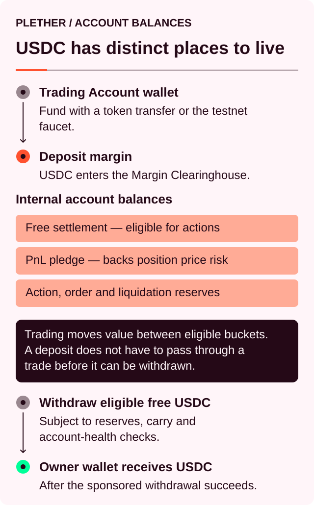
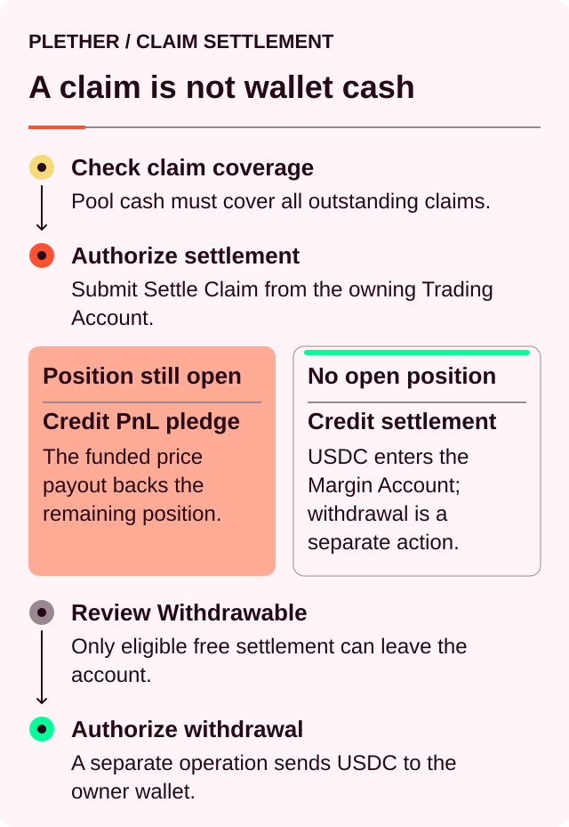

# Your Margin Account

Every Plether trade settles through a USDC[^usdc] Margin Account associated with the **Trading Account**.

The connected owner wallet signs for the Trading Account, but the Trading Account owns the positions, orders, Margin Account and trader claims. Deposits credit the Margin Account. Orders reserve parts of it. Position margin supports open exposure. Fees, VPI[^vpi], carry[^carry] and realized PnL[^pnl] update it. Eligible USDC can then be withdrawn to the owner wallet.



### Three places USDC can appear

| Balance                  | Where it exists                                                                        | What it can do                                                        |
| ------------------------ | -------------------------------------------------------------------------------------- | --------------------------------------------------------------------- |
| **Owner-wallet USDC**    | At the connected owner-wallet address, outside the Trading Account and Plether         | Can fund the in-app deposit flow through an owner-paid token transfer when required |
| **Trading Account USDC** | At the Trading Account address, outside Plether’s Margin Account                       | Can fund a sponsored deposit; it is not yet trading collateral        |
| **Margin Account USDC**  | In Plether’s internal clearinghouse accounting under the Trading Account address       | Can become available, assigned or reserved collateral                 |

The current application uses a separate smart Trading Account, so the owner-wallet and Trading Account token balances are at two different addresses. The deposit flow can use both balances. When the Trading Account does not hold the complete deposit amount, the application first transfers the exact shortfall from the owner wallet to the Trading Account and then submits the sponsored Margin Account deposit.

The Margin Account has no separate wallet address. Sending USDC to a Plether contract does not credit it; use the deposit flow.

### Reading your account

The current interface places related values in several locations:

| Value                       | Where it appears                    | Meaning                                                                |
| --------------------------- | ----------------------------------- | ---------------------------------------------------------------------- |
| **Available to Trade**      | Trade-ticket context row            | Free, unreserved USDC inside Plether                                   |
| **Portfolio value**         | Margin Account card                 | Current account equity after PnL, carry and applicable VPI treatment   |
| **Unrealized PnL**          | Margin Account and Position panels  | Directional profit or loss under the latest usable mark                |
| **Maintenance margin**      | Margin Account card                 | The account-equity threshold used to determine liquidation eligibility |
| **Withdrawable**            | Margin Account card                 | The maximum amount that can currently reach the owner wallet           |
| **Position margin**         | `Edit Position Margin`              | USDC assigned to the open position                                     |
| **Owner/Trading balances**  | Deposit or withdrawal modal         | USDC held outside the Margin Account                                   |
| **Trader claim**            | Separate card, when a claim exists  | A HousePool obligation owed to the Trading Account                     |

Pending-order margin and reserved execution rewards are internal account buckets, but the current Margin Account card does not show their aggregate values. **Open Orders** shows which commitments are active.

These values answer different account questions. Portfolio value measures current risk equity, while Withdrawable measures the amount eligible to leave Plether now.

### How account USDC is allocated

Plether’s clearinghouse records the account’s total USDC and divides it into several buckets:

```
Margin Account USDC
= Available to Trade
+ Position margin
+ Pending order margin
+ Reserved settlement
```

Reserved settlement includes execution rewards associated with pending orders.

Assigning margin or committing an order moves USDC between these buckets. The account’s total USDC changes when funds enter or leave through:

* Deposits and withdrawals
* Trading fees and VPI
* Realized carry
* Realized trading losses
* HousePool payouts
* Settled trader claims
* Execution reward payments

### Portfolio value

**Portfolio value** is the interface label for current account equity.

For an account with an open position, the simplified relationship is:

```
Portfolio value
≈ reachable account collateral
+ unrealized PnL
− accrued carry
− provisional VPI rebate clawback, when applicable
```

The calculation uses the latest mark accepted by the protocol.

Eligible free USDC, assigned position margin and committed order margin remain terminally reachable and can contribute to account equity. Reserved execution rewards are excluded from account health because they are already committed to terminal order processing.

An unsettled trader claim also remains outside Portfolio value. It enters the Margin Account after successful claim settlement.

Portfolio value can change as the accepted mark changes or carry accrues. Available to Trade may remain unchanged during the same period because unrealized PnL has not yet settled into account USDC.

### Depositing USDC

To deposit:

1. Open the **Margin Account** section.
2. Select `Deposit`.
3. In `Deposit Margin`, enter an `Amount` no greater than `Available to deposit`.
4. Select `Deposit` or `Transfer & Deposit`, depending on where the USDC is held.
5. Confirm the requested wallet actions.

If the Trading Account already holds the complete amount, the owner wallet authorizes only the sponsored deposit operation. The Trading Account approves the clearinghouse and deposits the amount into the Margin Account.

If the amount exceeds the Trading Account balance, the application first requests a regular MockUSDC transfer for only the shortfall from the owner wallet to the Trading Account. This transfer requires Arbitrum Sepolia ETH for network gas. After it confirms, the application requests the sponsored deposit authorization.

The two-step path is deliberately recoverable. If the owner-wallet transfer confirms but the sponsored deposit fails, the USDC remains at the Trading Account address. Retry the deposit; do not transfer the same amount again. If the sponsored deposit reverts, the Margin Account is not credited.

After confirmation, the deposited amount enters **Available to Trade**, subject to any carry collected during the same sponsored operation.

#### Deposits and accrued carry

An account with an open position checkpoints and realizes carry when its settlement balance changes.

Plether first credits the deposit and then applies accrued carry. A deposit can therefore increase the displayed Margin Account balance by less than the amount transferred from the funding balance.

For example:

```
Deposit:                         500 USDC
Carry collected in operation:    40 USDC

Net account increase:            460 USDC
```

The complete `500 USDC` entered Plether. The account used `40 USDC` to settle carry that had already accrued.

Deposits have no market-state, oracle-freshness[^oracle] or degraded-mode restriction. They remain available as a protective account action.

### What happens when you commit an order

A committed order reserves account USDC before it enters the pending queue.

#### Opening and increasing

An opening or increase reserves:

* The requested order margin
* The execution reward

The margin enters the **Pending order margin** bucket. The execution reward enters reserved settlement.

Both amounts reduce **Available to Trade** and **Withdrawable** while the order remains pending.

Immediately before a successful execution, the committed margin is released for the engine to apply the order. The resulting position margin then reflects the submitted margin, execution fee, VPI and any carry realized on an existing position.

#### Reducing and closing

A reduction or close reserves its execution reward without reserving new order margin.

Plether uses free account USDC for this reward first. When free USDC is insufficient, a bounded amount can be moved from position margin after the relevant risk checks pass. This allows a risk-reducing close to be committed during stale-market conditions.

The current ticket checks the quoted reward against **Available to Trade** before enabling review. Treat position-margin sourcing as a protocol fallback, not as an option you can select in the interface.

#### When the order reaches a final state

The reservation outcome depends on how the order finishes:

| Result                                  | Account effect                                                                                                                     |
| --------------------------------------- | ---------------------------------------------------------------------------------------------------------------------------------- |
| **Executed open or increase**           | Committed margin is applied to the position; the execution reward is paid                                                          |
| **Executed reduction or close**         | Proportional margin is released, net settlement is applied and the execution reward is paid                                        |
| **Failed, expired or outside slippage** | Remaining committed margin normally returns to Available to Trade; the execution reward is paid for terminal processing            |
| **Still pending**                       | Margin and reward remain reserved                                                                                                  |
| **Liquidation**                         | Pending execution rewards are forfeited to the protocol treasury; remaining order reservations are resolved during account cleanup |

Pending orders are binding and have no trader cancellation action. For the current sponsored Trading Account, keepers finalize orders and clean up expired orders before their margin becomes available again.

Terminal account settlement has wider reach than an ordinary partial reduction. A full close or liquidation may consume committed margin from other orders when free USDC and position margin cannot cover the account obligation. Partial reductions leave committed order margin protected.

### Position margin

Position margin is USDC assigned directly to the open position.

It determines the leverage displayed for that position. Free USDC elsewhere in the account can also support account health, although it remains outside the assigned position-margin amount.

This can produce two different views of the same account:

* **Position leverage** reflects the margin assigned to the position.
* **Account buffer** also includes eligible free USDC.

#### Adding position margin

To add margin:

1. Select the pencil icon next to **Leverage**.
2. Open `Edit Position Margin`.
3. Enter the additional amount.
4. Review the resulting position margin and leverage.
5. Select `Add Margin`.

Plether realizes accrued carry first. The requested USDC then moves from **Available to Trade** into **Position margin**.

The immediate account effect is:

* **Position margin** increases.
* **Available to Trade** decreases.
* **Exposure** remains unchanged.

Total account USDC stays unchanged apart from carry collected during the transaction.

Additional position margin can:

* Lower displayed leverage
* Reduce the position’s LP-backed[^lp] borrow base
* Reduce future carry accrual

It normally does not increase immediate account-wide liquidation headroom: the same USDC already contributed while it was free collateral. Depositing new USDC adds collateral. Carry collected during the margin action can reduce equity.

Adding margin is immediate and bypasses the delayed order queue. It remains available during stale, frozen and degraded market conditions and requires no current oracle mark.

Position margin leaves the assigned bucket as exposure is reduced. A partial reduction releases a proportional share, while a complete close releases the remainder. Close settlement can then consume some or all of that released amount before any balance remains free.


### Available to Trade and Withdrawable

The account follows this relationship:

```
Withdrawable
≤ Available to Trade
≤ total Margin Account USDC
```

**Available to Trade** is free, unreserved account USDC. A new order must still pass the protocol’s margin, capacity, solvency and market-state checks.

**Withdrawable** is the current wallet-out limit after withdrawal-specific checks.

#### Flat accounts

When the account has no open position, its free, unreserved USDC is generally withdrawable.

A stale mark or degraded mode does not block a flat account withdrawal. Pending order margin and reserved execution rewards continue to limit the available amount.

#### Accounts with an open position

An open-position withdrawal requires:

* A usable stored mark
* Sufficient post-withdrawal account equity
* Carry realization before funds leave
* An account outside degraded mode
* A position above the applicable liquidation threshold
* Preservation of all pending reservations

The post-withdrawal requirement is stricter than the ordinary liquidation threshold. Equity must remain above the effective margin requirement, normally at least initial margin. During the FAD[^fad] window, the higher applicable FAD requirement can control.

During a scheduled oracle closure, Plether may use the stored mark within the frozen-market validity window. Once that mark exceeds the permitted age, Withdrawable falls to zero until an eligible mark becomes available.

Withdrawing while a position remains open reduces the account buffer supporting that position. Exposure and assigned position margin remain unchanged.

The displayed Withdrawable value is an estimate based on the current state. Carry, accepted marks and account reservations can change before the withdrawal operation confirms.

#### Withdrawing to the owner wallet

To withdraw:

1. Open the **Margin Account** section.
2. Select `Withdraw`.
3. In `Withdraw Margin`, enter an `Amount` no greater than **Withdrawable**.
4. Review the displayed owner-wallet, Trading Account and position-margin context.
5. Select `Withdraw` and authorize the sponsored operation.

For a separate smart account, the operation atomically:

1. Withdraws eligible USDC from the Margin Account to the Trading Account.
2. Transfers the same USDC from the Trading Account to its verified owner wallet.

If either step fails, neither step is applied. The USDC is not left behind in the separate Trading Account.

### Reductions, closes and account settlement

A reduction releases the proportional position margin associated with the exposure being closed.

The account then receives the net close settlement:

```
Net close economics
= realized PnL
− execution fee
− signed VPI
− accrued carry
− frozen-close spread, when applicable
```

Released position margin is added separately.

```
Account movement
≈ released position margin
+ net close economics
```

Released position margin follows separately. The complete fresh HousePool-funded payout is credited immediately when physical HousePool cash can cover it after protecting existing trader claims. When full payment is unavailable, the complete fresh payout is recorded in full as a trader claim; it is never split between an immediate credit and a new claim.

### Trader claims

A trader claim records a fixed USDC obligation owed to the Trading Account by the HousePool.

While unsettled, the claim remains outside:

* Available to Trade
* Position margin
* Portfolio value
* Account health
* Withdrawable

Claim settlement becomes available once the HousePool has enough physical cash to cover aggregate trader claims. Settlement credits the account’s complete claim balance; partial claim servicing is unavailable.

The flow is:



Claim settlement and wallet withdrawal are separate sponsored operations.

An existing claim can also offset a later uncovered loss from the same account during a close or liquidation. The remaining claim balance reflects any such netting.

### Example: how account USDC moves

Assume a flat account deposits `5,000 USDC`.

```
Margin Account USDC:    5,000.00
Available to Trade:     5,000.00
Withdrawable:           5,000.00
```

The trader commits a `1,200 USDC` contract-notional opening at `1x`, so the submitted margin is `1,200 USDC`. At the current `1 bp` execution-reward rate, the order reserves:

```
Order margin:           1,200.00
Execution reward:           0.12
```

While the order is pending:

```
Margin Account USDC:    5,000.00
Available to Trade:     3,799.88
Pending order margin:   1,200.00
Reserved reward:            0.12
```

When the order executes, pending order margin is replaced by the resulting position margin. The execution reward leaves the account, and the execution fee and VPI are applied.

If the trader later adds `300 USDC` of position margin:

```
Position margin:          +300
Available to Trade:       −300
Exposure:             unchanged
```

Any carry accrued before the margin addition is collected first.

When the position closes, its remaining margin is released separately. The complete fresh HousePool-funded payout is then either credited to the Margin Account or recorded in full as a trader claim, depending on HousePool settlement liquidity.

### Common account situations

| Situation                                                                | Likely explanation                                                           |
| ------------------------------------------------------------------------ | ---------------------------------------------------------------------------- |
| Deposit increased Available to Trade by less than the transferred amount | Accrued carry was collected during the deposit                               |
| Available to Trade fell after committing an order                        | The execution reward—and, for an open or increase, order margin—was reserved  |
| Portfolio value exceeds Withdrawable                                     | Part of the value comes from unrealized PnL or supports the open position    |
| Free USDC is visible but Withdrawable is zero                            | Check mark freshness, degraded mode, carry and post-withdraw margin headroom |
| Adding margin left Portfolio value nearly unchanged                      | Existing account USDC moved into the position-margin bucket                  |
| A failed order still affects the account                                 | Terminal processing or cleanup may still be required                         |
| A trader claim appears without increasing Available to Trade             | The claim awaits settlement into the Margin Account                          |
| A pending close exists while health continues to decline                 | Exposure and carry remain active until the close executes                    |

[^usdc]: A US dollar-denominated stablecoin Plether uses for margin and settlement.
[^vpi]: Virtual Price Impact, a separate USDC charge or rebate based on how a trade changes HousePool directional imbalance.
[^pnl]: Profit and loss, the financial result of market-price movement on a position.
[^carry]: The time-based cost charged on the portion of a position financed by LP capital.
[^oracle]: A service that supplies external market data to smart contracts; Plether uses Pyth price feeds.
[^lp]: Liquidity provider, a participant that supplies USDC capital to the HousePool.
[^fad]: Friday Afternoon Deleverage, Plether’s wider scheduled close-only window around the weekly FX closure.
